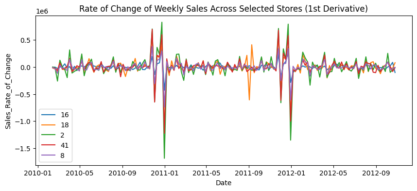
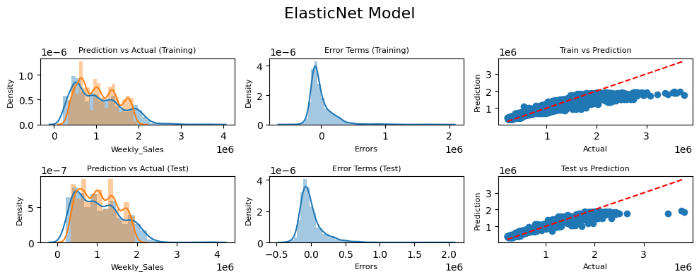

# <center> ***WALMART WEEKLY SALES FORECASTING***

This notebook presents an analysis of the Walmart sales dataset with the goal of forecasting 'Weekly_Sales' based on various features. The goal of this project is to (1) **explore, clean, and visualize the data**, (2) **build a set of regression models to predict the weekly sales amount for a given store**, as well as (3) **evaluate the models and compare them against each other based on their respective scores**.

# <center> Data Loading and Initial Data Exploration
from package_installer_updater import install_or_update_packages_from_code

code = """
import pandas as pd
import numpy as np
import matplotlib.pyplot as plt
import seaborn as sns
import math
import random

from sklearn.model_selection import train_test_split
from sklearn.linear_model import LinearRegression, Ridge, Lasso, ElasticNet
from sklearn.ensemble import RandomForestRegressor
from sklearn.preprocessing import PolynomialFeatures
from sklearn.svm import SVR
from sklearn.metrics import mean_squared_error, r2_score, mean_absolute_error

from IPython.display import display
import warnings
"""

install_or_update_packages_from_code(code)

```python
import pandas as pd
import numpy as np
import matplotlib.pyplot as plt
import seaborn as sns
import math
import random

from sklearn.model_selection import train_test_split
from sklearn.linear_model import LinearRegression, Ridge, Lasso, ElasticNet
from sklearn.ensemble import RandomForestRegressor
from sklearn.preprocessing import PolynomialFeatures
from sklearn.svm import SVR
from sklearn.metrics import mean_squared_error, r2_score, mean_absolute_error

from IPython.display import display
import warnings
warnings.filterwarnings("ignore")

# Set display option
#pd.set_option('display.float_format', '{:.4f}'.format)
```

    /var/folders/hl/5yxgmlvs0rxfpy8dgdyqq3740000gn/T/ipykernel_9628/56858597.py:1: DeprecationWarning: 
    Pyarrow will become a required dependency of pandas in the next major release of pandas (pandas 3.0),
    (to allow more performant data types, such as the Arrow string type, and better interoperability with other libraries)
    but was not found to be installed on your system.
    If this would cause problems for you,
    please provide us feedback at https://github.com/pandas-dev/pandas/issues/54466
            
      import pandas as pd


```python
# Import "ML_Toolchest.ipynb" which contains a custom collection of user defined functions covering various steps along the ML pipeline
%run 'ML_Toolchest.ipynb'
```


```python
# Load the dataset
data = pd.read_csv('Walmart.csv')

# Display the first few rows of the dataframe
data.head()
```


<div>
<style scoped>
    .dataframe tbody tr th:only-of-type {
        vertical-align: middle;
    }

    .dataframe tbody tr th {
        vertical-align: top;
    }

    .dataframe thead th {
        text-align: right;
    }
</style>
<table border="1" class="dataframe">
  <thead>
    <tr style="text-align: right;">
      <th></th>
      <th>Store</th>
      <th>Date</th>
      <th>Weekly_Sales</th>
      <th>Holiday_Flag</th>
      <th>Temperature</th>
      <th>Fuel_Price</th>
      <th>CPI</th>
      <th>Unemployment</th>
    </tr>
  </thead>
  <tbody>
    <tr>
      <th>0</th>
      <td>1</td>
      <td>05-02-2010</td>
      <td>1643690.90</td>
      <td>0</td>
      <td>42.31</td>
      <td>2.572</td>
      <td>211.096358</td>
      <td>8.106</td>
    </tr>
    <tr>
      <th>1</th>
      <td>1</td>
      <td>12-02-2010</td>
      <td>1641957.44</td>
      <td>1</td>
      <td>38.51</td>
      <td>2.548</td>
      <td>211.242170</td>
      <td>8.106</td>
    </tr>
    <tr>
      <th>2</th>
      <td>1</td>
      <td>19-02-2010</td>
      <td>1611968.17</td>
      <td>0</td>
      <td>39.93</td>
      <td>2.514</td>
      <td>211.289143</td>
      <td>8.106</td>
    </tr>
    <tr>
      <th>3</th>
      <td>1</td>
      <td>26-02-2010</td>
      <td>1409727.59</td>
      <td>0</td>
      <td>46.63</td>
      <td>2.561</td>
      <td>211.319643</td>
      <td>8.106</td>
    </tr>
    <tr>
      <th>4</th>
      <td>1</td>
      <td>05-03-2010</td>
      <td>1554806.68</td>
      <td>0</td>
      <td>46.50</td>
      <td>2.625</td>
      <td>211.350143</td>
      <td>8.106</td>
    </tr>
  </tbody>
</table>
</div>


First, we load the dataset and examine its structure and features.

The dataset consists of the following columns:

1. **Store**: Identifier for the store.
2. **Date**: The week of sales.
3. **Weekly_Sales**: The target variable, representing sales for the given week.
4. **Holiday_Flag**: Indicates whether the week includes a holiday (1 if yes, 0 if no).
5. **Temperature**: The average temperature in the region.
6. **Fuel_Price**: Cost of fuel in the region.
7. **CPI**: Consumer Price Index for the region.
8. **Unemployment**: Unemployment rate in the region.


```python
data.info()
```

    <class 'pandas.core.frame.DataFrame'>
    RangeIndex: 6435 entries, 0 to 6434
    Data columns (total 8 columns):
     #   Column        Non-Null Count  Dtype  
    ---  ------        --------------  -----  
     0   Store         6435 non-null   int64  
     1   Date          6435 non-null   object 
     2   Weekly_Sales  6435 non-null   float64
     3   Holiday_Flag  6435 non-null   int64  
     4   Temperature   6435 non-null   float64
     5   Fuel_Price    6435 non-null   float64
     6   CPI           6435 non-null   float64
     7   Unemployment  6435 non-null   float64
    dtypes: float64(5), int64(2), object(1)
    memory usage: 402.3+ KB


```python
# Setting target variable - "Weekly_Sales"
target = 'Weekly_Sales'

# Move target column to first position
first_column = data.pop(target) 
data.insert(0, target, first_column) 
data.head()
```


<div>
<style scoped>
    .dataframe tbody tr th:only-of-type {
        vertical-align: middle;
    }

    .dataframe tbody tr th {
        vertical-align: top;
    }

    .dataframe thead th {
        text-align: right;
    }
</style>
<table border="1" class="dataframe">
  <thead>
    <tr style="text-align: right;">
      <th></th>
      <th>Weekly_Sales</th>
      <th>Store</th>
      <th>Date</th>
      <th>Holiday_Flag</th>
      <th>Temperature</th>
      <th>Fuel_Price</th>
      <th>CPI</th>
      <th>Unemployment</th>
    </tr>
  </thead>
  <tbody>
    <tr>
      <th>0</th>
      <td>1643690.90</td>
      <td>1</td>
      <td>05-02-2010</td>
      <td>0</td>
      <td>42.31</td>
      <td>2.572</td>
      <td>211.096358</td>
      <td>8.106</td>
    </tr>
    <tr>
      <th>1</th>
      <td>1641957.44</td>
      <td>1</td>
      <td>12-02-2010</td>
      <td>1</td>
      <td>38.51</td>
      <td>2.548</td>
      <td>211.242170</td>
      <td>8.106</td>
    </tr>
    <tr>
      <th>2</th>
      <td>1611968.17</td>
      <td>1</td>
      <td>19-02-2010</td>
      <td>0</td>
      <td>39.93</td>
      <td>2.514</td>
      <td>211.289143</td>
      <td>8.106</td>
    </tr>
    <tr>
      <th>3</th>
      <td>1409727.59</td>
      <td>1</td>
      <td>26-02-2010</td>
      <td>0</td>
      <td>46.63</td>
      <td>2.561</td>
      <td>211.319643</td>
      <td>8.106</td>
    </tr>
    <tr>
      <th>4</th>
      <td>1554806.68</td>
      <td>1</td>
      <td>05-03-2010</td>
      <td>0</td>
      <td>46.50</td>
      <td>2.625</td>
      <td>211.350143</td>
      <td>8.106</td>
    </tr>
  </tbody>
</table>
</div>


# <center> Preliminary Data Cleaning


```python
# Convert 'Date' to datetime and extract year and week for further analysis
data['Date'] = pd.to_datetime(data['Date'], format='%d-%m-%Y')
data['Year'] = data['Date'].dt.year
data['Quarter'] = data.Date.dt.quarter
data['Month'] = data.Date.dt.month
data['Week'] = data['Date'].dt.isocalendar().week

# Convert categorical features to 'category'
data = data.astype({'Store':'category', 'Week':'category', 
                    'Month':'category', 'Quarter':'category', 
                    'Year':'category', 'Holiday_Flag':'category'}) 
```


```python
data.info()
```

    <class 'pandas.core.frame.DataFrame'>
    RangeIndex: 6435 entries, 0 to 6434
    Data columns (total 12 columns):
     #   Column        Non-Null Count  Dtype         
    ---  ------        --------------  -----         
     0   Weekly_Sales  6435 non-null   float64       
     1   Store         6435 non-null   category      
     2   Date          6435 non-null   datetime64[ns]
     3   Holiday_Flag  6435 non-null   category      
     4   Temperature   6435 non-null   float64       
     5   Fuel_Price    6435 non-null   float64       
     6   CPI           6435 non-null   float64       
     7   Unemployment  6435 non-null   float64       
     8   Year          6435 non-null   category      
     9   Quarter       6435 non-null   category      
     10  Month         6435 non-null   category      
     11  Week          6435 non-null   category      
    dtypes: category(6), datetime64[ns](1), float64(5)
    memory usage: 343.3 KB


```python
# Unique values for each feature
data.nunique()
```


    Weekly_Sales    6435
    Store             45
    Date             143
    Holiday_Flag       2
    Temperature     3528
    Fuel_Price       892
    CPI             2145
    Unemployment     349
    Year               3
    Quarter            4
    Month             12
    Week              52
    dtype: int64


```python
# Check for missing values
print(check_missing_data(data))
```

    
    Missing Data Analysis Results:
    
                  Missing Count  Percentage (%)
    Weekly_Sales              0             0.0
    Store                     0             0.0
    Date                      0             0.0
    Holiday_Flag              0             0.0
    Temperature               0             0.0
    Fuel_Price                0             0.0
    CPI                       0             0.0
    Unemployment              0             0.0
    Year                      0             0.0
    Quarter                   0             0.0
    Month                     0             0.0
    Week                      0             0.0


```python
# Descriptive statistics
data.describe()
```


<div>
<style scoped>
    .dataframe tbody tr th:only-of-type {
        vertical-align: middle;
    }

    .dataframe tbody tr th {
        vertical-align: top;
    }

    .dataframe thead th {
        text-align: right;
    }
</style>
<table border="1" class="dataframe">
  <thead>
    <tr style="text-align: right;">
      <th></th>
      <th>Weekly_Sales</th>
      <th>Date</th>
      <th>Temperature</th>
      <th>Fuel_Price</th>
      <th>CPI</th>
      <th>Unemployment</th>
    </tr>
  </thead>
  <tbody>
    <tr>
      <th>count</th>
      <td>6.435000e+03</td>
      <td>6435</td>
      <td>6435.000000</td>
      <td>6435.000000</td>
      <td>6435.000000</td>
      <td>6435.000000</td>
    </tr>
    <tr>
      <th>mean</th>
      <td>1.046965e+06</td>
      <td>2011-06-17 00:00:00</td>
      <td>60.663782</td>
      <td>3.358607</td>
      <td>171.578394</td>
      <td>7.999151</td>
    </tr>
    <tr>
      <th>min</th>
      <td>2.099862e+05</td>
      <td>2010-02-05 00:00:00</td>
      <td>-2.060000</td>
      <td>2.472000</td>
      <td>126.064000</td>
      <td>3.879000</td>
    </tr>
    <tr>
      <th>25%</th>
      <td>5.533501e+05</td>
      <td>2010-10-08 00:00:00</td>
      <td>47.460000</td>
      <td>2.933000</td>
      <td>131.735000</td>
      <td>6.891000</td>
    </tr>
    <tr>
      <th>50%</th>
      <td>9.607460e+05</td>
      <td>2011-06-17 00:00:00</td>
      <td>62.670000</td>
      <td>3.445000</td>
      <td>182.616521</td>
      <td>7.874000</td>
    </tr>
    <tr>
      <th>75%</th>
      <td>1.420159e+06</td>
      <td>2012-02-24 00:00:00</td>
      <td>74.940000</td>
      <td>3.735000</td>
      <td>212.743293</td>
      <td>8.622000</td>
    </tr>
    <tr>
      <th>max</th>
      <td>3.818686e+06</td>
      <td>2012-10-26 00:00:00</td>
      <td>100.140000</td>
      <td>4.468000</td>
      <td>227.232807</td>
      <td>14.313000</td>
    </tr>
    <tr>
      <th>std</th>
      <td>5.643666e+05</td>
      <td>NaN</td>
      <td>18.444933</td>
      <td>0.459020</td>
      <td>39.356712</td>
      <td>1.875885</td>
    </tr>
  </tbody>
</table>
</div>


# <center> Exploratory Data Analysis (EDA)

We will perform the following analyses:

1. **Univariate Analysis**:
Visualize the distribution of the target variable (Weekly_Sales) as well as each independent variable/input feature.

2. **Bivariate Analysis**:
Visualize the relationship between Weekly_Sales and each continuous feature (like Temperature, Fuel_Price, CPI, Unemployment) and each categorical feature (like Store, Holiday_Flag).

3. **Store-Wise Analysis**:
Since each store might have unique characteristics, check if certain stores consistently have higher or lower sales.

4. **Time-Based Patterns**:
Explore how Weekly_Sales varies across different years and weeks.
Investigate if there are noticeable trends during holiday weeks compared to non-holiday weeks.

## 1. Univariate Analysis

### Target - Weekly Sales


```python
# Weekly_Sales distribution
sns.distplot(data[target])
plt.title('Weekly Sales Distribution')

plt.show()
```


    

    


### Categorical features


```python
cat_features = data.select_dtypes(include=['category']).columns.tolist()
cat_features
```


    ['Store', 'Holiday_Flag', 'Year', 'Quarter', 'Month', 'Week']


```python
# Overview of the distribution of each numerical variable
plt.figure(figsize=(15, 10))
plt.suptitle('Distribution of Categorical Features\n', fontsize=18)
for i, col in enumerate(cat_features, 1):
    plt.subplot(math.ceil(len(cat_features)/2), 2, i)
    sns.countplot(data=data, x=col, stat='percent')
    plt.title(col)

plt.tight_layout()
plt.show()
```


    

    


```python
print(f"Earliest date in dataset: {min(data['Date'].dt.date)}.")
print(f"Latest date in dataset: {max(data['Date'].dt.date)}.")
```

    Earliest date in dataset: 2010-02-05.
    Latest date in dataset: 2012-10-26.


### Numerical features


```python
num_features = data.select_dtypes(include=['float64', 'int64']).columns.tolist()
num_features.remove(target)
num_features
```


    ['Temperature', 'Fuel_Price', 'CPI', 'Unemployment']


```python
# Overview of the distribution of each numerical variable
plt.figure(figsize=(15, 12))
plt.suptitle('Distribution of Numerical Features\n', fontsize=18)
for i, col in enumerate(num_features):
    plt.subplot(len(num_features), 2, 2*i+1)
    sns.histplot(data=data, x=col, kde=True)
    plt.title(col)

    plt.subplot(len(num_features), 2, 2*i+2)
    sns.boxplot(data=data, x=col)
    plt.title(col)

plt.tight_layout()
plt.show()
```


    

    


## 2. Bivariate Analysis

Analyzing the relationship between `Weekly_Sales` and each feature, as well as between each of the independent variables itself:
1. Continuous features (Temperature, Fuel_Price, CPI, Unemployment) are visualized using scatter plots.
2. Categorical features (Store, Holiday_Flag) are examined using box plots.
3. Correlation matrix and Pairplot.

### Categorical features


```python
# Overview of the distribution of each categorical variable
plt.figure(figsize=(15, 15))
plt.suptitle(f'Bivariate Analysis of Categorical Features vs. {target}\n', fontsize=18)

for i, col in enumerate(cat_features, 1):
    
    # Boxplot (col vs target)
    plt.subplot(math.ceil(len(cat_features)/2), 2, i)
    sns.boxplot(data=data, x=col, y=target)
    plt.title(f'{col} vs. {target}')

    '''# Scatterplot mean target by col
    plt.subplot(len(cat_features), 2, i)
    sns.scatterplot(data=data.groupby([col])[target].mean().reset_index(), 
                    x=col, y=target)
    plt.title(f'Mean Weekly Sales by {col}')'''

plt.tight_layout()
plt.show()
```


    

    


### Numerical features


```python
# Overview of the distribution of each numerical variable
plt.figure(figsize=(15, 15))
plt.suptitle(f'Bivariate Analysis (with Residuals) of Numerical Features vs. {target}\n', fontsize=18)

for i, col in enumerate(num_features, 1):
    plt.subplot(math.ceil(len(cat_features)/2), 2, i)
    sns.regplot(data=data, x=col, y=target, line_kws = {"color": "red"}, 
                scatter_kws={"alpha": 0.8, "edgecolor": "white"})

    # col vs mean target
    #sns.scatterplot(data=data.groupby([col])[target].mean().reset_index(), x=col, y=target, color='orange')
    
    plt.title(f'{target} by {col}')

plt.tight_layout()
plt.show()
```


    

    


For each numeric feature (`Temperature`, `Fuel_Price`, `CPI`, `Unemployment`), we have two plots: one showing the relationship between the feature and `Weekly_Sales`, and another showing the residuals (actual minus predicted sales) against the feature.

1. **Temperature**:
The relationship between `Temperature` and `Weekly_Sales` does not appear to be linear.
The residuals are spread out and do not show any particular pattern, indicating that Temperature may not be a good predictor for Weekly_Sales.
2. **Fuel_Price**:
Similar to Temperature, `Fuel_Price` does not show a clear linear relationship with `Weekly_Sales`.
The residuals are widely scattered, suggesting that Fuel_Price alone may not be a strong predictor for Weekly_Sales.
3. **CPI (Consumer Price Index)**:
The plot suggests a very weak potential linear relationship between `CPI` and `Weekly_Sales`.
Residuals are scattered, with no clear pattern. However, there are some bands visible, suggesting some level of heteroscedasticity (i.e., the variability of the residuals is not constant across the range of CPI).
4. **Unemployment**:
There's no strong linear relationship visible between `Unemployment` and `Weekly_Sales`.
Residuals are widely dispersed and do not indicate a clear pattern, indicating that Unemployment is also not a strong predictor for Weekly_Sales.

**Conclusion from Residual Analysis**
The residual plots and the spread of residuals suggest that these individual numeric features have a weak linear relationship with `Weekly_Sales`. This could mean that the relationship between the features and the target variable is complex and possibly non-linear, or that additional factors not captured in these features significantly influence `Weekly_Sales`. This underscores the need for more sophisticated modeling techniques that can capture such complex relationships, or the inclusion of additional relevant features in the analysis. ​​

### Correlation Analysis


```python
# Correlation matrix
plt.figure(figsize=(8, 6))
sns.heatmap(data.drop('Date', axis=1, inplace=False).corr(), annot=True, cmap='coolwarm', annot_kws={'size': 8})
plt.title('Correlation Heatmap')
plt.tick_params(axis='x', rotation=45)
plt.xticks(fontsize=8)
plt.yticks(fontsize=8)
plt.show()
```


    

    


The heatmap above displays the correlation matrix for the features in the dataset. Focusing specifically on `Weekly_Sales` and its correlation with other features, here are the key takeaways from the correlation matrix:

1. **Store (-0.34)**:
   - There is a moderate negative correlation between the store identifier and `Weekly_Sales`. This could suggest that stores with higher ID numbers tend to have lower weekly sales. This might be influenced by many factors such as store size, location, demographic differences, or simply that the stores with higher IDs are newer and have not yet reached their sales potential.

2. **Holiday_Flag (0.037)**:
   - There is a very weak positive correlation between `Holiday_Flag` and `Weekly_Sales`. This suggests that there is a minimal overall effect of holidays on weekly sales when averaged across all stores and all holiday periods in the dataset. It’s possible that certain holidays have a more significant impact than others, and a more granular analysis might be required to uncover those effects.

3. **Temperature (-0.064)**:
   - `Weekly_Sales` has a very weak negative correlation with `Temperature`, indicating that there is not a significant linear relationship between the two. Seasonal variations in temperature may not be a strong predictor of sales performance, or any effect may be non-linear.

4. **Fuel_Price (0.0095)**:
   - This shows a negligible positive correlation with `Weekly_Sales`, suggesting that changes in fuel prices do not have a substantial linear impact on weekly sales. This might be due to the fact that the costs of fuel could be a smaller part of the overall costs or sales drivers for Walmart.

5. **CPI (-0.073)**:
   - `Weekly_Sales` has a very weak negative correlation with the Consumer Price Index. This might indicate that when the CPI is higher, possibly indicating higher prices overall, `Weekly_Sales` slightly decrease. However, the relationship is not strong enough to draw substantial conclusions.

6. **Unemployment (-0.11)**:
   - There is a weak negative correlation between `Unemployment` and `Weekly_Sales`. This could be expected as higher unemployment rates might lead to reduced consumer spending power, thereby impacting sales.

7. **Year (-0.018), Quarter (0.063), Month (0.076), Week (0.074)**:
   - There are very weak positive correlations between the time-related features and the target variable. This might indicate that `Weekly_Sales` have been decreasing slightly over the years while slighlty increasing within a given year, but without a strong trend.

**Summary**
These correlations with `Weekly_Sales` suggest that none of the features strongly predict weekly sales on their own in a linear manner. This could imply that predicting weekly sales is a complex problem that may require more sophisticated modeling to capture nonlinear relationships or interactions between features. It also suggests the potential value of exploring additional data sources or engineered features that could better explain the variance in weekly sales.

When focusing on the independent variables, here’s an interpretation of the significant correlations from the matrix:

1. **Fuel Price and Year (0.78)**:
   - This strong positive correlation suggests that fuel prices have increased over the years covered by the dataset. It reflects general historical trends of rising fuel prices, potentially due to inflation, global oil market dynamics, and other macroeconomic factors.

2. **Unemployment and Year (-0.24)**:
   - A moderate negative correlation suggests that the unemployment rate tends to decrease over the years captured in the data.

3. **CPI and Unemployment (-0.3)**:
   - The negative correlation here is moderate, which implies that, generally, as the CPI increases, the unemployment rate tends to decrease, or conversely, as the CPI decreases, unemployment tends to increase.
      
4. **Store and Unemployment (0.22)**:
   - A moderate positive correlation exists between `Store` and `Unemployment`. This might suggest that stores with higher IDs (possibly newer or in different locations) are in areas with higher unemployment rates.

5. **Fuel Price and CPI (-0.17)**:
   - Fuel_Price and CPI: Moderate negative correlation (-0.17), which could suggest that as fuel prices increase, CPI tends to decrease slightly.

6. **Temperature and Holiday_Flag (-0.16)**:
   - The negative correlation here is weak and indicates that lower temperatures might be slightly associated with holiday weeks, which is reasonable considering that major holidays like Christmas occur during winter in many regions.

7. **Quarter, Month, and Week**:
   - These variables (Quarter, Month, and Week) are highly correlated with one another (0.97, 0.96, and 1.00 respectively), which is expected since they are different measures of time and inherently related. Such high correlations can lead to multicollinearity if all are included in a regression model and only one feature should be considered for the modeling - most likely 'Month' due to the strongest correlation with Weekly Sales.

**Summary**
The high correlation between `Fuel_Price` and `Year` suggests that these variables may change together over time. The strong correlation of `Unemployment` with `Year` also indicates a time trend. When it comes to modeling, it's essential to be cautious about including highly correlated predictors, as they can distort the importance of individual predictors and affect the stability of the coefficients. In the case of time-related variables like `Quarter`, `Month`, and `Week`, it will be necessary to select only one to avoid multicollinearity or to use them to create new features that better capture the seasonal patterns in the data.


```python
# Pairplot
plt.figure(figsize=(10, 10))
g = sns.pairplot(data)
g.map_upper(sns.kdeplot, levels=4, color=".2")
plt.show()
```


    <Figure size 1000x1000 with 0 Axes>


    

    


## 3. Store-Wise Analysis

**Store-Wise Patterns**:
Since each store might have unique characteristics, we'll analyze if certain stores consistently have higher or lower sales.


```python
# Store-Wise Analysis: Comparing a selection of stores
random.seed(42)
# Selecting random stores for illustration
sample_stores = random.sample(list(data['Store'].unique()), 5)  
filtered_data = data[data['Store'].isin(sample_stores)]

# reseting Store categorical levels to randomly selected Store numbers
filtered_data['Store'] = filtered_data['Store'].astype('str')
filtered_data['Store'] = filtered_data['Store'].astype('category')
filtered_data = filtered_data.sort_values(by='Date')

# Weekly_Sales over time for selected stores
plt.figure(figsize=(10, 4))
sns.lineplot(data=filtered_data, x='Date', y='Weekly_Sales', hue='Store', estimator='mean', ci=None)
plt.title('Weekly Sales Comparison Across Selected Stores')
plt.legend()

# Calculating the derivative of weekly sales, the rate of change
filtered_data['Sales_Rate_of_Change'] = filtered_data.groupby('Store')['Weekly_Sales'].transform(lambda x: x.diff())
plt.figure(figsize=(10, 4))
sns.lineplot(data=filtered_data, x='Date', y='Sales_Rate_of_Change', hue='Store', estimator='mean', ci=None)
plt.title('Rate of Change of Weekly Sales Across Selected Stores (1st Derivative)')
plt.legend()

# Calculating the second derivative of weekly sales
filtered_data['Sales_Acceleration'] = filtered_data.groupby('Store')['Weekly_Sales'].transform(lambda x: x.diff().diff())
plt.figure(figsize=(10, 4))
sns.lineplot(data=filtered_data, x='Date', y='Sales_Acceleration', hue='Store', estimator='mean', ci=None)
plt.title('Acceleration of Weekly Sales Across Selected Stores (2nd Derivative)')
plt.legend()

plt.show()
```


    

    


    

    


    

    

**PERSONAL NOTE/REFRESHER ON DERIVATIVE INTERPRETATION**


**1. Weekly Sales Chart (Original Data):**
* This chart displays the absolute sales values over time for each store.
* Peaks represent weeks with the highest sales, which could be influenced by factors like holidays, promotions, or seasonal demand.
* Troughs indicate weeks with the lowest sales, which might correspond to off-peak seasons or periods of low demand.
* Trends, either upward or downward, suggest long-term increases or decreases in sales performance.

**2. First Derivative (Rate of Change) Chart:**
* The first derivative chart shows the rate at which sales are changing from one week to the next.
* When the line is above zero, it indicates that sales are increasing week-over-week.
* When the line is below zero, it indicates that sales are decreasing week-over-week.
* The magnitude of the values indicates how quickly sales are rising or falling. Larger absolute values mean a steeper increase or decrease.
* This chart helps identify periods of growth or decline in sales that may not be apparent from the original sales data.
  
**3. Second Derivative (Acceleration) Chart:**
* The second derivative chart represents the acceleration of sales, or how the rate of change itself is changing.
* A positive value indicates that the rate of sales increase is growing - sales are not just rising, they are rising more rapidly.
* A negative value indicates that the rate of sales increase is slowing down, or if sales are decreasing, they are doing so at a faster rate.
* A crossing of the zero line suggests an inflection point where the sales trend is shifting from acceleration to deceleration or vice versa.
* This can be particularly useful for forecasting, as it may precede visible trends in the original sales data.

Together, these charts provide a more nuanced view of sales performance over time. While the original sales chart shows what happened, the first and second derivatives show how the situation is changing and how the rate of change itself is changing, offering insights into the dynamics of sales performance that can inform strategic business decisions.
## 4. Time-Series Analysis

**Time-Based Patterns**: The line plot of average `Weekly_Sales` over time shows some seasonal patterns and peaks, which likely correspond to holiday periods or specific events.


```python
# Time-series analysis for Weekly_Sales
plt.figure(figsize=(14, 4))

# weekly_sales over entire time-window
plt.subplot(1, 2, 1)
sns.lineplot(data=data, x='Date', y='Weekly_Sales', estimator='mean', ci=None)
plt.title('Overall Weekly Sales Over Time')
plt.tick_params(axis='x', rotation=45)

# mean weekly_sales per week of year
plt.subplot(1, 2, 2)
sns.lineplot(data=data.groupby(['Week'])[target].mean().reset_index(), 
                x='Week', y=target)
plt.title('Average Weekly Sales by Week of Year')

plt.show()
```


    

    


# <center> Feature Engineering

**1. Adding New Features**:
   - We have already extracted more granular time features from the `Date` column (see Data Cleaning section), such as the year, quarter, month, and week of the year. These features can capture seasonal trends and weekly patterns in sales.
   - Create binary indicators for major holidays, which can help the model identify potential sales surges for specific holidays, such as Thanksgiving/Black Friday or Christmas.
   - Add binary or continuous indicator to show whether certain date is close to a major holiday (e.g. within +/- 1 week).

**2. Nonlinear Transformations**:
   - Experiment with nonlinear transformations (like log, square root) on features that have a skewed distribution.

**3. Interaction Features**:
   - Consider creating interaction features, especially between numeric variables that might have synergistic effects. For example, the interaction between `CPI` and `Fuel_Price` might be worth exploring.
   
**4. Lag Features and Rolling Window Statistics**:
   - For time series data like this, lag features (e.g., sales from the previous week) can be very informative. However, this depends on the availability of such historical data.
   - Features like rolling averages or rolling standard deviations of sales can help capture trends and fluctuations over time.

**5. External Data**:
   - Consider integrating external data sources that could impact sales, such as local economic indicators, population density, or data on local events.

### 1. Adding new features

#### Store-related Features


```python
# Adding new features with the goal to account for store-specific sales patterns (such as general sales amount base)

## Average Weekly_Sales per store
temp = data.groupby(['Store'])[target].mean().to_frame('Avg_Weekly_Sales').reset_index()

## Rank based on Avg weekly sales per store
temp['Store_Sales_Rank'] = temp['Avg_Weekly_Sales'].rank(ascending=False, method='dense')

data = pd.merge(data, temp, on=['Store'], how='left')

data.head()
```


<div>
<style scoped>
    .dataframe tbody tr th:only-of-type {
        vertical-align: middle;
    }

    .dataframe tbody tr th {
        vertical-align: top;
    }

    .dataframe thead th {
        text-align: right;
    }
</style>
<table border="1" class="dataframe">
  <thead>
    <tr style="text-align: right;">
      <th></th>
      <th>Weekly_Sales</th>
      <th>Store</th>
      <th>Date</th>
      <th>Holiday_Flag</th>
      <th>Temperature</th>
      <th>Fuel_Price</th>
      <th>CPI</th>
      <th>Unemployment</th>
      <th>Year</th>
      <th>Quarter</th>
      <th>Month</th>
      <th>Week</th>
      <th>Avg_Weekly_Sales</th>
      <th>Store_Sales_Rank</th>
    </tr>
  </thead>
  <tbody>
    <tr>
      <th>0</th>
      <td>1643690.90</td>
      <td>1</td>
      <td>2010-02-05</td>
      <td>0</td>
      <td>42.31</td>
      <td>2.572</td>
      <td>211.096358</td>
      <td>8.106</td>
      <td>2010</td>
      <td>1</td>
      <td>2</td>
      <td>5</td>
      <td>1.555264e+06</td>
      <td>9.0</td>
    </tr>
    <tr>
      <th>1</th>
      <td>1641957.44</td>
      <td>1</td>
      <td>2010-02-12</td>
      <td>1</td>
      <td>38.51</td>
      <td>2.548</td>
      <td>211.242170</td>
      <td>8.106</td>
      <td>2010</td>
      <td>1</td>
      <td>2</td>
      <td>6</td>
      <td>1.555264e+06</td>
      <td>9.0</td>
    </tr>
    <tr>
      <th>2</th>
      <td>1611968.17</td>
      <td>1</td>
      <td>2010-02-19</td>
      <td>0</td>
      <td>39.93</td>
      <td>2.514</td>
      <td>211.289143</td>
      <td>8.106</td>
      <td>2010</td>
      <td>1</td>
      <td>2</td>
      <td>7</td>
      <td>1.555264e+06</td>
      <td>9.0</td>
    </tr>
    <tr>
      <th>3</th>
      <td>1409727.59</td>
      <td>1</td>
      <td>2010-02-26</td>
      <td>0</td>
      <td>46.63</td>
      <td>2.561</td>
      <td>211.319643</td>
      <td>8.106</td>
      <td>2010</td>
      <td>1</td>
      <td>2</td>
      <td>8</td>
      <td>1.555264e+06</td>
      <td>9.0</td>
    </tr>
    <tr>
      <th>4</th>
      <td>1554806.68</td>
      <td>1</td>
      <td>2010-03-05</td>
      <td>0</td>
      <td>46.50</td>
      <td>2.625</td>
      <td>211.350143</td>
      <td>8.106</td>
      <td>2010</td>
      <td>1</td>
      <td>3</td>
      <td>9</td>
      <td>1.555264e+06</td>
      <td>9.0</td>
    </tr>
  </tbody>
</table>
</div>


#### Time-related Features


```python
# Add extended list of major US Holidays to the dataset
holiday_dates = {
    "Date": ["2010-01-01", "2010-01-22", "2010-02-19", "2010-06-04", "2010-07-02", "2010-07-09", "2010-09-10", 
             "2010-10-15", "2010-11-12", "2010-11-26", "2010-12-24", "2010-12-31", "2010-02-05",
             
             "2011-01-21", "2011-02-25", "2011-06-03", "2011-07-08", "2011-09-09", "2011-10-14", "2011-11-11", 
             "2011-11-25", "2011-12-23", "2011-12-30", "2011-02-04",
             
             "2012-01-06", "2012-01-20", "2012-02-24", "2012-06-01", "2012-07-06", "2012-09-07", 
             "2012-10-12", "2012-11-09", "2012-11-16", "2012-11-23", "2012-12-28", "2012-02-03"],
    
    "Holiday_Name": ["New Year's Day", "Martin Luther King Jr. Day", "Presidents' Day", "Memorial Day", 
                     "Independence Day", "Independence Day", "Labor Day", "Columbus Day", 
                     "Veterans Day", "Thanksgiving", "Christmas Day", "New Year's Day", "Super Bowl",
                
                     "Martin Luther King Jr. Day", "Presidents' Day", "Memorial Day", "Independence Day", 
                     "Labor Day", "Columbus Day", "Veterans Day", "Thanksgiving", "Christmas Day", 
                     "New Year's Day", "Super Bowl",
                    
                     "New Year's Day", "Martin Luther King Jr. Day", "Presidents' Day", "Memorial Day", 
                     "Independence Day", "Labor Day", "Columbus Day", "Veterans Day", "Veterans Day",
                     "Thanksgiving", "Christmas Day", "Super Bowl"]
}

# Convert dictionary to dataframe
holiday_dates = pd.DataFrame(holiday_dates)
holiday_dates['Date'] = pd.to_datetime(holiday_dates['Date'])

# Merge holiday_dates with main dataset
data = pd.merge(data, holiday_dates, on='Date', how='left')

# Create new flag that accounts for extended list of holidays
data['Ext_Holiday_Flag'] = [True if pd.notnull(x) else False for x in data['Holiday_Name']]
data['Holiday_Name'] = data['Holiday_Name'].fillna('none')

data.head()
```


<div>
<style scoped>
    .dataframe tbody tr th:only-of-type {
        vertical-align: middle;
    }

    .dataframe tbody tr th {
        vertical-align: top;
    }

    .dataframe thead th {
        text-align: right;
    }
</style>
<table border="1" class="dataframe">
  <thead>
    <tr style="text-align: right;">
      <th></th>
      <th>Weekly_Sales</th>
      <th>Store</th>
      <th>Date</th>
      <th>Holiday_Flag</th>
      <th>Temperature</th>
      <th>Fuel_Price</th>
      <th>CPI</th>
      <th>Unemployment</th>
      <th>Year</th>
      <th>Quarter</th>
      <th>Month</th>
      <th>Week</th>
      <th>Avg_Weekly_Sales</th>
      <th>Store_Sales_Rank</th>
      <th>Holiday_Name</th>
      <th>Ext_Holiday_Flag</th>
    </tr>
  </thead>
  <tbody>
    <tr>
      <th>0</th>
      <td>1643690.90</td>
      <td>1</td>
      <td>2010-02-05</td>
      <td>0</td>
      <td>42.31</td>
      <td>2.572</td>
      <td>211.096358</td>
      <td>8.106</td>
      <td>2010</td>
      <td>1</td>
      <td>2</td>
      <td>5</td>
      <td>1.555264e+06</td>
      <td>9.0</td>
      <td>Super Bowl</td>
      <td>True</td>
    </tr>
    <tr>
      <th>1</th>
      <td>1641957.44</td>
      <td>1</td>
      <td>2010-02-12</td>
      <td>1</td>
      <td>38.51</td>
      <td>2.548</td>
      <td>211.242170</td>
      <td>8.106</td>
      <td>2010</td>
      <td>1</td>
      <td>2</td>
      <td>6</td>
      <td>1.555264e+06</td>
      <td>9.0</td>
      <td>none</td>
      <td>False</td>
    </tr>
    <tr>
      <th>2</th>
      <td>1611968.17</td>
      <td>1</td>
      <td>2010-02-19</td>
      <td>0</td>
      <td>39.93</td>
      <td>2.514</td>
      <td>211.289143</td>
      <td>8.106</td>
      <td>2010</td>
      <td>1</td>
      <td>2</td>
      <td>7</td>
      <td>1.555264e+06</td>
      <td>9.0</td>
      <td>Presidents' Day</td>
      <td>True</td>
    </tr>
    <tr>
      <th>3</th>
      <td>1409727.59</td>
      <td>1</td>
      <td>2010-02-26</td>
      <td>0</td>
      <td>46.63</td>
      <td>2.561</td>
      <td>211.319643</td>
      <td>8.106</td>
      <td>2010</td>
      <td>1</td>
      <td>2</td>
      <td>8</td>
      <td>1.555264e+06</td>
      <td>9.0</td>
      <td>none</td>
      <td>False</td>
    </tr>
    <tr>
      <th>4</th>
      <td>1554806.68</td>
      <td>1</td>
      <td>2010-03-05</td>
      <td>0</td>
      <td>46.50</td>
      <td>2.625</td>
      <td>211.350143</td>
      <td>8.106</td>
      <td>2010</td>
      <td>1</td>
      <td>3</td>
      <td>9</td>
      <td>1.555264e+06</td>
      <td>9.0</td>
      <td>none</td>
      <td>False</td>
    </tr>
  </tbody>
</table>
</div>


```python
# Plot Weekly_Sales across extended list of major US holidays to check if there are any significant sales surges
plt.figure(figsize=(12, 5))
sns.boxplot(data=data, x='Holiday_Name', y=target, hue='Year')
plt.title('Impact of major US Holidays on Weekly_Sales')
plt.tick_params(axis='x', rotation=45)
```


    

    


```python
# Create binary indicator for the two holidays that show a significant surge in Weekly_Sales - Christmas and Thanksgiving
data['Christmas'] = [True if x=='Christmas Day' else False for x in data['Holiday_Name']]
data['Thanksgiving'] = [True if x=='Thanksgiving' else False for x in data['Holiday_Name']]

# Create binary indicator to show whether respective week is BEFORE/AFTER a significant holiday week (Christmas or Thanksgiving)
data['Pre_Holiday_Week'] = ((data['Thanksgiving'].shift(-1) == True) | (data['Christmas'].shift(-1) == 1))
data['Post_Holiday_Week'] = ((data['Thanksgiving'].shift(1) == True) | (data['Christmas'].shift(1) == 1))
data['Holiday_Proximity'] = ((data['Thanksgiving'].shift(-1) == True) | (data['Christmas'].shift(-1) == True |
                            (data['Thanksgiving'].shift(1) == True) | (data['Christmas'].shift(1) == True)))
```


```python
data.info()
```

    <class 'pandas.core.frame.DataFrame'>
    RangeIndex: 6435 entries, 0 to 6434
    Data columns (total 21 columns):
     #   Column             Non-Null Count  Dtype         
    ---  ------             --------------  -----         
     0   Weekly_Sales       6435 non-null   float64       
     1   Store              6435 non-null   category      
     2   Date               6435 non-null   datetime64[ns]
     3   Holiday_Flag       6435 non-null   category      
     4   Temperature        6435 non-null   float64       
     5   Fuel_Price         6435 non-null   float64       
     6   CPI                6435 non-null   float64       
     7   Unemployment       6435 non-null   float64       
     8   Year               6435 non-null   category      
     9   Quarter            6435 non-null   category      
     10  Month              6435 non-null   category      
     11  Week               6435 non-null   category      
     12  Avg_Weekly_Sales   6435 non-null   float64       
     13  Store_Sales_Rank   6435 non-null   float64       
     14  Holiday_Name       6435 non-null   object        
     15  Ext_Holiday_Flag   6435 non-null   bool          
     16  Christmas          6435 non-null   bool          
     17  Thanksgiving       6435 non-null   bool          
     18  Pre_Holiday_Week   6435 non-null   bool          
     19  Post_Holiday_Week  6435 non-null   bool          
     20  Holiday_Proximity  6435 non-null   bool          
    dtypes: bool(6), category(6), datetime64[ns](1), float64(7), object(1)
    memory usage: 531.9+ KB

# Convert categorical features to 'category'
data = data.astype({'Ext_Holiday_Flag':'category', 'Christmas':'category', 'Thanksgiving':'category', 'Holiday_Proximity':'category'}) 

```python
# Correlation matrix
plt.figure(figsize=(12, 8))
sns.heatmap(data.drop(['Holiday_Name', 'Date'], axis=1, inplace=False).corr(), annot=True, cmap='coolwarm', annot_kws={'size': 8})
plt.title('Correlation Heatmap with added features')
plt.tick_params(axis='x', rotation=45)
plt.xticks(fontsize=8)
plt.yticks(fontsize=8)
plt.show()
```


    

    


# <center> Data Preprocessing

**1. Train-Test-Valid Splitting**:
   - Splitting the dataset into a train and test data subsets.

**2. Missing Data**:
   - Since there are no missing values in this dataset, we can skip this step.

**3. Outlier Detection and Treatment**:
   - Identify potential outliers using the IQR, z-score, or Standard-deviation aprroach and either remove or max-cap them.

**4. Categorical Encoding**:
   - We can consider using one-hot encoding, especially if the number of unique category levels is manageable.

**5. Feature Scaling - Normalization/Standardization**:
   - Scale numerical features (like `Temperature`, `Fuel_Price`, `CPI`, `Unemployment`) to ensure they are on the same scale. This is particularly important for models sensitive to the scale of input features (like neural networks, SVMs, and k-nearest neighbors).


```python
# Import "ML_Toolchest.ipynb" which contains a custom collection of user defined functions covering various steps along the ML pipeline
%run 'ML_Toolchest.ipynb'
```

### 1. Train-Test Splitting


```python
# Split data into train and test subsets
X_train, X_test, y_train, y_test = split_data(data, target, total_record_cnt=-1, 
                                              train_size=0.8, test_size=0.2, valid_size=0,
                                              rand_state=100)
```

    
    Train-Test Splitting Results:
    
    Training: 	80.0%, 	5148 samples.
    Test: 		20.0%,  1287 samples.
    


### 2. Missing Data - ***skip***

### 3. Outlier Detection and Handling


```python
# Determing numerical features to be scaled
num_features = ['Temperature', 'Fuel_Price', 'CPI', 'Unemployment', 'Avg_Weekly_Sales', 'Store_Sales_Rank']
#num_features = X_train.select_dtypes(include=['float64', 'int64']).columns.tolist()
```


```python
# Identify outliers using z-score method and replace with max-capping
X_train, y_train = outlier_removal(X_train, y_train, num_features, 
                                   detection_method='iqr', thres=1.5, 
                                   handling_method='drop')
```

    
    Outlier Removal Results:
    
    Detected 379 outliers using the "iqr" approach.
    Outliers have been "dropped".
    
    The dataset now has 4769 samples.
    


### 4. Categorical Encoding


```python
# Determing categorical features to be encoded
cat_features = ['Store', 'Year', 'Quarter', 'Month', 'Week']
#cat_features = X_train.select_dtypes(include=['category']).columns.tolist()
```


```python
# Training data
X_train = one_hot_encoding(X_train, cols=cat_features, drop_first=True, dtype=bool)

# Test data
X_test = one_hot_encoding(X_test, cols=cat_features, drop_first=True, dtype=bool, info=False)
```

    
    One-Hot Encoding Results:
    
    The following categorical features were encoded:
    
    "Store, Year, Quarter, Month, Week"
    


<div>
<style scoped>
    .dataframe tbody tr th:only-of-type {
        vertical-align: middle;
    }

    .dataframe tbody tr th {
        vertical-align: top;
    }

    .dataframe thead th {
        text-align: right;
    }
</style>
<table border="1" class="dataframe">
  <thead>
    <tr style="text-align: right;">
      <th></th>
      <th>Date</th>
      <th>Holiday_Flag</th>
      <th>Temperature</th>
      <th>Fuel_Price</th>
      <th>CPI</th>
      <th>Unemployment</th>
      <th>Avg_Weekly_Sales</th>
      <th>Store_Sales_Rank</th>
      <th>Holiday_Name</th>
      <th>Ext_Holiday_Flag</th>
      <th>Christmas</th>
      <th>Thanksgiving</th>
      <th>Pre_Holiday_Week</th>
      <th>Post_Holiday_Week</th>
      <th>Holiday_Proximity</th>
      <th>Store_2</th>
      <th>Store_3</th>
      <th>Store_4</th>
      <th>Store_5</th>
      <th>Store_6</th>
      <th>Store_7</th>
      <th>Store_8</th>
      <th>Store_9</th>
      <th>Store_10</th>
      <th>Store_11</th>
      <th>Store_12</th>
      <th>Store_13</th>
      <th>Store_14</th>
      <th>Store_15</th>
      <th>Store_16</th>
      <th>Store_17</th>
      <th>Store_18</th>
      <th>Store_19</th>
      <th>Store_20</th>
      <th>Store_21</th>
      <th>Store_22</th>
      <th>Store_23</th>
      <th>Store_24</th>
      <th>Store_25</th>
      <th>Store_26</th>
      <th>Store_27</th>
      <th>Store_28</th>
      <th>Store_29</th>
      <th>Store_30</th>
      <th>Store_31</th>
      <th>Store_32</th>
      <th>Store_33</th>
      <th>Store_34</th>
      <th>Store_35</th>
      <th>Store_36</th>
      <th>Store_37</th>
      <th>Store_38</th>
      <th>Store_39</th>
      <th>Store_40</th>
      <th>Store_41</th>
      <th>Store_42</th>
      <th>Store_43</th>
      <th>Store_44</th>
      <th>Store_45</th>
      <th>Year_2011</th>
      <th>Year_2012</th>
      <th>Quarter_2</th>
      <th>Quarter_3</th>
      <th>Quarter_4</th>
      <th>Month_2</th>
      <th>Month_3</th>
      <th>Month_4</th>
      <th>Month_5</th>
      <th>Month_6</th>
      <th>Month_7</th>
      <th>Month_8</th>
      <th>Month_9</th>
      <th>Month_10</th>
      <th>Month_11</th>
      <th>Month_12</th>
      <th>Week_2</th>
      <th>Week_3</th>
      <th>Week_4</th>
      <th>Week_5</th>
      <th>Week_6</th>
      <th>Week_7</th>
      <th>Week_8</th>
      <th>Week_9</th>
      <th>Week_10</th>
      <th>Week_11</th>
      <th>Week_12</th>
      <th>Week_13</th>
      <th>Week_14</th>
      <th>Week_15</th>
      <th>Week_16</th>
      <th>Week_17</th>
      <th>Week_18</th>
      <th>Week_19</th>
      <th>Week_20</th>
      <th>Week_21</th>
      <th>Week_22</th>
      <th>Week_23</th>
      <th>Week_24</th>
      <th>Week_25</th>
      <th>Week_26</th>
      <th>Week_27</th>
      <th>Week_28</th>
      <th>Week_29</th>
      <th>Week_30</th>
      <th>Week_31</th>
      <th>Week_32</th>
      <th>Week_33</th>
      <th>Week_34</th>
      <th>Week_35</th>
      <th>Week_36</th>
      <th>Week_37</th>
      <th>Week_38</th>
      <th>Week_39</th>
      <th>Week_40</th>
      <th>Week_41</th>
      <th>Week_42</th>
      <th>Week_43</th>
      <th>Week_44</th>
      <th>Week_45</th>
      <th>Week_46</th>
      <th>Week_47</th>
      <th>Week_48</th>
      <th>Week_49</th>
      <th>Week_50</th>
      <th>Week_51</th>
      <th>Week_52</th>
    </tr>
  </thead>
  <tbody>
    <tr>
      <th>1033</th>
      <td>2010-09-17</td>
      <td>0</td>
      <td>75.32</td>
      <td>2.582</td>
      <td>214.878556</td>
      <td>6.315</td>
      <td>908749.518392</td>
      <td>26.0</td>
      <td>none</td>
      <td>False</td>
      <td>False</td>
      <td>False</td>
      <td>False</td>
      <td>False</td>
      <td>False</td>
      <td>False</td>
      <td>False</td>
      <td>False</td>
      <td>False</td>
      <td>False</td>
      <td>False</td>
      <td>True</td>
      <td>False</td>
      <td>False</td>
      <td>False</td>
      <td>False</td>
      <td>False</td>
      <td>False</td>
      <td>False</td>
      <td>False</td>
      <td>False</td>
      <td>False</td>
      <td>False</td>
      <td>False</td>
      <td>False</td>
      <td>False</td>
      <td>False</td>
      <td>False</td>
      <td>False</td>
      <td>False</td>
      <td>False</td>
      <td>False</td>
      <td>False</td>
      <td>False</td>
      <td>False</td>
      <td>False</td>
      <td>False</td>
      <td>False</td>
      <td>False</td>
      <td>False</td>
      <td>False</td>
      <td>False</td>
      <td>False</td>
      <td>False</td>
      <td>False</td>
      <td>False</td>
      <td>False</td>
      <td>False</td>
      <td>False</td>
      <td>False</td>
      <td>False</td>
      <td>False</td>
      <td>True</td>
      <td>False</td>
      <td>False</td>
      <td>False</td>
      <td>False</td>
      <td>False</td>
      <td>False</td>
      <td>False</td>
      <td>False</td>
      <td>True</td>
      <td>False</td>
      <td>False</td>
      <td>False</td>
      <td>False</td>
      <td>False</td>
      <td>False</td>
      <td>False</td>
      <td>False</td>
      <td>False</td>
      <td>False</td>
      <td>False</td>
      <td>False</td>
      <td>False</td>
      <td>False</td>
      <td>False</td>
      <td>False</td>
      <td>False</td>
      <td>False</td>
      <td>False</td>
      <td>False</td>
      <td>False</td>
      <td>False</td>
      <td>False</td>
      <td>False</td>
      <td>False</td>
      <td>False</td>
      <td>False</td>
      <td>False</td>
      <td>False</td>
      <td>False</td>
      <td>False</td>
      <td>False</td>
      <td>False</td>
      <td>False</td>
      <td>False</td>
      <td>False</td>
      <td>False</td>
      <td>False</td>
      <td>True</td>
      <td>False</td>
      <td>False</td>
      <td>False</td>
      <td>False</td>
      <td>False</td>
      <td>False</td>
      <td>False</td>
      <td>False</td>
      <td>False</td>
      <td>False</td>
      <td>False</td>
      <td>False</td>
      <td>False</td>
      <td>False</td>
      <td>False</td>
    </tr>
    <tr>
      <th>915</th>
      <td>2011-03-11</td>
      <td>0</td>
      <td>20.70</td>
      <td>3.372</td>
      <td>192.058484</td>
      <td>8.818</td>
      <td>570617.308671</td>
      <td>33.0</td>
      <td>none</td>
      <td>False</td>
      <td>False</td>
      <td>False</td>
      <td>False</td>
      <td>False</td>
      <td>False</td>
      <td>False</td>
      <td>False</td>
      <td>False</td>
      <td>False</td>
      <td>False</td>
      <td>True</td>
      <td>False</td>
      <td>False</td>
      <td>False</td>
      <td>False</td>
      <td>False</td>
      <td>False</td>
      <td>False</td>
      <td>False</td>
      <td>False</td>
      <td>False</td>
      <td>False</td>
      <td>False</td>
      <td>False</td>
      <td>False</td>
      <td>False</td>
      <td>False</td>
      <td>False</td>
      <td>False</td>
      <td>False</td>
      <td>False</td>
      <td>False</td>
      <td>False</td>
      <td>False</td>
      <td>False</td>
      <td>False</td>
      <td>False</td>
      <td>False</td>
      <td>False</td>
      <td>False</td>
      <td>False</td>
      <td>False</td>
      <td>False</td>
      <td>False</td>
      <td>False</td>
      <td>False</td>
      <td>False</td>
      <td>False</td>
      <td>False</td>
      <td>True</td>
      <td>False</td>
      <td>False</td>
      <td>False</td>
      <td>False</td>
      <td>False</td>
      <td>True</td>
      <td>False</td>
      <td>False</td>
      <td>False</td>
      <td>False</td>
      <td>False</td>
      <td>False</td>
      <td>False</td>
      <td>False</td>
      <td>False</td>
      <td>False</td>
      <td>False</td>
      <td>False</td>
      <td>False</td>
      <td>False</td>
      <td>False</td>
      <td>False</td>
      <td>False</td>
      <td>True</td>
      <td>False</td>
      <td>False</td>
      <td>False</td>
      <td>False</td>
      <td>False</td>
      <td>False</td>
      <td>False</td>
      <td>False</td>
      <td>False</td>
      <td>False</td>
      <td>False</td>
      <td>False</td>
      <td>False</td>
      <td>False</td>
      <td>False</td>
      <td>False</td>
      <td>False</td>
      <td>False</td>
      <td>False</td>
      <td>False</td>
      <td>False</td>
      <td>False</td>
      <td>False</td>
      <td>False</td>
      <td>False</td>
      <td>False</td>
      <td>False</td>
      <td>False</td>
      <td>False</td>
      <td>False</td>
      <td>False</td>
      <td>False</td>
      <td>False</td>
      <td>False</td>
      <td>False</td>
      <td>False</td>
      <td>False</td>
      <td>False</td>
      <td>False</td>
      <td>False</td>
      <td>False</td>
      <td>False</td>
    </tr>
    <tr>
      <th>5903</th>
      <td>2010-11-12</td>
      <td>0</td>
      <td>61.24</td>
      <td>3.130</td>
      <td>126.546161</td>
      <td>9.003</td>
      <td>556403.863147</td>
      <td>34.0</td>
      <td>Veterans Day</td>
      <td>True</td>
      <td>False</td>
      <td>False</td>
      <td>False</td>
      <td>False</td>
      <td>False</td>
      <td>False</td>
      <td>False</td>
      <td>False</td>
      <td>False</td>
      <td>False</td>
      <td>False</td>
      <td>False</td>
      <td>False</td>
      <td>False</td>
      <td>False</td>
      <td>False</td>
      <td>False</td>
      <td>False</td>
      <td>False</td>
      <td>False</td>
      <td>False</td>
      <td>False</td>
      <td>False</td>
      <td>False</td>
      <td>False</td>
      <td>False</td>
      <td>False</td>
      <td>False</td>
      <td>False</td>
      <td>False</td>
      <td>False</td>
      <td>False</td>
      <td>False</td>
      <td>False</td>
      <td>False</td>
      <td>False</td>
      <td>False</td>
      <td>False</td>
      <td>False</td>
      <td>False</td>
      <td>False</td>
      <td>False</td>
      <td>False</td>
      <td>False</td>
      <td>False</td>
      <td>True</td>
      <td>False</td>
      <td>False</td>
      <td>False</td>
      <td>False</td>
      <td>False</td>
      <td>False</td>
      <td>False</td>
      <td>True</td>
      <td>False</td>
      <td>False</td>
      <td>False</td>
      <td>False</td>
      <td>False</td>
      <td>False</td>
      <td>False</td>
      <td>False</td>
      <td>False</td>
      <td>True</td>
      <td>False</td>
      <td>False</td>
      <td>False</td>
      <td>False</td>
      <td>False</td>
      <td>False</td>
      <td>False</td>
      <td>False</td>
      <td>False</td>
      <td>False</td>
      <td>False</td>
      <td>False</td>
      <td>False</td>
      <td>False</td>
      <td>False</td>
      <td>False</td>
      <td>False</td>
      <td>False</td>
      <td>False</td>
      <td>False</td>
      <td>False</td>
      <td>False</td>
      <td>False</td>
      <td>False</td>
      <td>False</td>
      <td>False</td>
      <td>False</td>
      <td>False</td>
      <td>False</td>
      <td>False</td>
      <td>False</td>
      <td>False</td>
      <td>False</td>
      <td>False</td>
      <td>False</td>
      <td>False</td>
      <td>False</td>
      <td>False</td>
      <td>False</td>
      <td>False</td>
      <td>False</td>
      <td>False</td>
      <td>False</td>
      <td>False</td>
      <td>True</td>
      <td>False</td>
      <td>False</td>
      <td>False</td>
      <td>False</td>
      <td>False</td>
      <td>False</td>
      <td>False</td>
    </tr>
  </tbody>
</table>
</div>


### 5. Feature Scaling - Normalization/Standardization


```python
# Fit scaler on training dataset and apply
X_train, scaler = scaler_fit_and_transform(X_train, cols=num_features, scaler='Standard')

# Apply fitted scaler on test data
X_test = scaler_transform(X_test, num_features, scaler)
```

    
    Feature Scaling Results - Training Data:
    
    The following numerical features were scaled using the "StandardScaler()":
    
    "Temperature, Fuel_Price, CPI, Unemployment, Avg_Weekly_Sales, Store_Sales_Rank"
    


<div>
<style scoped>
    .dataframe tbody tr th:only-of-type {
        vertical-align: middle;
    }

    .dataframe tbody tr th {
        vertical-align: top;
    }

    .dataframe thead th {
        text-align: right;
    }
</style>
<table border="1" class="dataframe">
  <thead>
    <tr style="text-align: right;">
      <th></th>
      <th>Date</th>
      <th>Temperature</th>
      <th>Fuel_Price</th>
      <th>CPI</th>
      <th>Unemployment</th>
      <th>Avg_Weekly_Sales</th>
      <th>Store_Sales_Rank</th>
    </tr>
  </thead>
  <tbody>
    <tr>
      <th>count</th>
      <td>4769</td>
      <td>4.769000e+03</td>
      <td>4.769000e+03</td>
      <td>4.769000e+03</td>
      <td>4.769000e+03</td>
      <td>4.769000e+03</td>
      <td>4.769000e+03</td>
    </tr>
    <tr>
      <th>mean</th>
      <td>2011-06-17 20:02:40.033550080</td>
      <td>1.735757e-16</td>
      <td>6.376857e-16</td>
      <td>1.419149e-16</td>
      <td>-4.395263e-16</td>
      <td>1.705958e-16</td>
      <td>4.469759e-18</td>
    </tr>
    <tr>
      <th>min</th>
      <td>2010-02-05 00:00:00</td>
      <td>-2.920119e+00</td>
      <td>-1.917738e+00</td>
      <td>-1.252366e+00</td>
      <td>-2.735420e+00</td>
      <td>-1.444167e+00</td>
      <td>-1.683102e+00</td>
    </tr>
    <tr>
      <th>25%</th>
      <td>2010-10-15 00:00:00</td>
      <td>-7.260525e-01</td>
      <td>-9.711363e-01</td>
      <td>-1.080196e+00</td>
      <td>-6.647170e-01</td>
      <td>-9.008798e-01</td>
      <td>-9.174571e-01</td>
    </tr>
    <tr>
      <th>50%</th>
      <td>2011-06-10 00:00:00</td>
      <td>1.178194e-01</td>
      <td>1.928983e-01</td>
      <td>3.830938e-01</td>
      <td>1.056839e-01</td>
      <td>-1.538989e-01</td>
      <td>7.788094e-02</td>
    </tr>
    <tr>
      <th>75%</th>
      <td>2012-02-24 00:00:00</td>
      <td>7.733804e-01</td>
      <td>8.254304e-01</td>
      <td>9.928691e-01</td>
      <td>6.347834e-01</td>
      <td>7.270925e-01</td>
      <td>8.435256e-01</td>
    </tr>
    <tr>
      <th>max</th>
      <td>2012-10-26 00:00:00</td>
      <td>2.176216e+00</td>
      <td>2.466060e+00</td>
      <td>1.346176e+00</td>
      <td>2.570005e+00</td>
      <td>1.941168e+00</td>
      <td>1.685735e+00</td>
    </tr>
    <tr>
      <th>std</th>
      <td>NaN</td>
      <td>1.000105e+00</td>
      <td>1.000105e+00</td>
      <td>1.000105e+00</td>
      <td>1.000105e+00</td>
      <td>1.000105e+00</td>
      <td>1.000105e+00</td>
    </tr>
  </tbody>
</table>
</div>


    
    Feature Scaling Results - Test/Validation Data:
    
    The following numerical features were scaled using the pre-fitted "StandardScaler()":
    
    "Temperature, Fuel_Price, CPI, Unemployment, Avg_Weekly_Sales, Store_Sales_Rank"
    


<div>
<style scoped>
    .dataframe tbody tr th:only-of-type {
        vertical-align: middle;
    }

    .dataframe tbody tr th {
        vertical-align: top;
    }

    .dataframe thead th {
        text-align: right;
    }
</style>
<table border="1" class="dataframe">
  <thead>
    <tr style="text-align: right;">
      <th></th>
      <th>Date</th>
      <th>Temperature</th>
      <th>Fuel_Price</th>
      <th>CPI</th>
      <th>Unemployment</th>
      <th>Avg_Weekly_Sales</th>
      <th>Store_Sales_Rank</th>
    </tr>
  </thead>
  <tbody>
    <tr>
      <th>count</th>
      <td>1287</td>
      <td>1287.000000</td>
      <td>1287.000000</td>
      <td>1287.000000</td>
      <td>1287.000000</td>
      <td>1287.000000</td>
      <td>1287.000000</td>
    </tr>
    <tr>
      <th>mean</th>
      <td>2011-06-06 10:53:25.594405632</td>
      <td>0.083476</td>
      <td>-0.013644</td>
      <td>-0.079713</td>
      <td>0.231411</td>
      <td>0.017595</td>
      <td>-0.012426</td>
    </tr>
    <tr>
      <th>min</th>
      <td>2010-02-05 00:00:00</td>
      <td>-2.957565</td>
      <td>-1.827690</td>
      <td>-1.252366</td>
      <td>-2.920605</td>
      <td>-1.444167</td>
      <td>-1.683102</td>
    </tr>
    <tr>
      <th>25%</th>
      <td>2010-09-17 00:00:00</td>
      <td>-0.657132</td>
      <td>-0.971136</td>
      <td>-1.120624</td>
      <td>-0.630245</td>
      <td>-0.923640</td>
      <td>-0.917457</td>
    </tr>
    <tr>
      <th>50%</th>
      <td>2011-06-17 00:00:00</td>
      <td>0.179685</td>
      <td>0.078691</td>
      <td>0.185554</td>
      <td>0.123321</td>
      <td>-0.149037</td>
      <td>0.001316</td>
    </tr>
    <tr>
      <th>75%</th>
      <td>2012-02-10 00:00:00</td>
      <td>0.858853</td>
      <td>0.829823</td>
      <td>0.996650</td>
      <td>0.692102</td>
      <td>0.727093</td>
      <td>0.920090</td>
    </tr>
    <tr>
      <th>max</th>
      <td>2012-10-26 00:00:00</td>
      <td>2.172417</td>
      <td>2.466060</td>
      <td>1.338244</td>
      <td>5.285247</td>
      <td>1.941168</td>
      <td>1.685735</td>
    </tr>
    <tr>
      <th>std</th>
      <td>NaN</td>
      <td>0.993466</td>
      <td>1.026354</td>
      <td>1.020770</td>
      <td>1.512988</td>
      <td>1.006896</td>
      <td>1.012537</td>
    </tr>
  </tbody>
</table>
</div>


# <center> Feature Selection


```python
# Drop unnecessary columns
cols_to_drop = ['Date', 'Holiday_Flag', 'Holiday_Name', 'Week', 'Quarter']

X_train.drop(cols_to_drop , axis=1, inplace=True, errors='ignore')
X_test.drop(cols_to_drop, axis=1, inplace=True, errors='ignore')
X_train.head()
```


<div>
<style scoped>
    .dataframe tbody tr th:only-of-type {
        vertical-align: middle;
    }

    .dataframe tbody tr th {
        vertical-align: top;
    }

    .dataframe thead th {
        text-align: right;
    }
</style>
<table border="1" class="dataframe">
  <thead>
    <tr style="text-align: right;">
      <th></th>
      <th>Temperature</th>
      <th>Fuel_Price</th>
      <th>CPI</th>
      <th>Unemployment</th>
      <th>Avg_Weekly_Sales</th>
      <th>Store_Sales_Rank</th>
      <th>Ext_Holiday_Flag</th>
      <th>Christmas</th>
      <th>Thanksgiving</th>
      <th>Pre_Holiday_Week</th>
      <th>Post_Holiday_Week</th>
      <th>Holiday_Proximity</th>
      <th>Store_2</th>
      <th>Store_3</th>
      <th>Store_4</th>
      <th>Store_5</th>
      <th>Store_6</th>
      <th>Store_7</th>
      <th>Store_8</th>
      <th>Store_9</th>
      <th>Store_10</th>
      <th>Store_11</th>
      <th>Store_12</th>
      <th>Store_13</th>
      <th>Store_14</th>
      <th>Store_15</th>
      <th>Store_16</th>
      <th>Store_17</th>
      <th>Store_18</th>
      <th>Store_19</th>
      <th>Store_20</th>
      <th>Store_21</th>
      <th>Store_22</th>
      <th>Store_23</th>
      <th>Store_24</th>
      <th>Store_25</th>
      <th>Store_26</th>
      <th>Store_27</th>
      <th>Store_28</th>
      <th>Store_29</th>
      <th>Store_30</th>
      <th>Store_31</th>
      <th>Store_32</th>
      <th>Store_33</th>
      <th>Store_34</th>
      <th>Store_35</th>
      <th>Store_36</th>
      <th>Store_37</th>
      <th>Store_38</th>
      <th>Store_39</th>
      <th>Store_40</th>
      <th>Store_41</th>
      <th>Store_42</th>
      <th>Store_43</th>
      <th>Store_44</th>
      <th>Store_45</th>
      <th>Year_2011</th>
      <th>Year_2012</th>
      <th>Quarter_2</th>
      <th>Quarter_3</th>
      <th>Quarter_4</th>
      <th>Month_2</th>
      <th>Month_3</th>
      <th>Month_4</th>
      <th>Month_5</th>
      <th>Month_6</th>
      <th>Month_7</th>
      <th>Month_8</th>
      <th>Month_9</th>
      <th>Month_10</th>
      <th>Month_11</th>
      <th>Month_12</th>
      <th>Week_2</th>
      <th>Week_3</th>
      <th>Week_4</th>
      <th>Week_5</th>
      <th>Week_6</th>
      <th>Week_7</th>
      <th>Week_8</th>
      <th>Week_9</th>
      <th>Week_10</th>
      <th>Week_11</th>
      <th>Week_12</th>
      <th>Week_13</th>
      <th>Week_14</th>
      <th>Week_15</th>
      <th>Week_16</th>
      <th>Week_17</th>
      <th>Week_18</th>
      <th>Week_19</th>
      <th>Week_20</th>
      <th>Week_21</th>
      <th>Week_22</th>
      <th>Week_23</th>
      <th>Week_24</th>
      <th>Week_25</th>
      <th>Week_26</th>
      <th>Week_27</th>
      <th>Week_28</th>
      <th>Week_29</th>
      <th>Week_30</th>
      <th>Week_31</th>
      <th>Week_32</th>
      <th>Week_33</th>
      <th>Week_34</th>
      <th>Week_35</th>
      <th>Week_36</th>
      <th>Week_37</th>
      <th>Week_38</th>
      <th>Week_39</th>
      <th>Week_40</th>
      <th>Week_41</th>
      <th>Week_42</th>
      <th>Week_43</th>
      <th>Week_44</th>
      <th>Week_45</th>
      <th>Week_46</th>
      <th>Week_47</th>
      <th>Week_48</th>
      <th>Week_49</th>
      <th>Week_50</th>
      <th>Week_51</th>
      <th>Week_52</th>
    </tr>
  </thead>
  <tbody>
    <tr>
      <th>1033</th>
      <td>0.829277</td>
      <td>-1.676146</td>
      <td>1.028855</td>
      <td>-1.126477</td>
      <td>-0.255356</td>
      <td>0.231010</td>
      <td>False</td>
      <td>False</td>
      <td>False</td>
      <td>False</td>
      <td>False</td>
      <td>False</td>
      <td>False</td>
      <td>False</td>
      <td>False</td>
      <td>False</td>
      <td>False</td>
      <td>False</td>
      <td>True</td>
      <td>False</td>
      <td>False</td>
      <td>False</td>
      <td>False</td>
      <td>False</td>
      <td>False</td>
      <td>False</td>
      <td>False</td>
      <td>False</td>
      <td>False</td>
      <td>False</td>
      <td>False</td>
      <td>False</td>
      <td>False</td>
      <td>False</td>
      <td>False</td>
      <td>False</td>
      <td>False</td>
      <td>False</td>
      <td>False</td>
      <td>False</td>
      <td>False</td>
      <td>False</td>
      <td>False</td>
      <td>False</td>
      <td>False</td>
      <td>False</td>
      <td>False</td>
      <td>False</td>
      <td>False</td>
      <td>False</td>
      <td>False</td>
      <td>False</td>
      <td>False</td>
      <td>False</td>
      <td>False</td>
      <td>False</td>
      <td>False</td>
      <td>False</td>
      <td>False</td>
      <td>True</td>
      <td>False</td>
      <td>False</td>
      <td>False</td>
      <td>False</td>
      <td>False</td>
      <td>False</td>
      <td>False</td>
      <td>False</td>
      <td>True</td>
      <td>False</td>
      <td>False</td>
      <td>False</td>
      <td>False</td>
      <td>False</td>
      <td>False</td>
      <td>False</td>
      <td>False</td>
      <td>False</td>
      <td>False</td>
      <td>False</td>
      <td>False</td>
      <td>False</td>
      <td>False</td>
      <td>False</td>
      <td>False</td>
      <td>False</td>
      <td>False</td>
      <td>False</td>
      <td>False</td>
      <td>False</td>
      <td>False</td>
      <td>False</td>
      <td>False</td>
      <td>False</td>
      <td>False</td>
      <td>False</td>
      <td>False</td>
      <td>False</td>
      <td>False</td>
      <td>False</td>
      <td>False</td>
      <td>False</td>
      <td>False</td>
      <td>False</td>
      <td>False</td>
      <td>False</td>
      <td>False</td>
      <td>True</td>
      <td>False</td>
      <td>False</td>
      <td>False</td>
      <td>False</td>
      <td>False</td>
      <td>False</td>
      <td>False</td>
      <td>False</td>
      <td>False</td>
      <td>False</td>
      <td>False</td>
      <td>False</td>
      <td>False</td>
      <td>False</td>
      <td>False</td>
    </tr>
    <tr>
      <th>915</th>
      <td>-2.134857</td>
      <td>0.058925</td>
      <td>0.442716</td>
      <td>0.880093</td>
      <td>-0.874840</td>
      <td>0.766961</td>
      <td>False</td>
      <td>False</td>
      <td>False</td>
      <td>False</td>
      <td>False</td>
      <td>False</td>
      <td>False</td>
      <td>False</td>
      <td>False</td>
      <td>False</td>
      <td>False</td>
      <td>True</td>
      <td>False</td>
      <td>False</td>
      <td>False</td>
      <td>False</td>
      <td>False</td>
      <td>False</td>
      <td>False</td>
      <td>False</td>
      <td>False</td>
      <td>False</td>
      <td>False</td>
      <td>False</td>
      <td>False</td>
      <td>False</td>
      <td>False</td>
      <td>False</td>
      <td>False</td>
      <td>False</td>
      <td>False</td>
      <td>False</td>
      <td>False</td>
      <td>False</td>
      <td>False</td>
      <td>False</td>
      <td>False</td>
      <td>False</td>
      <td>False</td>
      <td>False</td>
      <td>False</td>
      <td>False</td>
      <td>False</td>
      <td>False</td>
      <td>False</td>
      <td>False</td>
      <td>False</td>
      <td>False</td>
      <td>False</td>
      <td>False</td>
      <td>True</td>
      <td>False</td>
      <td>False</td>
      <td>False</td>
      <td>False</td>
      <td>False</td>
      <td>True</td>
      <td>False</td>
      <td>False</td>
      <td>False</td>
      <td>False</td>
      <td>False</td>
      <td>False</td>
      <td>False</td>
      <td>False</td>
      <td>False</td>
      <td>False</td>
      <td>False</td>
      <td>False</td>
      <td>False</td>
      <td>False</td>
      <td>False</td>
      <td>False</td>
      <td>False</td>
      <td>True</td>
      <td>False</td>
      <td>False</td>
      <td>False</td>
      <td>False</td>
      <td>False</td>
      <td>False</td>
      <td>False</td>
      <td>False</td>
      <td>False</td>
      <td>False</td>
      <td>False</td>
      <td>False</td>
      <td>False</td>
      <td>False</td>
      <td>False</td>
      <td>False</td>
      <td>False</td>
      <td>False</td>
      <td>False</td>
      <td>False</td>
      <td>False</td>
      <td>False</td>
      <td>False</td>
      <td>False</td>
      <td>False</td>
      <td>False</td>
      <td>False</td>
      <td>False</td>
      <td>False</td>
      <td>False</td>
      <td>False</td>
      <td>False</td>
      <td>False</td>
      <td>False</td>
      <td>False</td>
      <td>False</td>
      <td>False</td>
      <td>False</td>
      <td>False</td>
      <td>False</td>
      <td>False</td>
      <td>False</td>
    </tr>
    <tr>
      <th>5903</th>
      <td>0.065179</td>
      <td>-0.472578</td>
      <td>-1.239982</td>
      <td>1.028401</td>
      <td>-0.900880</td>
      <td>0.843526</td>
      <td>True</td>
      <td>False</td>
      <td>False</td>
      <td>False</td>
      <td>False</td>
      <td>False</td>
      <td>False</td>
      <td>False</td>
      <td>False</td>
      <td>False</td>
      <td>False</td>
      <td>False</td>
      <td>False</td>
      <td>False</td>
      <td>False</td>
      <td>False</td>
      <td>False</td>
      <td>False</td>
      <td>False</td>
      <td>False</td>
      <td>False</td>
      <td>False</td>
      <td>False</td>
      <td>False</td>
      <td>False</td>
      <td>False</td>
      <td>False</td>
      <td>False</td>
      <td>False</td>
      <td>False</td>
      <td>False</td>
      <td>False</td>
      <td>False</td>
      <td>False</td>
      <td>False</td>
      <td>False</td>
      <td>False</td>
      <td>False</td>
      <td>False</td>
      <td>False</td>
      <td>False</td>
      <td>False</td>
      <td>False</td>
      <td>False</td>
      <td>False</td>
      <td>False</td>
      <td>True</td>
      <td>False</td>
      <td>False</td>
      <td>False</td>
      <td>False</td>
      <td>False</td>
      <td>False</td>
      <td>False</td>
      <td>True</td>
      <td>False</td>
      <td>False</td>
      <td>False</td>
      <td>False</td>
      <td>False</td>
      <td>False</td>
      <td>False</td>
      <td>False</td>
      <td>False</td>
      <td>True</td>
      <td>False</td>
      <td>False</td>
      <td>False</td>
      <td>False</td>
      <td>False</td>
      <td>False</td>
      <td>False</td>
      <td>False</td>
      <td>False</td>
      <td>False</td>
      <td>False</td>
      <td>False</td>
      <td>False</td>
      <td>False</td>
      <td>False</td>
      <td>False</td>
      <td>False</td>
      <td>False</td>
      <td>False</td>
      <td>False</td>
      <td>False</td>
      <td>False</td>
      <td>False</td>
      <td>False</td>
      <td>False</td>
      <td>False</td>
      <td>False</td>
      <td>False</td>
      <td>False</td>
      <td>False</td>
      <td>False</td>
      <td>False</td>
      <td>False</td>
      <td>False</td>
      <td>False</td>
      <td>False</td>
      <td>False</td>
      <td>False</td>
      <td>False</td>
      <td>False</td>
      <td>False</td>
      <td>False</td>
      <td>False</td>
      <td>False</td>
      <td>True</td>
      <td>False</td>
      <td>False</td>
      <td>False</td>
      <td>False</td>
      <td>False</td>
      <td>False</td>
      <td>False</td>
    </tr>
    <tr>
      <th>2083</th>
      <td>0.496612</td>
      <td>1.231744</td>
      <td>-0.991671</td>
      <td>0.068807</td>
      <td>-0.778298</td>
      <td>0.690397</td>
      <td>False</td>
      <td>False</td>
      <td>False</td>
      <td>False</td>
      <td>False</td>
      <td>False</td>
      <td>False</td>
      <td>False</td>
      <td>False</td>
      <td>False</td>
      <td>False</td>
      <td>False</td>
      <td>False</td>
      <td>False</td>
      <td>False</td>
      <td>False</td>
      <td>False</td>
      <td>False</td>
      <td>False</td>
      <td>True</td>
      <td>False</td>
      <td>False</td>
      <td>False</td>
      <td>False</td>
      <td>False</td>
      <td>False</td>
      <td>False</td>
      <td>False</td>
      <td>False</td>
      <td>False</td>
      <td>False</td>
      <td>False</td>
      <td>False</td>
      <td>False</td>
      <td>False</td>
      <td>False</td>
      <td>False</td>
      <td>False</td>
      <td>False</td>
      <td>False</td>
      <td>False</td>
      <td>False</td>
      <td>False</td>
      <td>False</td>
      <td>False</td>
      <td>False</td>
      <td>False</td>
      <td>False</td>
      <td>False</td>
      <td>False</td>
      <td>True</td>
      <td>False</td>
      <td>False</td>
      <td>True</td>
      <td>False</td>
      <td>False</td>
      <td>False</td>
      <td>False</td>
      <td>False</td>
      <td>False</td>
      <td>False</td>
      <td>True</td>
      <td>False</td>
      <td>False</td>
      <td>False</td>
      <td>False</td>
      <td>False</td>
      <td>False</td>
      <td>False</td>
      <td>False</td>
      <td>False</td>
      <td>False</td>
      <td>False</td>
      <td>False</td>
      <td>False</td>
      <td>False</td>
      <td>False</td>
      <td>False</td>
      <td>False</td>
      <td>False</td>
      <td>False</td>
      <td>False</td>
      <td>False</td>
      <td>False</td>
      <td>False</td>
      <td>False</td>
      <td>False</td>
      <td>False</td>
      <td>False</td>
      <td>False</td>
      <td>False</td>
      <td>False</td>
      <td>False</td>
      <td>False</td>
      <td>False</td>
      <td>False</td>
      <td>False</td>
      <td>False</td>
      <td>True</td>
      <td>False</td>
      <td>False</td>
      <td>False</td>
      <td>False</td>
      <td>False</td>
      <td>False</td>
      <td>False</td>
      <td>False</td>
      <td>False</td>
      <td>False</td>
      <td>False</td>
      <td>False</td>
      <td>False</td>
      <td>False</td>
      <td>False</td>
      <td>False</td>
      <td>False</td>
      <td>False</td>
    </tr>
    <tr>
      <th>5943</th>
      <td>1.484838</td>
      <td>0.873749</td>
      <td>-1.170775</td>
      <td>0.430359</td>
      <td>-0.900880</td>
      <td>0.843526</td>
      <td>False</td>
      <td>False</td>
      <td>False</td>
      <td>False</td>
      <td>False</td>
      <td>False</td>
      <td>False</td>
      <td>False</td>
      <td>False</td>
      <td>False</td>
      <td>False</td>
      <td>False</td>
      <td>False</td>
      <td>False</td>
      <td>False</td>
      <td>False</td>
      <td>False</td>
      <td>False</td>
      <td>False</td>
      <td>False</td>
      <td>False</td>
      <td>False</td>
      <td>False</td>
      <td>False</td>
      <td>False</td>
      <td>False</td>
      <td>False</td>
      <td>False</td>
      <td>False</td>
      <td>False</td>
      <td>False</td>
      <td>False</td>
      <td>False</td>
      <td>False</td>
      <td>False</td>
      <td>False</td>
      <td>False</td>
      <td>False</td>
      <td>False</td>
      <td>False</td>
      <td>False</td>
      <td>False</td>
      <td>False</td>
      <td>False</td>
      <td>False</td>
      <td>False</td>
      <td>True</td>
      <td>False</td>
      <td>False</td>
      <td>False</td>
      <td>True</td>
      <td>False</td>
      <td>False</td>
      <td>True</td>
      <td>False</td>
      <td>False</td>
      <td>False</td>
      <td>False</td>
      <td>False</td>
      <td>False</td>
      <td>False</td>
      <td>True</td>
      <td>False</td>
      <td>False</td>
      <td>False</td>
      <td>False</td>
      <td>False</td>
      <td>False</td>
      <td>False</td>
      <td>False</td>
      <td>False</td>
      <td>False</td>
      <td>False</td>
      <td>False</td>
      <td>False</td>
      <td>False</td>
      <td>False</td>
      <td>False</td>
      <td>False</td>
      <td>False</td>
      <td>False</td>
      <td>False</td>
      <td>False</td>
      <td>False</td>
      <td>False</td>
      <td>False</td>
      <td>False</td>
      <td>False</td>
      <td>False</td>
      <td>False</td>
      <td>False</td>
      <td>False</td>
      <td>False</td>
      <td>False</td>
      <td>False</td>
      <td>False</td>
      <td>False</td>
      <td>True</td>
      <td>False</td>
      <td>False</td>
      <td>False</td>
      <td>False</td>
      <td>False</td>
      <td>False</td>
      <td>False</td>
      <td>False</td>
      <td>False</td>
      <td>False</td>
      <td>False</td>
      <td>False</td>
      <td>False</td>
      <td>False</td>
      <td>False</td>
      <td>False</td>
      <td>False</td>
      <td>False</td>
      <td>False</td>
    </tr>
  </tbody>
</table>
</div>


```python
# Correlation matrix
plt.figure(figsize=(25, 20))
sns.heatmap(pd.concat([y_train, X_train], axis=1).corr(), annot=False, cmap='coolwarm')
plt.title('Correlation Heatmap with encoded/processed features')
plt.tick_params(axis='x', rotation=90)
plt.show()
```


    

    


```python
corr_tbl = pd.concat([y_train, X_train], axis=1).corr()
#corr_tbl
```


<div>
<style scoped>
    .dataframe tbody tr th:only-of-type {
        vertical-align: middle;
    }

    .dataframe tbody tr th {
        vertical-align: top;
    }

    .dataframe thead th {
        text-align: right;
    }
</style>
<table border="1" class="dataframe">
  <thead>
    <tr style="text-align: right;">
      <th></th>
      <th>Weekly_Sales</th>
      <th>Temperature</th>
      <th>Fuel_Price</th>
      <th>CPI</th>
      <th>Unemployment</th>
      <th>Avg_Weekly_Sales</th>
      <th>Store_Sales_Rank</th>
      <th>Ext_Holiday_Flag</th>
      <th>Christmas</th>
      <th>Thanksgiving</th>
      <th>Pre_Holiday_Week</th>
      <th>Post_Holiday_Week</th>
      <th>Holiday_Proximity</th>
      <th>Store_2</th>
      <th>Store_3</th>
      <th>Store_4</th>
      <th>Store_5</th>
      <th>Store_6</th>
      <th>Store_7</th>
      <th>Store_8</th>
      <th>Store_9</th>
      <th>Store_10</th>
      <th>Store_11</th>
      <th>Store_12</th>
      <th>Store_13</th>
      <th>Store_14</th>
      <th>Store_15</th>
      <th>Store_16</th>
      <th>Store_17</th>
      <th>Store_18</th>
      <th>Store_19</th>
      <th>Store_20</th>
      <th>Store_21</th>
      <th>Store_22</th>
      <th>Store_23</th>
      <th>Store_24</th>
      <th>Store_25</th>
      <th>Store_26</th>
      <th>Store_27</th>
      <th>Store_28</th>
      <th>Store_29</th>
      <th>Store_30</th>
      <th>Store_31</th>
      <th>Store_32</th>
      <th>Store_33</th>
      <th>Store_34</th>
      <th>Store_35</th>
      <th>Store_36</th>
      <th>Store_37</th>
      <th>Store_38</th>
      <th>Store_39</th>
      <th>Store_40</th>
      <th>Store_41</th>
      <th>Store_42</th>
      <th>Store_43</th>
      <th>Store_44</th>
      <th>Store_45</th>
      <th>Year_2011</th>
      <th>Year_2012</th>
      <th>Quarter_2</th>
      <th>Quarter_3</th>
      <th>Quarter_4</th>
      <th>Month_2</th>
      <th>Month_3</th>
      <th>Month_4</th>
      <th>Month_5</th>
      <th>Month_6</th>
      <th>Month_7</th>
      <th>Month_8</th>
      <th>Month_9</th>
      <th>Month_10</th>
      <th>Month_11</th>
      <th>Month_12</th>
      <th>Week_2</th>
      <th>Week_3</th>
      <th>Week_4</th>
      <th>Week_5</th>
      <th>Week_6</th>
      <th>Week_7</th>
      <th>Week_8</th>
      <th>Week_9</th>
      <th>Week_10</th>
      <th>Week_11</th>
      <th>Week_12</th>
      <th>Week_13</th>
      <th>Week_14</th>
      <th>Week_15</th>
      <th>Week_16</th>
      <th>Week_17</th>
      <th>Week_18</th>
      <th>Week_19</th>
      <th>Week_20</th>
      <th>Week_21</th>
      <th>Week_22</th>
      <th>Week_23</th>
      <th>Week_24</th>
      <th>Week_25</th>
      <th>Week_26</th>
      <th>Week_27</th>
      <th>Week_28</th>
      <th>Week_29</th>
      <th>Week_30</th>
      <th>Week_31</th>
      <th>Week_32</th>
      <th>Week_33</th>
      <th>Week_34</th>
      <th>Week_35</th>
      <th>Week_36</th>
      <th>Week_37</th>
      <th>Week_38</th>
      <th>Week_39</th>
      <th>Week_40</th>
      <th>Week_41</th>
      <th>Week_42</th>
      <th>Week_43</th>
      <th>Week_44</th>
      <th>Week_45</th>
      <th>Week_46</th>
      <th>Week_47</th>
      <th>Week_48</th>
      <th>Week_49</th>
      <th>Week_50</th>
      <th>Week_51</th>
      <th>Week_52</th>
    </tr>
  </thead>
  <tbody>
    <tr>
      <th>Weekly_Sales</th>
      <td>1.000000</td>
      <td>-0.057259</td>
      <td>0.002951</td>
      <td>-0.086643</td>
      <td>-8.463194e-02</td>
      <td>0.957518</td>
      <td>-0.943066</td>
      <td>0.073007</td>
      <td>0.154736</td>
      <td>0.095496</td>
      <td>0.032656</td>
      <td>0.002475</td>
      <td>0.032656</td>
      <td>0.234475</td>
      <td>-0.171901</td>
      <td>0.265695</td>
      <td>-0.199276</td>
      <td>0.146021</td>
      <td>-0.136461</td>
      <td>-0.039494</td>
      <td>-1.359577e-01</td>
      <td>0.227165</td>
      <td>0.088358</td>
      <td>-0.008396</td>
      <td>0.273789</td>
      <td>0.259171</td>
      <td>-0.118716</td>
      <td>-0.146238</td>
      <td>-0.041771</td>
      <td>0.011787</td>
      <td>0.105703</td>
      <td>0.291343</td>
      <td>-0.076531</td>
      <td>-0.007592</td>
      <td>0.083383</td>
      <td>0.082914</td>
      <td>-0.092627</td>
      <td>-0.011899</td>
      <td>0.204370</td>
      <td>0.017100</td>
      <td>-0.144306</td>
      <td>-0.170960</td>
      <td>0.090170</td>
      <td>0.031412</td>
      <td>-0.213504</td>
      <td>-0.023438</td>
      <td>-0.038882</td>
      <td>-0.180468</td>
      <td>-0.145907</td>
      <td>-0.058744</td>
      <td>0.111115</td>
      <td>-0.018167</td>
      <td>0.062946</td>
      <td>-0.133915</td>
      <td>-0.118836</td>
      <td>-0.205246</td>
      <td>-0.073703</td>
      <td>0.008833</td>
      <td>-0.036445</td>
      <td>-0.016242</td>
      <td>-2.286212e-02</td>
      <td>0.077406</td>
      <td>-0.000644</td>
      <td>-0.012102</td>
      <td>-0.019619</td>
      <td>-0.018050</td>
      <td>0.012718</td>
      <td>-0.010766</td>
      <td>0.003195</td>
      <td>-0.027736</td>
      <td>-0.033626</td>
      <td>0.051390</td>
      <td>0.116498</td>
      <td>-0.028429</td>
      <td>-0.028207</td>
      <td>-0.032567</td>
      <td>0.000879</td>
      <td>-0.000059</td>
      <td>0.017752</td>
      <td>-0.020567</td>
      <td>0.000656</td>
      <td>-0.004120</td>
      <td>-0.013385</td>
      <td>-0.003999</td>
      <td>-0.007960</td>
      <td>1.360278e-02</td>
      <td>-0.024489</td>
      <td>-0.004227</td>
      <td>-0.020489</td>
      <td>-0.004444</td>
      <td>-0.011566</td>
      <td>-0.025741</td>
      <td>0.005854</td>
      <td>0.021156</td>
      <td>0.007294</td>
      <td>0.004052</td>
      <td>-0.009062</td>
      <td>0.012834</td>
      <td>0.008431</td>
      <td>-0.005097</td>
      <td>-0.013901</td>
      <td>-0.022863</td>
      <td>0.008581</td>
      <td>-0.001368</td>
      <td>0.004645</td>
      <td>-0.006710</td>
      <td>0.000117</td>
      <td>0.007418</td>
      <td>-0.016492</td>
      <td>-0.020826</td>
      <td>-0.040563</td>
      <td>-0.006225</td>
      <td>-0.018564</td>
      <td>-0.012961</td>
      <td>-0.012906</td>
      <td>0.010714</td>
      <td>0.008693</td>
      <td>-0.017336</td>
      <td>0.095496</td>
      <td>0.018346</td>
      <td>0.030080</td>
      <td>0.062605</td>
      <td>0.154736</td>
      <td>-0.014624</td>
    </tr>
    <tr>
      <th>Temperature</th>
      <td>-0.057259</td>
      <td>1.000000</td>
      <td>0.153109</td>
      <td>0.226165</td>
      <td>2.004711e-02</td>
      <td>-0.034689</td>
      <td>0.052974</td>
      <td>-0.167644</td>
      <td>-0.132410</td>
      <td>-0.081125</td>
      <td>-0.145610</td>
      <td>-0.185774</td>
      <td>-0.145610</td>
      <td>0.072588</td>
      <td>0.090481</td>
      <td>0.005462</td>
      <td>0.080557</td>
      <td>0.083970</td>
      <td>-0.178882</td>
      <td>0.027714</td>
      <td>6.594256e-02</td>
      <td>0.094750</td>
      <td>0.106981</td>
      <td>0.066676</td>
      <td>-0.056963</td>
      <td>-0.015774</td>
      <td>-0.072525</td>
      <td>-0.129720</td>
      <td>-0.120701</td>
      <td>-0.058838</td>
      <td>-0.056123</td>
      <td>-0.042314</td>
      <td>0.068426</td>
      <td>-0.032387</td>
      <td>-0.084044</td>
      <td>-0.064156</td>
      <td>-0.062262</td>
      <td>-0.138363</td>
      <td>-0.021771</td>
      <td>0.077504</td>
      <td>-0.050343</td>
      <td>0.073942</td>
      <td>0.070915</td>
      <td>-0.069228</td>
      <td>0.132714</td>
      <td>-0.014318</td>
      <td>-0.025903</td>
      <td>0.092630</td>
      <td>0.094856</td>
      <td>0.073430</td>
      <td>0.092779</td>
      <td>-0.104740</td>
      <td>-0.103819</td>
      <td>0.099046</td>
      <td>0.085784</td>
      <td>-0.049032</td>
      <td>-0.026664</td>
      <td>-0.098028</td>
      <td>0.137882</td>
      <td>0.172044</td>
      <td>5.580783e-01</td>
      <td>-0.262825</td>
      <td>-0.356585</td>
      <td>-0.178693</td>
      <td>-0.050264</td>
      <td>0.078522</td>
      <td>0.246187</td>
      <td>0.342753</td>
      <td>0.316563</td>
      <td>0.199168</td>
      <td>0.017006</td>
      <td>-0.146905</td>
      <td>-0.310859</td>
      <td>-0.156779</td>
      <td>-0.144386</td>
      <td>-0.145982</td>
      <td>-0.191642</td>
      <td>-0.201938</td>
      <td>-0.157793</td>
      <td>-0.139601</td>
      <td>-0.126057</td>
      <td>-0.101081</td>
      <td>-0.066676</td>
      <td>-0.062846</td>
      <td>-0.053571</td>
      <td>-2.476120e-02</td>
      <td>-0.017992</td>
      <td>-0.020599</td>
      <td>0.008026</td>
      <td>0.014199</td>
      <td>0.026515</td>
      <td>0.036557</td>
      <td>0.075668</td>
      <td>0.094501</td>
      <td>0.105715</td>
      <td>0.115242</td>
      <td>0.128372</td>
      <td>0.139963</td>
      <td>0.156251</td>
      <td>0.151929</td>
      <td>0.157631</td>
      <td>0.156116</td>
      <td>0.163060</td>
      <td>0.153868</td>
      <td>0.143930</td>
      <td>0.125807</td>
      <td>0.135812</td>
      <td>0.109128</td>
      <td>0.073437</td>
      <td>0.071635</td>
      <td>0.080526</td>
      <td>0.026589</td>
      <td>-0.003184</td>
      <td>0.001942</td>
      <td>-0.012439</td>
      <td>-0.069975</td>
      <td>-0.065009</td>
      <td>-0.071034</td>
      <td>-0.081125</td>
      <td>-0.109725</td>
      <td>-0.148219</td>
      <td>-0.132951</td>
      <td>-0.132410</td>
      <td>-0.150850</td>
    </tr>
    <tr>
      <th>Fuel_Price</th>
      <td>0.002951</td>
      <td>0.153109</td>
      <td>1.000000</td>
      <td>-0.138343</td>
      <td>-9.869492e-02</td>
      <td>0.016844</td>
      <td>-0.017877</td>
      <td>-0.128253</td>
      <td>-0.054051</td>
      <td>-0.050627</td>
      <td>-0.065833</td>
      <td>-0.079150</td>
      <td>-0.065833</td>
      <td>-0.038424</td>
      <td>-0.039498</td>
      <td>-0.056443</td>
      <td>-0.039073</td>
      <td>-0.036205</td>
      <td>-0.034062</td>
      <td>-0.028385</td>
      <td>-3.168203e-02</td>
      <td>0.063606</td>
      <td>-0.053320</td>
      <td>0.083026</td>
      <td>-0.009412</td>
      <td>0.047127</td>
      <td>0.080357</td>
      <td>-0.028988</td>
      <td>-0.019282</td>
      <td>0.040260</td>
      <td>0.077360</td>
      <td>0.021352</td>
      <td>-0.038697</td>
      <td>0.042355</td>
      <td>-0.028683</td>
      <td>0.088774</td>
      <td>0.008831</td>
      <td>0.032565</td>
      <td>0.073280</td>
      <td>0.064586</td>
      <td>0.041245</td>
      <td>-0.040943</td>
      <td>-0.037988</td>
      <td>-0.029851</td>
      <td>0.096935</td>
      <td>-0.046134</td>
      <td>0.015252</td>
      <td>-0.051601</td>
      <td>-0.040723</td>
      <td>0.080626</td>
      <td>-0.038496</td>
      <td>-0.024371</td>
      <td>-0.044820</td>
      <td>0.085576</td>
      <td>-0.037220</td>
      <td>-0.011050</td>
      <td>0.021305</td>
      <td>0.344355</td>
      <td>0.494121</td>
      <td>0.188870</td>
      <td>4.749453e-02</td>
      <td>-0.135712</td>
      <td>-0.160489</td>
      <td>0.033056</td>
      <td>0.117913</td>
      <td>0.136686</td>
      <td>0.039054</td>
      <td>-0.030388</td>
      <td>0.043947</td>
      <td>0.062013</td>
      <td>-0.008761</td>
      <td>-0.094861</td>
      <td>-0.123944</td>
      <td>-0.028637</td>
      <td>-0.027197</td>
      <td>-0.028523</td>
      <td>-0.094312</td>
      <td>-0.076262</td>
      <td>-0.080046</td>
      <td>-0.059580</td>
      <td>-0.027042</td>
      <td>-0.004791</td>
      <td>0.015198</td>
      <td>0.013887</td>
      <td>0.050016</td>
      <td>5.029064e-02</td>
      <td>0.068841</td>
      <td>0.065010</td>
      <td>0.077460</td>
      <td>0.078680</td>
      <td>0.079940</td>
      <td>0.059674</td>
      <td>0.045911</td>
      <td>0.043652</td>
      <td>0.024002</td>
      <td>0.000128</td>
      <td>-0.002320</td>
      <td>-0.012566</td>
      <td>-0.023417</td>
      <td>-0.020155</td>
      <td>-0.000135</td>
      <td>0.004702</td>
      <td>0.005354</td>
      <td>0.017886</td>
      <td>0.007282</td>
      <td>0.009041</td>
      <td>0.003019</td>
      <td>0.028748</td>
      <td>0.036163</td>
      <td>0.031146</td>
      <td>0.003959</td>
      <td>0.001519</td>
      <td>0.013657</td>
      <td>0.018755</td>
      <td>0.018257</td>
      <td>-0.043976</td>
      <td>-0.049608</td>
      <td>-0.041441</td>
      <td>-0.050627</td>
      <td>-0.060163</td>
      <td>-0.052996</td>
      <td>-0.050919</td>
      <td>-0.054051</td>
      <td>-0.051055</td>
    </tr>
    <tr>
      <th>CPI</th>
      <td>-0.086643</td>
      <td>0.226165</td>
      <td>-0.138343</td>
      <td>1.000000</td>
      <td>-2.098605e-01</td>
      <td>-0.090431</td>
      <td>0.086309</td>
      <td>-0.007635</td>
      <td>0.003317</td>
      <td>-0.007704</td>
      <td>-0.007424</td>
      <td>0.007458</td>
      <td>-0.007424</td>
      <td>0.160662</td>
      <td>0.174109</td>
      <td>-0.171948</td>
      <td>0.167217</td>
      <td>0.175832</td>
      <td>0.078758</td>
      <td>0.180178</td>
      <td>1.784986e-01</td>
      <td>-0.181829</td>
      <td>0.182236</td>
      <td>-0.058919</td>
      <td>-0.191387</td>
      <td>0.047373</td>
      <td>-0.165181</td>
      <td>0.076803</td>
      <td>-0.185333</td>
      <td>-0.160902</td>
      <td>-0.155853</td>
      <td>0.136312</td>
      <td>0.158863</td>
      <td>-0.144911</td>
      <td>-0.136798</td>
      <td>-0.160169</td>
      <td>0.134575</td>
      <td>-0.161675</td>
      <td>-0.144159</td>
      <td>-0.056722</td>
      <td>-0.163765</td>
      <td>0.168432</td>
      <td>0.158755</td>
      <td>0.078644</td>
      <td>-0.182046</td>
      <td>-0.187809</td>
      <td>-0.141646</td>
      <td>0.156446</td>
      <td>0.160956</td>
      <td>-0.061200</td>
      <td>0.164998</td>
      <td>-0.140249</td>
      <td>0.077243</td>
      <td>-0.183492</td>
      <td>0.138474</td>
      <td>-0.185989</td>
      <td>0.046986</td>
      <td>-0.016323</td>
      <td>0.085588</td>
      <td>0.020243</td>
      <td>-4.625984e-03</td>
      <td>-0.005876</td>
      <td>-0.015114</td>
      <td>0.005115</td>
      <td>0.007500</td>
      <td>0.010936</td>
      <td>0.013190</td>
      <td>0.001753</td>
      <td>-0.003781</td>
      <td>-0.005282</td>
      <td>-0.002268</td>
      <td>-0.009590</td>
      <td>0.001619</td>
      <td>0.010802</td>
      <td>-0.007298</td>
      <td>-0.002927</td>
      <td>-0.006047</td>
      <td>-0.014616</td>
      <td>-0.006954</td>
      <td>-0.001805</td>
      <td>-0.001516</td>
      <td>0.005499</td>
      <td>0.003107</td>
      <td>-0.002850</td>
      <td>0.006167</td>
      <td>3.982645e-03</td>
      <td>0.010847</td>
      <td>-0.000613</td>
      <td>0.001151</td>
      <td>0.002104</td>
      <td>0.013867</td>
      <td>0.008611</td>
      <td>-0.002988</td>
      <td>-0.007718</td>
      <td>0.006323</td>
      <td>0.008824</td>
      <td>0.003165</td>
      <td>0.009473</td>
      <td>0.005722</td>
      <td>0.004774</td>
      <td>0.004066</td>
      <td>-0.004639</td>
      <td>0.002254</td>
      <td>-0.005371</td>
      <td>-0.002169</td>
      <td>-0.002725</td>
      <td>-0.004308</td>
      <td>0.007470</td>
      <td>-0.011718</td>
      <td>-0.003271</td>
      <td>-0.003045</td>
      <td>-0.003072</td>
      <td>0.006856</td>
      <td>0.000481</td>
      <td>-0.003849</td>
      <td>-0.006919</td>
      <td>0.003003</td>
      <td>-0.006927</td>
      <td>-0.007704</td>
      <td>0.004402</td>
      <td>-0.006508</td>
      <td>-0.003521</td>
      <td>0.003317</td>
      <td>0.006059</td>
    </tr>
    <tr>
      <th>Unemployment</th>
      <td>-0.084632</td>
      <td>0.020047</td>
      <td>-0.098695</td>
      <td>-0.209861</td>
      <td>1.000000e+00</td>
      <td>-0.074756</td>
      <td>0.043509</td>
      <td>-0.008778</td>
      <td>-0.009827</td>
      <td>0.010102</td>
      <td>-0.000615</td>
      <td>-0.001100</td>
      <td>-0.000615</td>
      <td>-0.014027</td>
      <td>-0.064498</td>
      <td>-0.172238</td>
      <td>-0.176656</td>
      <td>-0.146751</td>
      <td>0.112866</td>
      <td>-0.207768</td>
      <td>-2.049995e-01</td>
      <td>0.087694</td>
      <td>-0.067129</td>
      <td>0.124989</td>
      <td>-0.101397</td>
      <td>0.113358</td>
      <td>0.035279</td>
      <td>-0.158577</td>
      <td>-0.147261</td>
      <td>0.140723</td>
      <td>0.033255</td>
      <td>-0.042005</td>
      <td>-0.011221</td>
      <td>0.044050</td>
      <td>-0.274131</td>
      <td>0.092678</td>
      <td>-0.040346</td>
      <td>0.018840</td>
      <td>0.036230</td>
      <td>0.126640</td>
      <td>0.268229</td>
      <td>-0.015851</td>
      <td>-0.014810</td>
      <td>0.111454</td>
      <td>0.087705</td>
      <td>0.279847</td>
      <td>0.130635</td>
      <td>0.019621</td>
      <td>0.018436</td>
      <td>0.132675</td>
      <td>0.012016</td>
      <td>-0.282019</td>
      <td>-0.094254</td>
      <td>0.076722</td>
      <td>0.287998</td>
      <td>-0.128943</td>
      <td>0.118737</td>
      <td>-0.008827</td>
      <td>-0.199147</td>
      <td>-0.002269</td>
      <td>4.036156e-03</td>
      <td>-0.027470</td>
      <td>0.022779</td>
      <td>0.015644</td>
      <td>0.001823</td>
      <td>0.007410</td>
      <td>-0.012636</td>
      <td>0.005744</td>
      <td>-0.002917</td>
      <td>0.003245</td>
      <td>-0.043713</td>
      <td>0.007065</td>
      <td>-0.001268</td>
      <td>0.000377</td>
      <td>-0.005898</td>
      <td>-0.004842</td>
      <td>0.008533</td>
      <td>0.006851</td>
      <td>0.014843</td>
      <td>0.013723</td>
      <td>0.013592</td>
      <td>0.014066</td>
      <td>0.006519</td>
      <td>0.013982</td>
      <td>-0.009524</td>
      <td>-7.392147e-07</td>
      <td>0.008576</td>
      <td>-0.013607</td>
      <td>0.001362</td>
      <td>-0.005216</td>
      <td>0.001903</td>
      <td>0.008347</td>
      <td>0.009878</td>
      <td>-0.005286</td>
      <td>-0.005688</td>
      <td>0.000401</td>
      <td>0.012269</td>
      <td>-0.016699</td>
      <td>-0.000770</td>
      <td>-0.003607</td>
      <td>0.000376</td>
      <td>0.006294</td>
      <td>0.003269</td>
      <td>0.003960</td>
      <td>-0.006252</td>
      <td>0.000726</td>
      <td>0.003088</td>
      <td>-0.000742</td>
      <td>-0.004800</td>
      <td>0.003758</td>
      <td>0.006992</td>
      <td>-0.018992</td>
      <td>-0.029798</td>
      <td>-0.025766</td>
      <td>-0.022510</td>
      <td>0.007633</td>
      <td>-0.003358</td>
      <td>-0.000782</td>
      <td>0.010102</td>
      <td>0.005360</td>
      <td>0.008630</td>
      <td>-0.000087</td>
      <td>-0.009827</td>
      <td>-0.006813</td>
    </tr>
    <tr>
      <th>Avg_Weekly_Sales</th>
      <td>0.957518</td>
      <td>-0.034689</td>
      <td>0.016844</td>
      <td>-0.090431</td>
      <td>-7.475578e-02</td>
      <td>1.000000</td>
      <td>-0.985180</td>
      <td>0.015534</td>
      <td>0.001450</td>
      <td>0.004044</td>
      <td>-0.011421</td>
      <td>0.007246</td>
      <td>-0.011421</td>
      <td>0.245907</td>
      <td>-0.179996</td>
      <td>0.276281</td>
      <td>-0.208386</td>
      <td>0.150752</td>
      <td>-0.142345</td>
      <td>-0.039781</td>
      <td>-1.419230e-01</td>
      <td>0.238530</td>
      <td>0.090343</td>
      <td>-0.003748</td>
      <td>0.283637</td>
      <td>0.276404</td>
      <td>-0.125576</td>
      <td>-0.152991</td>
      <td>-0.044310</td>
      <td>0.010584</td>
      <td>0.111201</td>
      <td>0.302410</td>
      <td>-0.081063</td>
      <td>-0.005678</td>
      <td>0.081257</td>
      <td>0.088881</td>
      <td>-0.097443</td>
      <td>-0.013138</td>
      <td>0.208459</td>
      <td>0.025341</td>
      <td>-0.149726</td>
      <td>-0.178649</td>
      <td>0.096063</td>
      <td>0.035158</td>
      <td>-0.222935</td>
      <td>-0.023636</td>
      <td>-0.035979</td>
      <td>-0.189026</td>
      <td>-0.152414</td>
      <td>-0.065849</td>
      <td>0.117977</td>
      <td>-0.020482</td>
      <td>0.064754</td>
      <td>-0.139708</td>
      <td>-0.123652</td>
      <td>-0.214663</td>
      <td>-0.077162</td>
      <td>0.010738</td>
      <td>-0.019219</td>
      <td>-0.008120</td>
      <td>2.126386e-03</td>
      <td>-0.004322</td>
      <td>0.000655</td>
      <td>0.009783</td>
      <td>-0.004921</td>
      <td>-0.011506</td>
      <td>0.003607</td>
      <td>-0.003560</td>
      <td>0.001410</td>
      <td>0.005626</td>
      <td>-0.008814</td>
      <td>0.004750</td>
      <td>-0.001251</td>
      <td>-0.002307</td>
      <td>-0.001974</td>
      <td>0.001694</td>
      <td>0.002466</td>
      <td>-0.004759</td>
      <td>0.009305</td>
      <td>-0.006235</td>
      <td>0.002273</td>
      <td>0.003759</td>
      <td>-0.003690</td>
      <td>0.016726</td>
      <td>-0.000315</td>
      <td>5.407244e-03</td>
      <td>-0.016225</td>
      <td>0.001448</td>
      <td>0.000298</td>
      <td>-0.004961</td>
      <td>-0.005545</td>
      <td>-0.016122</td>
      <td>0.003879</td>
      <td>0.011645</td>
      <td>-0.000241</td>
      <td>-0.001646</td>
      <td>-0.004201</td>
      <td>0.008782</td>
      <td>-0.003167</td>
      <td>0.001224</td>
      <td>-0.005540</td>
      <td>-0.007015</td>
      <td>0.005232</td>
      <td>0.000874</td>
      <td>0.004006</td>
      <td>-0.008880</td>
      <td>0.004134</td>
      <td>0.008424</td>
      <td>0.002913</td>
      <td>0.004996</td>
      <td>-0.016347</td>
      <td>-0.002637</td>
      <td>-0.004442</td>
      <td>-0.000173</td>
      <td>-0.001727</td>
      <td>0.010510</td>
      <td>0.007528</td>
      <td>-0.012367</td>
      <td>0.004044</td>
      <td>0.006311</td>
      <td>-0.010297</td>
      <td>-0.003730</td>
      <td>0.001450</td>
      <td>0.003883</td>
    </tr>
    <tr>
      <th>Store_Sales_Rank</th>
      <td>-0.943066</td>
      <td>0.052974</td>
      <td>-0.017877</td>
      <td>0.086309</td>
      <td>4.350925e-02</td>
      <td>-0.985180</td>
      <td>1.000000</td>
      <td>-0.013035</td>
      <td>-0.000782</td>
      <td>-0.003418</td>
      <td>0.015080</td>
      <td>-0.007313</td>
      <td>0.015080</td>
      <td>-0.210574</td>
      <td>0.198330</td>
      <td>-0.231486</td>
      <td>0.238761</td>
      <td>-0.182721</td>
      <td>0.124792</td>
      <td>0.035988</td>
      <td>1.413775e-01</td>
      <td>-0.198864</td>
      <td>-0.097775</td>
      <td>-0.007937</td>
      <td>-0.235495</td>
      <td>-0.237268</td>
      <td>0.111393</td>
      <td>0.169454</td>
      <td>0.048133</td>
      <td>-0.048148</td>
      <td>-0.140316</td>
      <td>-0.262206</td>
      <td>0.069795</td>
      <td>-0.036059</td>
      <td>-0.099199</td>
      <td>-0.108112</td>
      <td>0.083700</td>
      <td>-0.011934</td>
      <td>-0.191502</td>
      <td>-0.026852</td>
      <td>0.160124</td>
      <td>0.196183</td>
      <td>-0.126783</td>
      <td>-0.061815</td>
      <td>0.260226</td>
      <td>0.000209</td>
      <td>0.023621</td>
      <td>0.222687</td>
      <td>0.180739</td>
      <td>0.074852</td>
      <td>-0.159017</td>
      <td>0.010365</td>
      <td>-0.073594</td>
      <td>0.130814</td>
      <td>0.099876</td>
      <td>0.252952</td>
      <td>0.061716</td>
      <td>-0.008065</td>
      <td>0.018482</td>
      <td>0.009779</td>
      <td>-4.099986e-03</td>
      <td>0.004698</td>
      <td>-0.000830</td>
      <td>-0.010806</td>
      <td>0.005597</td>
      <td>0.012110</td>
      <td>-0.002310</td>
      <td>0.001938</td>
      <td>-0.002821</td>
      <td>-0.005612</td>
      <td>0.006972</td>
      <td>-0.003128</td>
      <td>0.002486</td>
      <td>0.000839</td>
      <td>0.003158</td>
      <td>0.000697</td>
      <td>-0.001144</td>
      <td>0.002508</td>
      <td>-0.009147</td>
      <td>0.006590</td>
      <td>-0.002817</td>
      <td>-0.005704</td>
      <td>0.003357</td>
      <td>-0.016622</td>
      <td>0.000751</td>
      <td>-3.870551e-03</td>
      <td>0.015036</td>
      <td>-0.000040</td>
      <td>-0.000459</td>
      <td>0.003668</td>
      <td>0.007771</td>
      <td>0.017173</td>
      <td>-0.004562</td>
      <td>-0.010506</td>
      <td>0.000751</td>
      <td>0.001873</td>
      <td>0.005138</td>
      <td>-0.009136</td>
      <td>0.002846</td>
      <td>-0.000915</td>
      <td>0.003007</td>
      <td>0.006324</td>
      <td>-0.006051</td>
      <td>0.001446</td>
      <td>-0.003891</td>
      <td>0.005962</td>
      <td>-0.005828</td>
      <td>-0.007898</td>
      <td>-0.003281</td>
      <td>-0.004440</td>
      <td>0.014913</td>
      <td>0.000748</td>
      <td>0.003316</td>
      <td>0.000977</td>
      <td>0.001197</td>
      <td>-0.012038</td>
      <td>-0.006316</td>
      <td>0.015162</td>
      <td>-0.003418</td>
      <td>-0.007738</td>
      <td>0.010040</td>
      <td>0.006075</td>
      <td>-0.000782</td>
      <td>-0.002571</td>
    </tr>
    <tr>
      <th>Ext_Holiday_Flag</th>
      <td>0.073007</td>
      <td>-0.167644</td>
      <td>-0.128253</td>
      <td>-0.007635</td>
      <td>-8.778300e-03</td>
      <td>0.015534</td>
      <td>-0.013035</td>
      <td>1.000000</td>
      <td>0.234931</td>
      <td>0.238362</td>
      <td>-0.088364</td>
      <td>0.123199</td>
      <td>-0.088364</td>
      <td>0.000339</td>
      <td>0.001067</td>
      <td>0.009552</td>
      <td>-0.005895</td>
      <td>0.000687</td>
      <td>-0.005985</td>
      <td>-0.012664</td>
      <td>-3.832241e-04</td>
      <td>0.007227</td>
      <td>0.003291</td>
      <td>-0.007220</td>
      <td>0.007716</td>
      <td>-0.001808</td>
      <td>0.001889</td>
      <td>-0.007927</td>
      <td>0.010270</td>
      <td>-0.007927</td>
      <td>0.010671</td>
      <td>0.014409</td>
      <td>-0.008624</td>
      <td>-0.007927</td>
      <td>0.005652</td>
      <td>-0.003900</td>
      <td>0.007641</td>
      <td>0.001389</td>
      <td>0.003531</td>
      <td>-0.015630</td>
      <td>-0.003986</td>
      <td>-0.000009</td>
      <td>0.002544</td>
      <td>0.004456</td>
      <td>0.002315</td>
      <td>0.004716</td>
      <td>-0.009994</td>
      <td>0.010671</td>
      <td>0.002811</td>
      <td>0.000557</td>
      <td>-0.003309</td>
      <td>0.006145</td>
      <td>-0.000699</td>
      <td>-0.008606</td>
      <td>-0.015726</td>
      <td>-0.003900</td>
      <td>0.005873</td>
      <td>-0.000276</td>
      <td>-0.037542</td>
      <td>-0.197782</td>
      <td>-6.107657e-02</td>
      <td>0.189418</td>
      <td>0.228504</td>
      <td>-0.165042</td>
      <td>-0.170932</td>
      <td>-0.153915</td>
      <td>0.019534</td>
      <td>0.060082</td>
      <td>-0.163187</td>
      <td>0.005035</td>
      <td>0.015602</td>
      <td>0.177553</td>
      <td>0.129149</td>
      <td>-0.061565</td>
      <td>0.231452</td>
      <td>-0.062490</td>
      <td>0.285206</td>
      <td>-0.072734</td>
      <td>0.056911</td>
      <td>0.167961</td>
      <td>-0.075863</td>
      <td>-0.073132</td>
      <td>-0.077760</td>
      <td>-0.077006</td>
      <td>-0.075863</td>
      <td>-7.700641e-02</td>
      <td>-0.077006</td>
      <td>-0.073922</td>
      <td>-0.077384</td>
      <td>-0.078134</td>
      <td>-0.073528</td>
      <td>-0.071529</td>
      <td>-0.074704</td>
      <td>0.282308</td>
      <td>-0.075863</td>
      <td>-0.075479</td>
      <td>-0.071529</td>
      <td>0.042369</td>
      <td>0.288078</td>
      <td>-0.076246</td>
      <td>-0.075092</td>
      <td>-0.077384</td>
      <td>-0.075863</td>
      <td>-0.073922</td>
      <td>-0.076627</td>
      <td>-0.074704</td>
      <td>-0.075863</td>
      <td>0.274939</td>
      <td>-0.075479</td>
      <td>-0.078507</td>
      <td>-0.075863</td>
      <td>-0.076627</td>
      <td>0.285206</td>
      <td>-0.075479</td>
      <td>-0.075863</td>
      <td>-0.059192</td>
      <td>0.224341</td>
      <td>-0.061565</td>
      <td>0.238362</td>
      <td>-0.060626</td>
      <td>-0.062948</td>
      <td>-0.062490</td>
      <td>0.234931</td>
      <td>0.231452</td>
    </tr>
    <tr>
      <th>Christmas</th>
      <td>0.154736</td>
      <td>-0.132410</td>
      <td>-0.054051</td>
      <td>0.003317</td>
      <td>-9.826960e-03</td>
      <td>0.001450</td>
      <td>-0.000782</td>
      <td>0.234931</td>
      <td>1.000000</td>
      <td>-0.014895</td>
      <td>-0.020759</td>
      <td>-0.020443</td>
      <td>-0.020759</td>
      <td>0.004970</td>
      <td>0.005163</td>
      <td>0.007421</td>
      <td>0.004215</td>
      <td>0.003309</td>
      <td>0.002441</td>
      <td>-0.007331</td>
      <td>-6.919694e-03</td>
      <td>-0.006781</td>
      <td>0.003133</td>
      <td>-0.006335</td>
      <td>0.002612</td>
      <td>-0.007195</td>
      <td>0.002784</td>
      <td>0.003667</td>
      <td>0.004030</td>
      <td>0.003667</td>
      <td>0.004970</td>
      <td>-0.007331</td>
      <td>0.005358</td>
      <td>-0.019131</td>
      <td>0.011790</td>
      <td>0.003848</td>
      <td>0.004215</td>
      <td>0.003487</td>
      <td>0.004030</td>
      <td>-0.006086</td>
      <td>-0.008254</td>
      <td>0.003133</td>
      <td>-0.006357</td>
      <td>-0.008510</td>
      <td>0.004589</td>
      <td>-0.007864</td>
      <td>-0.006781</td>
      <td>0.004970</td>
      <td>0.003848</td>
      <td>-0.006575</td>
      <td>0.003133</td>
      <td>0.010731</td>
      <td>0.002958</td>
      <td>-0.007195</td>
      <td>-0.008637</td>
      <td>-0.007599</td>
      <td>0.002958</td>
      <td>0.037940</td>
      <td>-0.078897</td>
      <td>-0.073467</td>
      <td>-7.590056e-02</td>
      <td>0.229151</td>
      <td>-0.036361</td>
      <td>-0.038773</td>
      <td>-0.040157</td>
      <td>-0.036159</td>
      <td>-0.037654</td>
      <td>-0.040346</td>
      <td>-0.038338</td>
      <td>-0.038338</td>
      <td>-0.038580</td>
      <td>-0.029272</td>
      <td>0.437310</td>
      <td>-0.014463</td>
      <td>-0.014463</td>
      <td>-0.014681</td>
      <td>-0.017823</td>
      <td>-0.017088</td>
      <td>-0.018091</td>
      <td>-0.017367</td>
      <td>-0.017823</td>
      <td>-0.017181</td>
      <td>-0.018268</td>
      <td>-0.018091</td>
      <td>-0.017823</td>
      <td>-1.809116e-02</td>
      <td>-0.018091</td>
      <td>-0.017367</td>
      <td>-0.018180</td>
      <td>-0.018356</td>
      <td>-0.017274</td>
      <td>-0.016804</td>
      <td>-0.017550</td>
      <td>-0.017641</td>
      <td>-0.017823</td>
      <td>-0.017732</td>
      <td>-0.016804</td>
      <td>-0.017459</td>
      <td>-0.018002</td>
      <td>-0.017913</td>
      <td>-0.017641</td>
      <td>-0.018180</td>
      <td>-0.017823</td>
      <td>-0.017367</td>
      <td>-0.018002</td>
      <td>-0.017550</td>
      <td>-0.017823</td>
      <td>-0.017181</td>
      <td>-0.017732</td>
      <td>-0.018444</td>
      <td>-0.017823</td>
      <td>-0.018002</td>
      <td>-0.017823</td>
      <td>-0.017732</td>
      <td>-0.017823</td>
      <td>-0.013906</td>
      <td>-0.014019</td>
      <td>-0.014463</td>
      <td>-0.014895</td>
      <td>-0.014243</td>
      <td>-0.014788</td>
      <td>-0.014681</td>
      <td>1.000000</td>
      <td>-0.014463</td>
    </tr>
    <tr>
      <th>Thanksgiving</th>
      <td>0.095496</td>
      <td>-0.081125</td>
      <td>-0.050627</td>
      <td>-0.007704</td>
      <td>1.010223e-02</td>
      <td>0.004044</td>
      <td>-0.003418</td>
      <td>0.238362</td>
      <td>-0.014895</td>
      <td>1.000000</td>
      <td>-0.021063</td>
      <td>-0.020742</td>
      <td>-0.021063</td>
      <td>-0.007215</td>
      <td>-0.007075</td>
      <td>0.006818</td>
      <td>0.003616</td>
      <td>0.002711</td>
      <td>0.001844</td>
      <td>0.003616</td>
      <td>-7.355091e-03</td>
      <td>0.004371</td>
      <td>0.002535</td>
      <td>-0.006427</td>
      <td>0.002014</td>
      <td>0.003802</td>
      <td>0.002186</td>
      <td>-0.008171</td>
      <td>0.003432</td>
      <td>0.003069</td>
      <td>0.004371</td>
      <td>0.003616</td>
      <td>0.004758</td>
      <td>0.003069</td>
      <td>-0.002389</td>
      <td>-0.008037</td>
      <td>0.003616</td>
      <td>0.002889</td>
      <td>0.003432</td>
      <td>-0.006174</td>
      <td>0.002360</td>
      <td>0.002535</td>
      <td>-0.006790</td>
      <td>0.002014</td>
      <td>-0.007494</td>
      <td>0.002889</td>
      <td>-0.007215</td>
      <td>0.004371</td>
      <td>-0.008037</td>
      <td>-0.006671</td>
      <td>-0.019666</td>
      <td>-0.003121</td>
      <td>0.002360</td>
      <td>0.003802</td>
      <td>0.001844</td>
      <td>0.003250</td>
      <td>0.002360</td>
      <td>0.027582</td>
      <td>-0.080050</td>
      <td>-0.074540</td>
      <td>-7.700909e-02</td>
      <td>0.232498</td>
      <td>-0.036892</td>
      <td>-0.039340</td>
      <td>-0.040744</td>
      <td>-0.036687</td>
      <td>-0.038203</td>
      <td>-0.040935</td>
      <td>-0.038898</td>
      <td>-0.038898</td>
      <td>-0.039144</td>
      <td>0.508851</td>
      <td>-0.034061</td>
      <td>-0.014675</td>
      <td>-0.014675</td>
      <td>-0.014895</td>
      <td>-0.018083</td>
      <td>-0.017337</td>
      <td>-0.018355</td>
      <td>-0.017620</td>
      <td>-0.018083</td>
      <td>-0.017432</td>
      <td>-0.018535</td>
      <td>-0.018355</td>
      <td>-0.018083</td>
      <td>-1.835539e-02</td>
      <td>-0.018355</td>
      <td>-0.017620</td>
      <td>-0.018445</td>
      <td>-0.018624</td>
      <td>-0.017526</td>
      <td>-0.017050</td>
      <td>-0.017807</td>
      <td>-0.017899</td>
      <td>-0.018083</td>
      <td>-0.017991</td>
      <td>-0.017050</td>
      <td>-0.017714</td>
      <td>-0.018265</td>
      <td>-0.018174</td>
      <td>-0.017899</td>
      <td>-0.018445</td>
      <td>-0.018083</td>
      <td>-0.017620</td>
      <td>-0.018265</td>
      <td>-0.017807</td>
      <td>-0.018083</td>
      <td>-0.017432</td>
      <td>-0.017991</td>
      <td>-0.018713</td>
      <td>-0.018083</td>
      <td>-0.018265</td>
      <td>-0.018083</td>
      <td>-0.017991</td>
      <td>-0.018083</td>
      <td>-0.014109</td>
      <td>-0.014224</td>
      <td>-0.014675</td>
      <td>1.000000</td>
      <td>-0.014451</td>
      <td>-0.015004</td>
      <td>-0.014895</td>
      <td>-0.014895</td>
      <td>-0.014675</td>
    </tr>
    <tr>
      <th>Pre_Holiday_Week</th>
      <td>0.032656</td>
      <td>-0.145610</td>
      <td>-0.065833</td>
      <td>-0.007424</td>
      <td>-6.151209e-04</td>
      <td>-0.011421</td>
      <td>0.015080</td>
      <td>-0.088364</td>
      <td>-0.020759</td>
      <td>-0.021063</td>
      <td>1.000000</td>
      <td>-0.028907</td>
      <td>1.000000</td>
      <td>-0.000914</td>
      <td>0.007791</td>
      <td>0.011011</td>
      <td>0.006440</td>
      <td>-0.019180</td>
      <td>0.003913</td>
      <td>-0.010126</td>
      <td>7.243226e-03</td>
      <td>-0.000914</td>
      <td>0.004898</td>
      <td>-0.008958</td>
      <td>0.004156</td>
      <td>0.006705</td>
      <td>-0.003610</td>
      <td>0.005659</td>
      <td>-0.002070</td>
      <td>-0.002519</td>
      <td>-0.009344</td>
      <td>-0.001843</td>
      <td>-0.000437</td>
      <td>-0.002519</td>
      <td>0.017244</td>
      <td>-0.002295</td>
      <td>-0.001843</td>
      <td>0.005403</td>
      <td>-0.002070</td>
      <td>-0.008605</td>
      <td>0.004648</td>
      <td>0.004898</td>
      <td>-0.000195</td>
      <td>-0.003823</td>
      <td>-0.001382</td>
      <td>0.005403</td>
      <td>-0.017774</td>
      <td>0.007516</td>
      <td>0.005917</td>
      <td>-0.009297</td>
      <td>-0.019332</td>
      <td>0.015732</td>
      <td>-0.003395</td>
      <td>-0.001614</td>
      <td>0.003913</td>
      <td>0.005917</td>
      <td>0.004648</td>
      <td>0.051153</td>
      <td>-0.111564</td>
      <td>-0.103886</td>
      <td>-1.073267e-01</td>
      <td>0.324029</td>
      <td>-0.051416</td>
      <td>-0.054827</td>
      <td>-0.056784</td>
      <td>-0.051131</td>
      <td>-0.053244</td>
      <td>-0.057051</td>
      <td>-0.054211</td>
      <td>-0.054211</td>
      <td>-0.054554</td>
      <td>0.328375</td>
      <td>0.290348</td>
      <td>-0.020452</td>
      <td>-0.020452</td>
      <td>-0.020759</td>
      <td>-0.025202</td>
      <td>-0.024163</td>
      <td>-0.025582</td>
      <td>-0.024557</td>
      <td>-0.025202</td>
      <td>-0.024295</td>
      <td>-0.025832</td>
      <td>-0.025582</td>
      <td>-0.025202</td>
      <td>-2.558169e-02</td>
      <td>-0.025582</td>
      <td>-0.024557</td>
      <td>-0.025707</td>
      <td>-0.025956</td>
      <td>-0.024426</td>
      <td>-0.023762</td>
      <td>-0.024817</td>
      <td>-0.024946</td>
      <td>-0.025202</td>
      <td>-0.025074</td>
      <td>-0.023762</td>
      <td>-0.024687</td>
      <td>-0.025456</td>
      <td>-0.025329</td>
      <td>-0.024946</td>
      <td>-0.025707</td>
      <td>-0.025202</td>
      <td>-0.024557</td>
      <td>-0.025456</td>
      <td>-0.024817</td>
      <td>-0.025202</td>
      <td>-0.024295</td>
      <td>-0.025074</td>
      <td>-0.026080</td>
      <td>-0.025202</td>
      <td>-0.025456</td>
      <td>-0.025202</td>
      <td>-0.025074</td>
      <td>-0.025202</td>
      <td>-0.019664</td>
      <td>-0.019824</td>
      <td>0.696719</td>
      <td>-0.021063</td>
      <td>-0.020140</td>
      <td>-0.020911</td>
      <td>0.707192</td>
      <td>-0.020759</td>
      <td>-0.020452</td>
    </tr>
    <tr>
      <th>Post_Holiday_Week</th>
      <td>0.002475</td>
      <td>-0.185774</td>
      <td>-0.079150</td>
      <td>0.007458</td>
      <td>-1.099882e-03</td>
      <td>0.007246</td>
      <td>-0.007313</td>
      <td>0.123199</td>
      <td>-0.020443</td>
      <td>-0.020742</td>
      <td>-0.028907</td>
      <td>1.000000</td>
      <td>-0.028907</td>
      <td>0.008408</td>
      <td>-0.008500</td>
      <td>-0.006201</td>
      <td>0.007331</td>
      <td>-0.002189</td>
      <td>-0.003262</td>
      <td>-0.001073</td>
      <td>8.134587e-03</td>
      <td>-0.000145</td>
      <td>-0.002407</td>
      <td>-0.008821</td>
      <td>0.005045</td>
      <td>-0.000844</td>
      <td>0.005290</td>
      <td>0.006549</td>
      <td>0.007068</td>
      <td>-0.001748</td>
      <td>-0.008698</td>
      <td>0.007331</td>
      <td>0.000331</td>
      <td>0.006549</td>
      <td>0.008145</td>
      <td>-0.001525</td>
      <td>0.007331</td>
      <td>-0.010232</td>
      <td>-0.001300</td>
      <td>-0.008474</td>
      <td>-0.002623</td>
      <td>0.005787</td>
      <td>0.000573</td>
      <td>0.005045</td>
      <td>-0.000613</td>
      <td>-0.001970</td>
      <td>-0.008698</td>
      <td>-0.000145</td>
      <td>-0.009857</td>
      <td>-0.009155</td>
      <td>-0.002407</td>
      <td>0.006868</td>
      <td>0.005538</td>
      <td>-0.000844</td>
      <td>-0.011325</td>
      <td>-0.018190</td>
      <td>0.005538</td>
      <td>0.045236</td>
      <td>-0.109864</td>
      <td>-0.102303</td>
      <td>-1.056909e-01</td>
      <td>0.319091</td>
      <td>-0.050632</td>
      <td>-0.053992</td>
      <td>-0.055919</td>
      <td>-0.050352</td>
      <td>-0.052432</td>
      <td>-0.056181</td>
      <td>-0.053385</td>
      <td>-0.053385</td>
      <td>-0.053723</td>
      <td>-0.040762</td>
      <td>0.608950</td>
      <td>-0.020140</td>
      <td>-0.020140</td>
      <td>-0.020443</td>
      <td>-0.024818</td>
      <td>-0.023794</td>
      <td>-0.025192</td>
      <td>-0.024183</td>
      <td>-0.024818</td>
      <td>-0.023924</td>
      <td>-0.025438</td>
      <td>-0.025192</td>
      <td>-0.024818</td>
      <td>-2.519180e-02</td>
      <td>-0.025192</td>
      <td>-0.024183</td>
      <td>-0.025315</td>
      <td>-0.025561</td>
      <td>-0.024054</td>
      <td>-0.023400</td>
      <td>-0.024439</td>
      <td>-0.024566</td>
      <td>-0.024818</td>
      <td>-0.024692</td>
      <td>-0.023400</td>
      <td>-0.024311</td>
      <td>-0.025068</td>
      <td>-0.024943</td>
      <td>-0.024566</td>
      <td>-0.025315</td>
      <td>-0.024818</td>
      <td>-0.024183</td>
      <td>-0.025068</td>
      <td>-0.024439</td>
      <td>-0.024818</td>
      <td>-0.023924</td>
      <td>-0.024692</td>
      <td>-0.025683</td>
      <td>-0.024818</td>
      <td>-0.025068</td>
      <td>-0.024818</td>
      <td>-0.024692</td>
      <td>-0.024818</td>
      <td>-0.019364</td>
      <td>-0.019521</td>
      <td>-0.020140</td>
      <td>-0.020742</td>
      <td>0.696714</td>
      <td>-0.020593</td>
      <td>-0.020443</td>
      <td>-0.020443</td>
      <td>0.707502</td>
    </tr>
    <tr>
      <th>Holiday_Proximity</th>
      <td>0.032656</td>
      <td>-0.145610</td>
      <td>-0.065833</td>
      <td>-0.007424</td>
      <td>-6.151209e-04</td>
      <td>-0.011421</td>
      <td>0.015080</td>
      <td>-0.088364</td>
      <td>-0.020759</td>
      <td>-0.021063</td>
      <td>1.000000</td>
      <td>-0.028907</td>
      <td>1.000000</td>
      <td>-0.000914</td>
      <td>0.007791</td>
      <td>0.011011</td>
      <td>0.006440</td>
      <td>-0.019180</td>
      <td>0.003913</td>
      <td>-0.010126</td>
      <td>7.243226e-03</td>
      <td>-0.000914</td>
      <td>0.004898</td>
      <td>-0.008958</td>
      <td>0.004156</td>
      <td>0.006705</td>
      <td>-0.003610</td>
      <td>0.005659</td>
      <td>-0.002070</td>
      <td>-0.002519</td>
      <td>-0.009344</td>
      <td>-0.001843</td>
      <td>-0.000437</td>
      <td>-0.002519</td>
      <td>0.017244</td>
      <td>-0.002295</td>
      <td>-0.001843</td>
      <td>0.005403</td>
      <td>-0.002070</td>
      <td>-0.008605</td>
      <td>0.004648</td>
      <td>0.004898</td>
      <td>-0.000195</td>
      <td>-0.003823</td>
      <td>-0.001382</td>
      <td>0.005403</td>
      <td>-0.017774</td>
      <td>0.007516</td>
      <td>0.005917</td>
      <td>-0.009297</td>
      <td>-0.019332</td>
      <td>0.015732</td>
      <td>-0.003395</td>
      <td>-0.001614</td>
      <td>0.003913</td>
      <td>0.005917</td>
      <td>0.004648</td>
      <td>0.051153</td>
      <td>-0.111564</td>
      <td>-0.103886</td>
      <td>-1.073267e-01</td>
      <td>0.324029</td>
      <td>-0.051416</td>
      <td>-0.054827</td>
      <td>-0.056784</td>
      <td>-0.051131</td>
      <td>-0.053244</td>
      <td>-0.057051</td>
      <td>-0.054211</td>
      <td>-0.054211</td>
      <td>-0.054554</td>
      <td>0.328375</td>
      <td>0.290348</td>
      <td>-0.020452</td>
      <td>-0.020452</td>
      <td>-0.020759</td>
      <td>-0.025202</td>
      <td>-0.024163</td>
      <td>-0.025582</td>
      <td>-0.024557</td>
      <td>-0.025202</td>
      <td>-0.024295</td>
      <td>-0.025832</td>
      <td>-0.025582</td>
      <td>-0.025202</td>
      <td>-2.558169e-02</td>
      <td>-0.025582</td>
      <td>-0.024557</td>
      <td>-0.025707</td>
      <td>-0.025956</td>
      <td>-0.024426</td>
      <td>-0.023762</td>
      <td>-0.024817</td>
      <td>-0.024946</td>
      <td>-0.025202</td>
      <td>-0.025074</td>
      <td>-0.023762</td>
      <td>-0.024687</td>
      <td>-0.025456</td>
      <td>-0.025329</td>
      <td>-0.024946</td>
      <td>-0.025707</td>
      <td>-0.025202</td>
      <td>-0.024557</td>
      <td>-0.025456</td>
      <td>-0.024817</td>
      <td>-0.025202</td>
      <td>-0.024295</td>
      <td>-0.025074</td>
      <td>-0.026080</td>
      <td>-0.025202</td>
      <td>-0.025456</td>
      <td>-0.025202</td>
      <td>-0.025074</td>
      <td>-0.025202</td>
      <td>-0.019664</td>
      <td>-0.019824</td>
      <td>0.696719</td>
      <td>-0.021063</td>
      <td>-0.020140</td>
      <td>-0.020911</td>
      <td>0.707192</td>
      <td>-0.020759</td>
      <td>-0.020452</td>
    </tr>
    <tr>
      <th>Store_2</th>
      <td>0.234475</td>
      <td>0.072588</td>
      <td>-0.038424</td>
      <td>0.160662</td>
      <td>-1.402719e-02</td>
      <td>0.245907</td>
      <td>-0.210574</td>
      <td>0.000339</td>
      <td>0.004970</td>
      <td>-0.007215</td>
      <td>-0.000914</td>
      <td>0.008408</td>
      <td>-0.000914</td>
      <td>1.000000</td>
      <td>-0.023281</td>
      <td>-0.022037</td>
      <td>-0.023826</td>
      <td>-0.024361</td>
      <td>-0.024885</td>
      <td>-0.023826</td>
      <td>-2.350013e-02</td>
      <td>-0.023391</td>
      <td>-0.024466</td>
      <td>-0.007996</td>
      <td>-0.024781</td>
      <td>-0.023718</td>
      <td>-0.024676</td>
      <td>-0.024148</td>
      <td>-0.023934</td>
      <td>-0.024148</td>
      <td>-0.023391</td>
      <td>-0.023826</td>
      <td>-0.023170</td>
      <td>-0.024148</td>
      <td>-0.019849</td>
      <td>-0.024041</td>
      <td>-0.023826</td>
      <td>-0.024255</td>
      <td>-0.023934</td>
      <td>-0.007681</td>
      <td>-0.024571</td>
      <td>-0.024466</td>
      <td>-0.023059</td>
      <td>-0.024781</td>
      <td>-0.023609</td>
      <td>-0.024255</td>
      <td>-0.023391</td>
      <td>-0.023391</td>
      <td>-0.024041</td>
      <td>-0.008299</td>
      <td>-0.024466</td>
      <td>-0.020354</td>
      <td>-0.024571</td>
      <td>-0.023718</td>
      <td>-0.024885</td>
      <td>-0.024041</td>
      <td>-0.024571</td>
      <td>-0.004028</td>
      <td>0.004739</td>
      <td>0.005376</td>
      <td>3.997120e-03</td>
      <td>-0.006166</td>
      <td>-0.010220</td>
      <td>-0.000605</td>
      <td>0.000996</td>
      <td>-0.004679</td>
      <td>0.011885</td>
      <td>0.000564</td>
      <td>0.005271</td>
      <td>0.000393</td>
      <td>-0.014724</td>
      <td>0.006078</td>
      <td>0.001249</td>
      <td>0.005587</td>
      <td>-0.006335</td>
      <td>0.004970</td>
      <td>-0.003006</td>
      <td>-0.021569</td>
      <td>0.005985</td>
      <td>-0.001940</td>
      <td>-0.003006</td>
      <td>0.008596</td>
      <td>-0.004023</td>
      <td>-0.003622</td>
      <td>-0.003006</td>
      <td>5.984859e-03</td>
      <td>-0.003622</td>
      <td>0.008051</td>
      <td>-0.003824</td>
      <td>-0.013696</td>
      <td>-0.001720</td>
      <td>0.009723</td>
      <td>-0.002372</td>
      <td>0.007255</td>
      <td>-0.003006</td>
      <td>0.006996</td>
      <td>0.009723</td>
      <td>0.007783</td>
      <td>-0.003418</td>
      <td>0.006485</td>
      <td>-0.002586</td>
      <td>-0.003824</td>
      <td>-0.003006</td>
      <td>0.008051</td>
      <td>0.006234</td>
      <td>-0.002372</td>
      <td>0.006739</td>
      <td>0.008596</td>
      <td>-0.012590</td>
      <td>-0.004418</td>
      <td>-0.003006</td>
      <td>-0.003418</td>
      <td>-0.012751</td>
      <td>0.006996</td>
      <td>-0.012751</td>
      <td>0.007221</td>
      <td>0.006883</td>
      <td>0.005587</td>
      <td>-0.007215</td>
      <td>0.006224</td>
      <td>-0.006999</td>
      <td>-0.006781</td>
      <td>0.004970</td>
      <td>0.005587</td>
    </tr>
    <tr>
      <th>Store_3</th>
      <td>-0.171901</td>
      <td>0.090481</td>
      <td>-0.039498</td>
      <td>0.174109</td>
      <td>-6.449760e-02</td>
      <td>-0.179996</td>
      <td>0.198330</td>
      <td>0.001067</td>
      <td>0.005163</td>
      <td>-0.007075</td>
      <td>0.007791</td>
      <td>-0.008500</td>
      <td>0.007791</td>
      <td>-0.023281</td>
      <td>1.000000</td>
      <td>-0.021933</td>
      <td>-0.023714</td>
      <td>-0.024246</td>
      <td>-0.024768</td>
      <td>-0.023714</td>
      <td>-2.338957e-02</td>
      <td>-0.023281</td>
      <td>-0.024351</td>
      <td>-0.007958</td>
      <td>-0.024664</td>
      <td>-0.023606</td>
      <td>-0.024560</td>
      <td>-0.024034</td>
      <td>-0.023821</td>
      <td>-0.024034</td>
      <td>-0.023281</td>
      <td>-0.023714</td>
      <td>-0.023061</td>
      <td>-0.024034</td>
      <td>-0.019756</td>
      <td>-0.023928</td>
      <td>-0.023714</td>
      <td>-0.024140</td>
      <td>-0.023821</td>
      <td>-0.007645</td>
      <td>-0.024456</td>
      <td>-0.024351</td>
      <td>-0.022951</td>
      <td>-0.024664</td>
      <td>-0.023498</td>
      <td>-0.024140</td>
      <td>-0.023281</td>
      <td>-0.023281</td>
      <td>-0.023928</td>
      <td>-0.008260</td>
      <td>-0.024351</td>
      <td>-0.020259</td>
      <td>-0.024456</td>
      <td>-0.023606</td>
      <td>-0.024768</td>
      <td>-0.023928</td>
      <td>-0.024456</td>
      <td>0.002872</td>
      <td>0.002596</td>
      <td>-0.000103</td>
      <td>-1.367727e-03</td>
      <td>-0.015681</td>
      <td>0.010635</td>
      <td>0.004699</td>
      <td>-0.007972</td>
      <td>0.006007</td>
      <td>0.002430</td>
      <td>0.005738</td>
      <td>-0.004060</td>
      <td>-0.004060</td>
      <td>-0.019217</td>
      <td>-0.005903</td>
      <td>0.001645</td>
      <td>0.005781</td>
      <td>0.005781</td>
      <td>0.005163</td>
      <td>0.006977</td>
      <td>0.009111</td>
      <td>0.006222</td>
      <td>-0.001747</td>
      <td>-0.002812</td>
      <td>0.008834</td>
      <td>0.005732</td>
      <td>-0.003428</td>
      <td>-0.002812</td>
      <td>6.222304e-03</td>
      <td>-0.003428</td>
      <td>-0.021818</td>
      <td>0.005976</td>
      <td>-0.004027</td>
      <td>0.008560</td>
      <td>0.009963</td>
      <td>-0.002179</td>
      <td>-0.002392</td>
      <td>-0.002812</td>
      <td>0.007234</td>
      <td>-0.000395</td>
      <td>0.008021</td>
      <td>-0.003224</td>
      <td>0.006723</td>
      <td>-0.002392</td>
      <td>0.005976</td>
      <td>0.006977</td>
      <td>0.008289</td>
      <td>-0.003224</td>
      <td>-0.012114</td>
      <td>-0.002812</td>
      <td>0.008834</td>
      <td>-0.012440</td>
      <td>-0.013697</td>
      <td>0.006977</td>
      <td>-0.022616</td>
      <td>-0.002812</td>
      <td>-0.002603</td>
      <td>-0.012601</td>
      <td>-0.005028</td>
      <td>-0.005268</td>
      <td>0.005781</td>
      <td>-0.007075</td>
      <td>-0.005738</td>
      <td>0.004861</td>
      <td>0.005163</td>
      <td>0.005163</td>
      <td>-0.006195</td>
    </tr>
    <tr>
      <th>Store_4</th>
      <td>0.265695</td>
      <td>0.005462</td>
      <td>-0.056443</td>
      <td>-0.171948</td>
      <td>-1.722376e-01</td>
      <td>0.276281</td>
      <td>-0.231486</td>
      <td>0.009552</td>
      <td>0.007421</td>
      <td>0.006818</td>
      <td>0.011011</td>
      <td>-0.006201</td>
      <td>0.011011</td>
      <td>-0.022037</td>
      <td>-0.021933</td>
      <td>1.000000</td>
      <td>-0.022447</td>
      <td>-0.022951</td>
      <td>-0.023445</td>
      <td>-0.022447</td>
      <td>-2.214035e-02</td>
      <td>-0.022037</td>
      <td>-0.023051</td>
      <td>-0.007533</td>
      <td>-0.023347</td>
      <td>-0.022346</td>
      <td>-0.023248</td>
      <td>-0.022751</td>
      <td>-0.022549</td>
      <td>-0.022751</td>
      <td>-0.022037</td>
      <td>-0.022447</td>
      <td>-0.021829</td>
      <td>-0.022751</td>
      <td>-0.018701</td>
      <td>-0.022650</td>
      <td>-0.022447</td>
      <td>-0.022851</td>
      <td>-0.022549</td>
      <td>-0.007237</td>
      <td>-0.023150</td>
      <td>-0.023051</td>
      <td>-0.021725</td>
      <td>-0.023347</td>
      <td>-0.022243</td>
      <td>-0.022851</td>
      <td>-0.022037</td>
      <td>-0.022037</td>
      <td>-0.022650</td>
      <td>-0.007818</td>
      <td>-0.023051</td>
      <td>-0.019177</td>
      <td>-0.023150</td>
      <td>-0.022346</td>
      <td>-0.023445</td>
      <td>-0.022650</td>
      <td>-0.023150</td>
      <td>0.027867</td>
      <td>-0.038600</td>
      <td>0.003098</td>
      <td>-1.431872e-02</td>
      <td>-0.000697</td>
      <td>0.005321</td>
      <td>0.005064</td>
      <td>-0.002986</td>
      <td>0.000366</td>
      <td>0.007639</td>
      <td>-0.013290</td>
      <td>-0.004273</td>
      <td>-0.004273</td>
      <td>-0.004774</td>
      <td>0.004234</td>
      <td>0.000488</td>
      <td>-0.004579</td>
      <td>0.008043</td>
      <td>0.007421</td>
      <td>0.009757</td>
      <td>0.001165</td>
      <td>-0.001173</td>
      <td>0.000501</td>
      <td>0.009757</td>
      <td>-0.009745</td>
      <td>-0.001572</td>
      <td>0.008998</td>
      <td>-0.000560</td>
      <td>8.997664e-03</td>
      <td>-0.021514</td>
      <td>0.000501</td>
      <td>0.008750</td>
      <td>0.008261</td>
      <td>0.011351</td>
      <td>-0.009067</td>
      <td>-0.010400</td>
      <td>0.010277</td>
      <td>-0.000560</td>
      <td>0.010015</td>
      <td>-0.009067</td>
      <td>0.010808</td>
      <td>-0.011189</td>
      <td>-0.000766</td>
      <td>-0.010561</td>
      <td>-0.011497</td>
      <td>-0.000560</td>
      <td>0.000501</td>
      <td>-0.000971</td>
      <td>0.000070</td>
      <td>-0.010878</td>
      <td>0.000941</td>
      <td>-0.000352</td>
      <td>-0.001964</td>
      <td>-0.000560</td>
      <td>-0.000971</td>
      <td>-0.010878</td>
      <td>-0.000352</td>
      <td>-0.000560</td>
      <td>-0.003423</td>
      <td>-0.003661</td>
      <td>0.008043</td>
      <td>0.006818</td>
      <td>-0.004126</td>
      <td>-0.005235</td>
      <td>0.007421</td>
      <td>0.007421</td>
      <td>-0.004579</td>
    </tr>
    <tr>
      <th>Store_5</th>
      <td>-0.199276</td>
      <td>0.080557</td>
      <td>-0.039073</td>
      <td>0.167217</td>
      <td>-1.766559e-01</td>
      <td>-0.208386</td>
      <td>0.238761</td>
      <td>-0.005895</td>
      <td>0.004215</td>
      <td>0.003616</td>
      <td>0.006440</td>
      <td>0.007331</td>
      <td>0.006440</td>
      <td>-0.023826</td>
      <td>-0.023714</td>
      <td>-0.022447</td>
      <td>1.000000</td>
      <td>-0.024814</td>
      <td>-0.025348</td>
      <td>-0.024270</td>
      <td>-2.393772e-02</td>
      <td>-0.023826</td>
      <td>-0.024922</td>
      <td>-0.008145</td>
      <td>-0.025242</td>
      <td>-0.024160</td>
      <td>-0.025136</td>
      <td>-0.024598</td>
      <td>-0.024380</td>
      <td>-0.024598</td>
      <td>-0.023826</td>
      <td>-0.024270</td>
      <td>-0.023601</td>
      <td>-0.024598</td>
      <td>-0.020219</td>
      <td>-0.024489</td>
      <td>-0.024270</td>
      <td>-0.024706</td>
      <td>-0.024380</td>
      <td>-0.007825</td>
      <td>-0.025029</td>
      <td>-0.024922</td>
      <td>-0.023488</td>
      <td>-0.025242</td>
      <td>-0.024049</td>
      <td>-0.024706</td>
      <td>-0.023826</td>
      <td>-0.023826</td>
      <td>-0.024489</td>
      <td>-0.008453</td>
      <td>-0.024922</td>
      <td>-0.020733</td>
      <td>-0.025029</td>
      <td>-0.024160</td>
      <td>-0.025348</td>
      <td>-0.024489</td>
      <td>-0.025029</td>
      <td>0.003230</td>
      <td>-0.004964</td>
      <td>0.005048</td>
      <td>-5.655952e-03</td>
      <td>0.014380</td>
      <td>-0.006689</td>
      <td>-0.007109</td>
      <td>0.008384</td>
      <td>-0.001212</td>
      <td>0.000235</td>
      <td>0.007917</td>
      <td>-0.010946</td>
      <td>-0.006152</td>
      <td>0.007621</td>
      <td>0.004640</td>
      <td>0.010415</td>
      <td>0.004831</td>
      <td>-0.006882</td>
      <td>0.004215</td>
      <td>-0.013340</td>
      <td>-0.002030</td>
      <td>-0.004382</td>
      <td>0.007120</td>
      <td>-0.003765</td>
      <td>-0.012172</td>
      <td>0.004567</td>
      <td>-0.004382</td>
      <td>0.005811</td>
      <td>5.057114e-03</td>
      <td>0.005057</td>
      <td>0.007120</td>
      <td>-0.004584</td>
      <td>-0.004983</td>
      <td>-0.002477</td>
      <td>-0.001343</td>
      <td>0.006588</td>
      <td>-0.013013</td>
      <td>0.005811</td>
      <td>0.006067</td>
      <td>-0.001343</td>
      <td>0.006852</td>
      <td>0.005306</td>
      <td>0.005557</td>
      <td>0.006326</td>
      <td>-0.004584</td>
      <td>-0.003765</td>
      <td>-0.002696</td>
      <td>-0.004178</td>
      <td>-0.003130</td>
      <td>-0.013340</td>
      <td>-0.002254</td>
      <td>-0.003555</td>
      <td>0.004086</td>
      <td>-0.003765</td>
      <td>0.005306</td>
      <td>-0.003765</td>
      <td>0.006067</td>
      <td>0.005811</td>
      <td>-0.005709</td>
      <td>0.006125</td>
      <td>0.004831</td>
      <td>0.003616</td>
      <td>0.005468</td>
      <td>0.003913</td>
      <td>0.004215</td>
      <td>0.004215</td>
      <td>0.004831</td>
    </tr>
    <tr>
      <th>Store_6</th>
      <td>0.146021</td>
      <td>0.083970</td>
      <td>-0.036205</td>
      <td>0.175832</td>
      <td>-1.467508e-01</td>
      <td>0.150752</td>
      <td>-0.182721</td>
      <td>0.000687</td>
      <td>0.003309</td>
      <td>0.002711</td>
      <td>-0.019180</td>
      <td>-0.002189</td>
      <td>-0.019180</td>
      <td>-0.024361</td>
      <td>-0.024246</td>
      <td>-0.022951</td>
      <td>-0.024814</td>
      <td>1.000000</td>
      <td>-0.025917</td>
      <td>-0.024814</td>
      <td>-2.447473e-02</td>
      <td>-0.024361</td>
      <td>-0.025481</td>
      <td>-0.008328</td>
      <td>-0.025808</td>
      <td>-0.024702</td>
      <td>-0.025700</td>
      <td>-0.025150</td>
      <td>-0.024926</td>
      <td>-0.025150</td>
      <td>-0.024361</td>
      <td>-0.024814</td>
      <td>-0.024131</td>
      <td>-0.025150</td>
      <td>-0.020673</td>
      <td>-0.025038</td>
      <td>-0.024814</td>
      <td>-0.025260</td>
      <td>-0.024926</td>
      <td>-0.008000</td>
      <td>-0.025590</td>
      <td>-0.025481</td>
      <td>-0.024015</td>
      <td>-0.025808</td>
      <td>-0.024588</td>
      <td>-0.025260</td>
      <td>-0.024361</td>
      <td>-0.024361</td>
      <td>-0.025038</td>
      <td>-0.008643</td>
      <td>-0.025481</td>
      <td>-0.021199</td>
      <td>-0.025590</td>
      <td>-0.024702</td>
      <td>-0.025917</td>
      <td>-0.025038</td>
      <td>-0.025590</td>
      <td>-0.013196</td>
      <td>0.017313</td>
      <td>0.006940</td>
      <td>-3.764848e-03</td>
      <td>-0.015622</td>
      <td>0.011038</td>
      <td>0.009481</td>
      <td>0.005972</td>
      <td>-0.003201</td>
      <td>0.007659</td>
      <td>0.005504</td>
      <td>-0.003466</td>
      <td>-0.008159</td>
      <td>-0.004026</td>
      <td>-0.014828</td>
      <td>-0.007411</td>
      <td>-0.007544</td>
      <td>0.003925</td>
      <td>0.003309</td>
      <td>0.004697</td>
      <td>0.006822</td>
      <td>0.003944</td>
      <td>0.006004</td>
      <td>0.004697</td>
      <td>0.006547</td>
      <td>0.003454</td>
      <td>0.003944</td>
      <td>0.004697</td>
      <td>-5.298365e-03</td>
      <td>0.003944</td>
      <td>0.006004</td>
      <td>0.003698</td>
      <td>0.003213</td>
      <td>0.006274</td>
      <td>-0.012171</td>
      <td>-0.004042</td>
      <td>0.005211</td>
      <td>0.004697</td>
      <td>0.004953</td>
      <td>-0.002251</td>
      <td>-0.003826</td>
      <td>0.004192</td>
      <td>0.004443</td>
      <td>0.005211</td>
      <td>0.003698</td>
      <td>0.004697</td>
      <td>-0.013219</td>
      <td>-0.005094</td>
      <td>0.005473</td>
      <td>0.004697</td>
      <td>-0.003164</td>
      <td>-0.013890</td>
      <td>-0.006100</td>
      <td>0.004697</td>
      <td>0.004192</td>
      <td>-0.004679</td>
      <td>-0.004469</td>
      <td>-0.004679</td>
      <td>0.005552</td>
      <td>-0.018429</td>
      <td>-0.019014</td>
      <td>0.002711</td>
      <td>-0.007082</td>
      <td>-0.008216</td>
      <td>-0.007995</td>
      <td>0.003309</td>
      <td>0.003925</td>
    </tr>
    <tr>
      <th>Store_7</th>
      <td>-0.136461</td>
      <td>-0.178882</td>
      <td>-0.034062</td>
      <td>0.078758</td>
      <td>1.128656e-01</td>
      <td>-0.142345</td>
      <td>0.124792</td>
      <td>-0.005985</td>
      <td>0.002441</td>
      <td>0.001844</td>
      <td>0.003913</td>
      <td>-0.003262</td>
      <td>0.003913</td>
      <td>-0.024885</td>
      <td>-0.024768</td>
      <td>-0.023445</td>
      <td>-0.025348</td>
      <td>-0.025917</td>
      <td>1.000000</td>
      <td>-0.025348</td>
      <td>-2.500132e-02</td>
      <td>-0.024885</td>
      <td>-0.026029</td>
      <td>-0.008507</td>
      <td>-0.026364</td>
      <td>-0.025233</td>
      <td>-0.026253</td>
      <td>-0.025691</td>
      <td>-0.025463</td>
      <td>-0.025691</td>
      <td>-0.024885</td>
      <td>-0.025348</td>
      <td>-0.024650</td>
      <td>-0.025691</td>
      <td>-0.021117</td>
      <td>-0.025577</td>
      <td>-0.025348</td>
      <td>-0.025804</td>
      <td>-0.025463</td>
      <td>-0.008172</td>
      <td>-0.026141</td>
      <td>-0.026029</td>
      <td>-0.024532</td>
      <td>-0.026364</td>
      <td>-0.025117</td>
      <td>-0.025804</td>
      <td>-0.024885</td>
      <td>-0.024885</td>
      <td>-0.025577</td>
      <td>-0.008829</td>
      <td>-0.026029</td>
      <td>-0.021655</td>
      <td>-0.026141</td>
      <td>-0.025233</td>
      <td>-0.026474</td>
      <td>-0.025577</td>
      <td>-0.026141</td>
      <td>0.001168</td>
      <td>-0.001805</td>
      <td>0.005774</td>
      <td>-1.952041e-03</td>
      <td>0.003602</td>
      <td>-0.000778</td>
      <td>-0.006497</td>
      <td>0.008090</td>
      <td>-0.000283</td>
      <td>0.000782</td>
      <td>-0.005635</td>
      <td>0.008309</td>
      <td>-0.005490</td>
      <td>-0.001476</td>
      <td>0.007052</td>
      <td>0.001187</td>
      <td>-0.008183</td>
      <td>-0.008183</td>
      <td>0.002441</td>
      <td>-0.005558</td>
      <td>0.005753</td>
      <td>-0.006180</td>
      <td>0.004936</td>
      <td>0.003630</td>
      <td>0.005478</td>
      <td>-0.006586</td>
      <td>-0.015237</td>
      <td>0.003630</td>
      <td>2.877253e-03</td>
      <td>0.002877</td>
      <td>0.004936</td>
      <td>0.002631</td>
      <td>0.002146</td>
      <td>0.005205</td>
      <td>-0.003123</td>
      <td>-0.004919</td>
      <td>0.004144</td>
      <td>0.003630</td>
      <td>-0.005347</td>
      <td>-0.003123</td>
      <td>-0.004702</td>
      <td>-0.005974</td>
      <td>-0.005767</td>
      <td>0.004144</td>
      <td>0.002631</td>
      <td>0.003630</td>
      <td>0.004936</td>
      <td>0.003126</td>
      <td>0.004405</td>
      <td>0.003630</td>
      <td>-0.004039</td>
      <td>-0.005347</td>
      <td>0.001907</td>
      <td>-0.005558</td>
      <td>-0.005974</td>
      <td>0.003630</td>
      <td>-0.005347</td>
      <td>0.003630</td>
      <td>0.004682</td>
      <td>0.004346</td>
      <td>0.003057</td>
      <td>0.001844</td>
      <td>0.003691</td>
      <td>0.002140</td>
      <td>0.002441</td>
      <td>0.002441</td>
      <td>-0.008183</td>
    </tr>
    <tr>
      <th>Store_8</th>
      <td>-0.039494</td>
      <td>0.027714</td>
      <td>-0.028385</td>
      <td>0.180178</td>
      <td>-2.077678e-01</td>
      <td>-0.039781</td>
      <td>0.035988</td>
      <td>-0.012664</td>
      <td>-0.007331</td>
      <td>0.003616</td>
      <td>-0.010126</td>
      <td>-0.001073</td>
      <td>-0.010126</td>
      <td>-0.023826</td>
      <td>-0.023714</td>
      <td>-0.022447</td>
      <td>-0.024270</td>
      <td>-0.024814</td>
      <td>-0.025348</td>
      <td>1.000000</td>
      <td>-2.393772e-02</td>
      <td>-0.023826</td>
      <td>-0.024922</td>
      <td>-0.008145</td>
      <td>-0.025242</td>
      <td>-0.024160</td>
      <td>-0.025136</td>
      <td>-0.024598</td>
      <td>-0.024380</td>
      <td>-0.024598</td>
      <td>-0.023826</td>
      <td>-0.024270</td>
      <td>-0.023601</td>
      <td>-0.024598</td>
      <td>-0.020219</td>
      <td>-0.024489</td>
      <td>-0.024270</td>
      <td>-0.024706</td>
      <td>-0.024380</td>
      <td>-0.007825</td>
      <td>-0.025029</td>
      <td>-0.024922</td>
      <td>-0.023488</td>
      <td>-0.025242</td>
      <td>-0.024049</td>
      <td>-0.024706</td>
      <td>-0.023826</td>
      <td>-0.023826</td>
      <td>-0.024489</td>
      <td>-0.008453</td>
      <td>-0.024922</td>
      <td>-0.020733</td>
      <td>-0.025029</td>
      <td>-0.024160</td>
      <td>-0.025348</td>
      <td>-0.024489</td>
      <td>-0.025029</td>
      <td>-0.002479</td>
      <td>0.013126</td>
      <td>0.014377</td>
      <td>-2.591508e-03</td>
      <td>-0.008974</td>
      <td>-0.001681</td>
      <td>0.002390</td>
      <td>0.008384</td>
      <td>0.008850</td>
      <td>0.005099</td>
      <td>-0.005881</td>
      <td>0.003434</td>
      <td>-0.001359</td>
      <td>-0.001917</td>
      <td>-0.001399</td>
      <td>-0.011017</td>
      <td>0.004831</td>
      <td>-0.006882</td>
      <td>0.004215</td>
      <td>0.005811</td>
      <td>-0.002030</td>
      <td>0.005057</td>
      <td>-0.012513</td>
      <td>-0.013340</td>
      <td>0.007664</td>
      <td>0.004567</td>
      <td>0.005057</td>
      <td>0.005811</td>
      <td>-4.382172e-03</td>
      <td>0.005057</td>
      <td>0.007120</td>
      <td>0.004811</td>
      <td>0.004326</td>
      <td>-0.002477</td>
      <td>0.008789</td>
      <td>0.006588</td>
      <td>-0.003343</td>
      <td>0.005811</td>
      <td>0.006067</td>
      <td>-0.001343</td>
      <td>-0.012681</td>
      <td>-0.004178</td>
      <td>0.005557</td>
      <td>-0.003343</td>
      <td>0.004811</td>
      <td>-0.013340</td>
      <td>0.007120</td>
      <td>0.005306</td>
      <td>0.006588</td>
      <td>0.005811</td>
      <td>-0.012172</td>
      <td>0.006067</td>
      <td>-0.005180</td>
      <td>0.005811</td>
      <td>0.005306</td>
      <td>0.005811</td>
      <td>-0.013177</td>
      <td>-0.003765</td>
      <td>-0.005709</td>
      <td>0.006125</td>
      <td>-0.006882</td>
      <td>0.003616</td>
      <td>-0.006423</td>
      <td>-0.007550</td>
      <td>-0.007331</td>
      <td>-0.007331</td>
      <td>0.004831</td>
    </tr>
    <tr>
      <th>Store_9</th>
      <td>-0.135958</td>
      <td>0.065943</td>
      <td>-0.031682</td>
      <td>0.178499</td>
      <td>-2.049995e-01</td>
      <td>-0.141923</td>
      <td>0.141378</td>
      <td>-0.000383</td>
      <td>-0.006920</td>
      <td>-0.007355</td>
      <td>0.007243</td>
      <td>0.008135</td>
      <td>0.007243</td>
      <td>-0.023500</td>
      <td>-0.023390</td>
      <td>-0.022140</td>
      <td>-0.023938</td>
      <td>-0.024475</td>
      <td>-0.025001</td>
      <td>-0.023938</td>
      <td>1.000000e+00</td>
      <td>-0.023500</td>
      <td>-0.024581</td>
      <td>-0.008033</td>
      <td>-0.024897</td>
      <td>-0.023829</td>
      <td>-0.024792</td>
      <td>-0.024261</td>
      <td>-0.024046</td>
      <td>-0.024261</td>
      <td>-0.023500</td>
      <td>-0.023938</td>
      <td>-0.023279</td>
      <td>-0.024261</td>
      <td>-0.019942</td>
      <td>-0.024154</td>
      <td>-0.023938</td>
      <td>-0.024368</td>
      <td>-0.024046</td>
      <td>-0.007717</td>
      <td>-0.024687</td>
      <td>-0.024581</td>
      <td>-0.023167</td>
      <td>-0.024897</td>
      <td>-0.023720</td>
      <td>-0.024368</td>
      <td>-0.023500</td>
      <td>-0.023500</td>
      <td>-0.024154</td>
      <td>-0.008338</td>
      <td>-0.024581</td>
      <td>-0.020450</td>
      <td>-0.024687</td>
      <td>-0.023829</td>
      <td>-0.025001</td>
      <td>-0.024154</td>
      <td>-0.024687</td>
      <td>-0.007974</td>
      <td>0.012973</td>
      <td>0.001354</td>
      <td>-6.510695e-07</td>
      <td>0.003264</td>
      <td>-0.000446</td>
      <td>0.003763</td>
      <td>0.009884</td>
      <td>-0.005075</td>
      <td>-0.003389</td>
      <td>-0.004563</td>
      <td>0.004806</td>
      <td>-0.000051</td>
      <td>0.009056</td>
      <td>-0.006525</td>
      <td>0.000856</td>
      <td>-0.006473</td>
      <td>0.005396</td>
      <td>-0.006920</td>
      <td>-0.003198</td>
      <td>-0.001466</td>
      <td>0.005750</td>
      <td>-0.002131</td>
      <td>0.006504</td>
      <td>-0.011739</td>
      <td>0.005259</td>
      <td>0.005750</td>
      <td>0.006504</td>
      <td>-3.814392e-03</td>
      <td>0.005750</td>
      <td>0.007815</td>
      <td>0.005503</td>
      <td>-0.004414</td>
      <td>-0.001912</td>
      <td>-0.000779</td>
      <td>-0.002564</td>
      <td>-0.002778</td>
      <td>0.006504</td>
      <td>-0.012738</td>
      <td>-0.000779</td>
      <td>0.007547</td>
      <td>0.005999</td>
      <td>-0.003405</td>
      <td>-0.012575</td>
      <td>-0.004016</td>
      <td>0.006504</td>
      <td>-0.002131</td>
      <td>0.005999</td>
      <td>-0.002564</td>
      <td>-0.003198</td>
      <td>-0.001690</td>
      <td>-0.002989</td>
      <td>0.004778</td>
      <td>0.006504</td>
      <td>0.005999</td>
      <td>0.006504</td>
      <td>-0.002989</td>
      <td>0.006504</td>
      <td>-0.017635</td>
      <td>0.006691</td>
      <td>0.005396</td>
      <td>-0.007355</td>
      <td>0.006033</td>
      <td>-0.007139</td>
      <td>0.004778</td>
      <td>-0.006920</td>
      <td>0.005396</td>
    </tr>
    <tr>
      <th>Store_10</th>
      <td>0.227165</td>
      <td>0.094750</td>
      <td>0.063606</td>
      <td>-0.181829</td>
      <td>8.769350e-02</td>
      <td>0.238530</td>
      <td>-0.198864</td>
      <td>0.007227</td>
      <td>-0.006781</td>
      <td>0.004371</td>
      <td>-0.000914</td>
      <td>-0.000145</td>
      <td>-0.000914</td>
      <td>-0.023391</td>
      <td>-0.023281</td>
      <td>-0.022037</td>
      <td>-0.023826</td>
      <td>-0.024361</td>
      <td>-0.024885</td>
      <td>-0.023826</td>
      <td>-2.350013e-02</td>
      <td>1.000000</td>
      <td>-0.024466</td>
      <td>-0.007996</td>
      <td>-0.024781</td>
      <td>-0.023718</td>
      <td>-0.024676</td>
      <td>-0.024148</td>
      <td>-0.023934</td>
      <td>-0.024148</td>
      <td>-0.023391</td>
      <td>-0.023826</td>
      <td>-0.023170</td>
      <td>-0.024148</td>
      <td>-0.019849</td>
      <td>-0.024041</td>
      <td>-0.023826</td>
      <td>-0.024255</td>
      <td>-0.023934</td>
      <td>-0.007681</td>
      <td>-0.024571</td>
      <td>-0.024466</td>
      <td>-0.023059</td>
      <td>-0.024781</td>
      <td>-0.023609</td>
      <td>-0.024255</td>
      <td>-0.023391</td>
      <td>-0.023391</td>
      <td>-0.024041</td>
      <td>-0.008299</td>
      <td>-0.024466</td>
      <td>-0.020354</td>
      <td>-0.024571</td>
      <td>-0.023718</td>
      <td>-0.024885</td>
      <td>-0.024041</td>
      <td>-0.024571</td>
      <td>-0.004028</td>
      <td>-0.007534</td>
      <td>-0.004118</td>
      <td>8.782939e-04</td>
      <td>-0.006166</td>
      <td>-0.000027</td>
      <td>0.004229</td>
      <td>0.005695</td>
      <td>-0.009799</td>
      <td>-0.002968</td>
      <td>0.000564</td>
      <td>0.000393</td>
      <td>0.000393</td>
      <td>-0.009871</td>
      <td>0.006078</td>
      <td>-0.004204</td>
      <td>0.005587</td>
      <td>0.005587</td>
      <td>0.004970</td>
      <td>-0.003006</td>
      <td>-0.001275</td>
      <td>-0.003622</td>
      <td>0.008051</td>
      <td>0.006739</td>
      <td>0.008596</td>
      <td>-0.013541</td>
      <td>0.005985</td>
      <td>0.006739</td>
      <td>-3.621938e-03</td>
      <td>-0.003622</td>
      <td>0.008051</td>
      <td>0.005738</td>
      <td>-0.004222</td>
      <td>-0.001720</td>
      <td>-0.010900</td>
      <td>-0.002372</td>
      <td>0.007255</td>
      <td>-0.012751</td>
      <td>-0.002797</td>
      <td>0.009723</td>
      <td>-0.012097</td>
      <td>0.006234</td>
      <td>-0.012912</td>
      <td>0.007255</td>
      <td>0.005738</td>
      <td>0.006739</td>
      <td>0.008051</td>
      <td>-0.013071</td>
      <td>-0.002372</td>
      <td>0.006739</td>
      <td>-0.001499</td>
      <td>-0.002797</td>
      <td>0.005013</td>
      <td>-0.012751</td>
      <td>-0.013071</td>
      <td>-0.012751</td>
      <td>0.006996</td>
      <td>0.006739</td>
      <td>0.007221</td>
      <td>0.006883</td>
      <td>-0.006335</td>
      <td>0.004371</td>
      <td>-0.005877</td>
      <td>-0.006999</td>
      <td>0.004970</td>
      <td>-0.006781</td>
      <td>0.005587</td>
    </tr>
    <tr>
      <th>Store_11</th>
      <td>0.088358</td>
      <td>0.106981</td>
      <td>-0.053320</td>
      <td>0.182236</td>
      <td>-6.712945e-02</td>
      <td>0.090343</td>
      <td>-0.097775</td>
      <td>0.003291</td>
      <td>0.003133</td>
      <td>0.002535</td>
      <td>0.004898</td>
      <td>-0.002407</td>
      <td>0.004898</td>
      <td>-0.024466</td>
      <td>-0.024351</td>
      <td>-0.023051</td>
      <td>-0.024922</td>
      <td>-0.025481</td>
      <td>-0.026029</td>
      <td>-0.024922</td>
      <td>-2.458086e-02</td>
      <td>-0.024466</td>
      <td>1.000000</td>
      <td>-0.008364</td>
      <td>-0.025920</td>
      <td>-0.024809</td>
      <td>-0.025811</td>
      <td>-0.025259</td>
      <td>-0.025035</td>
      <td>-0.025259</td>
      <td>-0.024466</td>
      <td>-0.024922</td>
      <td>-0.024236</td>
      <td>-0.025259</td>
      <td>-0.020762</td>
      <td>-0.025147</td>
      <td>-0.024922</td>
      <td>-0.025370</td>
      <td>-0.025035</td>
      <td>-0.008035</td>
      <td>-0.025701</td>
      <td>-0.025591</td>
      <td>-0.024119</td>
      <td>-0.025920</td>
      <td>-0.024695</td>
      <td>-0.025370</td>
      <td>-0.024466</td>
      <td>-0.024466</td>
      <td>-0.025147</td>
      <td>-0.008680</td>
      <td>-0.025591</td>
      <td>-0.021290</td>
      <td>-0.025701</td>
      <td>-0.024809</td>
      <td>-0.026029</td>
      <td>-0.025147</td>
      <td>-0.025701</td>
      <td>-0.005822</td>
      <td>-0.007153</td>
      <td>0.003064</td>
      <td>-4.591510e-03</td>
      <td>0.006504</td>
      <td>-0.008943</td>
      <td>0.004381</td>
      <td>0.001001</td>
      <td>-0.003589</td>
      <td>0.007209</td>
      <td>-0.017390</td>
      <td>0.010145</td>
      <td>0.000797</td>
      <td>0.000213</td>
      <td>0.008465</td>
      <td>0.002696</td>
      <td>0.003748</td>
      <td>-0.007674</td>
      <td>-0.008125</td>
      <td>0.004480</td>
      <td>-0.012839</td>
      <td>0.003727</td>
      <td>-0.013357</td>
      <td>0.004480</td>
      <td>0.006329</td>
      <td>-0.005882</td>
      <td>0.003727</td>
      <td>0.004480</td>
      <td>3.726832e-03</td>
      <td>-0.005477</td>
      <td>-0.003785</td>
      <td>0.003481</td>
      <td>0.002996</td>
      <td>-0.003565</td>
      <td>0.007451</td>
      <td>-0.013696</td>
      <td>0.004994</td>
      <td>0.004480</td>
      <td>-0.004647</td>
      <td>0.007451</td>
      <td>0.005520</td>
      <td>-0.005273</td>
      <td>-0.005066</td>
      <td>-0.013863</td>
      <td>-0.014842</td>
      <td>0.004480</td>
      <td>0.005786</td>
      <td>0.003975</td>
      <td>0.005255</td>
      <td>-0.004857</td>
      <td>0.006329</td>
      <td>-0.004647</td>
      <td>0.002757</td>
      <td>0.004480</td>
      <td>-0.005273</td>
      <td>0.004480</td>
      <td>0.004735</td>
      <td>-0.004857</td>
      <td>0.005375</td>
      <td>0.005039</td>
      <td>0.003748</td>
      <td>0.002535</td>
      <td>0.004383</td>
      <td>0.002831</td>
      <td>0.003133</td>
      <td>0.003133</td>
      <td>-0.007674</td>
    </tr>
    <tr>
      <th>Store_12</th>
      <td>-0.008396</td>
      <td>0.066676</td>
      <td>0.083026</td>
      <td>-0.058919</td>
      <td>1.249890e-01</td>
      <td>-0.003748</td>
      <td>-0.007937</td>
      <td>-0.007220</td>
      <td>-0.006335</td>
      <td>-0.006427</td>
      <td>-0.008958</td>
      <td>-0.008821</td>
      <td>-0.008958</td>
      <td>-0.007996</td>
      <td>-0.007958</td>
      <td>-0.007533</td>
      <td>-0.008145</td>
      <td>-0.008328</td>
      <td>-0.008507</td>
      <td>-0.008145</td>
      <td>-8.033425e-03</td>
      <td>-0.007996</td>
      <td>-0.008364</td>
      <td>1.000000</td>
      <td>-0.008471</td>
      <td>-0.008108</td>
      <td>-0.008435</td>
      <td>-0.008255</td>
      <td>-0.008182</td>
      <td>-0.008255</td>
      <td>-0.007996</td>
      <td>-0.008145</td>
      <td>-0.007921</td>
      <td>-0.008255</td>
      <td>-0.006785</td>
      <td>-0.008218</td>
      <td>-0.008145</td>
      <td>-0.008291</td>
      <td>-0.008182</td>
      <td>-0.002626</td>
      <td>-0.008400</td>
      <td>-0.008364</td>
      <td>-0.007883</td>
      <td>-0.008471</td>
      <td>-0.008071</td>
      <td>-0.008291</td>
      <td>-0.007996</td>
      <td>-0.007996</td>
      <td>-0.008218</td>
      <td>-0.002837</td>
      <td>-0.008364</td>
      <td>-0.006958</td>
      <td>-0.008400</td>
      <td>-0.008108</td>
      <td>-0.008507</td>
      <td>-0.008218</td>
      <td>-0.008400</td>
      <td>-0.040111</td>
      <td>0.080290</td>
      <td>-0.031701</td>
      <td>4.770328e-02</td>
      <td>0.011285</td>
      <td>-0.015690</td>
      <td>-0.016731</td>
      <td>-0.017328</td>
      <td>-0.015603</td>
      <td>-0.016247</td>
      <td>0.009425</td>
      <td>0.025406</td>
      <td>0.039389</td>
      <td>0.038997</td>
      <td>-0.012631</td>
      <td>-0.014486</td>
      <td>-0.006241</td>
      <td>-0.006241</td>
      <td>-0.006335</td>
      <td>-0.007690</td>
      <td>-0.007373</td>
      <td>-0.007806</td>
      <td>-0.007494</td>
      <td>-0.007690</td>
      <td>-0.007414</td>
      <td>-0.007883</td>
      <td>-0.007806</td>
      <td>-0.007690</td>
      <td>-7.806235e-03</td>
      <td>-0.007806</td>
      <td>-0.007494</td>
      <td>-0.007845</td>
      <td>-0.007921</td>
      <td>-0.007454</td>
      <td>-0.007251</td>
      <td>-0.007573</td>
      <td>-0.007612</td>
      <td>-0.007690</td>
      <td>-0.007651</td>
      <td>-0.007251</td>
      <td>-0.007533</td>
      <td>-0.007768</td>
      <td>0.020069</td>
      <td>0.020595</td>
      <td>-0.007845</td>
      <td>-0.007690</td>
      <td>0.021142</td>
      <td>0.019898</td>
      <td>-0.007573</td>
      <td>0.020242</td>
      <td>0.021519</td>
      <td>0.020417</td>
      <td>0.019074</td>
      <td>0.020242</td>
      <td>0.019898</td>
      <td>0.020242</td>
      <td>0.020417</td>
      <td>0.020242</td>
      <td>-0.006000</td>
      <td>-0.006049</td>
      <td>-0.006241</td>
      <td>-0.006427</td>
      <td>-0.006146</td>
      <td>-0.006381</td>
      <td>-0.006335</td>
      <td>-0.006335</td>
      <td>-0.006241</td>
    </tr>
    <tr>
      <th>Store_13</th>
      <td>0.273789</td>
      <td>-0.056963</td>
      <td>-0.009412</td>
      <td>-0.191387</td>
      <td>-1.013974e-01</td>
      <td>0.283637</td>
      <td>-0.235495</td>
      <td>0.007716</td>
      <td>0.002612</td>
      <td>0.002014</td>
      <td>0.004156</td>
      <td>0.005045</td>
      <td>0.004156</td>
      <td>-0.024781</td>
      <td>-0.024664</td>
      <td>-0.023347</td>
      <td>-0.025242</td>
      <td>-0.025808</td>
      <td>-0.026364</td>
      <td>-0.025242</td>
      <td>-2.489680e-02</td>
      <td>-0.024781</td>
      <td>-0.025920</td>
      <td>-0.008471</td>
      <td>1.000000</td>
      <td>-0.025128</td>
      <td>-0.026143</td>
      <td>-0.025583</td>
      <td>-0.025356</td>
      <td>-0.025583</td>
      <td>-0.024781</td>
      <td>-0.025242</td>
      <td>-0.024547</td>
      <td>-0.025583</td>
      <td>-0.021029</td>
      <td>-0.025470</td>
      <td>-0.025242</td>
      <td>-0.025696</td>
      <td>-0.025356</td>
      <td>-0.008138</td>
      <td>-0.026032</td>
      <td>-0.025920</td>
      <td>-0.024429</td>
      <td>-0.026253</td>
      <td>-0.025012</td>
      <td>-0.025696</td>
      <td>-0.024781</td>
      <td>-0.024781</td>
      <td>-0.025470</td>
      <td>-0.008792</td>
      <td>-0.025920</td>
      <td>-0.021564</td>
      <td>-0.026032</td>
      <td>-0.025128</td>
      <td>-0.026364</td>
      <td>-0.025470</td>
      <td>-0.026032</td>
      <td>0.013191</td>
      <td>0.001957</td>
      <td>-0.002384</td>
      <td>-1.127852e-03</td>
      <td>0.004319</td>
      <td>0.009266</td>
      <td>-0.006098</td>
      <td>0.004115</td>
      <td>-0.009582</td>
      <td>0.001198</td>
      <td>-0.005215</td>
      <td>-0.000473</td>
      <td>0.004144</td>
      <td>0.003535</td>
      <td>0.001582</td>
      <td>0.001560</td>
      <td>-0.019341</td>
      <td>0.003228</td>
      <td>0.002612</td>
      <td>0.003839</td>
      <td>0.005963</td>
      <td>0.003087</td>
      <td>0.005146</td>
      <td>-0.005385</td>
      <td>-0.013421</td>
      <td>0.002597</td>
      <td>0.003087</td>
      <td>0.003839</td>
      <td>3.087010e-03</td>
      <td>0.003087</td>
      <td>0.005146</td>
      <td>-0.006210</td>
      <td>-0.006612</td>
      <td>-0.013595</td>
      <td>-0.002951</td>
      <td>0.004615</td>
      <td>0.004354</td>
      <td>0.003839</td>
      <td>-0.005174</td>
      <td>-0.002951</td>
      <td>0.004879</td>
      <td>-0.005801</td>
      <td>0.003586</td>
      <td>-0.004961</td>
      <td>-0.006210</td>
      <td>0.003839</td>
      <td>-0.004311</td>
      <td>0.003335</td>
      <td>-0.004746</td>
      <td>0.003839</td>
      <td>-0.003867</td>
      <td>0.004095</td>
      <td>0.002117</td>
      <td>0.003839</td>
      <td>0.003335</td>
      <td>0.003839</td>
      <td>0.004095</td>
      <td>-0.005385</td>
      <td>-0.006871</td>
      <td>0.004517</td>
      <td>0.003228</td>
      <td>0.002014</td>
      <td>0.003862</td>
      <td>-0.008732</td>
      <td>0.002612</td>
      <td>0.002612</td>
      <td>0.003228</td>
    </tr>
    <tr>
      <th>Store_14</th>
      <td>0.259171</td>
      <td>-0.015774</td>
      <td>0.047127</td>
      <td>0.047373</td>
      <td>1.133576e-01</td>
      <td>0.276404</td>
      <td>-0.237268</td>
      <td>-0.001808</td>
      <td>-0.007195</td>
      <td>0.003802</td>
      <td>0.006705</td>
      <td>-0.000844</td>
      <td>0.006705</td>
      <td>-0.023718</td>
      <td>-0.023606</td>
      <td>-0.022346</td>
      <td>-0.024160</td>
      <td>-0.024702</td>
      <td>-0.025233</td>
      <td>-0.024160</td>
      <td>-2.382900e-02</td>
      <td>-0.023718</td>
      <td>-0.024809</td>
      <td>-0.008108</td>
      <td>-0.025128</td>
      <td>1.000000</td>
      <td>-0.025022</td>
      <td>-0.024486</td>
      <td>-0.024269</td>
      <td>-0.024486</td>
      <td>-0.023718</td>
      <td>-0.024160</td>
      <td>-0.023494</td>
      <td>-0.024486</td>
      <td>-0.020127</td>
      <td>-0.024378</td>
      <td>-0.024160</td>
      <td>-0.024594</td>
      <td>-0.024269</td>
      <td>-0.007789</td>
      <td>-0.024915</td>
      <td>-0.024809</td>
      <td>-0.023382</td>
      <td>-0.025128</td>
      <td>-0.023940</td>
      <td>-0.024594</td>
      <td>-0.023718</td>
      <td>-0.023718</td>
      <td>-0.024378</td>
      <td>-0.008415</td>
      <td>-0.024809</td>
      <td>-0.020639</td>
      <td>-0.024915</td>
      <td>-0.024050</td>
      <td>-0.025233</td>
      <td>-0.024378</td>
      <td>-0.024915</td>
      <td>0.010041</td>
      <td>0.011056</td>
      <td>-0.003460</td>
      <td>1.342367e-03</td>
      <td>0.005122</td>
      <td>-0.011332</td>
      <td>0.002844</td>
      <td>-0.014304</td>
      <td>0.004249</td>
      <td>0.005552</td>
      <td>0.003793</td>
      <td>-0.000927</td>
      <td>-0.000927</td>
      <td>0.003305</td>
      <td>0.004995</td>
      <td>0.000081</td>
      <td>0.005018</td>
      <td>-0.006747</td>
      <td>0.004401</td>
      <td>-0.003577</td>
      <td>-0.011857</td>
      <td>0.005286</td>
      <td>-0.012369</td>
      <td>0.006040</td>
      <td>-0.012029</td>
      <td>0.004796</td>
      <td>0.005286</td>
      <td>-0.013194</td>
      <td>5.285836e-03</td>
      <td>-0.013675</td>
      <td>-0.002510</td>
      <td>-0.004397</td>
      <td>-0.004795</td>
      <td>0.007620</td>
      <td>-0.001156</td>
      <td>0.006817</td>
      <td>-0.003156</td>
      <td>0.006040</td>
      <td>0.006296</td>
      <td>-0.001156</td>
      <td>0.007082</td>
      <td>-0.003991</td>
      <td>0.005786</td>
      <td>-0.003156</td>
      <td>0.005040</td>
      <td>0.006040</td>
      <td>-0.002510</td>
      <td>0.005535</td>
      <td>-0.012703</td>
      <td>-0.003577</td>
      <td>0.007893</td>
      <td>-0.003368</td>
      <td>0.004315</td>
      <td>-0.013194</td>
      <td>-0.003991</td>
      <td>0.006040</td>
      <td>0.006296</td>
      <td>0.006040</td>
      <td>0.006649</td>
      <td>-0.005816</td>
      <td>0.005018</td>
      <td>0.003802</td>
      <td>-0.006288</td>
      <td>0.004099</td>
      <td>0.004401</td>
      <td>-0.007195</td>
      <td>0.005018</td>
    </tr>
    <tr>
      <th>Store_15</th>
      <td>-0.118716</td>
      <td>-0.072525</td>
      <td>0.080357</td>
      <td>-0.165181</td>
      <td>3.527883e-02</td>
      <td>-0.125576</td>
      <td>0.111393</td>
      <td>0.001889</td>
      <td>0.002784</td>
      <td>0.002186</td>
      <td>-0.003610</td>
      <td>0.005290</td>
      <td>-0.003610</td>
      <td>-0.024676</td>
      <td>-0.024560</td>
      <td>-0.023248</td>
      <td>-0.025136</td>
      <td>-0.025700</td>
      <td>-0.026253</td>
      <td>-0.025136</td>
      <td>-2.479189e-02</td>
      <td>-0.024676</td>
      <td>-0.025811</td>
      <td>-0.008435</td>
      <td>-0.026143</td>
      <td>-0.025022</td>
      <td>1.000000</td>
      <td>-0.025475</td>
      <td>-0.025249</td>
      <td>-0.025475</td>
      <td>-0.024676</td>
      <td>-0.025136</td>
      <td>-0.024444</td>
      <td>-0.025475</td>
      <td>-0.020940</td>
      <td>-0.025363</td>
      <td>-0.025136</td>
      <td>-0.025588</td>
      <td>-0.025249</td>
      <td>-0.008104</td>
      <td>-0.025922</td>
      <td>-0.025811</td>
      <td>-0.024327</td>
      <td>-0.026143</td>
      <td>-0.024907</td>
      <td>-0.025588</td>
      <td>-0.024676</td>
      <td>-0.024676</td>
      <td>-0.025363</td>
      <td>-0.008755</td>
      <td>-0.025811</td>
      <td>-0.021473</td>
      <td>-0.025922</td>
      <td>-0.025022</td>
      <td>-0.026253</td>
      <td>-0.025363</td>
      <td>-0.025922</td>
      <td>0.003223</td>
      <td>-0.008831</td>
      <td>0.004430</td>
      <td>-3.261035e-03</td>
      <td>-0.001413</td>
      <td>0.000016</td>
      <td>0.003492</td>
      <td>0.000109</td>
      <td>0.010242</td>
      <td>-0.003088</td>
      <td>-0.000343</td>
      <td>-0.000053</td>
      <td>-0.004690</td>
      <td>-0.000638</td>
      <td>-0.009772</td>
      <td>0.007117</td>
      <td>-0.007930</td>
      <td>0.003400</td>
      <td>-0.008383</td>
      <td>0.004051</td>
      <td>-0.003468</td>
      <td>-0.005831</td>
      <td>0.005357</td>
      <td>0.004051</td>
      <td>0.005900</td>
      <td>-0.006236</td>
      <td>0.003299</td>
      <td>0.004051</td>
      <td>-1.496100e-02</td>
      <td>0.003299</td>
      <td>0.005357</td>
      <td>0.003053</td>
      <td>0.002568</td>
      <td>0.005627</td>
      <td>0.007021</td>
      <td>0.004827</td>
      <td>0.004565</td>
      <td>-0.005210</td>
      <td>0.004307</td>
      <td>-0.002778</td>
      <td>-0.004356</td>
      <td>0.003547</td>
      <td>-0.005419</td>
      <td>0.004565</td>
      <td>-0.006035</td>
      <td>0.004051</td>
      <td>-0.004137</td>
      <td>0.003547</td>
      <td>-0.004572</td>
      <td>0.004051</td>
      <td>0.005900</td>
      <td>-0.014306</td>
      <td>-0.006634</td>
      <td>0.004051</td>
      <td>0.003547</td>
      <td>-0.005210</td>
      <td>0.004307</td>
      <td>-0.005210</td>
      <td>0.005026</td>
      <td>-0.018668</td>
      <td>-0.007930</td>
      <td>0.002186</td>
      <td>0.004034</td>
      <td>0.002483</td>
      <td>0.002784</td>
      <td>0.002784</td>
      <td>0.003400</td>
    </tr>
    <tr>
      <th>Store_16</th>
      <td>-0.146238</td>
      <td>-0.129720</td>
      <td>-0.028988</td>
      <td>0.076803</td>
      <td>-1.585770e-01</td>
      <td>-0.152991</td>
      <td>0.169454</td>
      <td>-0.007927</td>
      <td>0.003667</td>
      <td>-0.008171</td>
      <td>0.005659</td>
      <td>0.006549</td>
      <td>0.005659</td>
      <td>-0.024148</td>
      <td>-0.024034</td>
      <td>-0.022751</td>
      <td>-0.024598</td>
      <td>-0.025150</td>
      <td>-0.025691</td>
      <td>-0.024598</td>
      <td>-2.426121e-02</td>
      <td>-0.024148</td>
      <td>-0.025259</td>
      <td>-0.008255</td>
      <td>-0.025583</td>
      <td>-0.024486</td>
      <td>-0.025475</td>
      <td>1.000000</td>
      <td>-0.024709</td>
      <td>-0.024930</td>
      <td>-0.024148</td>
      <td>-0.024598</td>
      <td>-0.023920</td>
      <td>-0.024930</td>
      <td>-0.020492</td>
      <td>-0.024820</td>
      <td>-0.024598</td>
      <td>-0.025040</td>
      <td>-0.024709</td>
      <td>-0.007930</td>
      <td>-0.025367</td>
      <td>-0.025259</td>
      <td>-0.023806</td>
      <td>-0.025583</td>
      <td>-0.024374</td>
      <td>-0.025040</td>
      <td>-0.024148</td>
      <td>-0.024148</td>
      <td>-0.024820</td>
      <td>-0.008567</td>
      <td>-0.025259</td>
      <td>-0.021014</td>
      <td>-0.025367</td>
      <td>-0.024486</td>
      <td>-0.025691</td>
      <td>-0.024820</td>
      <td>-0.025367</td>
      <td>0.005693</td>
      <td>0.001370</td>
      <td>0.002508</td>
      <td>-2.091037e-03</td>
      <td>-0.004432</td>
      <td>0.002059</td>
      <td>0.001053</td>
      <td>-0.006750</td>
      <td>0.007519</td>
      <td>0.003766</td>
      <td>-0.002625</td>
      <td>-0.007366</td>
      <td>0.006831</td>
      <td>-0.012609</td>
      <td>-0.002368</td>
      <td>0.009151</td>
      <td>0.004283</td>
      <td>0.004283</td>
      <td>0.003667</td>
      <td>-0.004318</td>
      <td>0.007263</td>
      <td>-0.004936</td>
      <td>0.006444</td>
      <td>-0.004318</td>
      <td>-0.002805</td>
      <td>0.003893</td>
      <td>0.004383</td>
      <td>-0.004318</td>
      <td>-4.936229e-03</td>
      <td>-0.004936</td>
      <td>0.006444</td>
      <td>-0.005139</td>
      <td>-0.005539</td>
      <td>0.006714</td>
      <td>0.008111</td>
      <td>0.005913</td>
      <td>0.005651</td>
      <td>-0.004318</td>
      <td>-0.004108</td>
      <td>0.008111</td>
      <td>-0.003466</td>
      <td>0.004632</td>
      <td>0.004883</td>
      <td>-0.003896</td>
      <td>-0.005139</td>
      <td>-0.013771</td>
      <td>-0.003247</td>
      <td>-0.004732</td>
      <td>0.005913</td>
      <td>0.005136</td>
      <td>-0.002805</td>
      <td>0.005392</td>
      <td>0.003413</td>
      <td>0.005136</td>
      <td>-0.004732</td>
      <td>-0.013771</td>
      <td>-0.004108</td>
      <td>-0.004318</td>
      <td>0.005911</td>
      <td>-0.006347</td>
      <td>0.004283</td>
      <td>-0.008171</td>
      <td>0.004918</td>
      <td>0.003365</td>
      <td>0.003667</td>
      <td>0.003667</td>
      <td>0.004283</td>
    </tr>
    <tr>
      <th>Store_17</th>
      <td>-0.041771</td>
      <td>-0.120701</td>
      <td>-0.019282</td>
      <td>-0.185333</td>
      <td>-1.472608e-01</td>
      <td>-0.044310</td>
      <td>0.048133</td>
      <td>0.010270</td>
      <td>0.004030</td>
      <td>0.003432</td>
      <td>-0.002070</td>
      <td>0.007068</td>
      <td>-0.002070</td>
      <td>-0.023934</td>
      <td>-0.023821</td>
      <td>-0.022549</td>
      <td>-0.024380</td>
      <td>-0.024926</td>
      <td>-0.025463</td>
      <td>-0.024380</td>
      <td>-2.404598e-02</td>
      <td>-0.023934</td>
      <td>-0.025035</td>
      <td>-0.008182</td>
      <td>-0.025356</td>
      <td>-0.024269</td>
      <td>-0.025249</td>
      <td>-0.024709</td>
      <td>1.000000</td>
      <td>-0.024709</td>
      <td>-0.023934</td>
      <td>-0.024380</td>
      <td>-0.023708</td>
      <td>-0.024709</td>
      <td>-0.020310</td>
      <td>-0.024600</td>
      <td>-0.024380</td>
      <td>-0.024818</td>
      <td>-0.024490</td>
      <td>-0.007860</td>
      <td>-0.025142</td>
      <td>-0.025035</td>
      <td>-0.023595</td>
      <td>-0.025356</td>
      <td>-0.024158</td>
      <td>-0.024818</td>
      <td>-0.023934</td>
      <td>-0.023934</td>
      <td>-0.024600</td>
      <td>-0.008491</td>
      <td>-0.025035</td>
      <td>-0.020827</td>
      <td>-0.025142</td>
      <td>-0.024269</td>
      <td>-0.025463</td>
      <td>-0.024600</td>
      <td>-0.025142</td>
      <td>0.005005</td>
      <td>-0.002835</td>
      <td>-0.011287</td>
      <td>5.713593e-03</td>
      <td>0.006948</td>
      <td>0.007887</td>
      <td>-0.002788</td>
      <td>-0.001300</td>
      <td>-0.011636</td>
      <td>-0.005037</td>
      <td>-0.001733</td>
      <td>0.002985</td>
      <td>0.007758</td>
      <td>0.002403</td>
      <td>0.004289</td>
      <td>0.004655</td>
      <td>-0.018681</td>
      <td>0.004647</td>
      <td>0.004030</td>
      <td>0.005584</td>
      <td>0.007713</td>
      <td>0.004830</td>
      <td>-0.002882</td>
      <td>-0.003950</td>
      <td>0.007436</td>
      <td>0.004341</td>
      <td>-0.013967</td>
      <td>0.005584</td>
      <td>4.830461e-03</td>
      <td>-0.013967</td>
      <td>0.006893</td>
      <td>-0.004771</td>
      <td>0.004099</td>
      <td>-0.012486</td>
      <td>-0.011616</td>
      <td>-0.003315</td>
      <td>-0.003529</td>
      <td>-0.013485</td>
      <td>0.005840</td>
      <td>-0.001527</td>
      <td>0.006625</td>
      <td>0.005079</td>
      <td>-0.004158</td>
      <td>-0.003529</td>
      <td>-0.004771</td>
      <td>-0.003950</td>
      <td>0.006893</td>
      <td>0.005079</td>
      <td>-0.003315</td>
      <td>-0.003950</td>
      <td>0.007436</td>
      <td>0.005840</td>
      <td>0.003860</td>
      <td>0.005584</td>
      <td>-0.013808</td>
      <td>0.005584</td>
      <td>0.005840</td>
      <td>0.005584</td>
      <td>0.006276</td>
      <td>-0.006083</td>
      <td>0.004647</td>
      <td>0.003432</td>
      <td>0.005283</td>
      <td>0.003729</td>
      <td>-0.007465</td>
      <td>0.004030</td>
      <td>0.004647</td>
    </tr>
    <tr>
      <th>Store_18</th>
      <td>0.011787</td>
      <td>-0.058838</td>
      <td>0.040260</td>
      <td>-0.160902</td>
      <td>1.407227e-01</td>
      <td>0.010584</td>
      <td>-0.048148</td>
      <td>-0.007927</td>
      <td>0.003667</td>
      <td>0.003069</td>
      <td>-0.002519</td>
      <td>-0.001748</td>
      <td>-0.002519</td>
      <td>-0.024148</td>
      <td>-0.024034</td>
      <td>-0.022751</td>
      <td>-0.024598</td>
      <td>-0.025150</td>
      <td>-0.025691</td>
      <td>-0.024598</td>
      <td>-2.426121e-02</td>
      <td>-0.024148</td>
      <td>-0.025259</td>
      <td>-0.008255</td>
      <td>-0.025583</td>
      <td>-0.024486</td>
      <td>-0.025475</td>
      <td>-0.024930</td>
      <td>-0.024709</td>
      <td>1.000000</td>
      <td>-0.024148</td>
      <td>-0.024598</td>
      <td>-0.023920</td>
      <td>-0.024930</td>
      <td>-0.020492</td>
      <td>-0.024820</td>
      <td>-0.024598</td>
      <td>-0.025040</td>
      <td>-0.024709</td>
      <td>-0.007930</td>
      <td>-0.025367</td>
      <td>-0.025259</td>
      <td>-0.023806</td>
      <td>-0.025583</td>
      <td>-0.024374</td>
      <td>-0.025040</td>
      <td>-0.024148</td>
      <td>-0.024148</td>
      <td>-0.024820</td>
      <td>-0.008567</td>
      <td>-0.025259</td>
      <td>-0.021014</td>
      <td>-0.025367</td>
      <td>-0.024486</td>
      <td>-0.025691</td>
      <td>-0.024820</td>
      <td>-0.025367</td>
      <td>0.000056</td>
      <td>0.004347</td>
      <td>0.008648</td>
      <td>-5.116570e-03</td>
      <td>-0.004432</td>
      <td>0.007003</td>
      <td>0.001053</td>
      <td>0.006925</td>
      <td>-0.002415</td>
      <td>0.008569</td>
      <td>0.001916</td>
      <td>-0.002634</td>
      <td>-0.007366</td>
      <td>-0.003193</td>
      <td>-0.002368</td>
      <td>-0.001429</td>
      <td>-0.007283</td>
      <td>0.004283</td>
      <td>-0.007732</td>
      <td>0.005136</td>
      <td>-0.002580</td>
      <td>0.004383</td>
      <td>0.006444</td>
      <td>0.005136</td>
      <td>-0.002805</td>
      <td>0.003893</td>
      <td>-0.004936</td>
      <td>0.005136</td>
      <td>4.383200e-03</td>
      <td>-0.004936</td>
      <td>0.006444</td>
      <td>0.004137</td>
      <td>0.003652</td>
      <td>-0.012769</td>
      <td>-0.001892</td>
      <td>0.005913</td>
      <td>-0.003896</td>
      <td>0.005136</td>
      <td>0.005392</td>
      <td>0.008111</td>
      <td>0.006177</td>
      <td>-0.014095</td>
      <td>0.004883</td>
      <td>0.005651</td>
      <td>0.004137</td>
      <td>-0.013771</td>
      <td>-0.003247</td>
      <td>0.004632</td>
      <td>0.005913</td>
      <td>0.005136</td>
      <td>-0.002805</td>
      <td>0.005392</td>
      <td>-0.014885</td>
      <td>-0.013771</td>
      <td>0.004632</td>
      <td>-0.004318</td>
      <td>-0.004108</td>
      <td>0.005136</td>
      <td>0.005911</td>
      <td>-0.018269</td>
      <td>0.004283</td>
      <td>0.003069</td>
      <td>-0.006821</td>
      <td>0.003365</td>
      <td>-0.007732</td>
      <td>0.003667</td>
      <td>0.004283</td>
    </tr>
    <tr>
      <th>Store_19</th>
      <td>0.105703</td>
      <td>-0.056123</td>
      <td>0.077360</td>
      <td>-0.155853</td>
      <td>3.325507e-02</td>
      <td>0.111201</td>
      <td>-0.140316</td>
      <td>0.010671</td>
      <td>0.004970</td>
      <td>0.004371</td>
      <td>-0.009344</td>
      <td>-0.008698</td>
      <td>-0.009344</td>
      <td>-0.023391</td>
      <td>-0.023281</td>
      <td>-0.022037</td>
      <td>-0.023826</td>
      <td>-0.024361</td>
      <td>-0.024885</td>
      <td>-0.023826</td>
      <td>-2.350013e-02</td>
      <td>-0.023391</td>
      <td>-0.024466</td>
      <td>-0.007996</td>
      <td>-0.024781</td>
      <td>-0.023718</td>
      <td>-0.024676</td>
      <td>-0.024148</td>
      <td>-0.023934</td>
      <td>-0.024148</td>
      <td>1.000000</td>
      <td>-0.023826</td>
      <td>-0.023170</td>
      <td>-0.024148</td>
      <td>-0.019849</td>
      <td>-0.024041</td>
      <td>-0.023826</td>
      <td>-0.024255</td>
      <td>-0.023934</td>
      <td>-0.007681</td>
      <td>-0.024571</td>
      <td>-0.024466</td>
      <td>-0.023059</td>
      <td>-0.024781</td>
      <td>-0.023609</td>
      <td>-0.024255</td>
      <td>-0.023391</td>
      <td>-0.023391</td>
      <td>-0.024041</td>
      <td>-0.008299</td>
      <td>-0.024466</td>
      <td>-0.020354</td>
      <td>-0.024571</td>
      <td>-0.023718</td>
      <td>-0.024885</td>
      <td>-0.024041</td>
      <td>-0.024571</td>
      <td>-0.001123</td>
      <td>0.001671</td>
      <td>-0.007283</td>
      <td>7.115947e-03</td>
      <td>0.000625</td>
      <td>-0.010220</td>
      <td>0.004229</td>
      <td>-0.008401</td>
      <td>-0.009799</td>
      <td>0.006934</td>
      <td>0.009926</td>
      <td>-0.014243</td>
      <td>0.015028</td>
      <td>0.009543</td>
      <td>-0.000068</td>
      <td>-0.009657</td>
      <td>0.005587</td>
      <td>0.005587</td>
      <td>0.004970</td>
      <td>-0.012751</td>
      <td>-0.011422</td>
      <td>0.005985</td>
      <td>-0.001940</td>
      <td>0.006739</td>
      <td>-0.001499</td>
      <td>0.005494</td>
      <td>-0.003622</td>
      <td>-0.003006</td>
      <td>-3.621938e-03</td>
      <td>-0.003622</td>
      <td>-0.001940</td>
      <td>-0.003824</td>
      <td>-0.004222</td>
      <td>-0.001720</td>
      <td>-0.010900</td>
      <td>-0.002372</td>
      <td>0.007255</td>
      <td>0.006739</td>
      <td>0.006996</td>
      <td>-0.000588</td>
      <td>-0.002157</td>
      <td>0.006234</td>
      <td>0.006485</td>
      <td>-0.002586</td>
      <td>0.005738</td>
      <td>-0.003006</td>
      <td>-0.011930</td>
      <td>-0.003418</td>
      <td>-0.012263</td>
      <td>0.006739</td>
      <td>0.008596</td>
      <td>0.006996</td>
      <td>0.005013</td>
      <td>0.006739</td>
      <td>0.006234</td>
      <td>0.006739</td>
      <td>-0.002797</td>
      <td>0.006739</td>
      <td>0.007221</td>
      <td>-0.005406</td>
      <td>-0.006335</td>
      <td>0.004371</td>
      <td>-0.005877</td>
      <td>-0.006999</td>
      <td>-0.006781</td>
      <td>0.004970</td>
      <td>-0.006335</td>
    </tr>
    <tr>
      <th>Store_20</th>
      <td>0.291343</td>
      <td>-0.042314</td>
      <td>0.021352</td>
      <td>0.136312</td>
      <td>-4.200508e-02</td>
      <td>0.302410</td>
      <td>-0.262206</td>
      <td>0.014409</td>
      <td>-0.007331</td>
      <td>0.003616</td>
      <td>-0.001843</td>
      <td>0.007331</td>
      <td>-0.001843</td>
      <td>-0.023826</td>
      <td>-0.023714</td>
      <td>-0.022447</td>
      <td>-0.024270</td>
      <td>-0.024814</td>
      <td>-0.025348</td>
      <td>-0.024270</td>
      <td>-2.393772e-02</td>
      <td>-0.023826</td>
      <td>-0.024922</td>
      <td>-0.008145</td>
      <td>-0.025242</td>
      <td>-0.024160</td>
      <td>-0.025136</td>
      <td>-0.024598</td>
      <td>-0.024380</td>
      <td>-0.024598</td>
      <td>-0.023826</td>
      <td>1.000000</td>
      <td>-0.023601</td>
      <td>-0.024598</td>
      <td>-0.020219</td>
      <td>-0.024489</td>
      <td>-0.024270</td>
      <td>-0.024706</td>
      <td>-0.024380</td>
      <td>-0.007825</td>
      <td>-0.025029</td>
      <td>-0.024922</td>
      <td>-0.023488</td>
      <td>-0.025242</td>
      <td>-0.024049</td>
      <td>-0.024706</td>
      <td>-0.023826</td>
      <td>-0.023826</td>
      <td>-0.024489</td>
      <td>-0.008453</td>
      <td>-0.024922</td>
      <td>-0.020733</td>
      <td>-0.025029</td>
      <td>-0.024160</td>
      <td>-0.025348</td>
      <td>-0.024489</td>
      <td>-0.025029</td>
      <td>0.003230</td>
      <td>-0.007979</td>
      <td>0.008158</td>
      <td>-8.720396e-03</td>
      <td>0.001035</td>
      <td>-0.001681</td>
      <td>0.002390</td>
      <td>0.003768</td>
      <td>0.008850</td>
      <td>0.000235</td>
      <td>-0.001282</td>
      <td>-0.015739</td>
      <td>0.003434</td>
      <td>-0.006686</td>
      <td>0.004640</td>
      <td>0.005057</td>
      <td>-0.006882</td>
      <td>0.004831</td>
      <td>0.004215</td>
      <td>-0.003765</td>
      <td>-0.002030</td>
      <td>-0.004382</td>
      <td>0.007120</td>
      <td>-0.003765</td>
      <td>0.007664</td>
      <td>-0.004785</td>
      <td>0.005057</td>
      <td>0.005811</td>
      <td>-4.382172e-03</td>
      <td>0.005057</td>
      <td>0.007120</td>
      <td>-0.004584</td>
      <td>0.004326</td>
      <td>0.007390</td>
      <td>-0.001343</td>
      <td>0.006588</td>
      <td>0.006326</td>
      <td>0.005811</td>
      <td>-0.013177</td>
      <td>0.008789</td>
      <td>-0.002914</td>
      <td>0.005306</td>
      <td>0.005557</td>
      <td>-0.003343</td>
      <td>-0.013980</td>
      <td>-0.013340</td>
      <td>0.007120</td>
      <td>0.005306</td>
      <td>-0.022565</td>
      <td>-0.003765</td>
      <td>0.007664</td>
      <td>0.006067</td>
      <td>0.004086</td>
      <td>-0.022915</td>
      <td>0.005306</td>
      <td>0.005811</td>
      <td>-0.013177</td>
      <td>-0.003765</td>
      <td>0.006462</td>
      <td>0.006125</td>
      <td>-0.006882</td>
      <td>0.003616</td>
      <td>0.005468</td>
      <td>0.003913</td>
      <td>0.004215</td>
      <td>-0.007331</td>
      <td>0.004831</td>
    </tr>
    <tr>
      <th>Store_21</th>
      <td>-0.076531</td>
      <td>0.068426</td>
      <td>-0.038697</td>
      <td>0.158863</td>
      <td>-1.122129e-02</td>
      <td>-0.081063</td>
      <td>0.069795</td>
      <td>-0.008624</td>
      <td>0.005358</td>
      <td>0.004758</td>
      <td>-0.000437</td>
      <td>0.000331</td>
      <td>-0.000437</td>
      <td>-0.023170</td>
      <td>-0.023061</td>
      <td>-0.021829</td>
      <td>-0.023601</td>
      <td>-0.024131</td>
      <td>-0.024650</td>
      <td>-0.023601</td>
      <td>-2.327854e-02</td>
      <td>-0.023170</td>
      <td>-0.024236</td>
      <td>-0.007921</td>
      <td>-0.024547</td>
      <td>-0.023494</td>
      <td>-0.024444</td>
      <td>-0.023920</td>
      <td>-0.023708</td>
      <td>-0.023920</td>
      <td>-0.023170</td>
      <td>-0.023601</td>
      <td>1.000000</td>
      <td>-0.023920</td>
      <td>-0.019662</td>
      <td>-0.023815</td>
      <td>-0.023601</td>
      <td>-0.024026</td>
      <td>-0.023708</td>
      <td>-0.007609</td>
      <td>-0.024340</td>
      <td>-0.024236</td>
      <td>-0.022842</td>
      <td>-0.024547</td>
      <td>-0.023387</td>
      <td>-0.024026</td>
      <td>-0.023170</td>
      <td>-0.023170</td>
      <td>-0.023815</td>
      <td>-0.008220</td>
      <td>-0.024236</td>
      <td>-0.020162</td>
      <td>-0.024340</td>
      <td>-0.023494</td>
      <td>-0.024650</td>
      <td>-0.023815</td>
      <td>-0.024340</td>
      <td>-0.001892</td>
      <td>0.003530</td>
      <td>0.010335</td>
      <td>-9.928514e-03</td>
      <td>-0.001298</td>
      <td>0.005966</td>
      <td>0.000296</td>
      <td>0.011426</td>
      <td>0.006457</td>
      <td>-0.002115</td>
      <td>-0.007935</td>
      <td>-0.003630</td>
      <td>-0.003630</td>
      <td>0.005634</td>
      <td>-0.011790</td>
      <td>0.002045</td>
      <td>0.005976</td>
      <td>0.005976</td>
      <td>-0.006499</td>
      <td>-0.002617</td>
      <td>0.009353</td>
      <td>-0.003232</td>
      <td>0.008530</td>
      <td>0.007217</td>
      <td>-0.011296</td>
      <td>-0.003633</td>
      <td>0.006462</td>
      <td>0.007217</td>
      <td>6.462045e-03</td>
      <td>-0.003232</td>
      <td>0.008530</td>
      <td>0.006215</td>
      <td>-0.003831</td>
      <td>-0.001332</td>
      <td>0.010204</td>
      <td>0.007996</td>
      <td>-0.012127</td>
      <td>0.007217</td>
      <td>0.007474</td>
      <td>-0.010606</td>
      <td>-0.001769</td>
      <td>-0.003029</td>
      <td>-0.002824</td>
      <td>0.007734</td>
      <td>-0.013082</td>
      <td>0.007217</td>
      <td>-0.011633</td>
      <td>-0.003029</td>
      <td>-0.001984</td>
      <td>-0.002617</td>
      <td>-0.001111</td>
      <td>-0.002408</td>
      <td>-0.004027</td>
      <td>0.007217</td>
      <td>0.006711</td>
      <td>0.007217</td>
      <td>-0.002408</td>
      <td>-0.002617</td>
      <td>-0.017387</td>
      <td>-0.017529</td>
      <td>0.005976</td>
      <td>0.004758</td>
      <td>-0.005597</td>
      <td>0.005056</td>
      <td>-0.006499</td>
      <td>0.005358</td>
      <td>0.005976</td>
    </tr>
    <tr>
      <th>Store_22</th>
      <td>-0.007592</td>
      <td>-0.032387</td>
      <td>0.042355</td>
      <td>-0.144911</td>
      <td>4.405035e-02</td>
      <td>-0.005678</td>
      <td>-0.036059</td>
      <td>-0.007927</td>
      <td>-0.019131</td>
      <td>0.003069</td>
      <td>-0.002519</td>
      <td>0.006549</td>
      <td>-0.002519</td>
      <td>-0.024148</td>
      <td>-0.024034</td>
      <td>-0.022751</td>
      <td>-0.024598</td>
      <td>-0.025150</td>
      <td>-0.025691</td>
      <td>-0.024598</td>
      <td>-2.426121e-02</td>
      <td>-0.024148</td>
      <td>-0.025259</td>
      <td>-0.008255</td>
      <td>-0.025583</td>
      <td>-0.024486</td>
      <td>-0.025475</td>
      <td>-0.024930</td>
      <td>-0.024709</td>
      <td>-0.024930</td>
      <td>-0.024148</td>
      <td>-0.024598</td>
      <td>-0.023920</td>
      <td>1.000000</td>
      <td>-0.020492</td>
      <td>-0.024820</td>
      <td>-0.024598</td>
      <td>-0.025040</td>
      <td>-0.024709</td>
      <td>-0.007930</td>
      <td>-0.025367</td>
      <td>-0.025259</td>
      <td>-0.023806</td>
      <td>-0.025583</td>
      <td>-0.024374</td>
      <td>-0.025040</td>
      <td>-0.024148</td>
      <td>-0.024148</td>
      <td>-0.024820</td>
      <td>-0.008567</td>
      <td>-0.025259</td>
      <td>-0.021014</td>
      <td>-0.025367</td>
      <td>-0.024486</td>
      <td>-0.025691</td>
      <td>-0.024820</td>
      <td>-0.025367</td>
      <td>0.005693</td>
      <td>-0.001607</td>
      <td>-0.003632</td>
      <td>6.985561e-03</td>
      <td>0.005450</td>
      <td>-0.017718</td>
      <td>0.001053</td>
      <td>-0.006750</td>
      <td>0.002552</td>
      <td>-0.001037</td>
      <td>0.006457</td>
      <td>0.006831</td>
      <td>-0.002634</td>
      <td>0.010932</td>
      <td>-0.002368</td>
      <td>-0.001429</td>
      <td>0.004283</td>
      <td>-0.007283</td>
      <td>0.003667</td>
      <td>-0.023225</td>
      <td>0.007263</td>
      <td>-0.004936</td>
      <td>-0.012939</td>
      <td>0.005136</td>
      <td>0.006987</td>
      <td>-0.005340</td>
      <td>-0.004936</td>
      <td>-0.013771</td>
      <td>-4.936229e-03</td>
      <td>0.004383</td>
      <td>0.006444</td>
      <td>-0.005139</td>
      <td>0.003652</td>
      <td>-0.012769</td>
      <td>0.008111</td>
      <td>0.005913</td>
      <td>0.005651</td>
      <td>-0.013771</td>
      <td>0.005392</td>
      <td>-0.001892</td>
      <td>0.006177</td>
      <td>0.004632</td>
      <td>-0.004526</td>
      <td>0.005651</td>
      <td>0.004137</td>
      <td>-0.004318</td>
      <td>0.006444</td>
      <td>0.004632</td>
      <td>0.005913</td>
      <td>-0.004318</td>
      <td>-0.002805</td>
      <td>-0.004108</td>
      <td>0.003413</td>
      <td>0.005136</td>
      <td>0.004632</td>
      <td>0.005136</td>
      <td>0.005392</td>
      <td>0.005136</td>
      <td>-0.006105</td>
      <td>0.005575</td>
      <td>-0.007283</td>
      <td>0.003069</td>
      <td>0.004918</td>
      <td>0.003365</td>
      <td>0.003667</td>
      <td>-0.019131</td>
      <td>0.004283</td>
    </tr>
    <tr>
      <th>Store_23</th>
      <td>0.083383</td>
      <td>-0.084044</td>
      <td>-0.028683</td>
      <td>-0.136798</td>
      <td>-2.741310e-01</td>
      <td>0.081257</td>
      <td>-0.099199</td>
      <td>0.005652</td>
      <td>0.011790</td>
      <td>-0.002389</td>
      <td>0.017244</td>
      <td>0.008145</td>
      <td>0.017244</td>
      <td>-0.019849</td>
      <td>-0.019756</td>
      <td>-0.018701</td>
      <td>-0.020219</td>
      <td>-0.020673</td>
      <td>-0.021117</td>
      <td>-0.020219</td>
      <td>-1.994239e-02</td>
      <td>-0.019849</td>
      <td>-0.020762</td>
      <td>-0.006785</td>
      <td>-0.021029</td>
      <td>-0.020127</td>
      <td>-0.020940</td>
      <td>-0.020492</td>
      <td>-0.020310</td>
      <td>-0.020492</td>
      <td>-0.019849</td>
      <td>-0.020219</td>
      <td>-0.019662</td>
      <td>-0.020492</td>
      <td>1.000000</td>
      <td>-0.020402</td>
      <td>-0.020219</td>
      <td>-0.020583</td>
      <td>-0.020310</td>
      <td>-0.006519</td>
      <td>-0.020852</td>
      <td>-0.020762</td>
      <td>-0.019568</td>
      <td>-0.021029</td>
      <td>-0.020035</td>
      <td>-0.020583</td>
      <td>-0.019849</td>
      <td>-0.019849</td>
      <td>-0.020402</td>
      <td>-0.007042</td>
      <td>-0.020762</td>
      <td>-0.017273</td>
      <td>-0.020852</td>
      <td>-0.020127</td>
      <td>-0.021117</td>
      <td>-0.020402</td>
      <td>-0.020852</td>
      <td>0.026292</td>
      <td>-0.084511</td>
      <td>-0.015700</td>
      <td>2.688444e-03</td>
      <td>0.026792</td>
      <td>0.002824</td>
      <td>-0.007575</td>
      <td>-0.010006</td>
      <td>-0.008756</td>
      <td>-0.005550</td>
      <td>-0.004851</td>
      <td>0.004630</td>
      <td>0.004630</td>
      <td>0.004136</td>
      <td>0.019024</td>
      <td>0.021502</td>
      <td>-0.001534</td>
      <td>-0.015493</td>
      <td>-0.001967</td>
      <td>0.003730</td>
      <td>0.005458</td>
      <td>0.003118</td>
      <td>-0.006905</td>
      <td>-0.007680</td>
      <td>-0.006585</td>
      <td>0.002720</td>
      <td>0.003118</td>
      <td>-0.019091</td>
      <td>-8.130155e-03</td>
      <td>-0.008130</td>
      <td>0.004793</td>
      <td>0.002918</td>
      <td>0.002524</td>
      <td>0.005012</td>
      <td>-0.018000</td>
      <td>-0.007219</td>
      <td>0.004149</td>
      <td>0.003730</td>
      <td>-0.007528</td>
      <td>-0.005927</td>
      <td>0.004576</td>
      <td>-0.007981</td>
      <td>-0.019187</td>
      <td>0.004149</td>
      <td>0.002918</td>
      <td>0.003730</td>
      <td>0.004793</td>
      <td>0.003320</td>
      <td>0.004361</td>
      <td>0.003730</td>
      <td>0.005234</td>
      <td>0.003938</td>
      <td>-0.008713</td>
      <td>0.003730</td>
      <td>0.003320</td>
      <td>0.003730</td>
      <td>-0.007528</td>
      <td>0.003730</td>
      <td>0.014111</td>
      <td>0.013761</td>
      <td>0.012425</td>
      <td>-0.002389</td>
      <td>0.013082</td>
      <td>0.011481</td>
      <td>0.011790</td>
      <td>0.011790</td>
      <td>-0.001534</td>
    </tr>
    <tr>
      <th>Store_24</th>
      <td>0.082914</td>
      <td>-0.064156</td>
      <td>0.088774</td>
      <td>-0.160169</td>
      <td>9.267782e-02</td>
      <td>0.088881</td>
      <td>-0.108112</td>
      <td>-0.003900</td>
      <td>0.003848</td>
      <td>-0.008037</td>
      <td>-0.002295</td>
      <td>-0.001525</td>
      <td>-0.002295</td>
      <td>-0.024041</td>
      <td>-0.023928</td>
      <td>-0.022650</td>
      <td>-0.024489</td>
      <td>-0.025038</td>
      <td>-0.025577</td>
      <td>-0.024489</td>
      <td>-2.415381e-02</td>
      <td>-0.024041</td>
      <td>-0.025147</td>
      <td>-0.008218</td>
      <td>-0.025470</td>
      <td>-0.024378</td>
      <td>-0.025363</td>
      <td>-0.024820</td>
      <td>-0.024600</td>
      <td>-0.024820</td>
      <td>-0.024041</td>
      <td>-0.024489</td>
      <td>-0.023815</td>
      <td>-0.024820</td>
      <td>-0.020402</td>
      <td>1.000000</td>
      <td>-0.024489</td>
      <td>-0.024929</td>
      <td>-0.024600</td>
      <td>-0.007895</td>
      <td>-0.025255</td>
      <td>-0.025147</td>
      <td>-0.023700</td>
      <td>-0.025470</td>
      <td>-0.024266</td>
      <td>-0.024929</td>
      <td>-0.024041</td>
      <td>-0.024041</td>
      <td>-0.024710</td>
      <td>-0.008530</td>
      <td>-0.025147</td>
      <td>-0.020921</td>
      <td>-0.025255</td>
      <td>-0.024378</td>
      <td>-0.025577</td>
      <td>-0.024710</td>
      <td>-0.025255</td>
      <td>0.003935</td>
      <td>0.005255</td>
      <td>-0.008985</td>
      <td>-4.281953e-03</td>
      <td>-0.000420</td>
      <td>0.007443</td>
      <td>0.006204</td>
      <td>0.002830</td>
      <td>-0.002018</td>
      <td>-0.015087</td>
      <td>-0.002181</td>
      <td>-0.002212</td>
      <td>-0.002212</td>
      <td>0.001957</td>
      <td>-0.008036</td>
      <td>0.004256</td>
      <td>0.004464</td>
      <td>0.004464</td>
      <td>0.003848</td>
      <td>-0.004135</td>
      <td>0.007487</td>
      <td>0.004606</td>
      <td>0.006667</td>
      <td>0.005359</td>
      <td>-0.002623</td>
      <td>0.004116</td>
      <td>0.004606</td>
      <td>-0.004135</td>
      <td>-4.753019e-03</td>
      <td>0.004606</td>
      <td>0.006667</td>
      <td>0.004360</td>
      <td>-0.005355</td>
      <td>-0.012628</td>
      <td>0.008335</td>
      <td>0.006136</td>
      <td>-0.003713</td>
      <td>-0.004135</td>
      <td>-0.013465</td>
      <td>-0.011756</td>
      <td>-0.003283</td>
      <td>-0.004549</td>
      <td>0.005105</td>
      <td>-0.003713</td>
      <td>0.004360</td>
      <td>-0.004135</td>
      <td>0.006667</td>
      <td>-0.004549</td>
      <td>-0.003499</td>
      <td>-0.004135</td>
      <td>-0.002623</td>
      <td>0.005615</td>
      <td>0.003635</td>
      <td>-0.004135</td>
      <td>0.004854</td>
      <td>-0.004135</td>
      <td>-0.003925</td>
      <td>0.005359</td>
      <td>-0.005974</td>
      <td>0.005756</td>
      <td>-0.007150</td>
      <td>-0.008037</td>
      <td>0.005100</td>
      <td>0.003546</td>
      <td>0.003848</td>
      <td>0.003848</td>
      <td>-0.007150</td>
    </tr>
    <tr>
      <th>Store_25</th>
      <td>-0.092627</td>
      <td>-0.062262</td>
      <td>0.008831</td>
      <td>0.134575</td>
      <td>-4.034615e-02</td>
      <td>-0.097443</td>
      <td>0.083700</td>
      <td>0.007641</td>
      <td>0.004215</td>
      <td>0.003616</td>
      <td>-0.001843</td>
      <td>0.007331</td>
      <td>-0.001843</td>
      <td>-0.023826</td>
      <td>-0.023714</td>
      <td>-0.022447</td>
      <td>-0.024270</td>
      <td>-0.024814</td>
      <td>-0.025348</td>
      <td>-0.024270</td>
      <td>-2.393772e-02</td>
      <td>-0.023826</td>
      <td>-0.024922</td>
      <td>-0.008145</td>
      <td>-0.025242</td>
      <td>-0.024160</td>
      <td>-0.025136</td>
      <td>-0.024598</td>
      <td>-0.024380</td>
      <td>-0.024598</td>
      <td>-0.023826</td>
      <td>-0.024270</td>
      <td>-0.023601</td>
      <td>-0.024598</td>
      <td>-0.020219</td>
      <td>-0.024489</td>
      <td>1.000000</td>
      <td>-0.024706</td>
      <td>-0.024380</td>
      <td>-0.007825</td>
      <td>-0.025029</td>
      <td>-0.024922</td>
      <td>-0.023488</td>
      <td>-0.025242</td>
      <td>-0.024049</td>
      <td>-0.024706</td>
      <td>-0.023826</td>
      <td>-0.023826</td>
      <td>-0.024489</td>
      <td>-0.008453</td>
      <td>-0.024922</td>
      <td>-0.020733</td>
      <td>-0.025029</td>
      <td>-0.024160</td>
      <td>-0.025348</td>
      <td>-0.024489</td>
      <td>-0.025029</td>
      <td>0.003230</td>
      <td>-0.020039</td>
      <td>0.001939</td>
      <td>6.601824e-03</td>
      <td>0.001035</td>
      <td>-0.006689</td>
      <td>-0.007109</td>
      <td>-0.000849</td>
      <td>-0.001212</td>
      <td>0.005099</td>
      <td>0.007917</td>
      <td>-0.001359</td>
      <td>0.003434</td>
      <td>-0.001917</td>
      <td>0.004640</td>
      <td>-0.000301</td>
      <td>0.004831</td>
      <td>-0.006882</td>
      <td>-0.007331</td>
      <td>-0.003765</td>
      <td>-0.002030</td>
      <td>-0.004382</td>
      <td>-0.002696</td>
      <td>0.005811</td>
      <td>-0.002254</td>
      <td>0.004567</td>
      <td>-0.013821</td>
      <td>-0.003765</td>
      <td>-1.382146e-02</td>
      <td>0.005057</td>
      <td>0.007120</td>
      <td>-0.004584</td>
      <td>0.004326</td>
      <td>-0.002477</td>
      <td>-0.011474</td>
      <td>0.006588</td>
      <td>0.006326</td>
      <td>0.005811</td>
      <td>-0.003555</td>
      <td>-0.001343</td>
      <td>0.006852</td>
      <td>0.005306</td>
      <td>0.005557</td>
      <td>0.006326</td>
      <td>-0.004584</td>
      <td>-0.003765</td>
      <td>-0.002696</td>
      <td>0.005306</td>
      <td>-0.003130</td>
      <td>0.005811</td>
      <td>-0.002254</td>
      <td>0.006067</td>
      <td>0.004086</td>
      <td>-0.003765</td>
      <td>-0.004178</td>
      <td>0.005811</td>
      <td>-0.003555</td>
      <td>-0.003765</td>
      <td>-0.005709</td>
      <td>0.006125</td>
      <td>0.004831</td>
      <td>0.003616</td>
      <td>0.005468</td>
      <td>-0.007550</td>
      <td>-0.007331</td>
      <td>0.004215</td>
      <td>0.004831</td>
    </tr>
    <tr>
      <th>Store_26</th>
      <td>-0.011899</td>
      <td>-0.138363</td>
      <td>0.032565</td>
      <td>-0.161675</td>
      <td>1.884011e-02</td>
      <td>-0.013138</td>
      <td>-0.011934</td>
      <td>0.001389</td>
      <td>0.003487</td>
      <td>0.002889</td>
      <td>0.005403</td>
      <td>-0.010232</td>
      <td>0.005403</td>
      <td>-0.024255</td>
      <td>-0.024140</td>
      <td>-0.022851</td>
      <td>-0.024706</td>
      <td>-0.025260</td>
      <td>-0.025804</td>
      <td>-0.024706</td>
      <td>-2.436818e-02</td>
      <td>-0.024255</td>
      <td>-0.025370</td>
      <td>-0.008291</td>
      <td>-0.025696</td>
      <td>-0.024594</td>
      <td>-0.025588</td>
      <td>-0.025040</td>
      <td>-0.024818</td>
      <td>-0.025040</td>
      <td>-0.024255</td>
      <td>-0.024706</td>
      <td>-0.024026</td>
      <td>-0.025040</td>
      <td>-0.020583</td>
      <td>-0.024929</td>
      <td>-0.024706</td>
      <td>1.000000</td>
      <td>-0.024818</td>
      <td>-0.007965</td>
      <td>-0.025479</td>
      <td>-0.025370</td>
      <td>-0.023911</td>
      <td>-0.025696</td>
      <td>-0.024481</td>
      <td>-0.025150</td>
      <td>-0.024255</td>
      <td>-0.024255</td>
      <td>-0.024929</td>
      <td>-0.008605</td>
      <td>-0.025370</td>
      <td>-0.021106</td>
      <td>-0.025479</td>
      <td>-0.024594</td>
      <td>-0.025804</td>
      <td>-0.024929</td>
      <td>-0.025479</td>
      <td>-0.009404</td>
      <td>0.009374</td>
      <td>0.004733</td>
      <td>8.149801e-05</td>
      <td>-0.008410</td>
      <td>-0.003280</td>
      <td>0.005284</td>
      <td>-0.002632</td>
      <td>0.002137</td>
      <td>0.008112</td>
      <td>0.001456</td>
      <td>0.006374</td>
      <td>-0.007764</td>
      <td>-0.008300</td>
      <td>0.003252</td>
      <td>-0.007066</td>
      <td>0.004103</td>
      <td>0.004103</td>
      <td>-0.007864</td>
      <td>-0.004499</td>
      <td>-0.002760</td>
      <td>0.004163</td>
      <td>-0.003428</td>
      <td>0.004915</td>
      <td>0.006766</td>
      <td>0.003673</td>
      <td>-0.005118</td>
      <td>-0.004499</td>
      <td>4.162512e-03</td>
      <td>0.004163</td>
      <td>-0.003428</td>
      <td>-0.005321</td>
      <td>0.003431</td>
      <td>-0.012909</td>
      <td>0.007889</td>
      <td>0.005692</td>
      <td>0.005430</td>
      <td>0.004915</td>
      <td>-0.004289</td>
      <td>0.007889</td>
      <td>0.005956</td>
      <td>-0.004913</td>
      <td>-0.004707</td>
      <td>0.005430</td>
      <td>0.003916</td>
      <td>-0.004499</td>
      <td>0.006223</td>
      <td>0.004411</td>
      <td>0.005692</td>
      <td>-0.013913</td>
      <td>0.006766</td>
      <td>0.005171</td>
      <td>-0.005919</td>
      <td>-0.004499</td>
      <td>-0.004913</td>
      <td>-0.004499</td>
      <td>-0.004289</td>
      <td>-0.004499</td>
      <td>0.005731</td>
      <td>-0.006477</td>
      <td>0.004103</td>
      <td>0.002889</td>
      <td>-0.006952</td>
      <td>-0.008085</td>
      <td>0.003487</td>
      <td>0.003487</td>
      <td>-0.007414</td>
    </tr>
    <tr>
      <th>Store_27</th>
      <td>0.204370</td>
      <td>-0.021771</td>
      <td>0.073280</td>
      <td>-0.144159</td>
      <td>3.622954e-02</td>
      <td>0.208459</td>
      <td>-0.191502</td>
      <td>0.003531</td>
      <td>0.004030</td>
      <td>0.003432</td>
      <td>-0.002070</td>
      <td>-0.001300</td>
      <td>-0.002070</td>
      <td>-0.023934</td>
      <td>-0.023821</td>
      <td>-0.022549</td>
      <td>-0.024380</td>
      <td>-0.024926</td>
      <td>-0.025463</td>
      <td>-0.024380</td>
      <td>-2.404598e-02</td>
      <td>-0.023934</td>
      <td>-0.025035</td>
      <td>-0.008182</td>
      <td>-0.025356</td>
      <td>-0.024269</td>
      <td>-0.025249</td>
      <td>-0.024709</td>
      <td>-0.024490</td>
      <td>-0.024709</td>
      <td>-0.023934</td>
      <td>-0.024380</td>
      <td>-0.023708</td>
      <td>-0.024709</td>
      <td>-0.020310</td>
      <td>-0.024600</td>
      <td>-0.024380</td>
      <td>-0.024818</td>
      <td>1.000000</td>
      <td>-0.007860</td>
      <td>-0.025142</td>
      <td>-0.025035</td>
      <td>-0.023595</td>
      <td>-0.025356</td>
      <td>-0.024158</td>
      <td>-0.024818</td>
      <td>-0.023934</td>
      <td>-0.023934</td>
      <td>-0.024600</td>
      <td>-0.008491</td>
      <td>-0.025035</td>
      <td>-0.020827</td>
      <td>-0.025142</td>
      <td>-0.024269</td>
      <td>-0.025463</td>
      <td>-0.024600</td>
      <td>-0.025142</td>
      <td>-0.003522</td>
      <td>0.000167</td>
      <td>-0.001998</td>
      <td>5.713593e-03</td>
      <td>-0.006340</td>
      <td>0.002900</td>
      <td>-0.002788</td>
      <td>-0.001300</td>
      <td>-0.001617</td>
      <td>-0.000193</td>
      <td>-0.006313</td>
      <td>0.012531</td>
      <td>0.002985</td>
      <td>-0.007094</td>
      <td>-0.001725</td>
      <td>-0.000680</td>
      <td>0.004647</td>
      <td>0.004647</td>
      <td>-0.007465</td>
      <td>0.005584</td>
      <td>0.007713</td>
      <td>0.004830</td>
      <td>-0.012656</td>
      <td>-0.013485</td>
      <td>-0.002439</td>
      <td>0.004341</td>
      <td>0.004830</td>
      <td>0.005584</td>
      <td>4.830461e-03</td>
      <td>-0.004568</td>
      <td>-0.012656</td>
      <td>0.004584</td>
      <td>-0.005170</td>
      <td>-0.002662</td>
      <td>-0.001527</td>
      <td>0.006361</td>
      <td>0.006099</td>
      <td>0.005584</td>
      <td>-0.003741</td>
      <td>-0.011616</td>
      <td>-0.003100</td>
      <td>0.005079</td>
      <td>-0.004158</td>
      <td>-0.013157</td>
      <td>0.004584</td>
      <td>0.005584</td>
      <td>0.006893</td>
      <td>0.005079</td>
      <td>0.006361</td>
      <td>-0.003950</td>
      <td>-0.002439</td>
      <td>0.005840</td>
      <td>0.003860</td>
      <td>0.005584</td>
      <td>-0.013808</td>
      <td>-0.003950</td>
      <td>-0.003741</td>
      <td>0.005584</td>
      <td>-0.017960</td>
      <td>0.005940</td>
      <td>0.004647</td>
      <td>0.003432</td>
      <td>0.005283</td>
      <td>0.003729</td>
      <td>-0.007465</td>
      <td>0.004030</td>
      <td>-0.007017</td>
    </tr>
    <tr>
      <th>Store_28</th>
      <td>0.017100</td>
      <td>0.077504</td>
      <td>0.064586</td>
      <td>-0.056722</td>
      <td>1.266404e-01</td>
      <td>0.025341</td>
      <td>-0.026852</td>
      <td>-0.015630</td>
      <td>-0.006086</td>
      <td>-0.006174</td>
      <td>-0.008605</td>
      <td>-0.008474</td>
      <td>-0.008605</td>
      <td>-0.007681</td>
      <td>-0.007645</td>
      <td>-0.007237</td>
      <td>-0.007825</td>
      <td>-0.008000</td>
      <td>-0.008172</td>
      <td>-0.007825</td>
      <td>-7.717454e-03</td>
      <td>-0.007681</td>
      <td>-0.008035</td>
      <td>-0.002626</td>
      <td>-0.008138</td>
      <td>-0.007789</td>
      <td>-0.008104</td>
      <td>-0.007930</td>
      <td>-0.007860</td>
      <td>-0.007930</td>
      <td>-0.007681</td>
      <td>-0.007825</td>
      <td>-0.007609</td>
      <td>-0.007930</td>
      <td>-0.006519</td>
      <td>-0.007895</td>
      <td>-0.007825</td>
      <td>-0.007965</td>
      <td>-0.007860</td>
      <td>1.000000</td>
      <td>-0.008069</td>
      <td>-0.008035</td>
      <td>-0.007573</td>
      <td>-0.008138</td>
      <td>-0.007753</td>
      <td>-0.007965</td>
      <td>-0.007681</td>
      <td>-0.007681</td>
      <td>-0.007895</td>
      <td>-0.002725</td>
      <td>-0.008035</td>
      <td>-0.006684</td>
      <td>-0.008069</td>
      <td>-0.007789</td>
      <td>-0.008172</td>
      <td>-0.007895</td>
      <td>-0.008069</td>
      <td>-0.038533</td>
      <td>0.077133</td>
      <td>-0.030454</td>
      <td>7.087454e-02</td>
      <td>-0.016428</td>
      <td>-0.015072</td>
      <td>-0.016072</td>
      <td>-0.016646</td>
      <td>-0.014989</td>
      <td>-0.015608</td>
      <td>0.025165</td>
      <td>0.056869</td>
      <td>0.027765</td>
      <td>-0.001515</td>
      <td>-0.012134</td>
      <td>-0.013916</td>
      <td>-0.005995</td>
      <td>-0.005995</td>
      <td>-0.006086</td>
      <td>-0.007388</td>
      <td>-0.007083</td>
      <td>-0.007499</td>
      <td>-0.007199</td>
      <td>-0.007388</td>
      <td>-0.007122</td>
      <td>-0.007573</td>
      <td>-0.007499</td>
      <td>-0.007388</td>
      <td>-7.499199e-03</td>
      <td>-0.007499</td>
      <td>-0.007199</td>
      <td>-0.007536</td>
      <td>-0.007609</td>
      <td>-0.007160</td>
      <td>-0.006966</td>
      <td>-0.007275</td>
      <td>-0.007313</td>
      <td>-0.007388</td>
      <td>-0.007350</td>
      <td>-0.006966</td>
      <td>-0.007237</td>
      <td>0.021330</td>
      <td>0.021505</td>
      <td>-0.007313</td>
      <td>0.020987</td>
      <td>0.021682</td>
      <td>0.022603</td>
      <td>0.021330</td>
      <td>0.022227</td>
      <td>0.021682</td>
      <td>-0.007122</td>
      <td>0.021861</td>
      <td>0.020488</td>
      <td>0.021682</td>
      <td>0.021330</td>
      <td>-0.007388</td>
      <td>-0.007350</td>
      <td>-0.007388</td>
      <td>-0.005764</td>
      <td>-0.005811</td>
      <td>-0.005995</td>
      <td>-0.006174</td>
      <td>-0.005904</td>
      <td>-0.006130</td>
      <td>-0.006086</td>
      <td>-0.006086</td>
      <td>-0.005995</td>
    </tr>
    <tr>
      <th>Store_29</th>
      <td>-0.144306</td>
      <td>-0.050343</td>
      <td>0.041245</td>
      <td>-0.163765</td>
      <td>2.682292e-01</td>
      <td>-0.149726</td>
      <td>0.160124</td>
      <td>-0.003986</td>
      <td>-0.008254</td>
      <td>0.002360</td>
      <td>0.004648</td>
      <td>-0.002623</td>
      <td>0.004648</td>
      <td>-0.024571</td>
      <td>-0.024456</td>
      <td>-0.023150</td>
      <td>-0.025029</td>
      <td>-0.025590</td>
      <td>-0.026141</td>
      <td>-0.025029</td>
      <td>-2.468657e-02</td>
      <td>-0.024571</td>
      <td>-0.025701</td>
      <td>-0.008400</td>
      <td>-0.026032</td>
      <td>-0.024915</td>
      <td>-0.025922</td>
      <td>-0.025367</td>
      <td>-0.025142</td>
      <td>-0.025367</td>
      <td>-0.024571</td>
      <td>-0.025029</td>
      <td>-0.024340</td>
      <td>-0.025367</td>
      <td>-0.020852</td>
      <td>-0.025255</td>
      <td>-0.025029</td>
      <td>-0.025479</td>
      <td>-0.025142</td>
      <td>-0.008069</td>
      <td>1.000000</td>
      <td>-0.025701</td>
      <td>-0.024223</td>
      <td>-0.026032</td>
      <td>-0.024801</td>
      <td>-0.025479</td>
      <td>-0.024571</td>
      <td>-0.024571</td>
      <td>-0.025255</td>
      <td>-0.008718</td>
      <td>-0.025701</td>
      <td>-0.021382</td>
      <td>-0.025812</td>
      <td>-0.024915</td>
      <td>-0.026141</td>
      <td>-0.025255</td>
      <td>-0.025812</td>
      <td>-0.001281</td>
      <td>0.006644</td>
      <td>0.002240</td>
      <td>-2.435557e-03</td>
      <td>-0.003951</td>
      <td>0.005281</td>
      <td>-0.005290</td>
      <td>0.000553</td>
      <td>0.005798</td>
      <td>-0.002685</td>
      <td>-0.004365</td>
      <td>0.005025</td>
      <td>-0.004285</td>
      <td>-0.004846</td>
      <td>0.002242</td>
      <td>-0.002889</td>
      <td>0.003573</td>
      <td>0.003573</td>
      <td>0.002958</td>
      <td>0.004264</td>
      <td>0.006389</td>
      <td>0.003512</td>
      <td>-0.003962</td>
      <td>0.004264</td>
      <td>-0.003518</td>
      <td>-0.006060</td>
      <td>-0.005655</td>
      <td>-0.005035</td>
      <td>3.511767e-03</td>
      <td>0.003512</td>
      <td>-0.003962</td>
      <td>0.003266</td>
      <td>0.002781</td>
      <td>-0.003741</td>
      <td>0.007235</td>
      <td>0.005040</td>
      <td>0.004779</td>
      <td>-0.005035</td>
      <td>0.004520</td>
      <td>-0.002604</td>
      <td>-0.013665</td>
      <td>0.003760</td>
      <td>0.004011</td>
      <td>-0.014002</td>
      <td>0.003266</td>
      <td>0.004264</td>
      <td>0.005571</td>
      <td>-0.005450</td>
      <td>0.005040</td>
      <td>-0.005035</td>
      <td>-0.003518</td>
      <td>0.004520</td>
      <td>-0.006457</td>
      <td>0.004264</td>
      <td>-0.005450</td>
      <td>-0.005035</td>
      <td>-0.004824</td>
      <td>0.004264</td>
      <td>0.005200</td>
      <td>-0.006863</td>
      <td>0.003573</td>
      <td>0.002360</td>
      <td>-0.007339</td>
      <td>0.002657</td>
      <td>0.002958</td>
      <td>-0.008254</td>
      <td>0.003573</td>
    </tr>
    <tr>
      <th>Store_30</th>
      <td>-0.170960</td>
      <td>0.073942</td>
      <td>-0.040943</td>
      <td>0.168432</td>
      <td>-1.585085e-02</td>
      <td>-0.178649</td>
      <td>0.196183</td>
      <td>-0.000009</td>
      <td>0.003133</td>
      <td>0.002535</td>
      <td>0.004898</td>
      <td>0.005787</td>
      <td>0.004898</td>
      <td>-0.024466</td>
      <td>-0.024351</td>
      <td>-0.023051</td>
      <td>-0.024922</td>
      <td>-0.025481</td>
      <td>-0.026029</td>
      <td>-0.024922</td>
      <td>-2.458086e-02</td>
      <td>-0.024466</td>
      <td>-0.025591</td>
      <td>-0.008364</td>
      <td>-0.025920</td>
      <td>-0.024809</td>
      <td>-0.025811</td>
      <td>-0.025259</td>
      <td>-0.025035</td>
      <td>-0.025259</td>
      <td>-0.024466</td>
      <td>-0.024922</td>
      <td>-0.024236</td>
      <td>-0.025259</td>
      <td>-0.020762</td>
      <td>-0.025147</td>
      <td>-0.024922</td>
      <td>-0.025370</td>
      <td>-0.025035</td>
      <td>-0.008035</td>
      <td>-0.025701</td>
      <td>1.000000</td>
      <td>-0.024119</td>
      <td>-0.025920</td>
      <td>-0.024695</td>
      <td>-0.025370</td>
      <td>-0.024466</td>
      <td>-0.024466</td>
      <td>-0.025147</td>
      <td>-0.008680</td>
      <td>-0.025591</td>
      <td>-0.021290</td>
      <td>-0.025701</td>
      <td>-0.024809</td>
      <td>-0.026029</td>
      <td>-0.025147</td>
      <td>-0.025701</td>
      <td>-0.003039</td>
      <td>0.004607</td>
      <td>0.000032</td>
      <td>-1.603395e-03</td>
      <td>0.009757</td>
      <td>-0.004060</td>
      <td>-0.004882</td>
      <td>0.010004</td>
      <td>-0.008495</td>
      <td>-0.002278</td>
      <td>-0.003936</td>
      <td>0.005471</td>
      <td>-0.003877</td>
      <td>0.000213</td>
      <td>0.008465</td>
      <td>0.007920</td>
      <td>0.003748</td>
      <td>0.003748</td>
      <td>0.003133</td>
      <td>0.004480</td>
      <td>-0.003117</td>
      <td>-0.005477</td>
      <td>-0.003785</td>
      <td>0.004480</td>
      <td>-0.013013</td>
      <td>0.003237</td>
      <td>-0.005477</td>
      <td>0.004480</td>
      <td>3.726832e-03</td>
      <td>0.003727</td>
      <td>0.005786</td>
      <td>0.003481</td>
      <td>0.002996</td>
      <td>-0.003565</td>
      <td>0.007451</td>
      <td>-0.023172</td>
      <td>-0.004435</td>
      <td>-0.014194</td>
      <td>0.004735</td>
      <td>0.007451</td>
      <td>0.005520</td>
      <td>-0.005273</td>
      <td>-0.005066</td>
      <td>-0.004435</td>
      <td>0.003481</td>
      <td>0.004480</td>
      <td>0.005786</td>
      <td>0.003975</td>
      <td>-0.004220</td>
      <td>-0.004857</td>
      <td>0.006329</td>
      <td>-0.004647</td>
      <td>-0.006279</td>
      <td>0.004480</td>
      <td>0.003975</td>
      <td>-0.004857</td>
      <td>0.004735</td>
      <td>-0.004857</td>
      <td>0.005375</td>
      <td>0.005039</td>
      <td>0.003748</td>
      <td>0.002535</td>
      <td>0.004383</td>
      <td>0.002831</td>
      <td>0.003133</td>
      <td>0.003133</td>
      <td>0.003748</td>
    </tr>
    <tr>
      <th>Store_31</th>
      <td>0.090170</td>
      <td>0.070915</td>
      <td>-0.037988</td>
      <td>0.158755</td>
      <td>-1.480981e-02</td>
      <td>0.096063</td>
      <td>-0.126783</td>
      <td>0.002544</td>
      <td>-0.006357</td>
      <td>-0.006790</td>
      <td>-0.000195</td>
      <td>0.000573</td>
      <td>-0.000195</td>
      <td>-0.023059</td>
      <td>-0.022951</td>
      <td>-0.021725</td>
      <td>-0.023488</td>
      <td>-0.024015</td>
      <td>-0.024532</td>
      <td>-0.023488</td>
      <td>-2.316702e-02</td>
      <td>-0.023059</td>
      <td>-0.024119</td>
      <td>-0.007883</td>
      <td>-0.024429</td>
      <td>-0.023382</td>
      <td>-0.024327</td>
      <td>-0.023806</td>
      <td>-0.023595</td>
      <td>-0.023806</td>
      <td>-0.023059</td>
      <td>-0.023488</td>
      <td>-0.022842</td>
      <td>-0.023806</td>
      <td>-0.019568</td>
      <td>-0.023700</td>
      <td>-0.023488</td>
      <td>-0.023911</td>
      <td>-0.023595</td>
      <td>-0.007573</td>
      <td>-0.024223</td>
      <td>-0.024119</td>
      <td>1.000000</td>
      <td>-0.024429</td>
      <td>-0.023275</td>
      <td>-0.023911</td>
      <td>-0.023059</td>
      <td>-0.023059</td>
      <td>-0.023700</td>
      <td>-0.008181</td>
      <td>-0.024119</td>
      <td>-0.020066</td>
      <td>-0.024223</td>
      <td>-0.023382</td>
      <td>-0.024532</td>
      <td>-0.023700</td>
      <td>-0.024223</td>
      <td>-0.000810</td>
      <td>0.004472</td>
      <td>-0.004796</td>
      <td>4.017511e-04</td>
      <td>0.002890</td>
      <td>-0.003913</td>
      <td>0.010552</td>
      <td>-0.007102</td>
      <td>0.006911</td>
      <td>-0.006702</td>
      <td>0.011483</td>
      <td>-0.008142</td>
      <td>-0.003197</td>
      <td>0.006113</td>
      <td>-0.005269</td>
      <td>0.002448</td>
      <td>0.006173</td>
      <td>-0.005912</td>
      <td>-0.006357</td>
      <td>0.007460</td>
      <td>-0.010977</td>
      <td>-0.003035</td>
      <td>-0.001355</td>
      <td>0.007460</td>
      <td>0.009319</td>
      <td>-0.003435</td>
      <td>0.006704</td>
      <td>0.007460</td>
      <td>6.704135e-03</td>
      <td>-0.003035</td>
      <td>-0.021610</td>
      <td>-0.003236</td>
      <td>0.005971</td>
      <td>-0.001136</td>
      <td>0.010449</td>
      <td>-0.001787</td>
      <td>-0.002000</td>
      <td>-0.012299</td>
      <td>0.007717</td>
      <td>-0.010457</td>
      <td>0.008504</td>
      <td>0.006953</td>
      <td>0.007205</td>
      <td>0.007976</td>
      <td>-0.003236</td>
      <td>-0.002420</td>
      <td>-0.011483</td>
      <td>-0.012616</td>
      <td>0.008239</td>
      <td>-0.002420</td>
      <td>-0.000914</td>
      <td>-0.002211</td>
      <td>0.005732</td>
      <td>-0.002420</td>
      <td>-0.002831</td>
      <td>0.007460</td>
      <td>0.007717</td>
      <td>-0.002420</td>
      <td>-0.004747</td>
      <td>0.007471</td>
      <td>-0.005912</td>
      <td>-0.006790</td>
      <td>-0.005456</td>
      <td>0.005253</td>
      <td>0.005555</td>
      <td>-0.006357</td>
      <td>0.006173</td>
    </tr>
    <tr>
      <th>Store_32</th>
      <td>0.031412</td>
      <td>-0.069228</td>
      <td>-0.029851</td>
      <td>0.078644</td>
      <td>1.114542e-01</td>
      <td>0.035158</td>
      <td>-0.061815</td>
      <td>0.004456</td>
      <td>-0.008510</td>
      <td>0.002014</td>
      <td>-0.003823</td>
      <td>0.005045</td>
      <td>-0.003823</td>
      <td>-0.024781</td>
      <td>-0.024664</td>
      <td>-0.023347</td>
      <td>-0.025242</td>
      <td>-0.025808</td>
      <td>-0.026364</td>
      <td>-0.025242</td>
      <td>-2.489680e-02</td>
      <td>-0.024781</td>
      <td>-0.025920</td>
      <td>-0.008471</td>
      <td>-0.026253</td>
      <td>-0.025128</td>
      <td>-0.026143</td>
      <td>-0.025583</td>
      <td>-0.025356</td>
      <td>-0.025583</td>
      <td>-0.024781</td>
      <td>-0.025242</td>
      <td>-0.024547</td>
      <td>-0.025583</td>
      <td>-0.021029</td>
      <td>-0.025470</td>
      <td>-0.025242</td>
      <td>-0.025696</td>
      <td>-0.025356</td>
      <td>-0.008138</td>
      <td>-0.026032</td>
      <td>-0.025920</td>
      <td>-0.024429</td>
      <td>1.000000</td>
      <td>-0.025012</td>
      <td>-0.025696</td>
      <td>-0.024781</td>
      <td>-0.024781</td>
      <td>-0.025470</td>
      <td>-0.008792</td>
      <td>-0.025920</td>
      <td>-0.021564</td>
      <td>-0.026032</td>
      <td>-0.025128</td>
      <td>-0.026364</td>
      <td>-0.025470</td>
      <td>-0.026032</td>
      <td>0.004941</td>
      <td>-0.000948</td>
      <td>0.006602</td>
      <td>-7.032053e-03</td>
      <td>0.001105</td>
      <td>-0.000382</td>
      <td>-0.006098</td>
      <td>0.004115</td>
      <td>0.004958</td>
      <td>0.001198</td>
      <td>-0.009646</td>
      <td>-0.009709</td>
      <td>0.008762</td>
      <td>-0.001059</td>
      <td>0.007401</td>
      <td>-0.003602</td>
      <td>0.003228</td>
      <td>0.003228</td>
      <td>0.002612</td>
      <td>-0.005385</td>
      <td>0.005963</td>
      <td>-0.006006</td>
      <td>0.005146</td>
      <td>-0.014609</td>
      <td>-0.003867</td>
      <td>0.002597</td>
      <td>0.003087</td>
      <td>0.003839</td>
      <td>3.087010e-03</td>
      <td>0.003087</td>
      <td>0.005146</td>
      <td>-0.006210</td>
      <td>0.002356</td>
      <td>0.005415</td>
      <td>-0.002951</td>
      <td>0.004615</td>
      <td>-0.004961</td>
      <td>0.003839</td>
      <td>0.004095</td>
      <td>-0.002951</td>
      <td>-0.004530</td>
      <td>0.003335</td>
      <td>-0.005594</td>
      <td>-0.004961</td>
      <td>-0.006210</td>
      <td>-0.005385</td>
      <td>-0.013767</td>
      <td>0.003335</td>
      <td>-0.004746</td>
      <td>0.003839</td>
      <td>0.005688</td>
      <td>0.004095</td>
      <td>0.002117</td>
      <td>0.003839</td>
      <td>-0.005801</td>
      <td>0.003839</td>
      <td>0.004095</td>
      <td>-0.005385</td>
      <td>0.004853</td>
      <td>0.004517</td>
      <td>0.003228</td>
      <td>0.002014</td>
      <td>0.003862</td>
      <td>0.002311</td>
      <td>-0.008510</td>
      <td>-0.008510</td>
      <td>0.003228</td>
    </tr>
    <tr>
      <th>Store_33</th>
      <td>-0.213504</td>
      <td>0.132714</td>
      <td>0.096935</td>
      <td>-0.182046</td>
      <td>8.770527e-02</td>
      <td>-0.222935</td>
      <td>0.260226</td>
      <td>0.002315</td>
      <td>0.004589</td>
      <td>-0.007494</td>
      <td>-0.001382</td>
      <td>-0.000613</td>
      <td>-0.001382</td>
      <td>-0.023609</td>
      <td>-0.023498</td>
      <td>-0.022243</td>
      <td>-0.024049</td>
      <td>-0.024588</td>
      <td>-0.025117</td>
      <td>-0.024049</td>
      <td>-2.371984e-02</td>
      <td>-0.023609</td>
      <td>-0.024695</td>
      <td>-0.008071</td>
      <td>-0.025012</td>
      <td>-0.023940</td>
      <td>-0.024907</td>
      <td>-0.024374</td>
      <td>-0.024158</td>
      <td>-0.024374</td>
      <td>-0.023609</td>
      <td>-0.024049</td>
      <td>-0.023387</td>
      <td>-0.024374</td>
      <td>-0.020035</td>
      <td>-0.024266</td>
      <td>-0.024049</td>
      <td>-0.024481</td>
      <td>-0.024158</td>
      <td>-0.007753</td>
      <td>-0.024801</td>
      <td>-0.024695</td>
      <td>-0.023275</td>
      <td>-0.025012</td>
      <td>1.000000</td>
      <td>-0.024481</td>
      <td>-0.023609</td>
      <td>-0.023609</td>
      <td>-0.024266</td>
      <td>-0.008376</td>
      <td>-0.024695</td>
      <td>-0.020545</td>
      <td>-0.024801</td>
      <td>-0.023940</td>
      <td>-0.025117</td>
      <td>-0.024266</td>
      <td>-0.024801</td>
      <td>0.011152</td>
      <td>0.008969</td>
      <td>-0.005769</td>
      <td>-3.963093e-03</td>
      <td>0.002514</td>
      <td>0.004190</td>
      <td>0.003301</td>
      <td>-0.004592</td>
      <td>-0.000393</td>
      <td>-0.003806</td>
      <td>-0.000367</td>
      <td>-0.014997</td>
      <td>0.009180</td>
      <td>0.003762</td>
      <td>-0.006832</td>
      <td>0.005872</td>
      <td>0.005206</td>
      <td>-0.006611</td>
      <td>0.004589</td>
      <td>0.006271</td>
      <td>-0.011713</td>
      <td>0.005517</td>
      <td>0.007581</td>
      <td>0.006271</td>
      <td>-0.001880</td>
      <td>0.005026</td>
      <td>-0.004005</td>
      <td>-0.003389</td>
      <td>-4.005228e-03</td>
      <td>0.005517</td>
      <td>-0.002321</td>
      <td>-0.004207</td>
      <td>-0.004606</td>
      <td>0.007851</td>
      <td>-0.000969</td>
      <td>-0.002754</td>
      <td>-0.012722</td>
      <td>-0.003389</td>
      <td>0.006527</td>
      <td>0.009252</td>
      <td>-0.022243</td>
      <td>-0.003802</td>
      <td>0.006017</td>
      <td>0.006786</td>
      <td>0.005270</td>
      <td>-0.003389</td>
      <td>-0.012224</td>
      <td>-0.003802</td>
      <td>-0.002754</td>
      <td>-0.003389</td>
      <td>0.008125</td>
      <td>-0.003179</td>
      <td>0.004546</td>
      <td>-0.003389</td>
      <td>0.005765</td>
      <td>0.006271</td>
      <td>0.006527</td>
      <td>-0.003389</td>
      <td>-0.005440</td>
      <td>0.006500</td>
      <td>-0.006611</td>
      <td>-0.007494</td>
      <td>-0.006152</td>
      <td>0.004287</td>
      <td>0.004589</td>
      <td>0.004589</td>
      <td>0.005206</td>
    </tr>
    <tr>
      <th>Store_34</th>
      <td>-0.023438</td>
      <td>-0.014318</td>
      <td>-0.046134</td>
      <td>-0.187809</td>
      <td>2.798469e-01</td>
      <td>-0.023636</td>
      <td>0.000209</td>
      <td>0.004716</td>
      <td>-0.007864</td>
      <td>0.002889</td>
      <td>0.005403</td>
      <td>-0.001970</td>
      <td>0.005403</td>
      <td>-0.024255</td>
      <td>-0.024140</td>
      <td>-0.022851</td>
      <td>-0.024706</td>
      <td>-0.025260</td>
      <td>-0.025804</td>
      <td>-0.024706</td>
      <td>-2.436818e-02</td>
      <td>-0.024255</td>
      <td>-0.025370</td>
      <td>-0.008291</td>
      <td>-0.025696</td>
      <td>-0.024594</td>
      <td>-0.025588</td>
      <td>-0.025040</td>
      <td>-0.024818</td>
      <td>-0.025040</td>
      <td>-0.024255</td>
      <td>-0.024706</td>
      <td>-0.024026</td>
      <td>-0.025040</td>
      <td>-0.020583</td>
      <td>-0.024929</td>
      <td>-0.024706</td>
      <td>-0.025150</td>
      <td>-0.024818</td>
      <td>-0.007965</td>
      <td>-0.025479</td>
      <td>-0.025370</td>
      <td>-0.023911</td>
      <td>-0.025696</td>
      <td>-0.024481</td>
      <td>1.000000</td>
      <td>-0.024255</td>
      <td>-0.024255</td>
      <td>-0.024929</td>
      <td>-0.008605</td>
      <td>-0.025370</td>
      <td>-0.021106</td>
      <td>-0.025479</td>
      <td>-0.024594</td>
      <td>-0.025804</td>
      <td>-0.024929</td>
      <td>-0.025479</td>
      <td>-0.009404</td>
      <td>0.009374</td>
      <td>-0.013611</td>
      <td>6.107297e-03</td>
      <td>0.004711</td>
      <td>0.001644</td>
      <td>-0.004055</td>
      <td>-0.007171</td>
      <td>-0.002810</td>
      <td>-0.011020</td>
      <td>0.005978</td>
      <td>0.006374</td>
      <td>-0.003052</td>
      <td>0.005766</td>
      <td>0.003252</td>
      <td>-0.001798</td>
      <td>0.004103</td>
      <td>0.004103</td>
      <td>0.003487</td>
      <td>0.004915</td>
      <td>0.007042</td>
      <td>-0.005118</td>
      <td>-0.003428</td>
      <td>-0.004499</td>
      <td>-0.002985</td>
      <td>-0.005522</td>
      <td>0.004163</td>
      <td>-0.004499</td>
      <td>4.162512e-03</td>
      <td>-0.005118</td>
      <td>-0.013079</td>
      <td>0.003916</td>
      <td>-0.005721</td>
      <td>0.006493</td>
      <td>-0.012033</td>
      <td>0.005692</td>
      <td>-0.004077</td>
      <td>-0.004499</td>
      <td>-0.013749</td>
      <td>0.007889</td>
      <td>-0.003646</td>
      <td>0.004411</td>
      <td>-0.004707</td>
      <td>0.005430</td>
      <td>0.003916</td>
      <td>0.004915</td>
      <td>-0.003428</td>
      <td>0.004411</td>
      <td>0.005692</td>
      <td>-0.004499</td>
      <td>0.006766</td>
      <td>-0.013749</td>
      <td>0.003192</td>
      <td>0.004915</td>
      <td>0.004411</td>
      <td>0.004915</td>
      <td>0.005171</td>
      <td>-0.004499</td>
      <td>0.005731</td>
      <td>-0.006477</td>
      <td>0.004103</td>
      <td>0.002889</td>
      <td>0.004738</td>
      <td>0.003186</td>
      <td>0.003487</td>
      <td>-0.007864</td>
      <td>-0.007414</td>
    </tr>
    <tr>
      <th>Store_35</th>
      <td>-0.038882</td>
      <td>-0.025903</td>
      <td>0.015252</td>
      <td>-0.141646</td>
      <td>1.306350e-01</td>
      <td>-0.035979</td>
      <td>0.023621</td>
      <td>-0.009994</td>
      <td>-0.006781</td>
      <td>-0.007215</td>
      <td>-0.017774</td>
      <td>-0.008698</td>
      <td>-0.017774</td>
      <td>-0.023391</td>
      <td>-0.023281</td>
      <td>-0.022037</td>
      <td>-0.023826</td>
      <td>-0.024361</td>
      <td>-0.024885</td>
      <td>-0.023826</td>
      <td>-2.350013e-02</td>
      <td>-0.023391</td>
      <td>-0.024466</td>
      <td>-0.007996</td>
      <td>-0.024781</td>
      <td>-0.023718</td>
      <td>-0.024676</td>
      <td>-0.024148</td>
      <td>-0.023934</td>
      <td>-0.024148</td>
      <td>-0.023391</td>
      <td>-0.023826</td>
      <td>-0.023170</td>
      <td>-0.024148</td>
      <td>-0.019849</td>
      <td>-0.024041</td>
      <td>-0.023826</td>
      <td>-0.024255</td>
      <td>-0.023934</td>
      <td>-0.007681</td>
      <td>-0.024571</td>
      <td>-0.024466</td>
      <td>-0.023059</td>
      <td>-0.024781</td>
      <td>-0.023609</td>
      <td>-0.024255</td>
      <td>1.000000</td>
      <td>-0.023391</td>
      <td>-0.024041</td>
      <td>-0.008299</td>
      <td>-0.024466</td>
      <td>-0.020354</td>
      <td>-0.024571</td>
      <td>-0.023718</td>
      <td>-0.024885</td>
      <td>-0.024041</td>
      <td>-0.024571</td>
      <td>-0.009839</td>
      <td>-0.001398</td>
      <td>0.002211</td>
      <td>8.782939e-04</td>
      <td>-0.019748</td>
      <td>-0.000027</td>
      <td>0.013896</td>
      <td>0.005695</td>
      <td>0.000441</td>
      <td>-0.002968</td>
      <td>-0.004117</td>
      <td>0.005271</td>
      <td>0.000393</td>
      <td>-0.005017</td>
      <td>-0.006215</td>
      <td>-0.020563</td>
      <td>0.005587</td>
      <td>0.005587</td>
      <td>0.004970</td>
      <td>-0.003006</td>
      <td>-0.001275</td>
      <td>0.005985</td>
      <td>-0.001940</td>
      <td>0.006739</td>
      <td>0.008596</td>
      <td>0.005494</td>
      <td>0.005985</td>
      <td>0.006739</td>
      <td>-3.621938e-03</td>
      <td>0.005985</td>
      <td>-0.001940</td>
      <td>0.005738</td>
      <td>-0.004222</td>
      <td>0.008322</td>
      <td>-0.000588</td>
      <td>-0.002372</td>
      <td>-0.002586</td>
      <td>0.006739</td>
      <td>-0.002797</td>
      <td>-0.000588</td>
      <td>-0.002157</td>
      <td>-0.003418</td>
      <td>-0.003213</td>
      <td>-0.002586</td>
      <td>-0.003824</td>
      <td>0.006739</td>
      <td>0.008051</td>
      <td>-0.013071</td>
      <td>0.007518</td>
      <td>0.006739</td>
      <td>-0.011593</td>
      <td>-0.002797</td>
      <td>0.005013</td>
      <td>0.006739</td>
      <td>0.006234</td>
      <td>-0.003006</td>
      <td>-0.002797</td>
      <td>-0.012751</td>
      <td>-0.005166</td>
      <td>0.006883</td>
      <td>-0.006335</td>
      <td>-0.007215</td>
      <td>-0.005877</td>
      <td>-0.006999</td>
      <td>-0.018531</td>
      <td>-0.006781</td>
      <td>-0.006335</td>
    </tr>
    <tr>
      <th>Store_36</th>
      <td>-0.180468</td>
      <td>0.092630</td>
      <td>-0.051601</td>
      <td>0.156446</td>
      <td>1.962100e-02</td>
      <td>-0.189026</td>
      <td>0.222687</td>
      <td>0.010671</td>
      <td>0.004970</td>
      <td>0.004371</td>
      <td>0.007516</td>
      <td>-0.000145</td>
      <td>0.007516</td>
      <td>-0.023391</td>
      <td>-0.023281</td>
      <td>-0.022037</td>
      <td>-0.023826</td>
      <td>-0.024361</td>
      <td>-0.024885</td>
      <td>-0.023826</td>
      <td>-2.350013e-02</td>
      <td>-0.023391</td>
      <td>-0.024466</td>
      <td>-0.007996</td>
      <td>-0.024781</td>
      <td>-0.023718</td>
      <td>-0.024676</td>
      <td>-0.024148</td>
      <td>-0.023934</td>
      <td>-0.024148</td>
      <td>-0.023391</td>
      <td>-0.023826</td>
      <td>-0.023170</td>
      <td>-0.024148</td>
      <td>-0.019849</td>
      <td>-0.024041</td>
      <td>-0.023826</td>
      <td>-0.024255</td>
      <td>-0.023934</td>
      <td>-0.007681</td>
      <td>-0.024571</td>
      <td>-0.024466</td>
      <td>-0.023059</td>
      <td>-0.024781</td>
      <td>-0.023609</td>
      <td>-0.024255</td>
      <td>-0.023391</td>
      <td>1.000000</td>
      <td>-0.024041</td>
      <td>-0.008299</td>
      <td>-0.024466</td>
      <td>-0.020354</td>
      <td>-0.024571</td>
      <td>-0.023718</td>
      <td>-0.024885</td>
      <td>-0.024041</td>
      <td>-0.024571</td>
      <td>-0.009839</td>
      <td>0.001671</td>
      <td>0.008541</td>
      <td>-8.478185e-03</td>
      <td>0.000625</td>
      <td>-0.000027</td>
      <td>0.004229</td>
      <td>-0.003703</td>
      <td>0.005562</td>
      <td>0.011885</td>
      <td>0.005245</td>
      <td>-0.009364</td>
      <td>-0.009364</td>
      <td>-0.000164</td>
      <td>-0.006215</td>
      <td>0.006702</td>
      <td>-0.006335</td>
      <td>0.005587</td>
      <td>-0.006781</td>
      <td>0.006739</td>
      <td>-0.011422</td>
      <td>-0.003622</td>
      <td>0.008051</td>
      <td>0.006739</td>
      <td>0.008596</td>
      <td>-0.004023</td>
      <td>-0.003622</td>
      <td>-0.012751</td>
      <td>-3.621938e-03</td>
      <td>0.005985</td>
      <td>-0.001940</td>
      <td>0.005738</td>
      <td>0.005253</td>
      <td>0.008322</td>
      <td>-0.000588</td>
      <td>-0.002372</td>
      <td>0.007255</td>
      <td>0.006739</td>
      <td>-0.002797</td>
      <td>0.009723</td>
      <td>0.007783</td>
      <td>0.006234</td>
      <td>-0.003213</td>
      <td>-0.002586</td>
      <td>0.005738</td>
      <td>-0.003006</td>
      <td>-0.001940</td>
      <td>-0.013071</td>
      <td>-0.002372</td>
      <td>-0.003006</td>
      <td>-0.001499</td>
      <td>-0.002797</td>
      <td>-0.004418</td>
      <td>-0.003006</td>
      <td>-0.003418</td>
      <td>-0.003006</td>
      <td>-0.002797</td>
      <td>0.006739</td>
      <td>-0.017553</td>
      <td>-0.005406</td>
      <td>0.005587</td>
      <td>0.004371</td>
      <td>-0.005877</td>
      <td>0.004668</td>
      <td>0.004970</td>
      <td>0.004970</td>
      <td>0.005587</td>
    </tr>
    <tr>
      <th>Store_37</th>
      <td>-0.145907</td>
      <td>0.094856</td>
      <td>-0.040723</td>
      <td>0.160956</td>
      <td>1.843628e-02</td>
      <td>-0.152414</td>
      <td>0.180739</td>
      <td>0.002811</td>
      <td>0.003848</td>
      <td>-0.008037</td>
      <td>0.005917</td>
      <td>-0.009857</td>
      <td>0.005917</td>
      <td>-0.024041</td>
      <td>-0.023928</td>
      <td>-0.022650</td>
      <td>-0.024489</td>
      <td>-0.025038</td>
      <td>-0.025577</td>
      <td>-0.024489</td>
      <td>-2.415381e-02</td>
      <td>-0.024041</td>
      <td>-0.025147</td>
      <td>-0.008218</td>
      <td>-0.025470</td>
      <td>-0.024378</td>
      <td>-0.025363</td>
      <td>-0.024820</td>
      <td>-0.024600</td>
      <td>-0.024820</td>
      <td>-0.024041</td>
      <td>-0.024489</td>
      <td>-0.023815</td>
      <td>-0.024820</td>
      <td>-0.020402</td>
      <td>-0.024710</td>
      <td>-0.024489</td>
      <td>-0.024929</td>
      <td>-0.024600</td>
      <td>-0.007895</td>
      <td>-0.025255</td>
      <td>-0.025147</td>
      <td>-0.023700</td>
      <td>-0.025470</td>
      <td>-0.024266</td>
      <td>-0.024929</td>
      <td>-0.024041</td>
      <td>-0.024041</td>
      <td>1.000000</td>
      <td>-0.008530</td>
      <td>-0.025147</td>
      <td>-0.020921</td>
      <td>-0.025255</td>
      <td>-0.024378</td>
      <td>-0.025577</td>
      <td>-0.024710</td>
      <td>-0.025255</td>
      <td>-0.004556</td>
      <td>0.002266</td>
      <td>0.009514</td>
      <td>-7.320285e-03</td>
      <td>0.002888</td>
      <td>-0.007452</td>
      <td>-0.007923</td>
      <td>0.007407</td>
      <td>0.007959</td>
      <td>-0.000617</td>
      <td>-0.002181</td>
      <td>0.002540</td>
      <td>-0.011717</td>
      <td>0.006685</td>
      <td>0.003940</td>
      <td>-0.006368</td>
      <td>0.004464</td>
      <td>0.004464</td>
      <td>0.003848</td>
      <td>-0.004135</td>
      <td>-0.012283</td>
      <td>0.004606</td>
      <td>-0.003065</td>
      <td>-0.004135</td>
      <td>-0.002623</td>
      <td>0.004116</td>
      <td>-0.014112</td>
      <td>0.005359</td>
      <td>4.605836e-03</td>
      <td>0.004606</td>
      <td>0.006667</td>
      <td>-0.004955</td>
      <td>0.003875</td>
      <td>0.006938</td>
      <td>0.008335</td>
      <td>-0.003499</td>
      <td>-0.003713</td>
      <td>0.005359</td>
      <td>0.005615</td>
      <td>-0.001710</td>
      <td>-0.012967</td>
      <td>0.004854</td>
      <td>-0.013791</td>
      <td>0.005874</td>
      <td>0.004360</td>
      <td>-0.004135</td>
      <td>0.006667</td>
      <td>0.004854</td>
      <td>0.006136</td>
      <td>-0.013629</td>
      <td>-0.002623</td>
      <td>-0.003925</td>
      <td>-0.005552</td>
      <td>-0.004135</td>
      <td>-0.004549</td>
      <td>0.005359</td>
      <td>0.005615</td>
      <td>0.005359</td>
      <td>0.006093</td>
      <td>0.005756</td>
      <td>0.004464</td>
      <td>-0.008037</td>
      <td>-0.006689</td>
      <td>-0.007820</td>
      <td>0.003848</td>
      <td>0.003848</td>
      <td>-0.007150</td>
    </tr>
    <tr>
      <th>Store_38</th>
      <td>-0.058744</td>
      <td>0.073430</td>
      <td>0.080626</td>
      <td>-0.061200</td>
      <td>1.326748e-01</td>
      <td>-0.065849</td>
      <td>0.074852</td>
      <td>0.000557</td>
      <td>-0.006575</td>
      <td>-0.006671</td>
      <td>-0.009297</td>
      <td>-0.009155</td>
      <td>-0.009297</td>
      <td>-0.008299</td>
      <td>-0.008260</td>
      <td>-0.007818</td>
      <td>-0.008453</td>
      <td>-0.008643</td>
      <td>-0.008829</td>
      <td>-0.008453</td>
      <td>-8.337556e-03</td>
      <td>-0.008299</td>
      <td>-0.008680</td>
      <td>-0.002837</td>
      <td>-0.008792</td>
      <td>-0.008415</td>
      <td>-0.008755</td>
      <td>-0.008567</td>
      <td>-0.008491</td>
      <td>-0.008567</td>
      <td>-0.008299</td>
      <td>-0.008453</td>
      <td>-0.008220</td>
      <td>-0.008567</td>
      <td>-0.007042</td>
      <td>-0.008530</td>
      <td>-0.008453</td>
      <td>-0.008605</td>
      <td>-0.008491</td>
      <td>-0.002725</td>
      <td>-0.008718</td>
      <td>-0.008680</td>
      <td>-0.008181</td>
      <td>-0.008792</td>
      <td>-0.008376</td>
      <td>-0.008605</td>
      <td>-0.008299</td>
      <td>-0.008299</td>
      <td>-0.008530</td>
      <td>1.000000</td>
      <td>-0.008680</td>
      <td>-0.007221</td>
      <td>-0.008718</td>
      <td>-0.008415</td>
      <td>-0.008829</td>
      <td>-0.008530</td>
      <td>-0.008718</td>
      <td>-0.041630</td>
      <td>0.083330</td>
      <td>-0.032901</td>
      <td>6.077508e-02</td>
      <td>-0.000553</td>
      <td>-0.016284</td>
      <td>-0.017364</td>
      <td>-0.017984</td>
      <td>-0.016193</td>
      <td>-0.016862</td>
      <td>0.020722</td>
      <td>0.036734</td>
      <td>0.036734</td>
      <td>0.022942</td>
      <td>-0.013109</td>
      <td>-0.015034</td>
      <td>-0.006477</td>
      <td>-0.006477</td>
      <td>-0.006575</td>
      <td>-0.007981</td>
      <td>-0.007652</td>
      <td>-0.008102</td>
      <td>-0.007777</td>
      <td>-0.007981</td>
      <td>-0.007694</td>
      <td>-0.008181</td>
      <td>-0.008102</td>
      <td>-0.007981</td>
      <td>-8.101764e-03</td>
      <td>-0.008102</td>
      <td>-0.007777</td>
      <td>-0.008141</td>
      <td>-0.008220</td>
      <td>-0.007736</td>
      <td>-0.007525</td>
      <td>-0.007860</td>
      <td>-0.007900</td>
      <td>-0.007981</td>
      <td>-0.007941</td>
      <td>-0.007525</td>
      <td>-0.007818</td>
      <td>0.018600</td>
      <td>-0.008022</td>
      <td>0.019284</td>
      <td>0.018271</td>
      <td>-0.007981</td>
      <td>0.019819</td>
      <td>0.018600</td>
      <td>0.019460</td>
      <td>0.018938</td>
      <td>0.020188</td>
      <td>0.019110</td>
      <td>0.017792</td>
      <td>0.018938</td>
      <td>0.018600</td>
      <td>0.018938</td>
      <td>-0.007941</td>
      <td>0.018938</td>
      <td>-0.006227</td>
      <td>-0.006278</td>
      <td>-0.006477</td>
      <td>-0.006671</td>
      <td>-0.006378</td>
      <td>-0.006623</td>
      <td>-0.006575</td>
      <td>-0.006575</td>
      <td>-0.006477</td>
    </tr>
    <tr>
      <th>Store_39</th>
      <td>0.111115</td>
      <td>0.092779</td>
      <td>-0.038496</td>
      <td>0.164998</td>
      <td>1.201603e-02</td>
      <td>0.117977</td>
      <td>-0.159017</td>
      <td>-0.003309</td>
      <td>0.003133</td>
      <td>-0.019666</td>
      <td>-0.019332</td>
      <td>-0.002407</td>
      <td>-0.019332</td>
      <td>-0.024466</td>
      <td>-0.024351</td>
      <td>-0.023051</td>
      <td>-0.024922</td>
      <td>-0.025481</td>
      <td>-0.026029</td>
      <td>-0.024922</td>
      <td>-2.458086e-02</td>
      <td>-0.024466</td>
      <td>-0.025591</td>
      <td>-0.008364</td>
      <td>-0.025920</td>
      <td>-0.024809</td>
      <td>-0.025811</td>
      <td>-0.025259</td>
      <td>-0.025035</td>
      <td>-0.025259</td>
      <td>-0.024466</td>
      <td>-0.024922</td>
      <td>-0.024236</td>
      <td>-0.025259</td>
      <td>-0.020762</td>
      <td>-0.025147</td>
      <td>-0.024922</td>
      <td>-0.025370</td>
      <td>-0.025035</td>
      <td>-0.008035</td>
      <td>-0.025701</td>
      <td>-0.025591</td>
      <td>-0.024119</td>
      <td>-0.025920</td>
      <td>-0.024695</td>
      <td>-0.025370</td>
      <td>-0.024466</td>
      <td>-0.024466</td>
      <td>-0.025147</td>
      <td>-0.008680</td>
      <td>1.000000</td>
      <td>-0.021290</td>
      <td>-0.025701</td>
      <td>-0.024809</td>
      <td>-0.026029</td>
      <td>-0.025147</td>
      <td>-0.025701</td>
      <td>-0.011389</td>
      <td>0.016366</td>
      <td>-0.009065</td>
      <td>1.034907e-02</td>
      <td>-0.009762</td>
      <td>0.005706</td>
      <td>0.004381</td>
      <td>-0.008003</td>
      <td>-0.003589</td>
      <td>-0.002278</td>
      <td>0.005034</td>
      <td>0.005471</td>
      <td>0.005471</td>
      <td>0.000213</td>
      <td>-0.015092</td>
      <td>-0.002528</td>
      <td>0.003748</td>
      <td>0.003748</td>
      <td>-0.008125</td>
      <td>0.004480</td>
      <td>0.006605</td>
      <td>-0.005477</td>
      <td>0.005786</td>
      <td>0.004480</td>
      <td>-0.003342</td>
      <td>0.003237</td>
      <td>0.003727</td>
      <td>0.004480</td>
      <td>-5.477343e-03</td>
      <td>0.003727</td>
      <td>-0.013357</td>
      <td>-0.005680</td>
      <td>0.002996</td>
      <td>-0.003565</td>
      <td>-0.012307</td>
      <td>0.005255</td>
      <td>-0.004435</td>
      <td>-0.004857</td>
      <td>0.004735</td>
      <td>-0.002428</td>
      <td>0.005520</td>
      <td>-0.005273</td>
      <td>0.004226</td>
      <td>0.004994</td>
      <td>0.003481</td>
      <td>0.004480</td>
      <td>-0.003785</td>
      <td>0.003975</td>
      <td>0.005255</td>
      <td>0.004480</td>
      <td>0.006329</td>
      <td>0.004735</td>
      <td>0.002757</td>
      <td>-0.014194</td>
      <td>0.003975</td>
      <td>-0.004857</td>
      <td>0.004735</td>
      <td>0.004480</td>
      <td>0.005375</td>
      <td>0.005039</td>
      <td>-0.019096</td>
      <td>-0.019666</td>
      <td>0.004383</td>
      <td>0.002831</td>
      <td>-0.008125</td>
      <td>0.003133</td>
      <td>-0.007674</td>
    </tr>
    <tr>
      <th>Store_40</th>
      <td>-0.018167</td>
      <td>-0.104740</td>
      <td>-0.024371</td>
      <td>-0.140249</td>
      <td>-2.820188e-01</td>
      <td>-0.020482</td>
      <td>0.010365</td>
      <td>0.006145</td>
      <td>0.010731</td>
      <td>-0.003121</td>
      <td>0.015732</td>
      <td>0.006868</td>
      <td>0.015732</td>
      <td>-0.020354</td>
      <td>-0.020259</td>
      <td>-0.019177</td>
      <td>-0.020733</td>
      <td>-0.021199</td>
      <td>-0.021655</td>
      <td>-0.020733</td>
      <td>-2.044974e-02</td>
      <td>-0.020354</td>
      <td>-0.021290</td>
      <td>-0.006958</td>
      <td>-0.021564</td>
      <td>-0.020639</td>
      <td>-0.021473</td>
      <td>-0.021014</td>
      <td>-0.020827</td>
      <td>-0.021014</td>
      <td>-0.020354</td>
      <td>-0.020733</td>
      <td>-0.020162</td>
      <td>-0.021014</td>
      <td>-0.017273</td>
      <td>-0.020921</td>
      <td>-0.020733</td>
      <td>-0.021106</td>
      <td>-0.020827</td>
      <td>-0.006684</td>
      <td>-0.021382</td>
      <td>-0.021290</td>
      <td>-0.020066</td>
      <td>-0.021564</td>
      <td>-0.020545</td>
      <td>-0.021106</td>
      <td>-0.020354</td>
      <td>-0.020354</td>
      <td>-0.020921</td>
      <td>-0.007221</td>
      <td>-0.021290</td>
      <td>1.000000</td>
      <td>-0.021382</td>
      <td>-0.020639</td>
      <td>-0.021655</td>
      <td>-0.020921</td>
      <td>-0.021382</td>
      <td>0.037342</td>
      <td>-0.086661</td>
      <td>-0.004745</td>
      <td>-1.565047e-02</td>
      <td>0.026639</td>
      <td>0.006656</td>
      <td>-0.003922</td>
      <td>-0.001153</td>
      <td>-0.004609</td>
      <td>-0.001752</td>
      <td>-0.001521</td>
      <td>-0.008660</td>
      <td>-0.014235</td>
      <td>0.007541</td>
      <td>0.017018</td>
      <td>0.019209</td>
      <td>-0.002263</td>
      <td>-0.002263</td>
      <td>-0.016126</td>
      <td>0.002697</td>
      <td>0.004423</td>
      <td>0.002086</td>
      <td>0.003759</td>
      <td>0.002697</td>
      <td>0.004199</td>
      <td>-0.009189</td>
      <td>0.002086</td>
      <td>0.002697</td>
      <td>2.085670e-03</td>
      <td>-0.008893</td>
      <td>0.003759</td>
      <td>-0.009042</td>
      <td>0.001492</td>
      <td>-0.007498</td>
      <td>0.005110</td>
      <td>-0.007975</td>
      <td>0.003115</td>
      <td>0.002697</td>
      <td>-0.008286</td>
      <td>0.005110</td>
      <td>-0.007817</td>
      <td>0.002288</td>
      <td>0.002491</td>
      <td>0.003115</td>
      <td>-0.009042</td>
      <td>0.002697</td>
      <td>-0.019075</td>
      <td>0.002288</td>
      <td>0.003327</td>
      <td>0.002697</td>
      <td>-0.018872</td>
      <td>0.002905</td>
      <td>-0.009481</td>
      <td>-0.008440</td>
      <td>0.002288</td>
      <td>0.002697</td>
      <td>0.002905</td>
      <td>0.002697</td>
      <td>0.013036</td>
      <td>0.012689</td>
      <td>0.011362</td>
      <td>-0.003121</td>
      <td>-0.001815</td>
      <td>0.010423</td>
      <td>0.010731</td>
      <td>0.010731</td>
      <td>0.011362</td>
    </tr>
    <tr>
      <th>Store_41</th>
      <td>0.062946</td>
      <td>-0.103819</td>
      <td>-0.044820</td>
      <td>0.077243</td>
      <td>-9.425370e-02</td>
      <td>0.064754</td>
      <td>-0.073594</td>
      <td>-0.000699</td>
      <td>0.002958</td>
      <td>0.002360</td>
      <td>-0.003395</td>
      <td>0.005538</td>
      <td>-0.003395</td>
      <td>-0.024571</td>
      <td>-0.024456</td>
      <td>-0.023150</td>
      <td>-0.025029</td>
      <td>-0.025590</td>
      <td>-0.026141</td>
      <td>-0.025029</td>
      <td>-2.468657e-02</td>
      <td>-0.024571</td>
      <td>-0.025701</td>
      <td>-0.008400</td>
      <td>-0.026032</td>
      <td>-0.024915</td>
      <td>-0.025922</td>
      <td>-0.025367</td>
      <td>-0.025142</td>
      <td>-0.025367</td>
      <td>-0.024571</td>
      <td>-0.025029</td>
      <td>-0.024340</td>
      <td>-0.025367</td>
      <td>-0.020852</td>
      <td>-0.025255</td>
      <td>-0.025029</td>
      <td>-0.025479</td>
      <td>-0.025142</td>
      <td>-0.008069</td>
      <td>-0.025812</td>
      <td>-0.025701</td>
      <td>-0.024223</td>
      <td>-0.026032</td>
      <td>-0.024801</td>
      <td>-0.025479</td>
      <td>-0.024571</td>
      <td>-0.024571</td>
      <td>-0.025255</td>
      <td>-0.008718</td>
      <td>-0.025701</td>
      <td>-0.021382</td>
      <td>1.000000</td>
      <td>-0.024915</td>
      <td>-0.026141</td>
      <td>-0.025255</td>
      <td>-0.025812</td>
      <td>-0.006826</td>
      <td>-0.002140</td>
      <td>0.005260</td>
      <td>5.404028e-04</td>
      <td>-0.000711</td>
      <td>0.000418</td>
      <td>-0.009902</td>
      <td>0.005036</td>
      <td>0.000912</td>
      <td>0.002040</td>
      <td>0.000101</td>
      <td>0.000370</td>
      <td>0.000370</td>
      <td>-0.004846</td>
      <td>-0.003623</td>
      <td>0.007517</td>
      <td>0.003573</td>
      <td>-0.007802</td>
      <td>0.002958</td>
      <td>0.004264</td>
      <td>-0.003293</td>
      <td>0.003512</td>
      <td>-0.003962</td>
      <td>-0.014333</td>
      <td>0.006113</td>
      <td>0.003022</td>
      <td>-0.005655</td>
      <td>-0.005035</td>
      <td>3.511767e-03</td>
      <td>0.003512</td>
      <td>-0.003962</td>
      <td>0.003266</td>
      <td>0.002781</td>
      <td>0.005841</td>
      <td>-0.002604</td>
      <td>-0.004397</td>
      <td>0.004779</td>
      <td>-0.005035</td>
      <td>0.004520</td>
      <td>-0.002604</td>
      <td>-0.004180</td>
      <td>-0.005450</td>
      <td>0.004011</td>
      <td>0.004779</td>
      <td>0.003266</td>
      <td>0.004264</td>
      <td>-0.003962</td>
      <td>0.003760</td>
      <td>-0.004397</td>
      <td>-0.005035</td>
      <td>0.006113</td>
      <td>0.004520</td>
      <td>0.002542</td>
      <td>-0.014333</td>
      <td>-0.005450</td>
      <td>0.004264</td>
      <td>-0.004824</td>
      <td>0.004264</td>
      <td>0.005200</td>
      <td>-0.006863</td>
      <td>-0.007802</td>
      <td>0.002360</td>
      <td>0.004208</td>
      <td>0.002657</td>
      <td>0.002958</td>
      <td>0.002958</td>
      <td>0.003573</td>
    </tr>
    <tr>
      <th>Store_42</th>
      <td>-0.133915</td>
      <td>0.099046</td>
      <td>0.085576</td>
      <td>-0.183492</td>
      <td>7.672244e-02</td>
      <td>-0.139708</td>
      <td>0.130814</td>
      <td>-0.008606</td>
      <td>-0.007195</td>
      <td>0.003802</td>
      <td>-0.001614</td>
      <td>-0.000844</td>
      <td>-0.001614</td>
      <td>-0.023718</td>
      <td>-0.023606</td>
      <td>-0.022346</td>
      <td>-0.024160</td>
      <td>-0.024702</td>
      <td>-0.025233</td>
      <td>-0.024160</td>
      <td>-2.382900e-02</td>
      <td>-0.023718</td>
      <td>-0.024809</td>
      <td>-0.008108</td>
      <td>-0.025128</td>
      <td>-0.024050</td>
      <td>-0.025022</td>
      <td>-0.024486</td>
      <td>-0.024269</td>
      <td>-0.024486</td>
      <td>-0.023718</td>
      <td>-0.024160</td>
      <td>-0.023494</td>
      <td>-0.024486</td>
      <td>-0.020127</td>
      <td>-0.024378</td>
      <td>-0.024160</td>
      <td>-0.024594</td>
      <td>-0.024269</td>
      <td>-0.007789</td>
      <td>-0.024915</td>
      <td>-0.024809</td>
      <td>-0.023382</td>
      <td>-0.025128</td>
      <td>-0.023940</td>
      <td>-0.024594</td>
      <td>-0.023718</td>
      <td>-0.023718</td>
      <td>-0.024378</td>
      <td>-0.008415</td>
      <td>-0.024809</td>
      <td>-0.020639</td>
      <td>-0.024915</td>
      <td>1.000000</td>
      <td>-0.025233</td>
      <td>-0.024378</td>
      <td>-0.024915</td>
      <td>-0.004295</td>
      <td>0.008028</td>
      <td>0.009033</td>
      <td>-1.096869e-02</td>
      <td>-0.001580</td>
      <td>0.013816</td>
      <td>-0.006696</td>
      <td>0.004243</td>
      <td>0.004249</td>
      <td>0.005552</td>
      <td>-0.005446</td>
      <td>-0.005741</td>
      <td>-0.005741</td>
      <td>-0.001484</td>
      <td>0.004995</td>
      <td>-0.005300</td>
      <td>0.005018</td>
      <td>-0.006747</td>
      <td>0.004401</td>
      <td>0.006040</td>
      <td>0.008170</td>
      <td>0.005286</td>
      <td>0.007349</td>
      <td>-0.013194</td>
      <td>-0.012029</td>
      <td>0.004796</td>
      <td>0.005286</td>
      <td>0.006040</td>
      <td>-4.194477e-03</td>
      <td>0.005286</td>
      <td>-0.002510</td>
      <td>0.005040</td>
      <td>0.004554</td>
      <td>-0.002290</td>
      <td>0.009019</td>
      <td>-0.002943</td>
      <td>-0.003156</td>
      <td>0.006040</td>
      <td>-0.003368</td>
      <td>0.009019</td>
      <td>0.007082</td>
      <td>0.005535</td>
      <td>-0.003785</td>
      <td>-0.012868</td>
      <td>-0.004397</td>
      <td>0.006040</td>
      <td>-0.002510</td>
      <td>-0.013516</td>
      <td>-0.002943</td>
      <td>0.006040</td>
      <td>-0.021990</td>
      <td>0.006296</td>
      <td>0.004315</td>
      <td>-0.003577</td>
      <td>0.005535</td>
      <td>-0.013194</td>
      <td>-0.003368</td>
      <td>0.006040</td>
      <td>-0.005575</td>
      <td>0.006312</td>
      <td>0.005018</td>
      <td>0.003802</td>
      <td>0.005654</td>
      <td>0.004099</td>
      <td>-0.007195</td>
      <td>-0.007195</td>
      <td>-0.006747</td>
    </tr>
    <tr>
      <th>Store_43</th>
      <td>-0.118836</td>
      <td>0.085784</td>
      <td>-0.037220</td>
      <td>0.138474</td>
      <td>2.879981e-01</td>
      <td>-0.123652</td>
      <td>0.099876</td>
      <td>-0.015726</td>
      <td>-0.008637</td>
      <td>0.001844</td>
      <td>0.003913</td>
      <td>-0.011325</td>
      <td>0.003913</td>
      <td>-0.024885</td>
      <td>-0.024768</td>
      <td>-0.023445</td>
      <td>-0.025348</td>
      <td>-0.025917</td>
      <td>-0.026474</td>
      <td>-0.025348</td>
      <td>-2.500132e-02</td>
      <td>-0.024885</td>
      <td>-0.026029</td>
      <td>-0.008507</td>
      <td>-0.026364</td>
      <td>-0.025233</td>
      <td>-0.026253</td>
      <td>-0.025691</td>
      <td>-0.025463</td>
      <td>-0.025691</td>
      <td>-0.024885</td>
      <td>-0.025348</td>
      <td>-0.024650</td>
      <td>-0.025691</td>
      <td>-0.021117</td>
      <td>-0.025577</td>
      <td>-0.025348</td>
      <td>-0.025804</td>
      <td>-0.025463</td>
      <td>-0.008172</td>
      <td>-0.026141</td>
      <td>-0.026029</td>
      <td>-0.024532</td>
      <td>-0.026364</td>
      <td>-0.025117</td>
      <td>-0.025804</td>
      <td>-0.024885</td>
      <td>-0.024885</td>
      <td>-0.025577</td>
      <td>-0.008829</td>
      <td>-0.026029</td>
      <td>-0.021655</td>
      <td>-0.026141</td>
      <td>-0.025233</td>
      <td>1.000000</td>
      <td>-0.025577</td>
      <td>-0.026141</td>
      <td>0.001168</td>
      <td>0.006873</td>
      <td>0.005774</td>
      <td>9.883515e-04</td>
      <td>-0.006002</td>
      <td>-0.010388</td>
      <td>0.002617</td>
      <td>-0.005199</td>
      <td>0.004544</td>
      <td>0.010118</td>
      <td>0.003192</td>
      <td>-0.000890</td>
      <td>-0.000890</td>
      <td>-0.001476</td>
      <td>0.001256</td>
      <td>-0.009095</td>
      <td>0.003057</td>
      <td>0.003057</td>
      <td>0.002441</td>
      <td>-0.005558</td>
      <td>-0.003813</td>
      <td>-0.015237</td>
      <td>0.004936</td>
      <td>-0.005558</td>
      <td>0.005478</td>
      <td>0.002388</td>
      <td>0.002877</td>
      <td>-0.005558</td>
      <td>2.877253e-03</td>
      <td>0.002877</td>
      <td>-0.004483</td>
      <td>-0.006384</td>
      <td>0.002146</td>
      <td>0.005205</td>
      <td>-0.003123</td>
      <td>0.004405</td>
      <td>0.004144</td>
      <td>0.003630</td>
      <td>0.003885</td>
      <td>0.006599</td>
      <td>-0.004702</td>
      <td>0.003126</td>
      <td>0.003376</td>
      <td>0.004144</td>
      <td>0.002631</td>
      <td>0.003630</td>
      <td>-0.004483</td>
      <td>-0.005974</td>
      <td>0.004405</td>
      <td>0.003630</td>
      <td>-0.004039</td>
      <td>-0.005347</td>
      <td>0.001907</td>
      <td>0.003630</td>
      <td>0.003126</td>
      <td>-0.005558</td>
      <td>-0.005347</td>
      <td>0.003630</td>
      <td>0.004682</td>
      <td>-0.007240</td>
      <td>0.003057</td>
      <td>0.001844</td>
      <td>0.003691</td>
      <td>0.002140</td>
      <td>0.002441</td>
      <td>-0.008637</td>
      <td>-0.019423</td>
    </tr>
    <tr>
      <th>Store_44</th>
      <td>-0.205246</td>
      <td>-0.049032</td>
      <td>-0.011050</td>
      <td>-0.185989</td>
      <td>-1.289433e-01</td>
      <td>-0.214663</td>
      <td>0.252952</td>
      <td>-0.003900</td>
      <td>-0.007599</td>
      <td>0.003250</td>
      <td>0.005917</td>
      <td>-0.018190</td>
      <td>0.005917</td>
      <td>-0.024041</td>
      <td>-0.023928</td>
      <td>-0.022650</td>
      <td>-0.024489</td>
      <td>-0.025038</td>
      <td>-0.025577</td>
      <td>-0.024489</td>
      <td>-2.415381e-02</td>
      <td>-0.024041</td>
      <td>-0.025147</td>
      <td>-0.008218</td>
      <td>-0.025470</td>
      <td>-0.024378</td>
      <td>-0.025363</td>
      <td>-0.024820</td>
      <td>-0.024600</td>
      <td>-0.024820</td>
      <td>-0.024041</td>
      <td>-0.024489</td>
      <td>-0.023815</td>
      <td>-0.024820</td>
      <td>-0.020402</td>
      <td>-0.024710</td>
      <td>-0.024489</td>
      <td>-0.024929</td>
      <td>-0.024600</td>
      <td>-0.007895</td>
      <td>-0.025255</td>
      <td>-0.025147</td>
      <td>-0.023700</td>
      <td>-0.025470</td>
      <td>-0.024266</td>
      <td>-0.024929</td>
      <td>-0.024041</td>
      <td>-0.024041</td>
      <td>-0.024710</td>
      <td>-0.008530</td>
      <td>-0.025147</td>
      <td>-0.020921</td>
      <td>-0.025255</td>
      <td>-0.024378</td>
      <td>-0.025577</td>
      <td>1.000000</td>
      <td>-0.025255</td>
      <td>0.001105</td>
      <td>0.005255</td>
      <td>0.009514</td>
      <td>-1.243620e-03</td>
      <td>-0.003728</td>
      <td>-0.002487</td>
      <td>-0.003214</td>
      <td>0.002830</td>
      <td>0.012947</td>
      <td>-0.000617</td>
      <td>-0.002181</td>
      <td>-0.002212</td>
      <td>0.002540</td>
      <td>0.006685</td>
      <td>-0.002048</td>
      <td>-0.011680</td>
      <td>-0.018764</td>
      <td>0.004464</td>
      <td>0.003848</td>
      <td>0.005359</td>
      <td>0.007487</td>
      <td>-0.014112</td>
      <td>-0.003065</td>
      <td>-0.004135</td>
      <td>-0.002623</td>
      <td>-0.005156</td>
      <td>0.004606</td>
      <td>0.005359</td>
      <td>4.605836e-03</td>
      <td>0.004606</td>
      <td>-0.003065</td>
      <td>-0.004955</td>
      <td>0.003875</td>
      <td>0.006938</td>
      <td>0.008335</td>
      <td>0.006136</td>
      <td>0.005874</td>
      <td>0.005359</td>
      <td>-0.003925</td>
      <td>-0.011756</td>
      <td>0.006400</td>
      <td>-0.013952</td>
      <td>0.005105</td>
      <td>-0.003713</td>
      <td>0.004360</td>
      <td>-0.013629</td>
      <td>0.006667</td>
      <td>0.004854</td>
      <td>-0.003499</td>
      <td>0.005359</td>
      <td>-0.012456</td>
      <td>0.005615</td>
      <td>0.003635</td>
      <td>0.005359</td>
      <td>0.004854</td>
      <td>0.005359</td>
      <td>0.005615</td>
      <td>-0.004135</td>
      <td>-0.005974</td>
      <td>-0.006216</td>
      <td>0.004464</td>
      <td>0.003250</td>
      <td>-0.018478</td>
      <td>0.003546</td>
      <td>0.003848</td>
      <td>-0.007599</td>
      <td>-0.007150</td>
    </tr>
    <tr>
      <th>Store_45</th>
      <td>-0.073703</td>
      <td>-0.026664</td>
      <td>0.021305</td>
      <td>0.046986</td>
      <td>1.187372e-01</td>
      <td>-0.077162</td>
      <td>0.061716</td>
      <td>0.005873</td>
      <td>0.002958</td>
      <td>0.002360</td>
      <td>0.004648</td>
      <td>0.005538</td>
      <td>0.004648</td>
      <td>-0.024571</td>
      <td>-0.024456</td>
      <td>-0.023150</td>
      <td>-0.025029</td>
      <td>-0.025590</td>
      <td>-0.026141</td>
      <td>-0.025029</td>
      <td>-2.468657e-02</td>
      <td>-0.024571</td>
      <td>-0.025701</td>
      <td>-0.008400</td>
      <td>-0.026032</td>
      <td>-0.024915</td>
      <td>-0.025922</td>
      <td>-0.025367</td>
      <td>-0.025142</td>
      <td>-0.025367</td>
      <td>-0.024571</td>
      <td>-0.025029</td>
      <td>-0.024340</td>
      <td>-0.025367</td>
      <td>-0.020852</td>
      <td>-0.025255</td>
      <td>-0.025029</td>
      <td>-0.025479</td>
      <td>-0.025142</td>
      <td>-0.008069</td>
      <td>-0.025812</td>
      <td>-0.025701</td>
      <td>-0.024223</td>
      <td>-0.026032</td>
      <td>-0.024801</td>
      <td>-0.025479</td>
      <td>-0.024571</td>
      <td>-0.024571</td>
      <td>-0.025255</td>
      <td>-0.008718</td>
      <td>-0.025701</td>
      <td>-0.021382</td>
      <td>-0.025812</td>
      <td>-0.024915</td>
      <td>-0.026141</td>
      <td>-0.025255</td>
      <td>1.000000</td>
      <td>0.001491</td>
      <td>-0.005067</td>
      <td>-0.015879</td>
      <td>3.516362e-03</td>
      <td>0.009009</td>
      <td>0.005281</td>
      <td>-0.000678</td>
      <td>-0.008414</td>
      <td>-0.003974</td>
      <td>-0.012133</td>
      <td>0.004568</td>
      <td>-0.004285</td>
      <td>0.005025</td>
      <td>-0.000215</td>
      <td>0.008107</td>
      <td>0.007517</td>
      <td>0.003573</td>
      <td>0.003573</td>
      <td>0.002958</td>
      <td>-0.005035</td>
      <td>0.006389</td>
      <td>0.003512</td>
      <td>0.005571</td>
      <td>-0.005035</td>
      <td>0.006113</td>
      <td>-0.006060</td>
      <td>0.003512</td>
      <td>-0.005035</td>
      <td>-5.654963e-03</td>
      <td>0.003512</td>
      <td>-0.013495</td>
      <td>0.003266</td>
      <td>0.002781</td>
      <td>0.005841</td>
      <td>-0.002604</td>
      <td>-0.013834</td>
      <td>-0.004611</td>
      <td>-0.005035</td>
      <td>-0.004824</td>
      <td>-0.002604</td>
      <td>-0.004180</td>
      <td>-0.005450</td>
      <td>0.004011</td>
      <td>0.004779</td>
      <td>0.003266</td>
      <td>0.004264</td>
      <td>-0.003962</td>
      <td>-0.005450</td>
      <td>0.005040</td>
      <td>-0.005035</td>
      <td>0.006113</td>
      <td>0.004520</td>
      <td>-0.006457</td>
      <td>0.004264</td>
      <td>-0.005450</td>
      <td>0.004264</td>
      <td>0.004520</td>
      <td>-0.005035</td>
      <td>0.005200</td>
      <td>0.004864</td>
      <td>0.003573</td>
      <td>0.002360</td>
      <td>0.004208</td>
      <td>0.002657</td>
      <td>0.002958</td>
      <td>0.002958</td>
      <td>0.003573</td>
    </tr>
    <tr>
      <th>Year_2011</th>
      <td>0.008833</td>
      <td>-0.098028</td>
      <td>0.344355</td>
      <td>-0.016323</td>
      <td>-8.826684e-03</td>
      <td>0.010738</td>
      <td>-0.008065</td>
      <td>-0.000276</td>
      <td>0.037940</td>
      <td>0.027582</td>
      <td>0.051153</td>
      <td>0.045236</td>
      <td>0.051153</td>
      <td>-0.004028</td>
      <td>0.002872</td>
      <td>0.027867</td>
      <td>0.003230</td>
      <td>-0.013196</td>
      <td>0.001168</td>
      <td>-0.002479</td>
      <td>-7.974315e-03</td>
      <td>-0.004028</td>
      <td>-0.005822</td>
      <td>-0.040111</td>
      <td>0.013191</td>
      <td>0.010041</td>
      <td>0.003223</td>
      <td>0.005693</td>
      <td>0.005005</td>
      <td>0.000056</td>
      <td>-0.001123</td>
      <td>0.003230</td>
      <td>-0.001892</td>
      <td>0.005693</td>
      <td>0.026292</td>
      <td>0.003935</td>
      <td>0.003230</td>
      <td>-0.009404</td>
      <td>-0.003522</td>
      <td>-0.038533</td>
      <td>-0.001281</td>
      <td>-0.003039</td>
      <td>-0.000810</td>
      <td>0.004941</td>
      <td>0.011152</td>
      <td>-0.009404</td>
      <td>-0.009839</td>
      <td>-0.009839</td>
      <td>-0.004556</td>
      <td>-0.041630</td>
      <td>-0.011389</td>
      <td>0.037342</td>
      <td>-0.006826</td>
      <td>-0.004295</td>
      <td>0.001168</td>
      <td>0.001105</td>
      <td>0.001491</td>
      <td>1.000000</td>
      <td>-0.499574</td>
      <td>-0.021549</td>
      <td>-3.279044e-02</td>
      <td>0.050351</td>
      <td>-0.014169</td>
      <td>-0.030124</td>
      <td>0.008892</td>
      <td>-0.021393</td>
      <td>-0.022395</td>
      <td>-0.017913</td>
      <td>-0.038955</td>
      <td>0.006333</td>
      <td>-0.043039</td>
      <td>0.061920</td>
      <td>0.074285</td>
      <td>0.033849</td>
      <td>0.037538</td>
      <td>0.037940</td>
      <td>-0.004289</td>
      <td>-0.013998</td>
      <td>-0.007533</td>
      <td>-0.001761</td>
      <td>-0.010320</td>
      <td>0.003659</td>
      <td>-0.006700</td>
      <td>-0.004560</td>
      <td>-0.004289</td>
      <td>-4.559825e-03</td>
      <td>-0.010505</td>
      <td>-0.004853</td>
      <td>0.000283</td>
      <td>-0.013619</td>
      <td>-0.000619</td>
      <td>-0.010679</td>
      <td>-0.016253</td>
      <td>-0.002075</td>
      <td>0.004758</td>
      <td>-0.012278</td>
      <td>-0.001106</td>
      <td>-0.002892</td>
      <td>-0.024383</td>
      <td>-0.020386</td>
      <td>-0.008165</td>
      <td>-0.014512</td>
      <td>-0.004289</td>
      <td>-0.007944</td>
      <td>-0.009448</td>
      <td>-0.016253</td>
      <td>-0.028414</td>
      <td>-0.011959</td>
      <td>-0.003187</td>
      <td>-0.017557</td>
      <td>-0.004289</td>
      <td>-0.018409</td>
      <td>-0.013336</td>
      <td>-0.006218</td>
      <td>-0.010320</td>
      <td>0.030771</td>
      <td>0.025317</td>
      <td>0.037538</td>
      <td>0.027582</td>
      <td>0.025899</td>
      <td>0.025503</td>
      <td>0.034303</td>
      <td>0.037940</td>
      <td>0.037538</td>
    </tr>
    <tr>
      <th>Year_2012</th>
      <td>-0.036445</td>
      <td>0.137882</td>
      <td>0.494121</td>
      <td>0.085588</td>
      <td>-1.991473e-01</td>
      <td>-0.019219</td>
      <td>0.018482</td>
      <td>-0.037542</td>
      <td>-0.078897</td>
      <td>-0.080050</td>
      <td>-0.111564</td>
      <td>-0.109864</td>
      <td>-0.111564</td>
      <td>0.004739</td>
      <td>0.002596</td>
      <td>-0.038600</td>
      <td>-0.004964</td>
      <td>0.017313</td>
      <td>-0.001805</td>
      <td>0.013126</td>
      <td>1.297313e-02</td>
      <td>-0.007534</td>
      <td>-0.007153</td>
      <td>0.080290</td>
      <td>0.001957</td>
      <td>0.011056</td>
      <td>-0.008831</td>
      <td>0.001370</td>
      <td>-0.002835</td>
      <td>0.004347</td>
      <td>0.001671</td>
      <td>-0.007979</td>
      <td>0.003530</td>
      <td>-0.001607</td>
      <td>-0.084511</td>
      <td>0.005255</td>
      <td>-0.020039</td>
      <td>0.009374</td>
      <td>0.000167</td>
      <td>0.077133</td>
      <td>0.006644</td>
      <td>0.004607</td>
      <td>0.004472</td>
      <td>-0.000948</td>
      <td>0.008969</td>
      <td>0.009374</td>
      <td>-0.001398</td>
      <td>0.001671</td>
      <td>0.002266</td>
      <td>0.083330</td>
      <td>0.016366</td>
      <td>-0.086661</td>
      <td>-0.002140</td>
      <td>0.008028</td>
      <td>0.006873</td>
      <td>0.005255</td>
      <td>-0.005067</td>
      <td>-0.499574</td>
      <td>1.000000</td>
      <td>0.029247</td>
      <td>5.689188e-02</td>
      <td>-0.193382</td>
      <td>0.009468</td>
      <td>0.053859</td>
      <td>-0.011580</td>
      <td>0.019872</td>
      <td>0.038741</td>
      <td>0.009589</td>
      <td>0.063414</td>
      <td>0.015583</td>
      <td>0.008383</td>
      <td>-0.157315</td>
      <td>-0.180415</td>
      <td>0.050847</td>
      <td>0.046951</td>
      <td>0.047829</td>
      <td>-0.000234</td>
      <td>0.014289</td>
      <td>-0.003035</td>
      <td>0.007886</td>
      <td>0.012506</td>
      <td>0.000036</td>
      <td>0.010694</td>
      <td>0.000105</td>
      <td>0.025246</td>
      <td>1.266333e-02</td>
      <td>0.012663</td>
      <td>0.004621</td>
      <td>0.005424</td>
      <td>0.012819</td>
      <td>0.008904</td>
      <td>0.004050</td>
      <td>0.012347</td>
      <td>0.011328</td>
      <td>-0.003419</td>
      <td>0.007119</td>
      <td>-0.006059</td>
      <td>0.003631</td>
      <td>0.026281</td>
      <td>0.021011</td>
      <td>0.017761</td>
      <td>0.017924</td>
      <td>0.006136</td>
      <td>0.014417</td>
      <td>0.007354</td>
      <td>0.018811</td>
      <td>0.018876</td>
      <td>0.023128</td>
      <td>0.013520</td>
      <td>0.021090</td>
      <td>0.002951</td>
      <td>0.013663</td>
      <td>0.012506</td>
      <td>0.010319</td>
      <td>0.012506</td>
      <td>-0.074733</td>
      <td>-0.075341</td>
      <td>-0.077729</td>
      <td>-0.080050</td>
      <td>-0.076544</td>
      <td>-0.079475</td>
      <td>-0.078897</td>
      <td>-0.078897</td>
      <td>-0.077729</td>
    </tr>
    <tr>
      <th>Quarter_2</th>
      <td>-0.016242</td>
      <td>0.172044</td>
      <td>0.188870</td>
      <td>0.020243</td>
      <td>-2.269078e-03</td>
      <td>-0.008120</td>
      <td>0.009779</td>
      <td>-0.197782</td>
      <td>-0.073467</td>
      <td>-0.074540</td>
      <td>-0.103886</td>
      <td>-0.102303</td>
      <td>-0.103886</td>
      <td>0.005376</td>
      <td>-0.000103</td>
      <td>0.003098</td>
      <td>0.005048</td>
      <td>0.006940</td>
      <td>0.005774</td>
      <td>0.014377</td>
      <td>1.354382e-03</td>
      <td>-0.004118</td>
      <td>0.003064</td>
      <td>-0.031701</td>
      <td>-0.002384</td>
      <td>-0.003460</td>
      <td>0.004430</td>
      <td>0.002508</td>
      <td>-0.011287</td>
      <td>0.008648</td>
      <td>-0.007283</td>
      <td>0.008158</td>
      <td>0.010335</td>
      <td>-0.003632</td>
      <td>-0.015700</td>
      <td>-0.008985</td>
      <td>0.001939</td>
      <td>0.004733</td>
      <td>-0.001998</td>
      <td>-0.030454</td>
      <td>0.002240</td>
      <td>0.000032</td>
      <td>-0.004796</td>
      <td>0.006602</td>
      <td>-0.005769</td>
      <td>-0.013611</td>
      <td>0.002211</td>
      <td>0.008541</td>
      <td>0.009514</td>
      <td>-0.032901</td>
      <td>-0.009065</td>
      <td>-0.004745</td>
      <td>0.005260</td>
      <td>0.009033</td>
      <td>0.005774</td>
      <td>0.009514</td>
      <td>-0.015879</td>
      <td>-0.021549</td>
      <td>0.029247</td>
      <td>1.000000</td>
      <td>-3.798284e-01</td>
      <td>-0.320606</td>
      <td>-0.181960</td>
      <td>-0.194033</td>
      <td>0.546601</td>
      <td>0.492183</td>
      <td>0.512521</td>
      <td>-0.201902</td>
      <td>-0.191853</td>
      <td>-0.191853</td>
      <td>-0.193066</td>
      <td>-0.146487</td>
      <td>-0.167998</td>
      <td>-0.072379</td>
      <td>-0.072379</td>
      <td>-0.073467</td>
      <td>-0.089189</td>
      <td>-0.085511</td>
      <td>-0.090533</td>
      <td>-0.086907</td>
      <td>-0.089189</td>
      <td>-0.085979</td>
      <td>-0.091419</td>
      <td>-0.090533</td>
      <td>0.117764</td>
      <td>2.462481e-01</td>
      <td>0.246248</td>
      <td>0.236385</td>
      <td>0.247456</td>
      <td>0.249855</td>
      <td>0.235125</td>
      <td>0.228732</td>
      <td>0.238886</td>
      <td>0.240127</td>
      <td>0.242592</td>
      <td>0.241363</td>
      <td>0.228732</td>
      <td>0.013149</td>
      <td>-0.090087</td>
      <td>-0.089639</td>
      <td>-0.088283</td>
      <td>-0.090977</td>
      <td>-0.089189</td>
      <td>-0.086907</td>
      <td>-0.090087</td>
      <td>-0.087827</td>
      <td>-0.089189</td>
      <td>-0.085979</td>
      <td>-0.088737</td>
      <td>-0.092298</td>
      <td>-0.089189</td>
      <td>-0.090087</td>
      <td>-0.089189</td>
      <td>-0.088737</td>
      <td>-0.089189</td>
      <td>-0.069589</td>
      <td>-0.070156</td>
      <td>-0.072379</td>
      <td>-0.074540</td>
      <td>-0.071276</td>
      <td>-0.074006</td>
      <td>-0.073467</td>
      <td>-0.073467</td>
      <td>-0.072379</td>
    </tr>
    <tr>
      <th>Quarter_3</th>
      <td>-0.022862</td>
      <td>0.558078</td>
      <td>0.047495</td>
      <td>-0.004626</td>
      <td>4.036156e-03</td>
      <td>0.002126</td>
      <td>-0.004100</td>
      <td>-0.061077</td>
      <td>-0.075901</td>
      <td>-0.077009</td>
      <td>-0.107327</td>
      <td>-0.105691</td>
      <td>-0.107327</td>
      <td>0.003997</td>
      <td>-0.001368</td>
      <td>-0.014319</td>
      <td>-0.005656</td>
      <td>-0.003765</td>
      <td>-0.001952</td>
      <td>-0.002592</td>
      <td>-6.510695e-07</td>
      <td>0.000878</td>
      <td>-0.004592</td>
      <td>0.047703</td>
      <td>-0.001128</td>
      <td>0.001342</td>
      <td>-0.003261</td>
      <td>-0.002091</td>
      <td>0.005714</td>
      <td>-0.005117</td>
      <td>0.007116</td>
      <td>-0.008720</td>
      <td>-0.009929</td>
      <td>0.006986</td>
      <td>0.002688</td>
      <td>-0.004282</td>
      <td>0.006602</td>
      <td>0.000081</td>
      <td>0.005714</td>
      <td>0.070875</td>
      <td>-0.002436</td>
      <td>-0.001603</td>
      <td>0.000402</td>
      <td>-0.007032</td>
      <td>-0.003963</td>
      <td>0.006107</td>
      <td>0.000878</td>
      <td>-0.008478</td>
      <td>-0.007320</td>
      <td>0.060775</td>
      <td>0.010349</td>
      <td>-0.015650</td>
      <td>0.000540</td>
      <td>-0.010969</td>
      <td>0.000988</td>
      <td>-0.001244</td>
      <td>0.003516</td>
      <td>-0.032790</td>
      <td>0.056892</td>
      <td>-0.379828</td>
      <td>1.000000e+00</td>
      <td>-0.331225</td>
      <td>-0.187987</td>
      <td>-0.200460</td>
      <td>-0.207614</td>
      <td>-0.186945</td>
      <td>-0.194670</td>
      <td>0.531562</td>
      <td>0.505104</td>
      <td>0.505104</td>
      <td>-0.199461</td>
      <td>-0.151339</td>
      <td>-0.173563</td>
      <td>-0.074777</td>
      <td>-0.074777</td>
      <td>-0.075901</td>
      <td>-0.092143</td>
      <td>-0.088343</td>
      <td>-0.093532</td>
      <td>-0.089786</td>
      <td>-0.092143</td>
      <td>-0.088826</td>
      <td>-0.094447</td>
      <td>-0.093532</td>
      <td>-0.092143</td>
      <td>-9.353199e-02</td>
      <td>-0.093532</td>
      <td>-0.089786</td>
      <td>-0.093991</td>
      <td>-0.094902</td>
      <td>-0.089307</td>
      <td>-0.086879</td>
      <td>-0.090736</td>
      <td>-0.091207</td>
      <td>-0.092143</td>
      <td>-0.091676</td>
      <td>-0.086879</td>
      <td>0.130964</td>
      <td>0.237179</td>
      <td>0.236000</td>
      <td>0.232429</td>
      <td>0.239522</td>
      <td>0.234815</td>
      <td>0.228807</td>
      <td>0.237179</td>
      <td>0.231227</td>
      <td>0.234815</td>
      <td>0.226362</td>
      <td>0.233625</td>
      <td>0.242998</td>
      <td>0.124750</td>
      <td>-0.093071</td>
      <td>-0.092143</td>
      <td>-0.091676</td>
      <td>-0.092143</td>
      <td>-0.071894</td>
      <td>-0.072479</td>
      <td>-0.074777</td>
      <td>-0.077009</td>
      <td>-0.073636</td>
      <td>-0.076457</td>
      <td>-0.075901</td>
      <td>-0.075901</td>
      <td>-0.074777</td>
    </tr>
    <tr>
      <th>Quarter_4</th>
      <td>0.077406</td>
      <td>-0.262825</td>
      <td>-0.135712</td>
      <td>-0.005876</td>
      <td>-2.746982e-02</td>
      <td>-0.004322</td>
      <td>0.004698</td>
      <td>0.189418</td>
      <td>0.229151</td>
      <td>0.232498</td>
      <td>0.324029</td>
      <td>0.319091</td>
      <td>0.324029</td>
      <td>-0.006166</td>
      <td>-0.015681</td>
      <td>-0.000697</td>
      <td>0.014380</td>
      <td>-0.015622</td>
      <td>0.003602</td>
      <td>-0.008974</td>
      <td>3.264175e-03</td>
      <td>-0.006166</td>
      <td>0.006504</td>
      <td>0.011285</td>
      <td>0.004319</td>
      <td>0.005122</td>
      <td>-0.001413</td>
      <td>-0.004432</td>
      <td>0.006948</td>
      <td>-0.004432</td>
      <td>0.000625</td>
      <td>0.001035</td>
      <td>-0.001298</td>
      <td>0.005450</td>
      <td>0.026792</td>
      <td>-0.000420</td>
      <td>0.001035</td>
      <td>-0.008410</td>
      <td>-0.006340</td>
      <td>-0.016428</td>
      <td>-0.003951</td>
      <td>0.009757</td>
      <td>0.002890</td>
      <td>0.001105</td>
      <td>0.002514</td>
      <td>0.004711</td>
      <td>-0.019748</td>
      <td>0.000625</td>
      <td>0.002888</td>
      <td>-0.000553</td>
      <td>-0.009762</td>
      <td>0.026639</td>
      <td>-0.000711</td>
      <td>-0.001580</td>
      <td>-0.006002</td>
      <td>-0.003728</td>
      <td>0.009009</td>
      <td>0.050351</td>
      <td>-0.193382</td>
      <td>-0.320606</td>
      <td>-3.312253e-01</td>
      <td>1.000000</td>
      <td>-0.158677</td>
      <td>-0.169205</td>
      <td>-0.175244</td>
      <td>-0.157797</td>
      <td>-0.164318</td>
      <td>-0.176067</td>
      <td>-0.167303</td>
      <td>-0.167303</td>
      <td>0.602191</td>
      <td>0.456907</td>
      <td>0.524001</td>
      <td>-0.063118</td>
      <td>-0.063118</td>
      <td>-0.064066</td>
      <td>-0.077777</td>
      <td>-0.074569</td>
      <td>-0.078949</td>
      <td>-0.075787</td>
      <td>-0.077777</td>
      <td>-0.074977</td>
      <td>-0.079721</td>
      <td>-0.078949</td>
      <td>-0.077777</td>
      <td>-7.894870e-02</td>
      <td>-0.078949</td>
      <td>-0.075787</td>
      <td>-0.079336</td>
      <td>-0.080105</td>
      <td>-0.075383</td>
      <td>-0.073333</td>
      <td>-0.076588</td>
      <td>-0.076986</td>
      <td>-0.077777</td>
      <td>-0.077382</td>
      <td>-0.073333</td>
      <td>-0.076188</td>
      <td>-0.078560</td>
      <td>-0.078169</td>
      <td>-0.076986</td>
      <td>-0.079336</td>
      <td>-0.077777</td>
      <td>-0.075787</td>
      <td>-0.078560</td>
      <td>-0.076588</td>
      <td>-0.077777</td>
      <td>-0.074977</td>
      <td>-0.077382</td>
      <td>-0.080487</td>
      <td>0.042054</td>
      <td>0.280991</td>
      <td>0.278190</td>
      <td>0.276779</td>
      <td>0.278190</td>
      <td>0.217055</td>
      <td>0.218822</td>
      <td>0.225757</td>
      <td>0.232498</td>
      <td>0.222315</td>
      <td>0.230830</td>
      <td>0.229151</td>
      <td>0.229151</td>
      <td>0.225757</td>
    </tr>
    <tr>
      <th>Month_2</th>
      <td>-0.000644</td>
      <td>-0.356585</td>
      <td>-0.160489</td>
      <td>-0.015114</td>
      <td>2.277911e-02</td>
      <td>0.000655</td>
      <td>-0.000830</td>
      <td>0.228504</td>
      <td>-0.036361</td>
      <td>-0.036892</td>
      <td>-0.051416</td>
      <td>-0.050632</td>
      <td>-0.051416</td>
      <td>-0.010220</td>
      <td>0.010635</td>
      <td>0.005321</td>
      <td>-0.006689</td>
      <td>0.011038</td>
      <td>-0.000778</td>
      <td>-0.001681</td>
      <td>-4.457940e-04</td>
      <td>-0.000027</td>
      <td>-0.008943</td>
      <td>-0.015690</td>
      <td>0.009266</td>
      <td>-0.011332</td>
      <td>0.000016</td>
      <td>0.002059</td>
      <td>0.007887</td>
      <td>0.007003</td>
      <td>-0.010220</td>
      <td>-0.001681</td>
      <td>0.005966</td>
      <td>-0.017718</td>
      <td>0.002824</td>
      <td>0.007443</td>
      <td>-0.006689</td>
      <td>-0.003280</td>
      <td>0.002900</td>
      <td>-0.015072</td>
      <td>0.005281</td>
      <td>-0.004060</td>
      <td>-0.003913</td>
      <td>-0.000382</td>
      <td>0.004190</td>
      <td>0.001644</td>
      <td>-0.000027</td>
      <td>-0.000027</td>
      <td>-0.007452</td>
      <td>-0.016284</td>
      <td>0.005706</td>
      <td>0.006656</td>
      <td>0.000418</td>
      <td>0.013816</td>
      <td>-0.010388</td>
      <td>-0.002487</td>
      <td>0.005281</td>
      <td>-0.014169</td>
      <td>0.009468</td>
      <td>-0.181960</td>
      <td>-1.879873e-01</td>
      <td>-0.158677</td>
      <td>1.000000</td>
      <td>-0.096032</td>
      <td>-0.099460</td>
      <td>-0.089558</td>
      <td>-0.093259</td>
      <td>-0.099927</td>
      <td>-0.094953</td>
      <td>-0.094953</td>
      <td>-0.095554</td>
      <td>-0.072501</td>
      <td>-0.083147</td>
      <td>-0.035822</td>
      <td>-0.035822</td>
      <td>-0.036361</td>
      <td>0.490158</td>
      <td>0.469943</td>
      <td>0.497544</td>
      <td>0.477616</td>
      <td>-0.044142</td>
      <td>-0.042553</td>
      <td>-0.045246</td>
      <td>-0.044807</td>
      <td>-0.044142</td>
      <td>-4.480742e-02</td>
      <td>-0.044807</td>
      <td>-0.043013</td>
      <td>-0.045027</td>
      <td>-0.045464</td>
      <td>-0.042784</td>
      <td>-0.041620</td>
      <td>-0.043468</td>
      <td>-0.043694</td>
      <td>-0.044142</td>
      <td>-0.043918</td>
      <td>-0.041620</td>
      <td>-0.043241</td>
      <td>-0.044587</td>
      <td>-0.044365</td>
      <td>-0.043694</td>
      <td>-0.045027</td>
      <td>-0.044142</td>
      <td>-0.043013</td>
      <td>-0.044587</td>
      <td>-0.043468</td>
      <td>-0.044142</td>
      <td>-0.042553</td>
      <td>-0.043918</td>
      <td>-0.045681</td>
      <td>-0.044142</td>
      <td>-0.044587</td>
      <td>-0.044142</td>
      <td>-0.043918</td>
      <td>-0.044142</td>
      <td>-0.034442</td>
      <td>-0.034722</td>
      <td>-0.035822</td>
      <td>-0.036892</td>
      <td>-0.035276</td>
      <td>-0.036627</td>
      <td>-0.036361</td>
      <td>-0.036361</td>
      <td>-0.035822</td>
    </tr>
    <tr>
      <th>Month_3</th>
      <td>-0.012102</td>
      <td>-0.178693</td>
      <td>0.033056</td>
      <td>0.005115</td>
      <td>1.564353e-02</td>
      <td>0.009783</td>
      <td>-0.010806</td>
      <td>-0.165042</td>
      <td>-0.038773</td>
      <td>-0.039340</td>
      <td>-0.054827</td>
      <td>-0.053992</td>
      <td>-0.054827</td>
      <td>-0.000605</td>
      <td>0.004699</td>
      <td>0.005064</td>
      <td>-0.007109</td>
      <td>0.009481</td>
      <td>-0.006497</td>
      <td>0.002390</td>
      <td>3.762743e-03</td>
      <td>0.004229</td>
      <td>0.004381</td>
      <td>-0.016731</td>
      <td>-0.006098</td>
      <td>0.002844</td>
      <td>0.003492</td>
      <td>0.001053</td>
      <td>-0.002788</td>
      <td>0.001053</td>
      <td>0.004229</td>
      <td>0.002390</td>
      <td>0.000296</td>
      <td>0.001053</td>
      <td>-0.007575</td>
      <td>0.006204</td>
      <td>-0.007109</td>
      <td>0.005284</td>
      <td>-0.002788</td>
      <td>-0.016072</td>
      <td>-0.005290</td>
      <td>-0.004882</td>
      <td>0.010552</td>
      <td>-0.006098</td>
      <td>0.003301</td>
      <td>-0.004055</td>
      <td>0.013896</td>
      <td>0.004229</td>
      <td>-0.007923</td>
      <td>-0.017364</td>
      <td>0.004381</td>
      <td>-0.003922</td>
      <td>-0.009902</td>
      <td>-0.006696</td>
      <td>0.002617</td>
      <td>-0.003214</td>
      <td>-0.000678</td>
      <td>-0.030124</td>
      <td>0.053859</td>
      <td>-0.194033</td>
      <td>-2.004601e-01</td>
      <td>-0.169205</td>
      <td>-0.096032</td>
      <td>1.000000</td>
      <td>-0.106059</td>
      <td>-0.095500</td>
      <td>-0.099446</td>
      <td>-0.106557</td>
      <td>-0.101253</td>
      <td>-0.101253</td>
      <td>-0.101894</td>
      <td>-0.077311</td>
      <td>-0.088664</td>
      <td>-0.038199</td>
      <td>-0.038199</td>
      <td>-0.038773</td>
      <td>-0.047071</td>
      <td>-0.045130</td>
      <td>-0.047780</td>
      <td>-0.045867</td>
      <td>0.459660</td>
      <td>0.443113</td>
      <td>0.471153</td>
      <td>0.466587</td>
      <td>0.143580</td>
      <td>-4.778036e-02</td>
      <td>-0.047780</td>
      <td>-0.045867</td>
      <td>-0.048015</td>
      <td>-0.048480</td>
      <td>-0.045622</td>
      <td>-0.044382</td>
      <td>-0.046352</td>
      <td>-0.046593</td>
      <td>-0.047071</td>
      <td>-0.046832</td>
      <td>-0.044382</td>
      <td>-0.046110</td>
      <td>-0.047545</td>
      <td>-0.047309</td>
      <td>-0.046593</td>
      <td>-0.048015</td>
      <td>-0.047071</td>
      <td>-0.045867</td>
      <td>-0.047545</td>
      <td>-0.046352</td>
      <td>-0.047071</td>
      <td>-0.045377</td>
      <td>-0.046832</td>
      <td>-0.048711</td>
      <td>-0.047071</td>
      <td>-0.047545</td>
      <td>-0.047071</td>
      <td>-0.046832</td>
      <td>-0.047071</td>
      <td>-0.036727</td>
      <td>-0.037026</td>
      <td>-0.038199</td>
      <td>-0.039340</td>
      <td>-0.037617</td>
      <td>-0.039058</td>
      <td>-0.038773</td>
      <td>-0.038773</td>
      <td>-0.038199</td>
    </tr>
    <tr>
      <th>Month_4</th>
      <td>-0.019619</td>
      <td>-0.050264</td>
      <td>0.117913</td>
      <td>0.007500</td>
      <td>1.823230e-03</td>
      <td>-0.004921</td>
      <td>0.005597</td>
      <td>-0.170932</td>
      <td>-0.040157</td>
      <td>-0.040744</td>
      <td>-0.056784</td>
      <td>-0.055919</td>
      <td>-0.056784</td>
      <td>0.000996</td>
      <td>-0.007972</td>
      <td>-0.002986</td>
      <td>0.008384</td>
      <td>0.005972</td>
      <td>0.008090</td>
      <td>0.008384</td>
      <td>9.884049e-03</td>
      <td>0.005695</td>
      <td>0.001001</td>
      <td>-0.017328</td>
      <td>0.004115</td>
      <td>-0.014304</td>
      <td>0.000109</td>
      <td>-0.006750</td>
      <td>-0.001300</td>
      <td>0.006925</td>
      <td>-0.008401</td>
      <td>0.003768</td>
      <td>0.011426</td>
      <td>-0.006750</td>
      <td>-0.010006</td>
      <td>0.002830</td>
      <td>-0.000849</td>
      <td>-0.002632</td>
      <td>-0.001300</td>
      <td>-0.016646</td>
      <td>0.000553</td>
      <td>0.010004</td>
      <td>-0.007102</td>
      <td>0.004115</td>
      <td>-0.004592</td>
      <td>-0.007171</td>
      <td>0.005695</td>
      <td>-0.003703</td>
      <td>0.007407</td>
      <td>-0.017984</td>
      <td>-0.008003</td>
      <td>-0.001153</td>
      <td>0.005036</td>
      <td>0.004243</td>
      <td>-0.005199</td>
      <td>0.002830</td>
      <td>-0.008414</td>
      <td>0.008892</td>
      <td>-0.011580</td>
      <td>0.546601</td>
      <td>-2.076145e-01</td>
      <td>-0.175244</td>
      <td>-0.099460</td>
      <td>-0.106059</td>
      <td>1.000000</td>
      <td>-0.098908</td>
      <td>-0.102996</td>
      <td>-0.110360</td>
      <td>-0.104867</td>
      <td>-0.104867</td>
      <td>-0.105530</td>
      <td>-0.080070</td>
      <td>-0.091828</td>
      <td>-0.039563</td>
      <td>-0.039563</td>
      <td>-0.040157</td>
      <td>-0.048751</td>
      <td>-0.046740</td>
      <td>-0.049486</td>
      <td>-0.047504</td>
      <td>-0.048751</td>
      <td>-0.046996</td>
      <td>-0.049970</td>
      <td>-0.049486</td>
      <td>0.258496</td>
      <td>4.505080e-01</td>
      <td>0.450508</td>
      <td>0.432463</td>
      <td>0.452717</td>
      <td>-0.050210</td>
      <td>-0.047250</td>
      <td>-0.045966</td>
      <td>-0.048006</td>
      <td>-0.048256</td>
      <td>-0.048751</td>
      <td>-0.048504</td>
      <td>-0.045966</td>
      <td>-0.047755</td>
      <td>-0.049242</td>
      <td>-0.048997</td>
      <td>-0.048256</td>
      <td>-0.049728</td>
      <td>-0.048751</td>
      <td>-0.047504</td>
      <td>-0.049242</td>
      <td>-0.048006</td>
      <td>-0.048751</td>
      <td>-0.046996</td>
      <td>-0.048504</td>
      <td>-0.050450</td>
      <td>-0.048751</td>
      <td>-0.049242</td>
      <td>-0.048751</td>
      <td>-0.048504</td>
      <td>-0.048751</td>
      <td>-0.038038</td>
      <td>-0.038347</td>
      <td>-0.039563</td>
      <td>-0.040744</td>
      <td>-0.038959</td>
      <td>-0.040451</td>
      <td>-0.040157</td>
      <td>-0.040157</td>
      <td>-0.039563</td>
    </tr>
    <tr>
      <th>Month_5</th>
      <td>-0.018050</td>
      <td>0.078522</td>
      <td>0.136686</td>
      <td>0.010936</td>
      <td>7.410284e-03</td>
      <td>-0.011506</td>
      <td>0.012110</td>
      <td>-0.153915</td>
      <td>-0.036159</td>
      <td>-0.036687</td>
      <td>-0.051131</td>
      <td>-0.050352</td>
      <td>-0.051131</td>
      <td>-0.004679</td>
      <td>0.006007</td>
      <td>0.000366</td>
      <td>-0.001212</td>
      <td>-0.003201</td>
      <td>-0.000283</td>
      <td>0.008850</td>
      <td>-5.075142e-03</td>
      <td>-0.009799</td>
      <td>-0.003589</td>
      <td>-0.015603</td>
      <td>-0.009582</td>
      <td>0.004249</td>
      <td>0.010242</td>
      <td>0.007519</td>
      <td>-0.011636</td>
      <td>-0.002415</td>
      <td>-0.009799</td>
      <td>0.008850</td>
      <td>0.006457</td>
      <td>0.002552</td>
      <td>-0.008756</td>
      <td>-0.002018</td>
      <td>-0.001212</td>
      <td>0.002137</td>
      <td>-0.001617</td>
      <td>-0.014989</td>
      <td>0.005798</td>
      <td>-0.008495</td>
      <td>0.006911</td>
      <td>0.004958</td>
      <td>-0.000393</td>
      <td>-0.002810</td>
      <td>0.000441</td>
      <td>0.005562</td>
      <td>0.007959</td>
      <td>-0.016193</td>
      <td>-0.003589</td>
      <td>-0.004609</td>
      <td>0.000912</td>
      <td>0.004249</td>
      <td>0.004544</td>
      <td>0.012947</td>
      <td>-0.003974</td>
      <td>-0.021393</td>
      <td>0.019872</td>
      <td>0.492183</td>
      <td>-1.869451e-01</td>
      <td>-0.157797</td>
      <td>-0.089558</td>
      <td>-0.095500</td>
      <td>-0.098908</td>
      <td>1.000000</td>
      <td>-0.092742</td>
      <td>-0.099373</td>
      <td>-0.094427</td>
      <td>-0.094427</td>
      <td>-0.095024</td>
      <td>-0.072099</td>
      <td>-0.082686</td>
      <td>-0.035624</td>
      <td>-0.035624</td>
      <td>-0.036159</td>
      <td>-0.043898</td>
      <td>-0.042087</td>
      <td>-0.044559</td>
      <td>-0.042774</td>
      <td>-0.043898</td>
      <td>-0.042317</td>
      <td>-0.044995</td>
      <td>-0.044559</td>
      <td>-0.043898</td>
      <td>-4.455902e-02</td>
      <td>-0.044559</td>
      <td>-0.042774</td>
      <td>-0.044778</td>
      <td>0.507646</td>
      <td>0.477719</td>
      <td>0.464729</td>
      <td>0.485359</td>
      <td>-0.043451</td>
      <td>-0.043898</td>
      <td>-0.043675</td>
      <td>-0.041389</td>
      <td>-0.043001</td>
      <td>-0.044340</td>
      <td>-0.044119</td>
      <td>-0.043451</td>
      <td>-0.044778</td>
      <td>-0.043898</td>
      <td>-0.042774</td>
      <td>-0.044340</td>
      <td>-0.043227</td>
      <td>-0.043898</td>
      <td>-0.042317</td>
      <td>-0.043675</td>
      <td>-0.045427</td>
      <td>-0.043898</td>
      <td>-0.044340</td>
      <td>-0.043898</td>
      <td>-0.043675</td>
      <td>-0.043898</td>
      <td>-0.034251</td>
      <td>-0.034529</td>
      <td>-0.035624</td>
      <td>-0.036687</td>
      <td>-0.035081</td>
      <td>-0.036424</td>
      <td>-0.036159</td>
      <td>-0.036159</td>
      <td>-0.035624</td>
    </tr>
    <tr>
      <th>Month_6</th>
      <td>0.012718</td>
      <td>0.246187</td>
      <td>0.039054</td>
      <td>0.013190</td>
      <td>-1.263630e-02</td>
      <td>0.003607</td>
      <td>-0.002310</td>
      <td>0.019534</td>
      <td>-0.037654</td>
      <td>-0.038203</td>
      <td>-0.053244</td>
      <td>-0.052432</td>
      <td>-0.053244</td>
      <td>0.011885</td>
      <td>0.002430</td>
      <td>0.007639</td>
      <td>0.000235</td>
      <td>0.007659</td>
      <td>0.000782</td>
      <td>0.005099</td>
      <td>-3.389061e-03</td>
      <td>-0.002968</td>
      <td>0.007209</td>
      <td>-0.016247</td>
      <td>0.001198</td>
      <td>0.005552</td>
      <td>-0.003088</td>
      <td>0.003766</td>
      <td>-0.005037</td>
      <td>0.008569</td>
      <td>0.006934</td>
      <td>0.000235</td>
      <td>-0.002115</td>
      <td>-0.001037</td>
      <td>-0.005550</td>
      <td>-0.015087</td>
      <td>0.005099</td>
      <td>0.008112</td>
      <td>-0.000193</td>
      <td>-0.015608</td>
      <td>-0.002685</td>
      <td>-0.002278</td>
      <td>-0.006702</td>
      <td>0.001198</td>
      <td>-0.003806</td>
      <td>-0.011020</td>
      <td>-0.002968</td>
      <td>0.011885</td>
      <td>-0.000617</td>
      <td>-0.016862</td>
      <td>-0.002278</td>
      <td>-0.001752</td>
      <td>0.002040</td>
      <td>0.005552</td>
      <td>0.010118</td>
      <td>-0.000617</td>
      <td>-0.012133</td>
      <td>-0.022395</td>
      <td>0.038741</td>
      <td>0.512521</td>
      <td>-1.946701e-01</td>
      <td>-0.164318</td>
      <td>-0.093259</td>
      <td>-0.099446</td>
      <td>-0.102996</td>
      <td>-0.092742</td>
      <td>1.000000</td>
      <td>-0.103479</td>
      <td>-0.098329</td>
      <td>-0.098329</td>
      <td>-0.098951</td>
      <td>-0.075078</td>
      <td>-0.086103</td>
      <td>-0.037096</td>
      <td>-0.037096</td>
      <td>-0.037654</td>
      <td>-0.045711</td>
      <td>-0.043826</td>
      <td>-0.046400</td>
      <td>-0.044542</td>
      <td>-0.045711</td>
      <td>-0.044066</td>
      <td>-0.046854</td>
      <td>-0.046400</td>
      <td>-0.045711</td>
      <td>-4.640030e-02</td>
      <td>-0.046400</td>
      <td>-0.044542</td>
      <td>-0.046628</td>
      <td>-0.047080</td>
      <td>-0.044304</td>
      <td>-0.043100</td>
      <td>-0.045013</td>
      <td>0.468521</td>
      <td>0.473331</td>
      <td>0.470932</td>
      <td>0.446288</td>
      <td>0.112472</td>
      <td>-0.046172</td>
      <td>-0.045942</td>
      <td>-0.045247</td>
      <td>-0.046628</td>
      <td>-0.045711</td>
      <td>-0.044542</td>
      <td>-0.046172</td>
      <td>-0.045013</td>
      <td>-0.045711</td>
      <td>-0.044066</td>
      <td>-0.045480</td>
      <td>-0.047304</td>
      <td>-0.045711</td>
      <td>-0.046172</td>
      <td>-0.045711</td>
      <td>-0.045480</td>
      <td>-0.045711</td>
      <td>-0.035666</td>
      <td>-0.035956</td>
      <td>-0.037096</td>
      <td>-0.038203</td>
      <td>-0.036530</td>
      <td>-0.037929</td>
      <td>-0.037654</td>
      <td>-0.037654</td>
      <td>-0.037096</td>
    </tr>
    <tr>
      <th>Month_7</th>
      <td>-0.010766</td>
      <td>0.342753</td>
      <td>-0.030388</td>
      <td>0.001753</td>
      <td>5.743875e-03</td>
      <td>-0.003560</td>
      <td>0.001938</td>
      <td>0.060082</td>
      <td>-0.040346</td>
      <td>-0.040935</td>
      <td>-0.057051</td>
      <td>-0.056181</td>
      <td>-0.057051</td>
      <td>0.000564</td>
      <td>0.005738</td>
      <td>-0.013290</td>
      <td>0.007917</td>
      <td>0.005504</td>
      <td>-0.005635</td>
      <td>-0.005881</td>
      <td>-4.563418e-03</td>
      <td>0.000564</td>
      <td>-0.017390</td>
      <td>0.009425</td>
      <td>-0.005215</td>
      <td>0.003793</td>
      <td>-0.000343</td>
      <td>-0.002625</td>
      <td>-0.001733</td>
      <td>0.001916</td>
      <td>0.009926</td>
      <td>-0.001282</td>
      <td>-0.007935</td>
      <td>0.006457</td>
      <td>-0.004851</td>
      <td>-0.002181</td>
      <td>0.007917</td>
      <td>0.001456</td>
      <td>-0.006313</td>
      <td>0.025165</td>
      <td>-0.004365</td>
      <td>-0.003936</td>
      <td>0.011483</td>
      <td>-0.009646</td>
      <td>-0.000367</td>
      <td>0.005978</td>
      <td>-0.004117</td>
      <td>0.005245</td>
      <td>-0.002181</td>
      <td>0.020722</td>
      <td>0.005034</td>
      <td>-0.001521</td>
      <td>0.000101</td>
      <td>-0.005446</td>
      <td>0.003192</td>
      <td>-0.002181</td>
      <td>0.004568</td>
      <td>-0.017913</td>
      <td>0.009589</td>
      <td>-0.201902</td>
      <td>5.315617e-01</td>
      <td>-0.176067</td>
      <td>-0.099927</td>
      <td>-0.106557</td>
      <td>-0.110360</td>
      <td>-0.099373</td>
      <td>-0.103479</td>
      <td>1.000000</td>
      <td>-0.105359</td>
      <td>-0.105359</td>
      <td>-0.106026</td>
      <td>-0.080446</td>
      <td>-0.092259</td>
      <td>-0.039748</td>
      <td>-0.039748</td>
      <td>-0.040346</td>
      <td>-0.048980</td>
      <td>-0.046960</td>
      <td>-0.049718</td>
      <td>-0.047727</td>
      <td>-0.048980</td>
      <td>-0.047217</td>
      <td>-0.050205</td>
      <td>-0.049718</td>
      <td>-0.048980</td>
      <td>-4.971803e-02</td>
      <td>-0.049718</td>
      <td>-0.047727</td>
      <td>-0.049962</td>
      <td>-0.050446</td>
      <td>-0.047472</td>
      <td>-0.046181</td>
      <td>-0.048232</td>
      <td>-0.048482</td>
      <td>-0.048980</td>
      <td>-0.048732</td>
      <td>-0.046181</td>
      <td>0.284053</td>
      <td>0.446193</td>
      <td>0.443975</td>
      <td>0.437256</td>
      <td>0.450601</td>
      <td>-0.048980</td>
      <td>-0.047727</td>
      <td>-0.049473</td>
      <td>-0.048232</td>
      <td>-0.048980</td>
      <td>-0.047217</td>
      <td>-0.048732</td>
      <td>-0.050687</td>
      <td>-0.048980</td>
      <td>-0.049473</td>
      <td>-0.048980</td>
      <td>-0.048732</td>
      <td>-0.048980</td>
      <td>-0.038216</td>
      <td>-0.038527</td>
      <td>-0.039748</td>
      <td>-0.040935</td>
      <td>-0.039142</td>
      <td>-0.040641</td>
      <td>-0.040346</td>
      <td>-0.040346</td>
      <td>-0.039748</td>
    </tr>
    <tr>
      <th>Month_8</th>
      <td>0.003195</td>
      <td>0.316563</td>
      <td>0.043947</td>
      <td>-0.003781</td>
      <td>-2.917398e-03</td>
      <td>0.001410</td>
      <td>-0.002821</td>
      <td>-0.163187</td>
      <td>-0.038338</td>
      <td>-0.038898</td>
      <td>-0.054211</td>
      <td>-0.053385</td>
      <td>-0.054211</td>
      <td>0.005271</td>
      <td>-0.004060</td>
      <td>-0.004273</td>
      <td>-0.010946</td>
      <td>-0.003466</td>
      <td>0.008309</td>
      <td>0.003434</td>
      <td>4.805824e-03</td>
      <td>0.000393</td>
      <td>0.010145</td>
      <td>0.025406</td>
      <td>-0.000473</td>
      <td>-0.000927</td>
      <td>-0.000053</td>
      <td>-0.007366</td>
      <td>0.002985</td>
      <td>-0.002634</td>
      <td>-0.014243</td>
      <td>-0.015739</td>
      <td>-0.003630</td>
      <td>0.006831</td>
      <td>0.004630</td>
      <td>-0.002212</td>
      <td>-0.001359</td>
      <td>0.006374</td>
      <td>0.012531</td>
      <td>0.056869</td>
      <td>0.005025</td>
      <td>0.005471</td>
      <td>-0.008142</td>
      <td>-0.009709</td>
      <td>-0.014997</td>
      <td>0.006374</td>
      <td>0.005271</td>
      <td>-0.009364</td>
      <td>0.002540</td>
      <td>0.036734</td>
      <td>0.005471</td>
      <td>-0.008660</td>
      <td>0.000370</td>
      <td>-0.005741</td>
      <td>-0.000890</td>
      <td>-0.002212</td>
      <td>-0.004285</td>
      <td>-0.038955</td>
      <td>0.063414</td>
      <td>-0.191853</td>
      <td>5.051042e-01</td>
      <td>-0.167303</td>
      <td>-0.094953</td>
      <td>-0.101253</td>
      <td>-0.104867</td>
      <td>-0.094427</td>
      <td>-0.098329</td>
      <td>-0.105359</td>
      <td>1.000000</td>
      <td>-0.100115</td>
      <td>-0.100749</td>
      <td>-0.076442</td>
      <td>-0.087667</td>
      <td>-0.037770</td>
      <td>-0.037770</td>
      <td>-0.038338</td>
      <td>-0.046542</td>
      <td>-0.044623</td>
      <td>-0.047243</td>
      <td>-0.045351</td>
      <td>-0.046542</td>
      <td>-0.044867</td>
      <td>-0.047706</td>
      <td>-0.047243</td>
      <td>-0.046542</td>
      <td>-4.724340e-02</td>
      <td>-0.047243</td>
      <td>-0.045351</td>
      <td>-0.047475</td>
      <td>-0.047935</td>
      <td>-0.045109</td>
      <td>-0.043883</td>
      <td>-0.045831</td>
      <td>-0.046069</td>
      <td>-0.046542</td>
      <td>-0.046306</td>
      <td>-0.043883</td>
      <td>-0.045592</td>
      <td>-0.047011</td>
      <td>-0.046777</td>
      <td>-0.046069</td>
      <td>-0.047475</td>
      <td>0.464884</td>
      <td>0.452989</td>
      <td>0.469565</td>
      <td>0.457781</td>
      <td>0.135749</td>
      <td>-0.044867</td>
      <td>-0.046306</td>
      <td>-0.048164</td>
      <td>-0.046542</td>
      <td>-0.047011</td>
      <td>-0.046542</td>
      <td>-0.046306</td>
      <td>-0.046542</td>
      <td>-0.036314</td>
      <td>-0.036610</td>
      <td>-0.037770</td>
      <td>-0.038898</td>
      <td>-0.037194</td>
      <td>-0.038619</td>
      <td>-0.038338</td>
      <td>-0.038338</td>
      <td>-0.037770</td>
    </tr>
    <tr>
      <th>Month_9</th>
      <td>-0.027736</td>
      <td>0.199168</td>
      <td>0.062013</td>
      <td>-0.005282</td>
      <td>3.244552e-03</td>
      <td>0.005626</td>
      <td>-0.005612</td>
      <td>0.005035</td>
      <td>-0.038338</td>
      <td>-0.038898</td>
      <td>-0.054211</td>
      <td>-0.053385</td>
      <td>-0.054211</td>
      <td>0.000393</td>
      <td>-0.004060</td>
      <td>-0.004273</td>
      <td>-0.006152</td>
      <td>-0.008159</td>
      <td>-0.005490</td>
      <td>-0.001359</td>
      <td>-5.091994e-05</td>
      <td>0.000393</td>
      <td>0.000797</td>
      <td>0.039389</td>
      <td>0.004144</td>
      <td>-0.000927</td>
      <td>-0.004690</td>
      <td>0.006831</td>
      <td>0.007758</td>
      <td>-0.007366</td>
      <td>0.015028</td>
      <td>0.003434</td>
      <td>-0.003630</td>
      <td>-0.002634</td>
      <td>0.004630</td>
      <td>-0.002212</td>
      <td>0.003434</td>
      <td>-0.007764</td>
      <td>0.002985</td>
      <td>0.027765</td>
      <td>-0.004285</td>
      <td>-0.003877</td>
      <td>-0.003197</td>
      <td>0.008762</td>
      <td>0.009180</td>
      <td>-0.003052</td>
      <td>0.000393</td>
      <td>-0.009364</td>
      <td>-0.011717</td>
      <td>0.036734</td>
      <td>0.005471</td>
      <td>-0.014235</td>
      <td>0.000370</td>
      <td>-0.005741</td>
      <td>-0.000890</td>
      <td>0.002540</td>
      <td>0.005025</td>
      <td>0.006333</td>
      <td>0.015583</td>
      <td>-0.191853</td>
      <td>5.051042e-01</td>
      <td>-0.167303</td>
      <td>-0.094953</td>
      <td>-0.101253</td>
      <td>-0.104867</td>
      <td>-0.094427</td>
      <td>-0.098329</td>
      <td>-0.105359</td>
      <td>-0.100115</td>
      <td>1.000000</td>
      <td>-0.100749</td>
      <td>-0.076442</td>
      <td>-0.087667</td>
      <td>-0.037770</td>
      <td>-0.037770</td>
      <td>-0.038338</td>
      <td>-0.046542</td>
      <td>-0.044623</td>
      <td>-0.047243</td>
      <td>-0.045351</td>
      <td>-0.046542</td>
      <td>-0.044867</td>
      <td>-0.047706</td>
      <td>-0.047243</td>
      <td>-0.046542</td>
      <td>-4.724340e-02</td>
      <td>-0.047243</td>
      <td>-0.045351</td>
      <td>-0.047475</td>
      <td>-0.047935</td>
      <td>-0.045109</td>
      <td>-0.043883</td>
      <td>-0.045831</td>
      <td>-0.046069</td>
      <td>-0.046542</td>
      <td>-0.046306</td>
      <td>-0.043883</td>
      <td>-0.045592</td>
      <td>-0.047011</td>
      <td>-0.046777</td>
      <td>-0.046069</td>
      <td>-0.047475</td>
      <td>-0.046542</td>
      <td>-0.045351</td>
      <td>-0.047011</td>
      <td>-0.045831</td>
      <td>0.282594</td>
      <td>0.448149</td>
      <td>0.462528</td>
      <td>0.481085</td>
      <td>0.292721</td>
      <td>-0.047011</td>
      <td>-0.046542</td>
      <td>-0.046306</td>
      <td>-0.046542</td>
      <td>-0.036314</td>
      <td>-0.036610</td>
      <td>-0.037770</td>
      <td>-0.038898</td>
      <td>-0.037194</td>
      <td>-0.038619</td>
      <td>-0.038338</td>
      <td>-0.038338</td>
      <td>-0.037770</td>
    </tr>
    <tr>
      <th>Month_10</th>
      <td>-0.033626</td>
      <td>0.017006</td>
      <td>-0.008761</td>
      <td>-0.002268</td>
      <td>-4.371301e-02</td>
      <td>-0.008814</td>
      <td>0.006972</td>
      <td>0.015602</td>
      <td>-0.038580</td>
      <td>-0.039144</td>
      <td>-0.054554</td>
      <td>-0.053723</td>
      <td>-0.054554</td>
      <td>-0.014724</td>
      <td>-0.019217</td>
      <td>-0.004774</td>
      <td>0.007621</td>
      <td>-0.004026</td>
      <td>-0.001476</td>
      <td>-0.001917</td>
      <td>9.055688e-03</td>
      <td>-0.009871</td>
      <td>0.000213</td>
      <td>0.038997</td>
      <td>0.003535</td>
      <td>0.003305</td>
      <td>-0.000638</td>
      <td>-0.012609</td>
      <td>0.002403</td>
      <td>-0.003193</td>
      <td>0.009543</td>
      <td>-0.006686</td>
      <td>0.005634</td>
      <td>0.010932</td>
      <td>0.004136</td>
      <td>0.001957</td>
      <td>-0.001917</td>
      <td>-0.008300</td>
      <td>-0.007094</td>
      <td>-0.001515</td>
      <td>-0.004846</td>
      <td>0.000213</td>
      <td>0.006113</td>
      <td>-0.001059</td>
      <td>0.003762</td>
      <td>0.005766</td>
      <td>-0.005017</td>
      <td>-0.000164</td>
      <td>0.006685</td>
      <td>0.022942</td>
      <td>0.000213</td>
      <td>0.007541</td>
      <td>-0.004846</td>
      <td>-0.001484</td>
      <td>-0.001476</td>
      <td>0.006685</td>
      <td>-0.000215</td>
      <td>-0.043039</td>
      <td>0.008383</td>
      <td>-0.193066</td>
      <td>-1.994608e-01</td>
      <td>0.602191</td>
      <td>-0.095554</td>
      <td>-0.101894</td>
      <td>-0.105530</td>
      <td>-0.095024</td>
      <td>-0.098951</td>
      <td>-0.106026</td>
      <td>-0.100749</td>
      <td>-0.100749</td>
      <td>1.000000</td>
      <td>-0.076926</td>
      <td>-0.088222</td>
      <td>-0.038009</td>
      <td>-0.038009</td>
      <td>-0.038580</td>
      <td>-0.046836</td>
      <td>-0.044905</td>
      <td>-0.047542</td>
      <td>-0.045638</td>
      <td>-0.046836</td>
      <td>-0.045150</td>
      <td>-0.048007</td>
      <td>-0.047542</td>
      <td>-0.046836</td>
      <td>-4.754219e-02</td>
      <td>-0.047542</td>
      <td>-0.045638</td>
      <td>-0.047775</td>
      <td>-0.048239</td>
      <td>-0.045395</td>
      <td>-0.044160</td>
      <td>-0.046121</td>
      <td>-0.046360</td>
      <td>-0.046836</td>
      <td>-0.046599</td>
      <td>-0.044160</td>
      <td>-0.045880</td>
      <td>-0.047308</td>
      <td>-0.047073</td>
      <td>-0.046360</td>
      <td>-0.047775</td>
      <td>-0.046836</td>
      <td>-0.045638</td>
      <td>-0.047308</td>
      <td>-0.046121</td>
      <td>-0.046836</td>
      <td>-0.045150</td>
      <td>-0.046599</td>
      <td>-0.048469</td>
      <td>0.124443</td>
      <td>0.466614</td>
      <td>0.461963</td>
      <td>0.459621</td>
      <td>0.461963</td>
      <td>-0.036544</td>
      <td>-0.036841</td>
      <td>-0.038009</td>
      <td>-0.039144</td>
      <td>-0.037429</td>
      <td>-0.038863</td>
      <td>-0.038580</td>
      <td>-0.038580</td>
      <td>-0.038009</td>
    </tr>
    <tr>
      <th>Month_11</th>
      <td>0.051390</td>
      <td>-0.146905</td>
      <td>-0.094861</td>
      <td>-0.009590</td>
      <td>7.064669e-03</td>
      <td>0.004750</td>
      <td>-0.003128</td>
      <td>0.177553</td>
      <td>-0.029272</td>
      <td>0.508851</td>
      <td>0.328375</td>
      <td>-0.040762</td>
      <td>0.328375</td>
      <td>0.006078</td>
      <td>-0.005903</td>
      <td>0.004234</td>
      <td>0.004640</td>
      <td>-0.014828</td>
      <td>0.007052</td>
      <td>-0.001399</td>
      <td>-6.524914e-03</td>
      <td>0.006078</td>
      <td>0.008465</td>
      <td>-0.012631</td>
      <td>0.001582</td>
      <td>0.004995</td>
      <td>-0.009772</td>
      <td>-0.002368</td>
      <td>0.004289</td>
      <td>-0.002368</td>
      <td>-0.000068</td>
      <td>0.004640</td>
      <td>-0.011790</td>
      <td>-0.002368</td>
      <td>0.019024</td>
      <td>-0.008036</td>
      <td>0.004640</td>
      <td>0.003252</td>
      <td>-0.001725</td>
      <td>-0.012134</td>
      <td>0.002242</td>
      <td>0.008465</td>
      <td>-0.005269</td>
      <td>0.007401</td>
      <td>-0.006832</td>
      <td>0.003252</td>
      <td>-0.006215</td>
      <td>-0.006215</td>
      <td>0.003940</td>
      <td>-0.013109</td>
      <td>-0.015092</td>
      <td>0.017018</td>
      <td>-0.003623</td>
      <td>0.004995</td>
      <td>0.001256</td>
      <td>-0.002048</td>
      <td>0.008107</td>
      <td>0.061920</td>
      <td>-0.157315</td>
      <td>-0.146487</td>
      <td>-1.513393e-01</td>
      <td>0.456907</td>
      <td>-0.072501</td>
      <td>-0.077311</td>
      <td>-0.080070</td>
      <td>-0.072099</td>
      <td>-0.075078</td>
      <td>-0.080446</td>
      <td>-0.076442</td>
      <td>-0.076442</td>
      <td>-0.076926</td>
      <td>1.000000</td>
      <td>-0.066937</td>
      <td>-0.028839</td>
      <td>-0.028839</td>
      <td>-0.029272</td>
      <td>-0.035537</td>
      <td>-0.034071</td>
      <td>-0.036072</td>
      <td>-0.034627</td>
      <td>-0.035537</td>
      <td>-0.034257</td>
      <td>-0.036425</td>
      <td>-0.036072</td>
      <td>-0.035537</td>
      <td>-3.607224e-02</td>
      <td>-0.036072</td>
      <td>-0.034627</td>
      <td>-0.036249</td>
      <td>-0.036601</td>
      <td>-0.034443</td>
      <td>-0.033506</td>
      <td>-0.034994</td>
      <td>-0.035176</td>
      <td>-0.035537</td>
      <td>-0.035357</td>
      <td>-0.033506</td>
      <td>-0.034811</td>
      <td>-0.035895</td>
      <td>-0.035716</td>
      <td>-0.035176</td>
      <td>-0.036249</td>
      <td>-0.035537</td>
      <td>-0.034627</td>
      <td>-0.035895</td>
      <td>-0.034994</td>
      <td>-0.035537</td>
      <td>-0.034257</td>
      <td>-0.035357</td>
      <td>-0.036775</td>
      <td>-0.035537</td>
      <td>-0.035895</td>
      <td>-0.035537</td>
      <td>-0.035357</td>
      <td>-0.035537</td>
      <td>0.475052</td>
      <td>0.478919</td>
      <td>0.494099</td>
      <td>0.508851</td>
      <td>-0.028399</td>
      <td>-0.029487</td>
      <td>-0.029272</td>
      <td>-0.029272</td>
      <td>-0.028839</td>
    </tr>
    <tr>
      <th>Month_12</th>
      <td>0.116498</td>
      <td>-0.310859</td>
      <td>-0.123944</td>
      <td>0.001619</td>
      <td>-1.268464e-03</td>
      <td>-0.001251</td>
      <td>0.002486</td>
      <td>0.129149</td>
      <td>0.437310</td>
      <td>-0.034061</td>
      <td>0.290348</td>
      <td>0.608950</td>
      <td>0.290348</td>
      <td>0.001249</td>
      <td>0.001645</td>
      <td>0.000488</td>
      <td>0.010415</td>
      <td>-0.007411</td>
      <td>0.001187</td>
      <td>-0.011017</td>
      <td>8.560179e-04</td>
      <td>-0.004204</td>
      <td>0.002696</td>
      <td>-0.014486</td>
      <td>0.001560</td>
      <td>0.000081</td>
      <td>0.007117</td>
      <td>0.009151</td>
      <td>0.004655</td>
      <td>-0.001429</td>
      <td>-0.009657</td>
      <td>0.005057</td>
      <td>0.002045</td>
      <td>-0.001429</td>
      <td>0.021502</td>
      <td>0.004256</td>
      <td>-0.000301</td>
      <td>-0.007066</td>
      <td>-0.000680</td>
      <td>-0.013916</td>
      <td>-0.002889</td>
      <td>0.007920</td>
      <td>0.002448</td>
      <td>-0.003602</td>
      <td>0.005872</td>
      <td>-0.001798</td>
      <td>-0.020563</td>
      <td>0.006702</td>
      <td>-0.006368</td>
      <td>-0.015034</td>
      <td>-0.002528</td>
      <td>0.019209</td>
      <td>0.007517</td>
      <td>-0.005300</td>
      <td>-0.009095</td>
      <td>-0.011680</td>
      <td>0.007517</td>
      <td>0.074285</td>
      <td>-0.180415</td>
      <td>-0.167998</td>
      <td>-1.735625e-01</td>
      <td>0.524001</td>
      <td>-0.083147</td>
      <td>-0.088664</td>
      <td>-0.091828</td>
      <td>-0.082686</td>
      <td>-0.086103</td>
      <td>-0.092259</td>
      <td>-0.087667</td>
      <td>-0.087667</td>
      <td>-0.088222</td>
      <td>-0.066937</td>
      <td>1.000000</td>
      <td>-0.033074</td>
      <td>-0.033074</td>
      <td>-0.033571</td>
      <td>-0.040755</td>
      <td>-0.039074</td>
      <td>-0.041369</td>
      <td>-0.039712</td>
      <td>-0.040755</td>
      <td>-0.039288</td>
      <td>-0.041774</td>
      <td>-0.041369</td>
      <td>-0.040755</td>
      <td>-4.136923e-02</td>
      <td>-0.041369</td>
      <td>-0.039712</td>
      <td>-0.041572</td>
      <td>-0.041975</td>
      <td>-0.039501</td>
      <td>-0.038427</td>
      <td>-0.040132</td>
      <td>-0.040341</td>
      <td>-0.040755</td>
      <td>-0.040548</td>
      <td>-0.038427</td>
      <td>-0.039923</td>
      <td>-0.041165</td>
      <td>-0.040961</td>
      <td>-0.040341</td>
      <td>-0.041572</td>
      <td>-0.040755</td>
      <td>-0.039712</td>
      <td>-0.041165</td>
      <td>-0.040132</td>
      <td>-0.040755</td>
      <td>-0.039288</td>
      <td>-0.040548</td>
      <td>-0.042175</td>
      <td>-0.040755</td>
      <td>-0.041165</td>
      <td>-0.040755</td>
      <td>-0.040548</td>
      <td>-0.040755</td>
      <td>-0.031799</td>
      <td>-0.032058</td>
      <td>-0.033074</td>
      <td>-0.034061</td>
      <td>0.424264</td>
      <td>0.440514</td>
      <td>0.437310</td>
      <td>0.437310</td>
      <td>0.430834</td>
    </tr>
    <tr>
      <th>Week_2</th>
      <td>-0.028429</td>
      <td>-0.156779</td>
      <td>-0.028637</td>
      <td>0.010802</td>
      <td>3.765448e-04</td>
      <td>-0.002307</td>
      <td>0.000839</td>
      <td>-0.061565</td>
      <td>-0.014463</td>
      <td>-0.014675</td>
      <td>-0.020452</td>
      <td>-0.020140</td>
      <td>-0.020452</td>
      <td>0.005587</td>
      <td>0.005781</td>
      <td>-0.004579</td>
      <td>0.004831</td>
      <td>-0.007544</td>
      <td>-0.008183</td>
      <td>0.004831</td>
      <td>-6.473199e-03</td>
      <td>0.005587</td>
      <td>0.003748</td>
      <td>-0.006241</td>
      <td>-0.019341</td>
      <td>0.005018</td>
      <td>-0.007930</td>
      <td>0.004283</td>
      <td>-0.018681</td>
      <td>-0.007283</td>
      <td>0.005587</td>
      <td>-0.006882</td>
      <td>0.005976</td>
      <td>0.004283</td>
      <td>-0.001534</td>
      <td>0.004464</td>
      <td>0.004831</td>
      <td>0.004103</td>
      <td>0.004647</td>
      <td>-0.005995</td>
      <td>0.003573</td>
      <td>0.003748</td>
      <td>0.006173</td>
      <td>0.003228</td>
      <td>0.005206</td>
      <td>0.004103</td>
      <td>0.005587</td>
      <td>-0.006335</td>
      <td>0.004464</td>
      <td>-0.006477</td>
      <td>0.003748</td>
      <td>-0.002263</td>
      <td>0.003573</td>
      <td>0.005018</td>
      <td>0.003057</td>
      <td>-0.018764</td>
      <td>0.003573</td>
      <td>0.033849</td>
      <td>0.050847</td>
      <td>-0.072379</td>
      <td>-7.477655e-02</td>
      <td>-0.063118</td>
      <td>-0.035822</td>
      <td>-0.038199</td>
      <td>-0.039563</td>
      <td>-0.035624</td>
      <td>-0.037096</td>
      <td>-0.039748</td>
      <td>-0.037770</td>
      <td>-0.037770</td>
      <td>-0.038009</td>
      <td>-0.028839</td>
      <td>-0.033074</td>
      <td>1.000000</td>
      <td>-0.014249</td>
      <td>-0.014463</td>
      <td>-0.017559</td>
      <td>-0.016835</td>
      <td>-0.017823</td>
      <td>-0.017109</td>
      <td>-0.017559</td>
      <td>-0.016927</td>
      <td>-0.017998</td>
      <td>-0.017823</td>
      <td>-0.017559</td>
      <td>-1.782325e-02</td>
      <td>-0.017823</td>
      <td>-0.017109</td>
      <td>-0.017911</td>
      <td>-0.018084</td>
      <td>-0.017018</td>
      <td>-0.016555</td>
      <td>-0.017290</td>
      <td>-0.017380</td>
      <td>-0.017559</td>
      <td>-0.017470</td>
      <td>-0.016555</td>
      <td>-0.017200</td>
      <td>-0.017735</td>
      <td>-0.017647</td>
      <td>-0.017380</td>
      <td>-0.017911</td>
      <td>-0.017559</td>
      <td>-0.017109</td>
      <td>-0.017735</td>
      <td>-0.017290</td>
      <td>-0.017559</td>
      <td>-0.016927</td>
      <td>-0.017470</td>
      <td>-0.018171</td>
      <td>-0.017559</td>
      <td>-0.017735</td>
      <td>-0.017559</td>
      <td>-0.017470</td>
      <td>-0.017559</td>
      <td>-0.013700</td>
      <td>-0.013811</td>
      <td>-0.014249</td>
      <td>-0.014675</td>
      <td>-0.014032</td>
      <td>-0.014569</td>
      <td>-0.014463</td>
      <td>-0.014463</td>
      <td>-0.014249</td>
    </tr>
    <tr>
      <th>Week_3</th>
      <td>-0.028207</td>
      <td>-0.144386</td>
      <td>-0.027197</td>
      <td>-0.007298</td>
      <td>-5.897908e-03</td>
      <td>-0.001974</td>
      <td>0.003158</td>
      <td>0.231452</td>
      <td>-0.014463</td>
      <td>-0.014675</td>
      <td>-0.020452</td>
      <td>-0.020140</td>
      <td>-0.020452</td>
      <td>-0.006335</td>
      <td>0.005781</td>
      <td>0.008043</td>
      <td>-0.006882</td>
      <td>0.003925</td>
      <td>-0.008183</td>
      <td>-0.006882</td>
      <td>5.395577e-03</td>
      <td>0.005587</td>
      <td>-0.007674</td>
      <td>-0.006241</td>
      <td>0.003228</td>
      <td>-0.006747</td>
      <td>0.003400</td>
      <td>0.004283</td>
      <td>0.004647</td>
      <td>0.004283</td>
      <td>0.005587</td>
      <td>0.004831</td>
      <td>0.005976</td>
      <td>-0.007283</td>
      <td>-0.015493</td>
      <td>0.004464</td>
      <td>-0.006882</td>
      <td>0.004103</td>
      <td>0.004647</td>
      <td>-0.005995</td>
      <td>0.003573</td>
      <td>0.003748</td>
      <td>-0.005912</td>
      <td>0.003228</td>
      <td>-0.006611</td>
      <td>0.004103</td>
      <td>0.005587</td>
      <td>0.005587</td>
      <td>0.004464</td>
      <td>-0.006477</td>
      <td>0.003748</td>
      <td>-0.002263</td>
      <td>-0.007802</td>
      <td>-0.006747</td>
      <td>0.003057</td>
      <td>0.004464</td>
      <td>0.003573</td>
      <td>0.037538</td>
      <td>0.046951</td>
      <td>-0.072379</td>
      <td>-7.477655e-02</td>
      <td>-0.063118</td>
      <td>-0.035822</td>
      <td>-0.038199</td>
      <td>-0.039563</td>
      <td>-0.035624</td>
      <td>-0.037096</td>
      <td>-0.039748</td>
      <td>-0.037770</td>
      <td>-0.037770</td>
      <td>-0.038009</td>
      <td>-0.028839</td>
      <td>-0.033074</td>
      <td>-0.014249</td>
      <td>1.000000</td>
      <td>-0.014463</td>
      <td>-0.017559</td>
      <td>-0.016835</td>
      <td>-0.017823</td>
      <td>-0.017109</td>
      <td>-0.017559</td>
      <td>-0.016927</td>
      <td>-0.017998</td>
      <td>-0.017823</td>
      <td>-0.017559</td>
      <td>-1.782325e-02</td>
      <td>-0.017823</td>
      <td>-0.017109</td>
      <td>-0.017911</td>
      <td>-0.018084</td>
      <td>-0.017018</td>
      <td>-0.016555</td>
      <td>-0.017290</td>
      <td>-0.017380</td>
      <td>-0.017559</td>
      <td>-0.017470</td>
      <td>-0.016555</td>
      <td>-0.017200</td>
      <td>-0.017735</td>
      <td>-0.017647</td>
      <td>-0.017380</td>
      <td>-0.017911</td>
      <td>-0.017559</td>
      <td>-0.017109</td>
      <td>-0.017735</td>
      <td>-0.017290</td>
      <td>-0.017559</td>
      <td>-0.016927</td>
      <td>-0.017470</td>
      <td>-0.018171</td>
      <td>-0.017559</td>
      <td>-0.017735</td>
      <td>-0.017559</td>
      <td>-0.017470</td>
      <td>-0.017559</td>
      <td>-0.013700</td>
      <td>-0.013811</td>
      <td>-0.014249</td>
      <td>-0.014675</td>
      <td>-0.014032</td>
      <td>-0.014569</td>
      <td>-0.014463</td>
      <td>-0.014463</td>
      <td>-0.014249</td>
    </tr>
    <tr>
      <th>Week_4</th>
      <td>-0.032567</td>
      <td>-0.145982</td>
      <td>-0.028523</td>
      <td>-0.002927</td>
      <td>-4.842182e-03</td>
      <td>0.001694</td>
      <td>0.000697</td>
      <td>-0.062490</td>
      <td>-0.014681</td>
      <td>-0.014895</td>
      <td>-0.020759</td>
      <td>-0.020443</td>
      <td>-0.020759</td>
      <td>0.004970</td>
      <td>0.005163</td>
      <td>0.007421</td>
      <td>0.004215</td>
      <td>0.003309</td>
      <td>0.002441</td>
      <td>0.004215</td>
      <td>-6.919694e-03</td>
      <td>0.004970</td>
      <td>-0.008125</td>
      <td>-0.006335</td>
      <td>0.002612</td>
      <td>0.004401</td>
      <td>-0.008383</td>
      <td>0.003667</td>
      <td>0.004030</td>
      <td>-0.007732</td>
      <td>0.004970</td>
      <td>0.004215</td>
      <td>-0.006499</td>
      <td>0.003667</td>
      <td>-0.001967</td>
      <td>0.003848</td>
      <td>-0.007331</td>
      <td>-0.007864</td>
      <td>-0.007465</td>
      <td>-0.006086</td>
      <td>0.002958</td>
      <td>0.003133</td>
      <td>-0.006357</td>
      <td>0.002612</td>
      <td>0.004589</td>
      <td>0.003487</td>
      <td>0.004970</td>
      <td>-0.006781</td>
      <td>0.003848</td>
      <td>-0.006575</td>
      <td>-0.008125</td>
      <td>-0.016126</td>
      <td>0.002958</td>
      <td>0.004401</td>
      <td>0.002441</td>
      <td>0.003848</td>
      <td>0.002958</td>
      <td>0.037940</td>
      <td>0.047829</td>
      <td>-0.073467</td>
      <td>-7.590056e-02</td>
      <td>-0.064066</td>
      <td>-0.036361</td>
      <td>-0.038773</td>
      <td>-0.040157</td>
      <td>-0.036159</td>
      <td>-0.037654</td>
      <td>-0.040346</td>
      <td>-0.038338</td>
      <td>-0.038338</td>
      <td>-0.038580</td>
      <td>-0.029272</td>
      <td>-0.033571</td>
      <td>-0.014463</td>
      <td>-0.014463</td>
      <td>1.000000</td>
      <td>-0.017823</td>
      <td>-0.017088</td>
      <td>-0.018091</td>
      <td>-0.017367</td>
      <td>-0.017823</td>
      <td>-0.017181</td>
      <td>-0.018268</td>
      <td>-0.018091</td>
      <td>-0.017823</td>
      <td>-1.809116e-02</td>
      <td>-0.018091</td>
      <td>-0.017367</td>
      <td>-0.018180</td>
      <td>-0.018356</td>
      <td>-0.017274</td>
      <td>-0.016804</td>
      <td>-0.017550</td>
      <td>-0.017641</td>
      <td>-0.017823</td>
      <td>-0.017732</td>
      <td>-0.016804</td>
      <td>-0.017459</td>
      <td>-0.018002</td>
      <td>-0.017913</td>
      <td>-0.017641</td>
      <td>-0.018180</td>
      <td>-0.017823</td>
      <td>-0.017367</td>
      <td>-0.018002</td>
      <td>-0.017550</td>
      <td>-0.017823</td>
      <td>-0.017181</td>
      <td>-0.017732</td>
      <td>-0.018444</td>
      <td>-0.017823</td>
      <td>-0.018002</td>
      <td>-0.017823</td>
      <td>-0.017732</td>
      <td>-0.017823</td>
      <td>-0.013906</td>
      <td>-0.014019</td>
      <td>-0.014463</td>
      <td>-0.014895</td>
      <td>-0.014243</td>
      <td>-0.014788</td>
      <td>-0.014681</td>
      <td>-0.014681</td>
      <td>-0.014463</td>
    </tr>
    <tr>
      <th>Week_5</th>
      <td>0.000879</td>
      <td>-0.191642</td>
      <td>-0.094312</td>
      <td>-0.006047</td>
      <td>8.533306e-03</td>
      <td>0.002466</td>
      <td>-0.001144</td>
      <td>0.285206</td>
      <td>-0.017823</td>
      <td>-0.018083</td>
      <td>-0.025202</td>
      <td>-0.024818</td>
      <td>-0.025202</td>
      <td>-0.003006</td>
      <td>0.006977</td>
      <td>0.009757</td>
      <td>-0.013340</td>
      <td>0.004697</td>
      <td>-0.005558</td>
      <td>0.005811</td>
      <td>-3.198039e-03</td>
      <td>-0.003006</td>
      <td>0.004480</td>
      <td>-0.007690</td>
      <td>0.003839</td>
      <td>-0.003577</td>
      <td>0.004051</td>
      <td>-0.004318</td>
      <td>0.005584</td>
      <td>0.005136</td>
      <td>-0.012751</td>
      <td>-0.003765</td>
      <td>-0.002617</td>
      <td>-0.023225</td>
      <td>0.003730</td>
      <td>-0.004135</td>
      <td>-0.003765</td>
      <td>-0.004499</td>
      <td>0.005584</td>
      <td>-0.007388</td>
      <td>0.004264</td>
      <td>0.004480</td>
      <td>0.007460</td>
      <td>-0.005385</td>
      <td>0.006271</td>
      <td>0.004915</td>
      <td>-0.003006</td>
      <td>0.006739</td>
      <td>-0.004135</td>
      <td>-0.007981</td>
      <td>0.004480</td>
      <td>0.002697</td>
      <td>0.004264</td>
      <td>0.006040</td>
      <td>-0.005558</td>
      <td>0.005359</td>
      <td>-0.005035</td>
      <td>-0.004289</td>
      <td>-0.000234</td>
      <td>-0.089189</td>
      <td>-9.214348e-02</td>
      <td>-0.077777</td>
      <td>0.490158</td>
      <td>-0.047071</td>
      <td>-0.048751</td>
      <td>-0.043898</td>
      <td>-0.045711</td>
      <td>-0.048980</td>
      <td>-0.046542</td>
      <td>-0.046542</td>
      <td>-0.046836</td>
      <td>-0.035537</td>
      <td>-0.040755</td>
      <td>-0.017559</td>
      <td>-0.017559</td>
      <td>-0.017823</td>
      <td>1.000000</td>
      <td>-0.020744</td>
      <td>-0.021963</td>
      <td>-0.021083</td>
      <td>-0.021637</td>
      <td>-0.020858</td>
      <td>-0.022178</td>
      <td>-0.021963</td>
      <td>-0.021637</td>
      <td>-2.196272e-02</td>
      <td>-0.021963</td>
      <td>-0.021083</td>
      <td>-0.022070</td>
      <td>-0.022284</td>
      <td>-0.020971</td>
      <td>-0.020400</td>
      <td>-0.021306</td>
      <td>-0.021417</td>
      <td>-0.021637</td>
      <td>-0.021527</td>
      <td>-0.020400</td>
      <td>-0.021195</td>
      <td>-0.021855</td>
      <td>-0.021746</td>
      <td>-0.021417</td>
      <td>-0.022070</td>
      <td>-0.021637</td>
      <td>-0.021083</td>
      <td>-0.021855</td>
      <td>-0.021306</td>
      <td>-0.021637</td>
      <td>-0.020858</td>
      <td>-0.021527</td>
      <td>-0.022391</td>
      <td>-0.021637</td>
      <td>-0.021855</td>
      <td>-0.021637</td>
      <td>-0.021527</td>
      <td>-0.021637</td>
      <td>-0.016882</td>
      <td>-0.017019</td>
      <td>-0.017559</td>
      <td>-0.018083</td>
      <td>-0.017291</td>
      <td>-0.017953</td>
      <td>-0.017823</td>
      <td>-0.017823</td>
      <td>-0.017559</td>
    </tr>
    <tr>
      <th>Week_6</th>
      <td>-0.000059</td>
      <td>-0.201938</td>
      <td>-0.076262</td>
      <td>-0.014616</td>
      <td>6.850556e-03</td>
      <td>-0.004759</td>
      <td>0.002508</td>
      <td>-0.072734</td>
      <td>-0.017088</td>
      <td>-0.017337</td>
      <td>-0.024163</td>
      <td>-0.023794</td>
      <td>-0.024163</td>
      <td>-0.021569</td>
      <td>0.009111</td>
      <td>0.001165</td>
      <td>-0.002030</td>
      <td>0.006822</td>
      <td>0.005753</td>
      <td>-0.002030</td>
      <td>-1.465834e-03</td>
      <td>-0.001275</td>
      <td>-0.012839</td>
      <td>-0.007373</td>
      <td>0.005963</td>
      <td>-0.011857</td>
      <td>-0.003468</td>
      <td>0.007263</td>
      <td>0.007713</td>
      <td>-0.002580</td>
      <td>-0.011422</td>
      <td>-0.002030</td>
      <td>0.009353</td>
      <td>0.007263</td>
      <td>0.005458</td>
      <td>0.007487</td>
      <td>-0.002030</td>
      <td>-0.002760</td>
      <td>0.007713</td>
      <td>-0.007083</td>
      <td>0.006389</td>
      <td>-0.003117</td>
      <td>-0.010977</td>
      <td>0.005963</td>
      <td>-0.011713</td>
      <td>0.007042</td>
      <td>-0.001275</td>
      <td>-0.011422</td>
      <td>-0.012283</td>
      <td>-0.007652</td>
      <td>0.006605</td>
      <td>0.004423</td>
      <td>-0.003293</td>
      <td>0.008170</td>
      <td>-0.003813</td>
      <td>0.007487</td>
      <td>0.006389</td>
      <td>-0.013998</td>
      <td>0.014289</td>
      <td>-0.085511</td>
      <td>-8.834329e-02</td>
      <td>-0.074569</td>
      <td>0.469943</td>
      <td>-0.045130</td>
      <td>-0.046740</td>
      <td>-0.042087</td>
      <td>-0.043826</td>
      <td>-0.046960</td>
      <td>-0.044623</td>
      <td>-0.044623</td>
      <td>-0.044905</td>
      <td>-0.034071</td>
      <td>-0.039074</td>
      <td>-0.016835</td>
      <td>-0.016835</td>
      <td>-0.017088</td>
      <td>-0.020744</td>
      <td>1.000000</td>
      <td>-0.021057</td>
      <td>-0.020214</td>
      <td>-0.020744</td>
      <td>-0.019998</td>
      <td>-0.021263</td>
      <td>-0.021057</td>
      <td>-0.020744</td>
      <td>-2.105693e-02</td>
      <td>-0.021057</td>
      <td>-0.020214</td>
      <td>-0.021160</td>
      <td>-0.021365</td>
      <td>-0.020106</td>
      <td>-0.019559</td>
      <td>-0.020427</td>
      <td>-0.020534</td>
      <td>-0.020744</td>
      <td>-0.020639</td>
      <td>-0.019559</td>
      <td>-0.020321</td>
      <td>-0.020953</td>
      <td>-0.020849</td>
      <td>-0.020534</td>
      <td>-0.021160</td>
      <td>-0.020744</td>
      <td>-0.020214</td>
      <td>-0.020953</td>
      <td>-0.020427</td>
      <td>-0.020744</td>
      <td>-0.019998</td>
      <td>-0.020639</td>
      <td>-0.021467</td>
      <td>-0.020744</td>
      <td>-0.020953</td>
      <td>-0.020744</td>
      <td>-0.020639</td>
      <td>-0.020744</td>
      <td>-0.016186</td>
      <td>-0.016317</td>
      <td>-0.016835</td>
      <td>-0.017337</td>
      <td>-0.016578</td>
      <td>-0.017213</td>
      <td>-0.017088</td>
      <td>-0.017088</td>
      <td>-0.016835</td>
    </tr>
    <tr>
      <th>Week_7</th>
      <td>0.017752</td>
      <td>-0.157793</td>
      <td>-0.080046</td>
      <td>-0.006954</td>
      <td>1.484287e-02</td>
      <td>0.009305</td>
      <td>-0.009147</td>
      <td>0.056911</td>
      <td>-0.018091</td>
      <td>-0.018355</td>
      <td>-0.025582</td>
      <td>-0.025192</td>
      <td>-0.025582</td>
      <td>0.005985</td>
      <td>0.006222</td>
      <td>-0.001173</td>
      <td>-0.004382</td>
      <td>0.003944</td>
      <td>-0.006180</td>
      <td>0.005057</td>
      <td>5.749664e-03</td>
      <td>-0.003622</td>
      <td>0.003727</td>
      <td>-0.007806</td>
      <td>0.003087</td>
      <td>0.005286</td>
      <td>-0.005831</td>
      <td>-0.004936</td>
      <td>0.004830</td>
      <td>0.004383</td>
      <td>0.005985</td>
      <td>-0.004382</td>
      <td>-0.003232</td>
      <td>-0.004936</td>
      <td>0.003118</td>
      <td>0.004606</td>
      <td>-0.004382</td>
      <td>0.004163</td>
      <td>0.004830</td>
      <td>-0.007499</td>
      <td>0.003512</td>
      <td>-0.005477</td>
      <td>-0.003035</td>
      <td>-0.006006</td>
      <td>0.005517</td>
      <td>-0.005118</td>
      <td>0.005985</td>
      <td>-0.003622</td>
      <td>0.004606</td>
      <td>-0.008102</td>
      <td>-0.005477</td>
      <td>0.002086</td>
      <td>0.003512</td>
      <td>0.005286</td>
      <td>-0.015237</td>
      <td>-0.014112</td>
      <td>0.003512</td>
      <td>-0.007533</td>
      <td>-0.003035</td>
      <td>-0.090533</td>
      <td>-9.353199e-02</td>
      <td>-0.078949</td>
      <td>0.497544</td>
      <td>-0.047780</td>
      <td>-0.049486</td>
      <td>-0.044559</td>
      <td>-0.046400</td>
      <td>-0.049718</td>
      <td>-0.047243</td>
      <td>-0.047243</td>
      <td>-0.047542</td>
      <td>-0.036072</td>
      <td>-0.041369</td>
      <td>-0.017823</td>
      <td>-0.017823</td>
      <td>-0.018091</td>
      <td>-0.021963</td>
      <td>-0.021057</td>
      <td>1.000000</td>
      <td>-0.021401</td>
      <td>-0.021963</td>
      <td>-0.021172</td>
      <td>-0.022512</td>
      <td>-0.022294</td>
      <td>-0.021963</td>
      <td>-2.229368e-02</td>
      <td>-0.022294</td>
      <td>-0.021401</td>
      <td>-0.022403</td>
      <td>-0.022620</td>
      <td>-0.021287</td>
      <td>-0.020708</td>
      <td>-0.021627</td>
      <td>-0.021740</td>
      <td>-0.021963</td>
      <td>-0.021851</td>
      <td>-0.020708</td>
      <td>-0.021514</td>
      <td>-0.022184</td>
      <td>-0.022074</td>
      <td>-0.021740</td>
      <td>-0.022403</td>
      <td>-0.021963</td>
      <td>-0.021401</td>
      <td>-0.022184</td>
      <td>-0.021627</td>
      <td>-0.021963</td>
      <td>-0.021172</td>
      <td>-0.021851</td>
      <td>-0.022728</td>
      <td>-0.021963</td>
      <td>-0.022184</td>
      <td>-0.021963</td>
      <td>-0.021851</td>
      <td>-0.021963</td>
      <td>-0.017136</td>
      <td>-0.017276</td>
      <td>-0.017823</td>
      <td>-0.018355</td>
      <td>-0.017551</td>
      <td>-0.018224</td>
      <td>-0.018091</td>
      <td>-0.018091</td>
      <td>-0.017823</td>
    </tr>
    <tr>
      <th>Week_8</th>
      <td>-0.020567</td>
      <td>-0.139601</td>
      <td>-0.059580</td>
      <td>-0.001805</td>
      <td>1.372338e-02</td>
      <td>-0.006235</td>
      <td>0.006590</td>
      <td>0.167961</td>
      <td>-0.017367</td>
      <td>-0.017620</td>
      <td>-0.024557</td>
      <td>-0.024183</td>
      <td>-0.024557</td>
      <td>-0.001940</td>
      <td>-0.001747</td>
      <td>0.000501</td>
      <td>0.007120</td>
      <td>0.006004</td>
      <td>0.004936</td>
      <td>-0.012513</td>
      <td>-2.131448e-03</td>
      <td>0.008051</td>
      <td>-0.013357</td>
      <td>-0.007494</td>
      <td>0.005146</td>
      <td>-0.012369</td>
      <td>0.005357</td>
      <td>0.006444</td>
      <td>-0.002882</td>
      <td>0.006444</td>
      <td>-0.001940</td>
      <td>0.007120</td>
      <td>0.008530</td>
      <td>-0.012939</td>
      <td>-0.006905</td>
      <td>0.006667</td>
      <td>-0.002696</td>
      <td>-0.003428</td>
      <td>-0.012656</td>
      <td>-0.007199</td>
      <td>-0.003962</td>
      <td>-0.003785</td>
      <td>-0.001355</td>
      <td>0.005146</td>
      <td>0.007581</td>
      <td>-0.003428</td>
      <td>-0.001940</td>
      <td>0.008051</td>
      <td>-0.003065</td>
      <td>-0.007777</td>
      <td>0.005786</td>
      <td>0.003759</td>
      <td>-0.003962</td>
      <td>0.007349</td>
      <td>0.004936</td>
      <td>-0.003065</td>
      <td>0.005571</td>
      <td>-0.001761</td>
      <td>0.007886</td>
      <td>-0.086907</td>
      <td>-8.978568e-02</td>
      <td>-0.075787</td>
      <td>0.477616</td>
      <td>-0.045867</td>
      <td>-0.047504</td>
      <td>-0.042774</td>
      <td>-0.044542</td>
      <td>-0.047727</td>
      <td>-0.045351</td>
      <td>-0.045351</td>
      <td>-0.045638</td>
      <td>-0.034627</td>
      <td>-0.039712</td>
      <td>-0.017109</td>
      <td>-0.017109</td>
      <td>-0.017367</td>
      <td>-0.021083</td>
      <td>-0.020214</td>
      <td>-0.021401</td>
      <td>1.000000</td>
      <td>-0.021083</td>
      <td>-0.020324</td>
      <td>-0.021610</td>
      <td>-0.021401</td>
      <td>-0.021083</td>
      <td>-2.140073e-02</td>
      <td>-0.021401</td>
      <td>-0.020544</td>
      <td>-0.021506</td>
      <td>-0.021714</td>
      <td>-0.020434</td>
      <td>-0.019878</td>
      <td>-0.020761</td>
      <td>-0.020869</td>
      <td>-0.021083</td>
      <td>-0.020976</td>
      <td>-0.019878</td>
      <td>-0.020652</td>
      <td>-0.021295</td>
      <td>-0.021189</td>
      <td>-0.020869</td>
      <td>-0.021506</td>
      <td>-0.021083</td>
      <td>-0.020544</td>
      <td>-0.021295</td>
      <td>-0.020761</td>
      <td>-0.021083</td>
      <td>-0.020324</td>
      <td>-0.020976</td>
      <td>-0.021818</td>
      <td>-0.021083</td>
      <td>-0.021295</td>
      <td>-0.021083</td>
      <td>-0.020976</td>
      <td>-0.021083</td>
      <td>-0.016450</td>
      <td>-0.016584</td>
      <td>-0.017109</td>
      <td>-0.017620</td>
      <td>-0.016848</td>
      <td>-0.017494</td>
      <td>-0.017367</td>
      <td>-0.017367</td>
      <td>-0.017109</td>
    </tr>
    <tr>
      <th>Week_9</th>
      <td>0.000656</td>
      <td>-0.126057</td>
      <td>-0.027042</td>
      <td>-0.001516</td>
      <td>1.359220e-02</td>
      <td>0.002273</td>
      <td>-0.002817</td>
      <td>-0.075863</td>
      <td>-0.017823</td>
      <td>-0.018083</td>
      <td>-0.025202</td>
      <td>-0.024818</td>
      <td>-0.025202</td>
      <td>-0.003006</td>
      <td>-0.002812</td>
      <td>0.009757</td>
      <td>-0.003765</td>
      <td>0.004697</td>
      <td>0.003630</td>
      <td>-0.013340</td>
      <td>6.503900e-03</td>
      <td>0.006739</td>
      <td>0.004480</td>
      <td>-0.007690</td>
      <td>-0.005385</td>
      <td>0.006040</td>
      <td>0.004051</td>
      <td>-0.004318</td>
      <td>-0.003950</td>
      <td>0.005136</td>
      <td>0.006739</td>
      <td>-0.003765</td>
      <td>0.007217</td>
      <td>0.005136</td>
      <td>-0.007680</td>
      <td>0.005359</td>
      <td>0.005811</td>
      <td>0.004915</td>
      <td>-0.013485</td>
      <td>-0.007388</td>
      <td>0.004264</td>
      <td>0.004480</td>
      <td>0.007460</td>
      <td>-0.014609</td>
      <td>0.006271</td>
      <td>-0.004499</td>
      <td>0.006739</td>
      <td>0.006739</td>
      <td>-0.004135</td>
      <td>-0.007981</td>
      <td>0.004480</td>
      <td>0.002697</td>
      <td>-0.014333</td>
      <td>-0.013194</td>
      <td>-0.005558</td>
      <td>-0.004135</td>
      <td>-0.005035</td>
      <td>-0.010320</td>
      <td>0.012506</td>
      <td>-0.089189</td>
      <td>-9.214348e-02</td>
      <td>-0.077777</td>
      <td>-0.044142</td>
      <td>0.459660</td>
      <td>-0.048751</td>
      <td>-0.043898</td>
      <td>-0.045711</td>
      <td>-0.048980</td>
      <td>-0.046542</td>
      <td>-0.046542</td>
      <td>-0.046836</td>
      <td>-0.035537</td>
      <td>-0.040755</td>
      <td>-0.017559</td>
      <td>-0.017559</td>
      <td>-0.017823</td>
      <td>-0.021637</td>
      <td>-0.020744</td>
      <td>-0.021963</td>
      <td>-0.021083</td>
      <td>1.000000</td>
      <td>-0.020858</td>
      <td>-0.022178</td>
      <td>-0.021963</td>
      <td>-0.021637</td>
      <td>-2.196272e-02</td>
      <td>-0.021963</td>
      <td>-0.021083</td>
      <td>-0.022070</td>
      <td>-0.022284</td>
      <td>-0.020971</td>
      <td>-0.020400</td>
      <td>-0.021306</td>
      <td>-0.021417</td>
      <td>-0.021637</td>
      <td>-0.021527</td>
      <td>-0.020400</td>
      <td>-0.021195</td>
      <td>-0.021855</td>
      <td>-0.021746</td>
      <td>-0.021417</td>
      <td>-0.022070</td>
      <td>-0.021637</td>
      <td>-0.021083</td>
      <td>-0.021855</td>
      <td>-0.021306</td>
      <td>-0.021637</td>
      <td>-0.020858</td>
      <td>-0.021527</td>
      <td>-0.022391</td>
      <td>-0.021637</td>
      <td>-0.021855</td>
      <td>-0.021637</td>
      <td>-0.021527</td>
      <td>-0.021637</td>
      <td>-0.016882</td>
      <td>-0.017019</td>
      <td>-0.017559</td>
      <td>-0.018083</td>
      <td>-0.017291</td>
      <td>-0.017953</td>
      <td>-0.017823</td>
      <td>-0.017823</td>
      <td>-0.017559</td>
    </tr>
    <tr>
      <th>Week_10</th>
      <td>-0.004120</td>
      <td>-0.101081</td>
      <td>-0.004791</td>
      <td>0.005499</td>
      <td>1.406558e-02</td>
      <td>0.003759</td>
      <td>-0.005704</td>
      <td>-0.073132</td>
      <td>-0.017181</td>
      <td>-0.017432</td>
      <td>-0.024295</td>
      <td>-0.023924</td>
      <td>-0.024295</td>
      <td>0.008596</td>
      <td>0.008834</td>
      <td>-0.009745</td>
      <td>-0.012172</td>
      <td>0.006547</td>
      <td>0.005478</td>
      <td>0.007664</td>
      <td>-1.173912e-02</td>
      <td>0.008596</td>
      <td>0.006329</td>
      <td>-0.007414</td>
      <td>-0.013421</td>
      <td>-0.012029</td>
      <td>0.005900</td>
      <td>-0.002805</td>
      <td>0.007436</td>
      <td>-0.002805</td>
      <td>-0.001499</td>
      <td>0.007664</td>
      <td>-0.011296</td>
      <td>0.006987</td>
      <td>-0.006585</td>
      <td>-0.002623</td>
      <td>-0.002254</td>
      <td>0.006766</td>
      <td>-0.002439</td>
      <td>-0.007122</td>
      <td>-0.003518</td>
      <td>-0.013013</td>
      <td>0.009319</td>
      <td>-0.003867</td>
      <td>-0.001880</td>
      <td>-0.002985</td>
      <td>0.008596</td>
      <td>0.008596</td>
      <td>-0.002623</td>
      <td>-0.007694</td>
      <td>-0.003342</td>
      <td>0.004199</td>
      <td>0.006113</td>
      <td>-0.012029</td>
      <td>0.005478</td>
      <td>-0.002623</td>
      <td>0.006113</td>
      <td>0.003659</td>
      <td>0.000036</td>
      <td>-0.085979</td>
      <td>-8.882648e-02</td>
      <td>-0.074977</td>
      <td>-0.042553</td>
      <td>0.443113</td>
      <td>-0.046996</td>
      <td>-0.042317</td>
      <td>-0.044066</td>
      <td>-0.047217</td>
      <td>-0.044867</td>
      <td>-0.044867</td>
      <td>-0.045150</td>
      <td>-0.034257</td>
      <td>-0.039288</td>
      <td>-0.016927</td>
      <td>-0.016927</td>
      <td>-0.017181</td>
      <td>-0.020858</td>
      <td>-0.019998</td>
      <td>-0.021172</td>
      <td>-0.020324</td>
      <td>-0.020858</td>
      <td>1.000000</td>
      <td>-0.021379</td>
      <td>-0.021172</td>
      <td>-0.020858</td>
      <td>-2.117210e-02</td>
      <td>-0.021172</td>
      <td>-0.020324</td>
      <td>-0.021276</td>
      <td>-0.021482</td>
      <td>-0.020216</td>
      <td>-0.019666</td>
      <td>-0.020539</td>
      <td>-0.020646</td>
      <td>-0.020858</td>
      <td>-0.020752</td>
      <td>-0.019666</td>
      <td>-0.020432</td>
      <td>-0.021068</td>
      <td>-0.020963</td>
      <td>-0.020646</td>
      <td>-0.021276</td>
      <td>-0.020858</td>
      <td>-0.020324</td>
      <td>-0.021068</td>
      <td>-0.020539</td>
      <td>-0.020858</td>
      <td>-0.020107</td>
      <td>-0.020752</td>
      <td>-0.021585</td>
      <td>-0.020858</td>
      <td>-0.021068</td>
      <td>-0.020858</td>
      <td>-0.020752</td>
      <td>-0.020858</td>
      <td>-0.016274</td>
      <td>-0.016407</td>
      <td>-0.016927</td>
      <td>-0.017432</td>
      <td>-0.016668</td>
      <td>-0.017307</td>
      <td>-0.017181</td>
      <td>-0.017181</td>
      <td>-0.016927</td>
    </tr>
    <tr>
      <th>Week_11</th>
      <td>-0.013385</td>
      <td>-0.066676</td>
      <td>0.015198</td>
      <td>0.003107</td>
      <td>6.518945e-03</td>
      <td>-0.003690</td>
      <td>0.003357</td>
      <td>-0.077760</td>
      <td>-0.018268</td>
      <td>-0.018535</td>
      <td>-0.025832</td>
      <td>-0.025438</td>
      <td>-0.025832</td>
      <td>-0.004023</td>
      <td>0.005732</td>
      <td>-0.001572</td>
      <td>0.004567</td>
      <td>0.003454</td>
      <td>-0.006586</td>
      <td>0.004567</td>
      <td>5.259272e-03</td>
      <td>-0.013541</td>
      <td>-0.005882</td>
      <td>-0.007883</td>
      <td>0.002597</td>
      <td>0.004796</td>
      <td>-0.006236</td>
      <td>0.003893</td>
      <td>0.004341</td>
      <td>0.003893</td>
      <td>0.005494</td>
      <td>-0.004785</td>
      <td>-0.003633</td>
      <td>-0.005340</td>
      <td>0.002720</td>
      <td>0.004116</td>
      <td>0.004567</td>
      <td>0.003673</td>
      <td>0.004341</td>
      <td>-0.007573</td>
      <td>-0.006060</td>
      <td>0.003237</td>
      <td>-0.003435</td>
      <td>0.002597</td>
      <td>0.005026</td>
      <td>-0.005522</td>
      <td>0.005494</td>
      <td>-0.004023</td>
      <td>0.004116</td>
      <td>-0.008181</td>
      <td>0.003237</td>
      <td>-0.009189</td>
      <td>0.003022</td>
      <td>0.004796</td>
      <td>0.002388</td>
      <td>-0.005156</td>
      <td>-0.006060</td>
      <td>-0.006700</td>
      <td>0.010694</td>
      <td>-0.091419</td>
      <td>-9.444731e-02</td>
      <td>-0.079721</td>
      <td>-0.045246</td>
      <td>0.471153</td>
      <td>-0.049970</td>
      <td>-0.044995</td>
      <td>-0.046854</td>
      <td>-0.050205</td>
      <td>-0.047706</td>
      <td>-0.047706</td>
      <td>-0.048007</td>
      <td>-0.036425</td>
      <td>-0.041774</td>
      <td>-0.017998</td>
      <td>-0.017998</td>
      <td>-0.018268</td>
      <td>-0.022178</td>
      <td>-0.021263</td>
      <td>-0.022512</td>
      <td>-0.021610</td>
      <td>-0.022178</td>
      <td>-0.021379</td>
      <td>1.000000</td>
      <td>-0.022512</td>
      <td>-0.022178</td>
      <td>-2.251184e-02</td>
      <td>-0.022512</td>
      <td>-0.021610</td>
      <td>-0.022622</td>
      <td>-0.022842</td>
      <td>-0.021495</td>
      <td>-0.020911</td>
      <td>-0.021839</td>
      <td>-0.021952</td>
      <td>-0.022178</td>
      <td>-0.022065</td>
      <td>-0.020911</td>
      <td>-0.021725</td>
      <td>-0.022401</td>
      <td>-0.022290</td>
      <td>-0.021952</td>
      <td>-0.022622</td>
      <td>-0.022178</td>
      <td>-0.021610</td>
      <td>-0.022401</td>
      <td>-0.021839</td>
      <td>-0.022178</td>
      <td>-0.021379</td>
      <td>-0.022065</td>
      <td>-0.022951</td>
      <td>-0.022178</td>
      <td>-0.022401</td>
      <td>-0.022178</td>
      <td>-0.022065</td>
      <td>-0.022178</td>
      <td>-0.017304</td>
      <td>-0.017445</td>
      <td>-0.017998</td>
      <td>-0.018535</td>
      <td>-0.017723</td>
      <td>-0.018402</td>
      <td>-0.018268</td>
      <td>-0.018268</td>
      <td>-0.017998</td>
    </tr>
    <tr>
      <th>Week_12</th>
      <td>-0.003999</td>
      <td>-0.062846</td>
      <td>0.013887</td>
      <td>-0.002850</td>
      <td>1.398197e-02</td>
      <td>0.016726</td>
      <td>-0.016622</td>
      <td>-0.077006</td>
      <td>-0.018091</td>
      <td>-0.018355</td>
      <td>-0.025582</td>
      <td>-0.025192</td>
      <td>-0.025582</td>
      <td>-0.003622</td>
      <td>-0.003428</td>
      <td>0.008998</td>
      <td>-0.004382</td>
      <td>0.003944</td>
      <td>-0.015237</td>
      <td>0.005057</td>
      <td>5.749664e-03</td>
      <td>0.005985</td>
      <td>0.003727</td>
      <td>-0.007806</td>
      <td>0.003087</td>
      <td>0.005286</td>
      <td>0.003299</td>
      <td>0.004383</td>
      <td>-0.013967</td>
      <td>-0.004936</td>
      <td>-0.003622</td>
      <td>0.005057</td>
      <td>0.006462</td>
      <td>-0.004936</td>
      <td>0.003118</td>
      <td>0.004606</td>
      <td>-0.013821</td>
      <td>-0.005118</td>
      <td>0.004830</td>
      <td>-0.007499</td>
      <td>-0.005655</td>
      <td>-0.005477</td>
      <td>0.006704</td>
      <td>0.003087</td>
      <td>-0.004005</td>
      <td>0.004163</td>
      <td>0.005985</td>
      <td>-0.003622</td>
      <td>-0.014112</td>
      <td>-0.008102</td>
      <td>0.003727</td>
      <td>0.002086</td>
      <td>-0.005655</td>
      <td>0.005286</td>
      <td>0.002877</td>
      <td>0.004606</td>
      <td>0.003512</td>
      <td>-0.004560</td>
      <td>0.000105</td>
      <td>-0.090533</td>
      <td>-9.353199e-02</td>
      <td>-0.078949</td>
      <td>-0.044807</td>
      <td>0.466587</td>
      <td>-0.049486</td>
      <td>-0.044559</td>
      <td>-0.046400</td>
      <td>-0.049718</td>
      <td>-0.047243</td>
      <td>-0.047243</td>
      <td>-0.047542</td>
      <td>-0.036072</td>
      <td>-0.041369</td>
      <td>-0.017823</td>
      <td>-0.017823</td>
      <td>-0.018091</td>
      <td>-0.021963</td>
      <td>-0.021057</td>
      <td>-0.022294</td>
      <td>-0.021401</td>
      <td>-0.021963</td>
      <td>-0.021172</td>
      <td>-0.022512</td>
      <td>1.000000</td>
      <td>-0.021963</td>
      <td>-2.229368e-02</td>
      <td>-0.022294</td>
      <td>-0.021401</td>
      <td>-0.022403</td>
      <td>-0.022620</td>
      <td>-0.021287</td>
      <td>-0.020708</td>
      <td>-0.021627</td>
      <td>-0.021740</td>
      <td>-0.021963</td>
      <td>-0.021851</td>
      <td>-0.020708</td>
      <td>-0.021514</td>
      <td>-0.022184</td>
      <td>-0.022074</td>
      <td>-0.021740</td>
      <td>-0.022403</td>
      <td>-0.021963</td>
      <td>-0.021401</td>
      <td>-0.022184</td>
      <td>-0.021627</td>
      <td>-0.021963</td>
      <td>-0.021172</td>
      <td>-0.021851</td>
      <td>-0.022728</td>
      <td>-0.021963</td>
      <td>-0.022184</td>
      <td>-0.021963</td>
      <td>-0.021851</td>
      <td>-0.021963</td>
      <td>-0.017136</td>
      <td>-0.017276</td>
      <td>-0.017823</td>
      <td>-0.018355</td>
      <td>-0.017551</td>
      <td>-0.018224</td>
      <td>-0.018091</td>
      <td>-0.018091</td>
      <td>-0.017823</td>
    </tr>
    <tr>
      <th>Week_13</th>
      <td>-0.007960</td>
      <td>-0.053571</td>
      <td>0.050016</td>
      <td>0.006167</td>
      <td>-9.523681e-03</td>
      <td>-0.000315</td>
      <td>0.000751</td>
      <td>-0.075863</td>
      <td>-0.017823</td>
      <td>-0.018083</td>
      <td>-0.025202</td>
      <td>-0.024818</td>
      <td>-0.025202</td>
      <td>-0.003006</td>
      <td>-0.002812</td>
      <td>-0.000560</td>
      <td>0.005811</td>
      <td>0.004697</td>
      <td>0.003630</td>
      <td>0.005811</td>
      <td>6.503900e-03</td>
      <td>0.006739</td>
      <td>0.004480</td>
      <td>-0.007690</td>
      <td>0.003839</td>
      <td>-0.013194</td>
      <td>0.004051</td>
      <td>-0.004318</td>
      <td>0.005584</td>
      <td>0.005136</td>
      <td>-0.003006</td>
      <td>0.005811</td>
      <td>0.007217</td>
      <td>-0.013771</td>
      <td>-0.019091</td>
      <td>-0.004135</td>
      <td>-0.003765</td>
      <td>-0.004499</td>
      <td>0.005584</td>
      <td>-0.007388</td>
      <td>-0.005035</td>
      <td>0.004480</td>
      <td>0.007460</td>
      <td>0.003839</td>
      <td>-0.003389</td>
      <td>-0.004499</td>
      <td>0.006739</td>
      <td>-0.012751</td>
      <td>0.005359</td>
      <td>-0.007981</td>
      <td>0.004480</td>
      <td>0.002697</td>
      <td>-0.005035</td>
      <td>0.006040</td>
      <td>-0.005558</td>
      <td>0.005359</td>
      <td>-0.005035</td>
      <td>-0.004289</td>
      <td>0.025246</td>
      <td>0.117764</td>
      <td>-9.214348e-02</td>
      <td>-0.077777</td>
      <td>-0.044142</td>
      <td>0.143580</td>
      <td>0.258496</td>
      <td>-0.043898</td>
      <td>-0.045711</td>
      <td>-0.048980</td>
      <td>-0.046542</td>
      <td>-0.046542</td>
      <td>-0.046836</td>
      <td>-0.035537</td>
      <td>-0.040755</td>
      <td>-0.017559</td>
      <td>-0.017559</td>
      <td>-0.017823</td>
      <td>-0.021637</td>
      <td>-0.020744</td>
      <td>-0.021963</td>
      <td>-0.021083</td>
      <td>-0.021637</td>
      <td>-0.020858</td>
      <td>-0.022178</td>
      <td>-0.021963</td>
      <td>1.000000</td>
      <td>-2.196272e-02</td>
      <td>-0.021963</td>
      <td>-0.021083</td>
      <td>-0.022070</td>
      <td>-0.022284</td>
      <td>-0.020971</td>
      <td>-0.020400</td>
      <td>-0.021306</td>
      <td>-0.021417</td>
      <td>-0.021637</td>
      <td>-0.021527</td>
      <td>-0.020400</td>
      <td>-0.021195</td>
      <td>-0.021855</td>
      <td>-0.021746</td>
      <td>-0.021417</td>
      <td>-0.022070</td>
      <td>-0.021637</td>
      <td>-0.021083</td>
      <td>-0.021855</td>
      <td>-0.021306</td>
      <td>-0.021637</td>
      <td>-0.020858</td>
      <td>-0.021527</td>
      <td>-0.022391</td>
      <td>-0.021637</td>
      <td>-0.021855</td>
      <td>-0.021637</td>
      <td>-0.021527</td>
      <td>-0.021637</td>
      <td>-0.016882</td>
      <td>-0.017019</td>
      <td>-0.017559</td>
      <td>-0.018083</td>
      <td>-0.017291</td>
      <td>-0.017953</td>
      <td>-0.017823</td>
      <td>-0.017823</td>
      <td>-0.017559</td>
    </tr>
    <tr>
      <th>Week_14</th>
      <td>0.013603</td>
      <td>-0.024761</td>
      <td>0.050291</td>
      <td>0.003983</td>
      <td>-7.392147e-07</td>
      <td>0.005407</td>
      <td>-0.003871</td>
      <td>-0.077006</td>
      <td>-0.018091</td>
      <td>-0.018355</td>
      <td>-0.025582</td>
      <td>-0.025192</td>
      <td>-0.025582</td>
      <td>0.005985</td>
      <td>0.006222</td>
      <td>0.008998</td>
      <td>0.005057</td>
      <td>-0.005298</td>
      <td>0.002877</td>
      <td>-0.004382</td>
      <td>-3.814392e-03</td>
      <td>-0.003622</td>
      <td>0.003727</td>
      <td>-0.007806</td>
      <td>0.003087</td>
      <td>0.005286</td>
      <td>-0.014961</td>
      <td>-0.004936</td>
      <td>0.004830</td>
      <td>0.004383</td>
      <td>-0.003622</td>
      <td>-0.004382</td>
      <td>0.006462</td>
      <td>-0.004936</td>
      <td>-0.008130</td>
      <td>-0.004753</td>
      <td>-0.013821</td>
      <td>0.004163</td>
      <td>0.004830</td>
      <td>-0.007499</td>
      <td>0.003512</td>
      <td>0.003727</td>
      <td>0.006704</td>
      <td>0.003087</td>
      <td>-0.004005</td>
      <td>0.004163</td>
      <td>-0.003622</td>
      <td>-0.003622</td>
      <td>0.004606</td>
      <td>-0.008102</td>
      <td>-0.005477</td>
      <td>0.002086</td>
      <td>0.003512</td>
      <td>-0.004194</td>
      <td>0.002877</td>
      <td>0.004606</td>
      <td>-0.005655</td>
      <td>-0.004560</td>
      <td>0.012663</td>
      <td>0.246248</td>
      <td>-9.353199e-02</td>
      <td>-0.078949</td>
      <td>-0.044807</td>
      <td>-0.047780</td>
      <td>0.450508</td>
      <td>-0.044559</td>
      <td>-0.046400</td>
      <td>-0.049718</td>
      <td>-0.047243</td>
      <td>-0.047243</td>
      <td>-0.047542</td>
      <td>-0.036072</td>
      <td>-0.041369</td>
      <td>-0.017823</td>
      <td>-0.017823</td>
      <td>-0.018091</td>
      <td>-0.021963</td>
      <td>-0.021057</td>
      <td>-0.022294</td>
      <td>-0.021401</td>
      <td>-0.021963</td>
      <td>-0.021172</td>
      <td>-0.022512</td>
      <td>-0.022294</td>
      <td>-0.021963</td>
      <td>1.000000e+00</td>
      <td>-0.022294</td>
      <td>-0.021401</td>
      <td>-0.022403</td>
      <td>-0.022620</td>
      <td>-0.021287</td>
      <td>-0.020708</td>
      <td>-0.021627</td>
      <td>-0.021740</td>
      <td>-0.021963</td>
      <td>-0.021851</td>
      <td>-0.020708</td>
      <td>-0.021514</td>
      <td>-0.022184</td>
      <td>-0.022074</td>
      <td>-0.021740</td>
      <td>-0.022403</td>
      <td>-0.021963</td>
      <td>-0.021401</td>
      <td>-0.022184</td>
      <td>-0.021627</td>
      <td>-0.021963</td>
      <td>-0.021172</td>
      <td>-0.021851</td>
      <td>-0.022728</td>
      <td>-0.021963</td>
      <td>-0.022184</td>
      <td>-0.021963</td>
      <td>-0.021851</td>
      <td>-0.021963</td>
      <td>-0.017136</td>
      <td>-0.017276</td>
      <td>-0.017823</td>
      <td>-0.018355</td>
      <td>-0.017551</td>
      <td>-0.018224</td>
      <td>-0.018091</td>
      <td>-0.018091</td>
      <td>-0.017823</td>
    </tr>
    <tr>
      <th>Week_15</th>
      <td>-0.024489</td>
      <td>-0.017992</td>
      <td>0.068841</td>
      <td>0.010847</td>
      <td>8.576030e-03</td>
      <td>-0.016225</td>
      <td>0.015036</td>
      <td>-0.077006</td>
      <td>-0.018091</td>
      <td>-0.018355</td>
      <td>-0.025582</td>
      <td>-0.025192</td>
      <td>-0.025582</td>
      <td>-0.003622</td>
      <td>-0.003428</td>
      <td>-0.021514</td>
      <td>0.005057</td>
      <td>0.003944</td>
      <td>0.002877</td>
      <td>0.005057</td>
      <td>5.749664e-03</td>
      <td>-0.003622</td>
      <td>-0.005477</td>
      <td>-0.007806</td>
      <td>0.003087</td>
      <td>-0.013675</td>
      <td>0.003299</td>
      <td>-0.004936</td>
      <td>-0.013967</td>
      <td>-0.004936</td>
      <td>-0.003622</td>
      <td>0.005057</td>
      <td>-0.003232</td>
      <td>0.004383</td>
      <td>-0.008130</td>
      <td>0.004606</td>
      <td>0.005057</td>
      <td>0.004163</td>
      <td>-0.004568</td>
      <td>-0.007499</td>
      <td>0.003512</td>
      <td>0.003727</td>
      <td>-0.003035</td>
      <td>0.003087</td>
      <td>0.005517</td>
      <td>-0.005118</td>
      <td>0.005985</td>
      <td>0.005985</td>
      <td>0.004606</td>
      <td>-0.008102</td>
      <td>0.003727</td>
      <td>-0.008893</td>
      <td>0.003512</td>
      <td>0.005286</td>
      <td>0.002877</td>
      <td>0.004606</td>
      <td>0.003512</td>
      <td>-0.010505</td>
      <td>0.012663</td>
      <td>0.246248</td>
      <td>-9.353199e-02</td>
      <td>-0.078949</td>
      <td>-0.044807</td>
      <td>-0.047780</td>
      <td>0.450508</td>
      <td>-0.044559</td>
      <td>-0.046400</td>
      <td>-0.049718</td>
      <td>-0.047243</td>
      <td>-0.047243</td>
      <td>-0.047542</td>
      <td>-0.036072</td>
      <td>-0.041369</td>
      <td>-0.017823</td>
      <td>-0.017823</td>
      <td>-0.018091</td>
      <td>-0.021963</td>
      <td>-0.021057</td>
      <td>-0.022294</td>
      <td>-0.021401</td>
      <td>-0.021963</td>
      <td>-0.021172</td>
      <td>-0.022512</td>
      <td>-0.022294</td>
      <td>-0.021963</td>
      <td>-2.229368e-02</td>
      <td>1.000000</td>
      <td>-0.021401</td>
      <td>-0.022403</td>
      <td>-0.022620</td>
      <td>-0.021287</td>
      <td>-0.020708</td>
      <td>-0.021627</td>
      <td>-0.021740</td>
      <td>-0.021963</td>
      <td>-0.021851</td>
      <td>-0.020708</td>
      <td>-0.021514</td>
      <td>-0.022184</td>
      <td>-0.022074</td>
      <td>-0.021740</td>
      <td>-0.022403</td>
      <td>-0.021963</td>
      <td>-0.021401</td>
      <td>-0.022184</td>
      <td>-0.021627</td>
      <td>-0.021963</td>
      <td>-0.021172</td>
      <td>-0.021851</td>
      <td>-0.022728</td>
      <td>-0.021963</td>
      <td>-0.022184</td>
      <td>-0.021963</td>
      <td>-0.021851</td>
      <td>-0.021963</td>
      <td>-0.017136</td>
      <td>-0.017276</td>
      <td>-0.017823</td>
      <td>-0.018355</td>
      <td>-0.017551</td>
      <td>-0.018224</td>
      <td>-0.018091</td>
      <td>-0.018091</td>
      <td>-0.017823</td>
    </tr>
    <tr>
      <th>Week_16</th>
      <td>-0.004227</td>
      <td>-0.020599</td>
      <td>0.065010</td>
      <td>-0.000613</td>
      <td>-1.360676e-02</td>
      <td>0.001448</td>
      <td>-0.000040</td>
      <td>-0.073922</td>
      <td>-0.017367</td>
      <td>-0.017620</td>
      <td>-0.024557</td>
      <td>-0.024183</td>
      <td>-0.024557</td>
      <td>0.008051</td>
      <td>-0.021818</td>
      <td>0.000501</td>
      <td>0.007120</td>
      <td>0.006004</td>
      <td>0.004936</td>
      <td>0.007120</td>
      <td>7.814613e-03</td>
      <td>0.008051</td>
      <td>-0.003785</td>
      <td>-0.007494</td>
      <td>0.005146</td>
      <td>-0.002510</td>
      <td>0.005357</td>
      <td>0.006444</td>
      <td>0.006893</td>
      <td>0.006444</td>
      <td>-0.001940</td>
      <td>0.007120</td>
      <td>0.008530</td>
      <td>0.006444</td>
      <td>0.004793</td>
      <td>0.006667</td>
      <td>0.007120</td>
      <td>-0.003428</td>
      <td>-0.012656</td>
      <td>-0.007199</td>
      <td>-0.003962</td>
      <td>0.005786</td>
      <td>-0.021610</td>
      <td>0.005146</td>
      <td>-0.002321</td>
      <td>-0.013079</td>
      <td>-0.001940</td>
      <td>-0.001940</td>
      <td>0.006667</td>
      <td>-0.007777</td>
      <td>-0.013357</td>
      <td>0.003759</td>
      <td>-0.003962</td>
      <td>-0.002510</td>
      <td>-0.004483</td>
      <td>-0.003065</td>
      <td>-0.013495</td>
      <td>-0.004853</td>
      <td>0.004621</td>
      <td>0.236385</td>
      <td>-8.978568e-02</td>
      <td>-0.075787</td>
      <td>-0.043013</td>
      <td>-0.045867</td>
      <td>0.432463</td>
      <td>-0.042774</td>
      <td>-0.044542</td>
      <td>-0.047727</td>
      <td>-0.045351</td>
      <td>-0.045351</td>
      <td>-0.045638</td>
      <td>-0.034627</td>
      <td>-0.039712</td>
      <td>-0.017109</td>
      <td>-0.017109</td>
      <td>-0.017367</td>
      <td>-0.021083</td>
      <td>-0.020214</td>
      <td>-0.021401</td>
      <td>-0.020544</td>
      <td>-0.021083</td>
      <td>-0.020324</td>
      <td>-0.021610</td>
      <td>-0.021401</td>
      <td>-0.021083</td>
      <td>-2.140073e-02</td>
      <td>-0.021401</td>
      <td>1.000000</td>
      <td>-0.021506</td>
      <td>-0.021714</td>
      <td>-0.020434</td>
      <td>-0.019878</td>
      <td>-0.020761</td>
      <td>-0.020869</td>
      <td>-0.021083</td>
      <td>-0.020976</td>
      <td>-0.019878</td>
      <td>-0.020652</td>
      <td>-0.021295</td>
      <td>-0.021189</td>
      <td>-0.020869</td>
      <td>-0.021506</td>
      <td>-0.021083</td>
      <td>-0.020544</td>
      <td>-0.021295</td>
      <td>-0.020761</td>
      <td>-0.021083</td>
      <td>-0.020324</td>
      <td>-0.020976</td>
      <td>-0.021818</td>
      <td>-0.021083</td>
      <td>-0.021295</td>
      <td>-0.021083</td>
      <td>-0.020976</td>
      <td>-0.021083</td>
      <td>-0.016450</td>
      <td>-0.016584</td>
      <td>-0.017109</td>
      <td>-0.017620</td>
      <td>-0.016848</td>
      <td>-0.017494</td>
      <td>-0.017367</td>
      <td>-0.017367</td>
      <td>-0.017109</td>
    </tr>
    <tr>
      <th>Week_17</th>
      <td>-0.020489</td>
      <td>0.008026</td>
      <td>0.077460</td>
      <td>0.001151</td>
      <td>1.362291e-03</td>
      <td>0.000298</td>
      <td>-0.000459</td>
      <td>-0.077384</td>
      <td>-0.018180</td>
      <td>-0.018445</td>
      <td>-0.025707</td>
      <td>-0.025315</td>
      <td>-0.025707</td>
      <td>-0.003824</td>
      <td>0.005976</td>
      <td>0.008750</td>
      <td>-0.004584</td>
      <td>0.003698</td>
      <td>0.002631</td>
      <td>0.004811</td>
      <td>5.503261e-03</td>
      <td>0.005738</td>
      <td>0.003481</td>
      <td>-0.007845</td>
      <td>-0.006210</td>
      <td>-0.004397</td>
      <td>0.003053</td>
      <td>-0.005139</td>
      <td>-0.004771</td>
      <td>0.004137</td>
      <td>-0.003824</td>
      <td>-0.004584</td>
      <td>0.006215</td>
      <td>-0.005139</td>
      <td>0.002918</td>
      <td>0.004360</td>
      <td>-0.004584</td>
      <td>-0.005321</td>
      <td>0.004584</td>
      <td>-0.007536</td>
      <td>0.003266</td>
      <td>0.003481</td>
      <td>-0.003236</td>
      <td>-0.006210</td>
      <td>-0.004207</td>
      <td>0.003916</td>
      <td>0.005738</td>
      <td>0.005738</td>
      <td>-0.004955</td>
      <td>-0.008141</td>
      <td>-0.005680</td>
      <td>-0.009042</td>
      <td>0.003266</td>
      <td>0.005040</td>
      <td>-0.006384</td>
      <td>-0.004955</td>
      <td>0.003266</td>
      <td>0.000283</td>
      <td>0.005424</td>
      <td>0.247456</td>
      <td>-9.399067e-02</td>
      <td>-0.079336</td>
      <td>-0.045027</td>
      <td>-0.048015</td>
      <td>0.452717</td>
      <td>-0.044778</td>
      <td>-0.046628</td>
      <td>-0.049962</td>
      <td>-0.047475</td>
      <td>-0.047475</td>
      <td>-0.047775</td>
      <td>-0.036249</td>
      <td>-0.041572</td>
      <td>-0.017911</td>
      <td>-0.017911</td>
      <td>-0.018180</td>
      <td>-0.022070</td>
      <td>-0.021160</td>
      <td>-0.022403</td>
      <td>-0.021506</td>
      <td>-0.022070</td>
      <td>-0.021276</td>
      <td>-0.022622</td>
      <td>-0.022403</td>
      <td>-0.022070</td>
      <td>-2.240300e-02</td>
      <td>-0.022403</td>
      <td>-0.021506</td>
      <td>1.000000</td>
      <td>-0.022731</td>
      <td>-0.021391</td>
      <td>-0.020809</td>
      <td>-0.021733</td>
      <td>-0.021846</td>
      <td>-0.022070</td>
      <td>-0.021959</td>
      <td>-0.020809</td>
      <td>-0.021620</td>
      <td>-0.022293</td>
      <td>-0.022182</td>
      <td>-0.021846</td>
      <td>-0.022513</td>
      <td>-0.022070</td>
      <td>-0.021506</td>
      <td>-0.022293</td>
      <td>-0.021733</td>
      <td>-0.022070</td>
      <td>-0.021276</td>
      <td>-0.021959</td>
      <td>-0.022840</td>
      <td>-0.022070</td>
      <td>-0.022293</td>
      <td>-0.022070</td>
      <td>-0.021959</td>
      <td>-0.022070</td>
      <td>-0.017220</td>
      <td>-0.017360</td>
      <td>-0.017911</td>
      <td>-0.018445</td>
      <td>-0.017638</td>
      <td>-0.018313</td>
      <td>-0.018180</td>
      <td>-0.018180</td>
      <td>-0.017911</td>
    </tr>
    <tr>
      <th>Week_18</th>
      <td>-0.004444</td>
      <td>0.014199</td>
      <td>0.078680</td>
      <td>0.002104</td>
      <td>-5.215731e-03</td>
      <td>-0.004961</td>
      <td>0.003668</td>
      <td>-0.078134</td>
      <td>-0.018356</td>
      <td>-0.018624</td>
      <td>-0.025956</td>
      <td>-0.025561</td>
      <td>-0.025956</td>
      <td>-0.013696</td>
      <td>-0.004027</td>
      <td>0.008261</td>
      <td>-0.004983</td>
      <td>0.003213</td>
      <td>0.002146</td>
      <td>0.004326</td>
      <td>-4.414418e-03</td>
      <td>-0.004222</td>
      <td>0.002996</td>
      <td>-0.007921</td>
      <td>-0.006612</td>
      <td>-0.004795</td>
      <td>0.002568</td>
      <td>-0.005539</td>
      <td>0.004099</td>
      <td>0.003652</td>
      <td>-0.004222</td>
      <td>0.004326</td>
      <td>-0.003831</td>
      <td>0.003652</td>
      <td>0.002524</td>
      <td>-0.005355</td>
      <td>0.004326</td>
      <td>0.003431</td>
      <td>-0.005170</td>
      <td>-0.007609</td>
      <td>0.002781</td>
      <td>0.002996</td>
      <td>0.005971</td>
      <td>0.002356</td>
      <td>-0.004606</td>
      <td>-0.005721</td>
      <td>-0.004222</td>
      <td>0.005253</td>
      <td>0.003875</td>
      <td>-0.008220</td>
      <td>0.002996</td>
      <td>0.001492</td>
      <td>0.002781</td>
      <td>0.004554</td>
      <td>0.002146</td>
      <td>0.003875</td>
      <td>0.002781</td>
      <td>-0.013619</td>
      <td>0.012819</td>
      <td>0.249855</td>
      <td>-9.490194e-02</td>
      <td>-0.080105</td>
      <td>-0.045464</td>
      <td>-0.048480</td>
      <td>-0.050210</td>
      <td>0.507646</td>
      <td>-0.047080</td>
      <td>-0.050446</td>
      <td>-0.047935</td>
      <td>-0.047935</td>
      <td>-0.048239</td>
      <td>-0.036601</td>
      <td>-0.041975</td>
      <td>-0.018084</td>
      <td>-0.018084</td>
      <td>-0.018356</td>
      <td>-0.022284</td>
      <td>-0.021365</td>
      <td>-0.022620</td>
      <td>-0.021714</td>
      <td>-0.022284</td>
      <td>-0.021482</td>
      <td>-0.022842</td>
      <td>-0.022620</td>
      <td>-0.022284</td>
      <td>-2.262021e-02</td>
      <td>-0.022620</td>
      <td>-0.021714</td>
      <td>-0.022731</td>
      <td>1.000000</td>
      <td>-0.021598</td>
      <td>-0.021011</td>
      <td>-0.021944</td>
      <td>-0.022058</td>
      <td>-0.022284</td>
      <td>-0.022171</td>
      <td>-0.021011</td>
      <td>-0.021829</td>
      <td>-0.022509</td>
      <td>-0.022397</td>
      <td>-0.022058</td>
      <td>-0.022731</td>
      <td>-0.022284</td>
      <td>-0.021714</td>
      <td>-0.022509</td>
      <td>-0.021944</td>
      <td>-0.022284</td>
      <td>-0.021482</td>
      <td>-0.022171</td>
      <td>-0.023061</td>
      <td>-0.022284</td>
      <td>-0.022509</td>
      <td>-0.022284</td>
      <td>-0.022171</td>
      <td>-0.022284</td>
      <td>-0.017387</td>
      <td>-0.017529</td>
      <td>-0.018084</td>
      <td>-0.018624</td>
      <td>-0.017809</td>
      <td>-0.018491</td>
      <td>-0.018356</td>
      <td>-0.018356</td>
      <td>-0.018084</td>
    </tr>
    <tr>
      <th>Week_19</th>
      <td>-0.011566</td>
      <td>0.026515</td>
      <td>0.079940</td>
      <td>0.013867</td>
      <td>1.903102e-03</td>
      <td>-0.005545</td>
      <td>0.007771</td>
      <td>-0.073528</td>
      <td>-0.017274</td>
      <td>-0.017526</td>
      <td>-0.024426</td>
      <td>-0.024054</td>
      <td>-0.024426</td>
      <td>-0.001720</td>
      <td>0.008560</td>
      <td>0.011351</td>
      <td>-0.002477</td>
      <td>0.006274</td>
      <td>0.005205</td>
      <td>-0.002477</td>
      <td>-1.911816e-03</td>
      <td>-0.001720</td>
      <td>-0.003565</td>
      <td>-0.007454</td>
      <td>-0.013595</td>
      <td>0.007620</td>
      <td>0.005627</td>
      <td>0.006714</td>
      <td>-0.012486</td>
      <td>-0.012769</td>
      <td>-0.001720</td>
      <td>0.007390</td>
      <td>-0.001332</td>
      <td>-0.012769</td>
      <td>0.005012</td>
      <td>-0.012628</td>
      <td>-0.002477</td>
      <td>-0.012909</td>
      <td>-0.002662</td>
      <td>-0.007160</td>
      <td>-0.003741</td>
      <td>-0.003565</td>
      <td>-0.001136</td>
      <td>0.005415</td>
      <td>0.007851</td>
      <td>0.006493</td>
      <td>0.008322</td>
      <td>0.008322</td>
      <td>0.006938</td>
      <td>-0.007736</td>
      <td>-0.003565</td>
      <td>-0.007498</td>
      <td>0.005841</td>
      <td>-0.002290</td>
      <td>0.005205</td>
      <td>0.006938</td>
      <td>0.005841</td>
      <td>-0.000619</td>
      <td>0.008904</td>
      <td>0.235125</td>
      <td>-8.930727e-02</td>
      <td>-0.075383</td>
      <td>-0.042784</td>
      <td>-0.045622</td>
      <td>-0.047250</td>
      <td>0.477719</td>
      <td>-0.044304</td>
      <td>-0.047472</td>
      <td>-0.045109</td>
      <td>-0.045109</td>
      <td>-0.045395</td>
      <td>-0.034443</td>
      <td>-0.039501</td>
      <td>-0.017018</td>
      <td>-0.017018</td>
      <td>-0.017274</td>
      <td>-0.020971</td>
      <td>-0.020106</td>
      <td>-0.021287</td>
      <td>-0.020434</td>
      <td>-0.020971</td>
      <td>-0.020216</td>
      <td>-0.021495</td>
      <td>-0.021287</td>
      <td>-0.020971</td>
      <td>-2.128670e-02</td>
      <td>-0.021287</td>
      <td>-0.020434</td>
      <td>-0.021391</td>
      <td>-0.021598</td>
      <td>1.000000</td>
      <td>-0.019773</td>
      <td>-0.020650</td>
      <td>-0.020758</td>
      <td>-0.020971</td>
      <td>-0.020864</td>
      <td>-0.019773</td>
      <td>-0.020542</td>
      <td>-0.021182</td>
      <td>-0.021077</td>
      <td>-0.020758</td>
      <td>-0.021391</td>
      <td>-0.020971</td>
      <td>-0.020434</td>
      <td>-0.021182</td>
      <td>-0.020650</td>
      <td>-0.020971</td>
      <td>-0.020216</td>
      <td>-0.020864</td>
      <td>-0.021702</td>
      <td>-0.020971</td>
      <td>-0.021182</td>
      <td>-0.020971</td>
      <td>-0.020864</td>
      <td>-0.020971</td>
      <td>-0.016362</td>
      <td>-0.016495</td>
      <td>-0.017018</td>
      <td>-0.017526</td>
      <td>-0.016759</td>
      <td>-0.017401</td>
      <td>-0.017274</td>
      <td>-0.017274</td>
      <td>-0.017018</td>
    </tr>
    <tr>
      <th>Week_20</th>
      <td>-0.025741</td>
      <td>0.036557</td>
      <td>0.059674</td>
      <td>0.008611</td>
      <td>8.347037e-03</td>
      <td>-0.016122</td>
      <td>0.017173</td>
      <td>-0.071529</td>
      <td>-0.016804</td>
      <td>-0.017050</td>
      <td>-0.023762</td>
      <td>-0.023400</td>
      <td>-0.023762</td>
      <td>0.009723</td>
      <td>0.009963</td>
      <td>-0.009067</td>
      <td>-0.001343</td>
      <td>-0.012171</td>
      <td>-0.003123</td>
      <td>0.008789</td>
      <td>-7.792344e-04</td>
      <td>-0.010900</td>
      <td>0.007451</td>
      <td>-0.007251</td>
      <td>-0.002951</td>
      <td>-0.001156</td>
      <td>0.007021</td>
      <td>0.008111</td>
      <td>-0.011616</td>
      <td>-0.001892</td>
      <td>-0.010900</td>
      <td>-0.001343</td>
      <td>0.010204</td>
      <td>0.008111</td>
      <td>-0.018000</td>
      <td>0.008335</td>
      <td>-0.011474</td>
      <td>0.007889</td>
      <td>-0.001527</td>
      <td>-0.006966</td>
      <td>0.007235</td>
      <td>0.007451</td>
      <td>0.010449</td>
      <td>-0.002951</td>
      <td>-0.000969</td>
      <td>-0.012033</td>
      <td>-0.000588</td>
      <td>-0.000588</td>
      <td>0.008335</td>
      <td>-0.007525</td>
      <td>-0.012307</td>
      <td>0.005110</td>
      <td>-0.002604</td>
      <td>0.009019</td>
      <td>-0.003123</td>
      <td>0.008335</td>
      <td>-0.002604</td>
      <td>-0.010679</td>
      <td>0.004050</td>
      <td>0.228732</td>
      <td>-8.687885e-02</td>
      <td>-0.073333</td>
      <td>-0.041620</td>
      <td>-0.044382</td>
      <td>-0.045966</td>
      <td>0.464729</td>
      <td>-0.043100</td>
      <td>-0.046181</td>
      <td>-0.043883</td>
      <td>-0.043883</td>
      <td>-0.044160</td>
      <td>-0.033506</td>
      <td>-0.038427</td>
      <td>-0.016555</td>
      <td>-0.016555</td>
      <td>-0.016804</td>
      <td>-0.020400</td>
      <td>-0.019559</td>
      <td>-0.020708</td>
      <td>-0.019878</td>
      <td>-0.020400</td>
      <td>-0.019666</td>
      <td>-0.020911</td>
      <td>-0.020708</td>
      <td>-0.020400</td>
      <td>-2.070788e-02</td>
      <td>-0.020708</td>
      <td>-0.019878</td>
      <td>-0.020809</td>
      <td>-0.021011</td>
      <td>-0.019773</td>
      <td>1.000000</td>
      <td>-0.020089</td>
      <td>-0.020193</td>
      <td>-0.020400</td>
      <td>-0.020297</td>
      <td>-0.019235</td>
      <td>-0.019984</td>
      <td>-0.020606</td>
      <td>-0.020503</td>
      <td>-0.020193</td>
      <td>-0.020809</td>
      <td>-0.020400</td>
      <td>-0.019878</td>
      <td>-0.020606</td>
      <td>-0.020089</td>
      <td>-0.020400</td>
      <td>-0.019666</td>
      <td>-0.020297</td>
      <td>-0.021111</td>
      <td>-0.020400</td>
      <td>-0.020606</td>
      <td>-0.020400</td>
      <td>-0.020297</td>
      <td>-0.020400</td>
      <td>-0.015917</td>
      <td>-0.016047</td>
      <td>-0.016555</td>
      <td>-0.017050</td>
      <td>-0.016303</td>
      <td>-0.016927</td>
      <td>-0.016804</td>
      <td>-0.016804</td>
      <td>-0.016555</td>
    </tr>
    <tr>
      <th>Week_21</th>
      <td>0.005854</td>
      <td>0.075668</td>
      <td>0.045911</td>
      <td>-0.002988</td>
      <td>9.877629e-03</td>
      <td>0.003879</td>
      <td>-0.004562</td>
      <td>-0.074704</td>
      <td>-0.017550</td>
      <td>-0.017807</td>
      <td>-0.024817</td>
      <td>-0.024439</td>
      <td>-0.024817</td>
      <td>-0.002372</td>
      <td>-0.002179</td>
      <td>-0.010400</td>
      <td>0.006588</td>
      <td>-0.004042</td>
      <td>-0.004919</td>
      <td>0.006588</td>
      <td>-2.564253e-03</td>
      <td>-0.002372</td>
      <td>-0.013696</td>
      <td>-0.007573</td>
      <td>0.004615</td>
      <td>0.006817</td>
      <td>0.004827</td>
      <td>0.005913</td>
      <td>-0.003315</td>
      <td>0.005913</td>
      <td>-0.002372</td>
      <td>0.006588</td>
      <td>0.007996</td>
      <td>0.005913</td>
      <td>-0.007219</td>
      <td>0.006136</td>
      <td>0.006588</td>
      <td>0.005692</td>
      <td>0.006361</td>
      <td>-0.007275</td>
      <td>0.005040</td>
      <td>-0.023172</td>
      <td>-0.001787</td>
      <td>0.004615</td>
      <td>-0.002754</td>
      <td>0.005692</td>
      <td>-0.002372</td>
      <td>-0.002372</td>
      <td>-0.003499</td>
      <td>-0.007860</td>
      <td>0.005255</td>
      <td>-0.007975</td>
      <td>-0.004397</td>
      <td>-0.002943</td>
      <td>0.004405</td>
      <td>0.006136</td>
      <td>-0.013834</td>
      <td>-0.016253</td>
      <td>0.012347</td>
      <td>0.238886</td>
      <td>-9.073554e-02</td>
      <td>-0.076588</td>
      <td>-0.043468</td>
      <td>-0.046352</td>
      <td>-0.048006</td>
      <td>0.485359</td>
      <td>-0.045013</td>
      <td>-0.048232</td>
      <td>-0.045831</td>
      <td>-0.045831</td>
      <td>-0.046121</td>
      <td>-0.034994</td>
      <td>-0.040132</td>
      <td>-0.017290</td>
      <td>-0.017290</td>
      <td>-0.017550</td>
      <td>-0.021306</td>
      <td>-0.020427</td>
      <td>-0.021627</td>
      <td>-0.020761</td>
      <td>-0.021306</td>
      <td>-0.020539</td>
      <td>-0.021839</td>
      <td>-0.021627</td>
      <td>-0.021306</td>
      <td>-2.162713e-02</td>
      <td>-0.021627</td>
      <td>-0.020761</td>
      <td>-0.021733</td>
      <td>-0.021944</td>
      <td>-0.020650</td>
      <td>-0.020089</td>
      <td>1.000000</td>
      <td>-0.021090</td>
      <td>-0.021306</td>
      <td>-0.021198</td>
      <td>-0.020089</td>
      <td>-0.020871</td>
      <td>-0.021521</td>
      <td>-0.021414</td>
      <td>-0.021090</td>
      <td>-0.021733</td>
      <td>-0.021306</td>
      <td>-0.020761</td>
      <td>-0.021521</td>
      <td>-0.020981</td>
      <td>-0.021306</td>
      <td>-0.020539</td>
      <td>-0.021198</td>
      <td>-0.022049</td>
      <td>-0.021306</td>
      <td>-0.021521</td>
      <td>-0.021306</td>
      <td>-0.021198</td>
      <td>-0.021306</td>
      <td>-0.016624</td>
      <td>-0.016759</td>
      <td>-0.017290</td>
      <td>-0.017807</td>
      <td>-0.017027</td>
      <td>-0.017679</td>
      <td>-0.017550</td>
      <td>-0.017550</td>
      <td>-0.017290</td>
    </tr>
    <tr>
      <th>Week_22</th>
      <td>0.021156</td>
      <td>0.094501</td>
      <td>0.043652</td>
      <td>-0.007718</td>
      <td>-5.286436e-03</td>
      <td>0.011645</td>
      <td>-0.010506</td>
      <td>0.282308</td>
      <td>-0.017641</td>
      <td>-0.017899</td>
      <td>-0.024946</td>
      <td>-0.024566</td>
      <td>-0.024946</td>
      <td>0.007255</td>
      <td>-0.002392</td>
      <td>0.010277</td>
      <td>-0.013013</td>
      <td>0.005211</td>
      <td>0.004144</td>
      <td>-0.003343</td>
      <td>-2.777525e-03</td>
      <td>0.007255</td>
      <td>0.004994</td>
      <td>-0.007612</td>
      <td>0.004354</td>
      <td>-0.003156</td>
      <td>0.004565</td>
      <td>0.005651</td>
      <td>-0.003529</td>
      <td>-0.003896</td>
      <td>0.007255</td>
      <td>0.006326</td>
      <td>-0.012127</td>
      <td>0.005651</td>
      <td>0.004149</td>
      <td>-0.003713</td>
      <td>0.006326</td>
      <td>0.005430</td>
      <td>0.006099</td>
      <td>-0.007313</td>
      <td>0.004779</td>
      <td>-0.004435</td>
      <td>-0.002000</td>
      <td>-0.004961</td>
      <td>-0.012722</td>
      <td>-0.004077</td>
      <td>-0.002586</td>
      <td>0.007255</td>
      <td>-0.003713</td>
      <td>-0.007900</td>
      <td>-0.004435</td>
      <td>0.003115</td>
      <td>0.004779</td>
      <td>-0.003156</td>
      <td>0.004144</td>
      <td>0.005874</td>
      <td>-0.004611</td>
      <td>-0.002075</td>
      <td>0.011328</td>
      <td>0.240127</td>
      <td>-9.120707e-02</td>
      <td>-0.076986</td>
      <td>-0.043694</td>
      <td>-0.046593</td>
      <td>-0.048256</td>
      <td>-0.043451</td>
      <td>0.468521</td>
      <td>-0.048482</td>
      <td>-0.046069</td>
      <td>-0.046069</td>
      <td>-0.046360</td>
      <td>-0.035176</td>
      <td>-0.040341</td>
      <td>-0.017380</td>
      <td>-0.017380</td>
      <td>-0.017641</td>
      <td>-0.021417</td>
      <td>-0.020534</td>
      <td>-0.021740</td>
      <td>-0.020869</td>
      <td>-0.021417</td>
      <td>-0.020646</td>
      <td>-0.021952</td>
      <td>-0.021740</td>
      <td>-0.021417</td>
      <td>-2.173952e-02</td>
      <td>-0.021740</td>
      <td>-0.020869</td>
      <td>-0.021846</td>
      <td>-0.022058</td>
      <td>-0.020758</td>
      <td>-0.020193</td>
      <td>-0.021090</td>
      <td>1.000000</td>
      <td>-0.021417</td>
      <td>-0.021308</td>
      <td>-0.020193</td>
      <td>-0.020979</td>
      <td>-0.021632</td>
      <td>-0.021525</td>
      <td>-0.021199</td>
      <td>-0.021846</td>
      <td>-0.021417</td>
      <td>-0.020869</td>
      <td>-0.021632</td>
      <td>-0.021090</td>
      <td>-0.021417</td>
      <td>-0.020646</td>
      <td>-0.021308</td>
      <td>-0.022163</td>
      <td>-0.021417</td>
      <td>-0.021632</td>
      <td>-0.021417</td>
      <td>-0.021308</td>
      <td>-0.021417</td>
      <td>-0.016710</td>
      <td>-0.016846</td>
      <td>-0.017380</td>
      <td>-0.017899</td>
      <td>-0.017115</td>
      <td>-0.017771</td>
      <td>-0.017641</td>
      <td>-0.017641</td>
      <td>-0.017380</td>
    </tr>
    <tr>
      <th>Week_23</th>
      <td>0.007294</td>
      <td>0.105715</td>
      <td>0.024002</td>
      <td>0.006323</td>
      <td>-5.688352e-03</td>
      <td>-0.000241</td>
      <td>0.000751</td>
      <td>-0.075863</td>
      <td>-0.017823</td>
      <td>-0.018083</td>
      <td>-0.025202</td>
      <td>-0.024818</td>
      <td>-0.025202</td>
      <td>-0.003006</td>
      <td>-0.002812</td>
      <td>-0.000560</td>
      <td>0.005811</td>
      <td>0.004697</td>
      <td>0.003630</td>
      <td>0.005811</td>
      <td>6.503900e-03</td>
      <td>-0.012751</td>
      <td>0.004480</td>
      <td>-0.007690</td>
      <td>0.003839</td>
      <td>0.006040</td>
      <td>-0.005210</td>
      <td>-0.004318</td>
      <td>-0.013485</td>
      <td>0.005136</td>
      <td>0.006739</td>
      <td>0.005811</td>
      <td>0.007217</td>
      <td>-0.013771</td>
      <td>0.003730</td>
      <td>-0.004135</td>
      <td>0.005811</td>
      <td>0.004915</td>
      <td>0.005584</td>
      <td>-0.007388</td>
      <td>-0.005035</td>
      <td>-0.014194</td>
      <td>-0.012299</td>
      <td>0.003839</td>
      <td>-0.003389</td>
      <td>-0.004499</td>
      <td>0.006739</td>
      <td>0.006739</td>
      <td>0.005359</td>
      <td>-0.007981</td>
      <td>-0.004857</td>
      <td>0.002697</td>
      <td>-0.005035</td>
      <td>0.006040</td>
      <td>0.003630</td>
      <td>0.005359</td>
      <td>-0.005035</td>
      <td>0.004758</td>
      <td>-0.003419</td>
      <td>0.242592</td>
      <td>-9.214348e-02</td>
      <td>-0.077777</td>
      <td>-0.044142</td>
      <td>-0.047071</td>
      <td>-0.048751</td>
      <td>-0.043898</td>
      <td>0.473331</td>
      <td>-0.048980</td>
      <td>-0.046542</td>
      <td>-0.046542</td>
      <td>-0.046836</td>
      <td>-0.035537</td>
      <td>-0.040755</td>
      <td>-0.017559</td>
      <td>-0.017559</td>
      <td>-0.017823</td>
      <td>-0.021637</td>
      <td>-0.020744</td>
      <td>-0.021963</td>
      <td>-0.021083</td>
      <td>-0.021637</td>
      <td>-0.020858</td>
      <td>-0.022178</td>
      <td>-0.021963</td>
      <td>-0.021637</td>
      <td>-2.196272e-02</td>
      <td>-0.021963</td>
      <td>-0.021083</td>
      <td>-0.022070</td>
      <td>-0.022284</td>
      <td>-0.020971</td>
      <td>-0.020400</td>
      <td>-0.021306</td>
      <td>-0.021417</td>
      <td>1.000000</td>
      <td>-0.021527</td>
      <td>-0.020400</td>
      <td>-0.021195</td>
      <td>-0.021855</td>
      <td>-0.021746</td>
      <td>-0.021417</td>
      <td>-0.022070</td>
      <td>-0.021637</td>
      <td>-0.021083</td>
      <td>-0.021855</td>
      <td>-0.021306</td>
      <td>-0.021637</td>
      <td>-0.020858</td>
      <td>-0.021527</td>
      <td>-0.022391</td>
      <td>-0.021637</td>
      <td>-0.021855</td>
      <td>-0.021637</td>
      <td>-0.021527</td>
      <td>-0.021637</td>
      <td>-0.016882</td>
      <td>-0.017019</td>
      <td>-0.017559</td>
      <td>-0.018083</td>
      <td>-0.017291</td>
      <td>-0.017953</td>
      <td>-0.017823</td>
      <td>-0.017823</td>
      <td>-0.017559</td>
    </tr>
    <tr>
      <th>Week_24</th>
      <td>0.004052</td>
      <td>0.115242</td>
      <td>0.000128</td>
      <td>0.008824</td>
      <td>4.012856e-04</td>
      <td>-0.001646</td>
      <td>0.001873</td>
      <td>-0.075479</td>
      <td>-0.017732</td>
      <td>-0.017991</td>
      <td>-0.025074</td>
      <td>-0.024692</td>
      <td>-0.025074</td>
      <td>0.006996</td>
      <td>0.007234</td>
      <td>0.010015</td>
      <td>0.006067</td>
      <td>0.004953</td>
      <td>-0.005347</td>
      <td>0.006067</td>
      <td>-1.273805e-02</td>
      <td>-0.002797</td>
      <td>-0.004647</td>
      <td>-0.007651</td>
      <td>-0.005174</td>
      <td>0.006296</td>
      <td>0.004307</td>
      <td>-0.004108</td>
      <td>0.005840</td>
      <td>0.005392</td>
      <td>0.006996</td>
      <td>-0.013177</td>
      <td>0.007474</td>
      <td>0.005392</td>
      <td>-0.007528</td>
      <td>-0.013465</td>
      <td>-0.003555</td>
      <td>-0.004289</td>
      <td>-0.003741</td>
      <td>-0.007350</td>
      <td>0.004520</td>
      <td>0.004735</td>
      <td>0.007717</td>
      <td>0.004095</td>
      <td>0.006527</td>
      <td>-0.013749</td>
      <td>-0.002797</td>
      <td>-0.002797</td>
      <td>0.005615</td>
      <td>-0.007941</td>
      <td>0.004735</td>
      <td>-0.008286</td>
      <td>0.004520</td>
      <td>-0.003368</td>
      <td>0.003885</td>
      <td>-0.003925</td>
      <td>-0.004824</td>
      <td>-0.012278</td>
      <td>0.007119</td>
      <td>0.241363</td>
      <td>-9.167637e-02</td>
      <td>-0.077382</td>
      <td>-0.043918</td>
      <td>-0.046832</td>
      <td>-0.048504</td>
      <td>-0.043675</td>
      <td>0.470932</td>
      <td>-0.048732</td>
      <td>-0.046306</td>
      <td>-0.046306</td>
      <td>-0.046599</td>
      <td>-0.035357</td>
      <td>-0.040548</td>
      <td>-0.017470</td>
      <td>-0.017470</td>
      <td>-0.017732</td>
      <td>-0.021527</td>
      <td>-0.020639</td>
      <td>-0.021851</td>
      <td>-0.020976</td>
      <td>-0.021527</td>
      <td>-0.020752</td>
      <td>-0.022065</td>
      <td>-0.021851</td>
      <td>-0.021527</td>
      <td>-2.185138e-02</td>
      <td>-0.021851</td>
      <td>-0.020976</td>
      <td>-0.021959</td>
      <td>-0.022171</td>
      <td>-0.020864</td>
      <td>-0.020297</td>
      <td>-0.021198</td>
      <td>-0.021308</td>
      <td>-0.021527</td>
      <td>1.000000</td>
      <td>-0.020297</td>
      <td>-0.021087</td>
      <td>-0.021744</td>
      <td>-0.021636</td>
      <td>-0.021308</td>
      <td>-0.021959</td>
      <td>-0.021527</td>
      <td>-0.020976</td>
      <td>-0.021744</td>
      <td>-0.021198</td>
      <td>-0.021527</td>
      <td>-0.020752</td>
      <td>-0.021418</td>
      <td>-0.022277</td>
      <td>-0.021527</td>
      <td>-0.021744</td>
      <td>-0.021527</td>
      <td>-0.021418</td>
      <td>-0.021527</td>
      <td>-0.016796</td>
      <td>-0.016933</td>
      <td>-0.017470</td>
      <td>-0.017991</td>
      <td>-0.017203</td>
      <td>-0.017862</td>
      <td>-0.017732</td>
      <td>-0.017732</td>
      <td>-0.017470</td>
    </tr>
    <tr>
      <th>Week_25</th>
      <td>-0.009062</td>
      <td>0.128372</td>
      <td>-0.002320</td>
      <td>0.003165</td>
      <td>1.226932e-02</td>
      <td>-0.004201</td>
      <td>0.005138</td>
      <td>-0.071529</td>
      <td>-0.016804</td>
      <td>-0.017050</td>
      <td>-0.023762</td>
      <td>-0.023400</td>
      <td>-0.023762</td>
      <td>0.009723</td>
      <td>-0.000395</td>
      <td>-0.009067</td>
      <td>-0.001343</td>
      <td>-0.002251</td>
      <td>-0.003123</td>
      <td>-0.001343</td>
      <td>-7.792344e-04</td>
      <td>0.009723</td>
      <td>0.007451</td>
      <td>-0.007251</td>
      <td>-0.002951</td>
      <td>-0.001156</td>
      <td>-0.002778</td>
      <td>0.008111</td>
      <td>-0.001527</td>
      <td>0.008111</td>
      <td>-0.000588</td>
      <td>0.008789</td>
      <td>-0.010606</td>
      <td>-0.001892</td>
      <td>-0.005927</td>
      <td>-0.011756</td>
      <td>-0.001343</td>
      <td>0.007889</td>
      <td>-0.011616</td>
      <td>-0.006966</td>
      <td>-0.002604</td>
      <td>0.007451</td>
      <td>-0.010457</td>
      <td>-0.002951</td>
      <td>0.009252</td>
      <td>0.007889</td>
      <td>-0.000588</td>
      <td>0.009723</td>
      <td>-0.001710</td>
      <td>-0.007525</td>
      <td>-0.002428</td>
      <td>0.005110</td>
      <td>-0.002604</td>
      <td>0.009019</td>
      <td>0.006599</td>
      <td>-0.011756</td>
      <td>-0.002604</td>
      <td>-0.001106</td>
      <td>-0.006059</td>
      <td>0.228732</td>
      <td>-8.687885e-02</td>
      <td>-0.073333</td>
      <td>-0.041620</td>
      <td>-0.044382</td>
      <td>-0.045966</td>
      <td>-0.041389</td>
      <td>0.446288</td>
      <td>-0.046181</td>
      <td>-0.043883</td>
      <td>-0.043883</td>
      <td>-0.044160</td>
      <td>-0.033506</td>
      <td>-0.038427</td>
      <td>-0.016555</td>
      <td>-0.016555</td>
      <td>-0.016804</td>
      <td>-0.020400</td>
      <td>-0.019559</td>
      <td>-0.020708</td>
      <td>-0.019878</td>
      <td>-0.020400</td>
      <td>-0.019666</td>
      <td>-0.020911</td>
      <td>-0.020708</td>
      <td>-0.020400</td>
      <td>-2.070788e-02</td>
      <td>-0.020708</td>
      <td>-0.019878</td>
      <td>-0.020809</td>
      <td>-0.021011</td>
      <td>-0.019773</td>
      <td>-0.019235</td>
      <td>-0.020089</td>
      <td>-0.020193</td>
      <td>-0.020400</td>
      <td>-0.020297</td>
      <td>1.000000</td>
      <td>-0.019984</td>
      <td>-0.020606</td>
      <td>-0.020503</td>
      <td>-0.020193</td>
      <td>-0.020809</td>
      <td>-0.020400</td>
      <td>-0.019878</td>
      <td>-0.020606</td>
      <td>-0.020089</td>
      <td>-0.020400</td>
      <td>-0.019666</td>
      <td>-0.020297</td>
      <td>-0.021111</td>
      <td>-0.020400</td>
      <td>-0.020606</td>
      <td>-0.020400</td>
      <td>-0.020297</td>
      <td>-0.020400</td>
      <td>-0.015917</td>
      <td>-0.016047</td>
      <td>-0.016555</td>
      <td>-0.017050</td>
      <td>-0.016303</td>
      <td>-0.016927</td>
      <td>-0.016804</td>
      <td>-0.016804</td>
      <td>-0.016555</td>
    </tr>
    <tr>
      <th>Week_26</th>
      <td>0.012834</td>
      <td>0.139963</td>
      <td>-0.012566</td>
      <td>0.009473</td>
      <td>-1.669860e-02</td>
      <td>0.008782</td>
      <td>-0.009136</td>
      <td>0.042369</td>
      <td>-0.017459</td>
      <td>-0.017714</td>
      <td>-0.024687</td>
      <td>-0.024311</td>
      <td>-0.024687</td>
      <td>0.007783</td>
      <td>0.008021</td>
      <td>0.010808</td>
      <td>0.006852</td>
      <td>-0.003826</td>
      <td>-0.004702</td>
      <td>-0.012681</td>
      <td>7.546808e-03</td>
      <td>-0.012097</td>
      <td>0.005520</td>
      <td>-0.007533</td>
      <td>0.004879</td>
      <td>0.007082</td>
      <td>-0.004356</td>
      <td>-0.003466</td>
      <td>0.006625</td>
      <td>0.006177</td>
      <td>-0.002157</td>
      <td>-0.002914</td>
      <td>-0.001769</td>
      <td>0.006177</td>
      <td>0.004576</td>
      <td>-0.003283</td>
      <td>0.006852</td>
      <td>0.005956</td>
      <td>-0.003100</td>
      <td>-0.007237</td>
      <td>-0.013665</td>
      <td>0.005520</td>
      <td>0.008504</td>
      <td>-0.004530</td>
      <td>-0.022243</td>
      <td>-0.003646</td>
      <td>-0.002157</td>
      <td>0.007783</td>
      <td>-0.012967</td>
      <td>-0.007818</td>
      <td>0.005520</td>
      <td>-0.007817</td>
      <td>-0.004180</td>
      <td>0.007082</td>
      <td>-0.004702</td>
      <td>0.006400</td>
      <td>-0.004180</td>
      <td>-0.002892</td>
      <td>0.003631</td>
      <td>0.013149</td>
      <td>1.309636e-01</td>
      <td>-0.076188</td>
      <td>-0.043241</td>
      <td>-0.046110</td>
      <td>-0.047755</td>
      <td>-0.043001</td>
      <td>0.112472</td>
      <td>0.284053</td>
      <td>-0.045592</td>
      <td>-0.045592</td>
      <td>-0.045880</td>
      <td>-0.034811</td>
      <td>-0.039923</td>
      <td>-0.017200</td>
      <td>-0.017200</td>
      <td>-0.017459</td>
      <td>-0.021195</td>
      <td>-0.020321</td>
      <td>-0.021514</td>
      <td>-0.020652</td>
      <td>-0.021195</td>
      <td>-0.020432</td>
      <td>-0.021725</td>
      <td>-0.021514</td>
      <td>-0.021195</td>
      <td>-2.151420e-02</td>
      <td>-0.021514</td>
      <td>-0.020652</td>
      <td>-0.021620</td>
      <td>-0.021829</td>
      <td>-0.020542</td>
      <td>-0.019984</td>
      <td>-0.020871</td>
      <td>-0.020979</td>
      <td>-0.021195</td>
      <td>-0.021087</td>
      <td>-0.019984</td>
      <td>1.000000</td>
      <td>-0.021408</td>
      <td>-0.021302</td>
      <td>-0.020979</td>
      <td>-0.021620</td>
      <td>-0.021195</td>
      <td>-0.020652</td>
      <td>-0.021408</td>
      <td>-0.020871</td>
      <td>-0.021195</td>
      <td>-0.020432</td>
      <td>-0.021087</td>
      <td>-0.021933</td>
      <td>-0.021195</td>
      <td>-0.021408</td>
      <td>-0.021195</td>
      <td>-0.021087</td>
      <td>-0.021195</td>
      <td>-0.016537</td>
      <td>-0.016672</td>
      <td>-0.017200</td>
      <td>-0.017714</td>
      <td>-0.016938</td>
      <td>-0.017587</td>
      <td>-0.017459</td>
      <td>-0.017459</td>
      <td>-0.017200</td>
    </tr>
    <tr>
      <th>Week_27</th>
      <td>0.008431</td>
      <td>0.156251</td>
      <td>-0.023417</td>
      <td>0.005722</td>
      <td>-7.695425e-04</td>
      <td>-0.003167</td>
      <td>0.002846</td>
      <td>0.288078</td>
      <td>-0.018002</td>
      <td>-0.018265</td>
      <td>-0.025456</td>
      <td>-0.025068</td>
      <td>-0.025456</td>
      <td>-0.003418</td>
      <td>-0.003224</td>
      <td>-0.011189</td>
      <td>0.005306</td>
      <td>0.004192</td>
      <td>-0.005974</td>
      <td>-0.004178</td>
      <td>5.998534e-03</td>
      <td>0.006234</td>
      <td>-0.005273</td>
      <td>-0.007768</td>
      <td>-0.005801</td>
      <td>-0.003991</td>
      <td>0.003547</td>
      <td>0.004632</td>
      <td>0.005079</td>
      <td>-0.014095</td>
      <td>0.006234</td>
      <td>0.005306</td>
      <td>-0.003029</td>
      <td>0.004632</td>
      <td>-0.007981</td>
      <td>-0.004549</td>
      <td>0.005306</td>
      <td>-0.004913</td>
      <td>0.005079</td>
      <td>0.021330</td>
      <td>0.003760</td>
      <td>-0.005273</td>
      <td>0.006953</td>
      <td>0.003335</td>
      <td>-0.003802</td>
      <td>0.004411</td>
      <td>-0.003418</td>
      <td>0.006234</td>
      <td>0.004854</td>
      <td>0.018600</td>
      <td>-0.005273</td>
      <td>0.002288</td>
      <td>-0.005450</td>
      <td>0.005535</td>
      <td>0.003126</td>
      <td>-0.013952</td>
      <td>-0.005450</td>
      <td>-0.024383</td>
      <td>0.026281</td>
      <td>-0.090087</td>
      <td>2.371794e-01</td>
      <td>-0.078560</td>
      <td>-0.044587</td>
      <td>-0.047545</td>
      <td>-0.049242</td>
      <td>-0.044340</td>
      <td>-0.046172</td>
      <td>0.446193</td>
      <td>-0.047011</td>
      <td>-0.047011</td>
      <td>-0.047308</td>
      <td>-0.035895</td>
      <td>-0.041165</td>
      <td>-0.017735</td>
      <td>-0.017735</td>
      <td>-0.018002</td>
      <td>-0.021855</td>
      <td>-0.020953</td>
      <td>-0.022184</td>
      <td>-0.021295</td>
      <td>-0.021855</td>
      <td>-0.021068</td>
      <td>-0.022401</td>
      <td>-0.022184</td>
      <td>-0.021855</td>
      <td>-2.218386e-02</td>
      <td>-0.022184</td>
      <td>-0.021295</td>
      <td>-0.022293</td>
      <td>-0.022509</td>
      <td>-0.021182</td>
      <td>-0.020606</td>
      <td>-0.021521</td>
      <td>-0.021632</td>
      <td>-0.021855</td>
      <td>-0.021744</td>
      <td>-0.020606</td>
      <td>-0.021408</td>
      <td>1.000000</td>
      <td>-0.021965</td>
      <td>-0.021632</td>
      <td>-0.022293</td>
      <td>-0.021855</td>
      <td>-0.021295</td>
      <td>-0.022075</td>
      <td>-0.021521</td>
      <td>-0.021855</td>
      <td>-0.021068</td>
      <td>-0.021744</td>
      <td>-0.022616</td>
      <td>-0.021855</td>
      <td>-0.022075</td>
      <td>-0.021855</td>
      <td>-0.021744</td>
      <td>-0.021855</td>
      <td>-0.017052</td>
      <td>-0.017191</td>
      <td>-0.017735</td>
      <td>-0.018265</td>
      <td>-0.017465</td>
      <td>-0.018134</td>
      <td>-0.018002</td>
      <td>-0.018002</td>
      <td>-0.017735</td>
    </tr>
    <tr>
      <th>Week_28</th>
      <td>-0.005097</td>
      <td>0.151929</td>
      <td>-0.020155</td>
      <td>0.004774</td>
      <td>-3.606937e-03</td>
      <td>0.001224</td>
      <td>-0.000915</td>
      <td>-0.076246</td>
      <td>-0.017913</td>
      <td>-0.018174</td>
      <td>-0.025329</td>
      <td>-0.024943</td>
      <td>-0.025329</td>
      <td>0.006485</td>
      <td>0.006723</td>
      <td>-0.000766</td>
      <td>0.005557</td>
      <td>0.004443</td>
      <td>-0.005767</td>
      <td>0.005557</td>
      <td>-3.405370e-03</td>
      <td>-0.012912</td>
      <td>-0.005066</td>
      <td>0.020069</td>
      <td>0.003586</td>
      <td>0.005786</td>
      <td>-0.005419</td>
      <td>0.004883</td>
      <td>-0.004158</td>
      <td>0.004883</td>
      <td>0.006485</td>
      <td>0.005557</td>
      <td>-0.002824</td>
      <td>-0.004526</td>
      <td>-0.019187</td>
      <td>0.005105</td>
      <td>0.005557</td>
      <td>-0.004707</td>
      <td>-0.004158</td>
      <td>0.021505</td>
      <td>0.004011</td>
      <td>-0.005066</td>
      <td>0.007205</td>
      <td>-0.005594</td>
      <td>0.006017</td>
      <td>-0.004707</td>
      <td>-0.003213</td>
      <td>-0.003213</td>
      <td>-0.013791</td>
      <td>-0.008022</td>
      <td>0.004226</td>
      <td>0.002491</td>
      <td>0.004011</td>
      <td>-0.003785</td>
      <td>0.003376</td>
      <td>0.005105</td>
      <td>0.004011</td>
      <td>-0.020386</td>
      <td>0.021011</td>
      <td>-0.089639</td>
      <td>2.359999e-01</td>
      <td>-0.078169</td>
      <td>-0.044365</td>
      <td>-0.047309</td>
      <td>-0.048997</td>
      <td>-0.044119</td>
      <td>-0.045942</td>
      <td>0.443975</td>
      <td>-0.046777</td>
      <td>-0.046777</td>
      <td>-0.047073</td>
      <td>-0.035716</td>
      <td>-0.040961</td>
      <td>-0.017647</td>
      <td>-0.017647</td>
      <td>-0.017913</td>
      <td>-0.021746</td>
      <td>-0.020849</td>
      <td>-0.022074</td>
      <td>-0.021189</td>
      <td>-0.021746</td>
      <td>-0.020963</td>
      <td>-0.022290</td>
      <td>-0.022074</td>
      <td>-0.021746</td>
      <td>-2.207354e-02</td>
      <td>-0.022074</td>
      <td>-0.021189</td>
      <td>-0.022182</td>
      <td>-0.022397</td>
      <td>-0.021077</td>
      <td>-0.020503</td>
      <td>-0.021414</td>
      <td>-0.021525</td>
      <td>-0.021746</td>
      <td>-0.021636</td>
      <td>-0.020503</td>
      <td>-0.021302</td>
      <td>-0.021965</td>
      <td>1.000000</td>
      <td>-0.021525</td>
      <td>-0.022182</td>
      <td>-0.021746</td>
      <td>-0.021189</td>
      <td>-0.021965</td>
      <td>-0.021414</td>
      <td>-0.021746</td>
      <td>-0.020963</td>
      <td>-0.021636</td>
      <td>-0.022504</td>
      <td>-0.021746</td>
      <td>-0.021965</td>
      <td>-0.021746</td>
      <td>-0.021636</td>
      <td>-0.021746</td>
      <td>-0.016967</td>
      <td>-0.017105</td>
      <td>-0.017647</td>
      <td>-0.018174</td>
      <td>-0.017378</td>
      <td>-0.018044</td>
      <td>-0.017913</td>
      <td>-0.017913</td>
      <td>-0.017647</td>
    </tr>
    <tr>
      <th>Week_29</th>
      <td>-0.013901</td>
      <td>0.157631</td>
      <td>-0.000135</td>
      <td>0.004066</td>
      <td>3.763468e-04</td>
      <td>-0.005540</td>
      <td>0.003007</td>
      <td>-0.075092</td>
      <td>-0.017641</td>
      <td>-0.017899</td>
      <td>-0.024946</td>
      <td>-0.024566</td>
      <td>-0.024946</td>
      <td>-0.002586</td>
      <td>-0.002392</td>
      <td>-0.010561</td>
      <td>0.006326</td>
      <td>0.005211</td>
      <td>0.004144</td>
      <td>-0.003343</td>
      <td>-1.257487e-02</td>
      <td>0.007255</td>
      <td>-0.013863</td>
      <td>0.020595</td>
      <td>-0.004961</td>
      <td>-0.003156</td>
      <td>0.004565</td>
      <td>-0.003896</td>
      <td>-0.003529</td>
      <td>0.005651</td>
      <td>-0.002586</td>
      <td>-0.003343</td>
      <td>0.007734</td>
      <td>0.005651</td>
      <td>0.004149</td>
      <td>-0.003713</td>
      <td>0.006326</td>
      <td>0.005430</td>
      <td>-0.013157</td>
      <td>-0.007313</td>
      <td>-0.014002</td>
      <td>-0.004435</td>
      <td>0.007976</td>
      <td>-0.004961</td>
      <td>0.006786</td>
      <td>0.005430</td>
      <td>-0.002586</td>
      <td>-0.002586</td>
      <td>0.005874</td>
      <td>0.019284</td>
      <td>0.004994</td>
      <td>0.003115</td>
      <td>0.004779</td>
      <td>-0.012868</td>
      <td>0.004144</td>
      <td>-0.003713</td>
      <td>0.004779</td>
      <td>-0.008165</td>
      <td>0.017761</td>
      <td>-0.088283</td>
      <td>2.324287e-01</td>
      <td>-0.076986</td>
      <td>-0.043694</td>
      <td>-0.046593</td>
      <td>-0.048256</td>
      <td>-0.043451</td>
      <td>-0.045247</td>
      <td>0.437256</td>
      <td>-0.046069</td>
      <td>-0.046069</td>
      <td>-0.046360</td>
      <td>-0.035176</td>
      <td>-0.040341</td>
      <td>-0.017380</td>
      <td>-0.017380</td>
      <td>-0.017641</td>
      <td>-0.021417</td>
      <td>-0.020534</td>
      <td>-0.021740</td>
      <td>-0.020869</td>
      <td>-0.021417</td>
      <td>-0.020646</td>
      <td>-0.021952</td>
      <td>-0.021740</td>
      <td>-0.021417</td>
      <td>-2.173952e-02</td>
      <td>-0.021740</td>
      <td>-0.020869</td>
      <td>-0.021846</td>
      <td>-0.022058</td>
      <td>-0.020758</td>
      <td>-0.020193</td>
      <td>-0.021090</td>
      <td>-0.021199</td>
      <td>-0.021417</td>
      <td>-0.021308</td>
      <td>-0.020193</td>
      <td>-0.020979</td>
      <td>-0.021632</td>
      <td>-0.021525</td>
      <td>1.000000</td>
      <td>-0.021846</td>
      <td>-0.021417</td>
      <td>-0.020869</td>
      <td>-0.021632</td>
      <td>-0.021090</td>
      <td>-0.021417</td>
      <td>-0.020646</td>
      <td>-0.021308</td>
      <td>-0.022163</td>
      <td>-0.021417</td>
      <td>-0.021632</td>
      <td>-0.021417</td>
      <td>-0.021308</td>
      <td>-0.021417</td>
      <td>-0.016710</td>
      <td>-0.016846</td>
      <td>-0.017380</td>
      <td>-0.017899</td>
      <td>-0.017115</td>
      <td>-0.017771</td>
      <td>-0.017641</td>
      <td>-0.017641</td>
      <td>-0.017380</td>
    </tr>
    <tr>
      <th>Week_30</th>
      <td>-0.022863</td>
      <td>0.156116</td>
      <td>0.004702</td>
      <td>-0.004639</td>
      <td>6.293946e-03</td>
      <td>-0.007015</td>
      <td>0.006324</td>
      <td>-0.077384</td>
      <td>-0.018180</td>
      <td>-0.018445</td>
      <td>-0.025707</td>
      <td>-0.025315</td>
      <td>-0.025707</td>
      <td>-0.003824</td>
      <td>0.005976</td>
      <td>-0.011497</td>
      <td>-0.004584</td>
      <td>0.003698</td>
      <td>0.002631</td>
      <td>0.004811</td>
      <td>-4.016163e-03</td>
      <td>0.005738</td>
      <td>-0.014842</td>
      <td>-0.007845</td>
      <td>-0.006210</td>
      <td>0.005040</td>
      <td>-0.006035</td>
      <td>-0.005139</td>
      <td>-0.004771</td>
      <td>0.004137</td>
      <td>0.005738</td>
      <td>-0.013980</td>
      <td>-0.013082</td>
      <td>0.004137</td>
      <td>0.002918</td>
      <td>0.004360</td>
      <td>-0.004584</td>
      <td>0.003916</td>
      <td>0.004584</td>
      <td>0.020987</td>
      <td>0.003266</td>
      <td>0.003481</td>
      <td>-0.003236</td>
      <td>-0.006210</td>
      <td>0.005270</td>
      <td>0.003916</td>
      <td>-0.003824</td>
      <td>0.005738</td>
      <td>0.004360</td>
      <td>0.018271</td>
      <td>0.003481</td>
      <td>-0.009042</td>
      <td>0.003266</td>
      <td>-0.004397</td>
      <td>0.002631</td>
      <td>0.004360</td>
      <td>0.003266</td>
      <td>-0.014512</td>
      <td>0.017924</td>
      <td>-0.090977</td>
      <td>2.395223e-01</td>
      <td>-0.079336</td>
      <td>-0.045027</td>
      <td>-0.048015</td>
      <td>-0.049728</td>
      <td>-0.044778</td>
      <td>-0.046628</td>
      <td>0.450601</td>
      <td>-0.047475</td>
      <td>-0.047475</td>
      <td>-0.047775</td>
      <td>-0.036249</td>
      <td>-0.041572</td>
      <td>-0.017911</td>
      <td>-0.017911</td>
      <td>-0.018180</td>
      <td>-0.022070</td>
      <td>-0.021160</td>
      <td>-0.022403</td>
      <td>-0.021506</td>
      <td>-0.022070</td>
      <td>-0.021276</td>
      <td>-0.022622</td>
      <td>-0.022403</td>
      <td>-0.022070</td>
      <td>-2.240300e-02</td>
      <td>-0.022403</td>
      <td>-0.021506</td>
      <td>-0.022513</td>
      <td>-0.022731</td>
      <td>-0.021391</td>
      <td>-0.020809</td>
      <td>-0.021733</td>
      <td>-0.021846</td>
      <td>-0.022070</td>
      <td>-0.021959</td>
      <td>-0.020809</td>
      <td>-0.021620</td>
      <td>-0.022293</td>
      <td>-0.022182</td>
      <td>-0.021846</td>
      <td>1.000000</td>
      <td>-0.022070</td>
      <td>-0.021506</td>
      <td>-0.022293</td>
      <td>-0.021733</td>
      <td>-0.022070</td>
      <td>-0.021276</td>
      <td>-0.021959</td>
      <td>-0.022840</td>
      <td>-0.022070</td>
      <td>-0.022293</td>
      <td>-0.022070</td>
      <td>-0.021959</td>
      <td>-0.022070</td>
      <td>-0.017220</td>
      <td>-0.017360</td>
      <td>-0.017911</td>
      <td>-0.018445</td>
      <td>-0.017638</td>
      <td>-0.018313</td>
      <td>-0.018180</td>
      <td>-0.018180</td>
      <td>-0.017911</td>
    </tr>
    <tr>
      <th>Week_31</th>
      <td>0.008581</td>
      <td>0.163060</td>
      <td>0.005354</td>
      <td>0.002254</td>
      <td>3.268923e-03</td>
      <td>0.005232</td>
      <td>-0.006051</td>
      <td>-0.075863</td>
      <td>-0.017823</td>
      <td>-0.018083</td>
      <td>-0.025202</td>
      <td>-0.024818</td>
      <td>-0.025202</td>
      <td>-0.003006</td>
      <td>0.006977</td>
      <td>-0.000560</td>
      <td>-0.003765</td>
      <td>0.004697</td>
      <td>0.003630</td>
      <td>-0.013340</td>
      <td>6.503900e-03</td>
      <td>0.006739</td>
      <td>0.004480</td>
      <td>-0.007690</td>
      <td>0.003839</td>
      <td>0.006040</td>
      <td>0.004051</td>
      <td>-0.013771</td>
      <td>-0.003950</td>
      <td>-0.013771</td>
      <td>-0.003006</td>
      <td>-0.013340</td>
      <td>0.007217</td>
      <td>-0.004318</td>
      <td>0.003730</td>
      <td>-0.004135</td>
      <td>-0.003765</td>
      <td>-0.004499</td>
      <td>0.005584</td>
      <td>0.021682</td>
      <td>0.004264</td>
      <td>0.004480</td>
      <td>-0.002420</td>
      <td>-0.005385</td>
      <td>-0.003389</td>
      <td>0.004915</td>
      <td>0.006739</td>
      <td>-0.003006</td>
      <td>-0.004135</td>
      <td>-0.007981</td>
      <td>0.004480</td>
      <td>0.002697</td>
      <td>0.004264</td>
      <td>0.006040</td>
      <td>0.003630</td>
      <td>-0.013629</td>
      <td>0.004264</td>
      <td>-0.004289</td>
      <td>0.006136</td>
      <td>-0.089189</td>
      <td>2.348150e-01</td>
      <td>-0.077777</td>
      <td>-0.044142</td>
      <td>-0.047071</td>
      <td>-0.048751</td>
      <td>-0.043898</td>
      <td>-0.045711</td>
      <td>-0.048980</td>
      <td>0.464884</td>
      <td>-0.046542</td>
      <td>-0.046836</td>
      <td>-0.035537</td>
      <td>-0.040755</td>
      <td>-0.017559</td>
      <td>-0.017559</td>
      <td>-0.017823</td>
      <td>-0.021637</td>
      <td>-0.020744</td>
      <td>-0.021963</td>
      <td>-0.021083</td>
      <td>-0.021637</td>
      <td>-0.020858</td>
      <td>-0.022178</td>
      <td>-0.021963</td>
      <td>-0.021637</td>
      <td>-2.196272e-02</td>
      <td>-0.021963</td>
      <td>-0.021083</td>
      <td>-0.022070</td>
      <td>-0.022284</td>
      <td>-0.020971</td>
      <td>-0.020400</td>
      <td>-0.021306</td>
      <td>-0.021417</td>
      <td>-0.021637</td>
      <td>-0.021527</td>
      <td>-0.020400</td>
      <td>-0.021195</td>
      <td>-0.021855</td>
      <td>-0.021746</td>
      <td>-0.021417</td>
      <td>-0.022070</td>
      <td>1.000000</td>
      <td>-0.021083</td>
      <td>-0.021855</td>
      <td>-0.021306</td>
      <td>-0.021637</td>
      <td>-0.020858</td>
      <td>-0.021527</td>
      <td>-0.022391</td>
      <td>-0.021637</td>
      <td>-0.021855</td>
      <td>-0.021637</td>
      <td>-0.021527</td>
      <td>-0.021637</td>
      <td>-0.016882</td>
      <td>-0.017019</td>
      <td>-0.017559</td>
      <td>-0.018083</td>
      <td>-0.017291</td>
      <td>-0.017953</td>
      <td>-0.017823</td>
      <td>-0.017823</td>
      <td>-0.017559</td>
    </tr>
    <tr>
      <th>Week_32</th>
      <td>-0.001368</td>
      <td>0.153868</td>
      <td>0.017886</td>
      <td>-0.005371</td>
      <td>3.960219e-03</td>
      <td>0.000874</td>
      <td>0.001446</td>
      <td>-0.073922</td>
      <td>-0.017367</td>
      <td>-0.017620</td>
      <td>-0.024557</td>
      <td>-0.024183</td>
      <td>-0.024557</td>
      <td>0.008051</td>
      <td>0.008289</td>
      <td>0.000501</td>
      <td>-0.002696</td>
      <td>-0.013219</td>
      <td>0.004936</td>
      <td>0.007120</td>
      <td>-2.131448e-03</td>
      <td>0.008051</td>
      <td>0.005786</td>
      <td>0.021142</td>
      <td>-0.004311</td>
      <td>-0.002510</td>
      <td>-0.004137</td>
      <td>-0.003247</td>
      <td>0.006893</td>
      <td>-0.003247</td>
      <td>-0.011930</td>
      <td>0.007120</td>
      <td>-0.011633</td>
      <td>0.006444</td>
      <td>0.004793</td>
      <td>0.006667</td>
      <td>-0.002696</td>
      <td>0.006223</td>
      <td>0.006893</td>
      <td>0.022603</td>
      <td>0.005571</td>
      <td>0.005786</td>
      <td>-0.011483</td>
      <td>-0.013767</td>
      <td>-0.012224</td>
      <td>-0.003428</td>
      <td>0.008051</td>
      <td>-0.001940</td>
      <td>0.006667</td>
      <td>0.019819</td>
      <td>-0.003785</td>
      <td>-0.019075</td>
      <td>-0.003962</td>
      <td>-0.002510</td>
      <td>-0.004483</td>
      <td>0.006667</td>
      <td>-0.003962</td>
      <td>-0.007944</td>
      <td>0.014417</td>
      <td>-0.086907</td>
      <td>2.288065e-01</td>
      <td>-0.075787</td>
      <td>-0.043013</td>
      <td>-0.045867</td>
      <td>-0.047504</td>
      <td>-0.042774</td>
      <td>-0.044542</td>
      <td>-0.047727</td>
      <td>0.452989</td>
      <td>-0.045351</td>
      <td>-0.045638</td>
      <td>-0.034627</td>
      <td>-0.039712</td>
      <td>-0.017109</td>
      <td>-0.017109</td>
      <td>-0.017367</td>
      <td>-0.021083</td>
      <td>-0.020214</td>
      <td>-0.021401</td>
      <td>-0.020544</td>
      <td>-0.021083</td>
      <td>-0.020324</td>
      <td>-0.021610</td>
      <td>-0.021401</td>
      <td>-0.021083</td>
      <td>-2.140073e-02</td>
      <td>-0.021401</td>
      <td>-0.020544</td>
      <td>-0.021506</td>
      <td>-0.021714</td>
      <td>-0.020434</td>
      <td>-0.019878</td>
      <td>-0.020761</td>
      <td>-0.020869</td>
      <td>-0.021083</td>
      <td>-0.020976</td>
      <td>-0.019878</td>
      <td>-0.020652</td>
      <td>-0.021295</td>
      <td>-0.021189</td>
      <td>-0.020869</td>
      <td>-0.021506</td>
      <td>-0.021083</td>
      <td>1.000000</td>
      <td>-0.021295</td>
      <td>-0.020761</td>
      <td>-0.021083</td>
      <td>-0.020324</td>
      <td>-0.020976</td>
      <td>-0.021818</td>
      <td>-0.021083</td>
      <td>-0.021295</td>
      <td>-0.021083</td>
      <td>-0.020976</td>
      <td>-0.021083</td>
      <td>-0.016450</td>
      <td>-0.016584</td>
      <td>-0.017109</td>
      <td>-0.017620</td>
      <td>-0.016848</td>
      <td>-0.017494</td>
      <td>-0.017367</td>
      <td>-0.017367</td>
      <td>-0.017109</td>
    </tr>
    <tr>
      <th>Week_33</th>
      <td>0.004645</td>
      <td>0.143930</td>
      <td>0.007282</td>
      <td>-0.002169</td>
      <td>-6.251963e-03</td>
      <td>0.004006</td>
      <td>-0.003891</td>
      <td>-0.076627</td>
      <td>-0.018002</td>
      <td>-0.018265</td>
      <td>-0.025456</td>
      <td>-0.025068</td>
      <td>-0.025456</td>
      <td>0.006234</td>
      <td>-0.003224</td>
      <td>-0.000971</td>
      <td>-0.004178</td>
      <td>-0.005094</td>
      <td>0.003126</td>
      <td>0.005306</td>
      <td>5.998534e-03</td>
      <td>-0.013071</td>
      <td>0.003975</td>
      <td>0.019898</td>
      <td>0.003335</td>
      <td>0.005535</td>
      <td>0.003547</td>
      <td>-0.004732</td>
      <td>0.005079</td>
      <td>0.004632</td>
      <td>-0.003418</td>
      <td>0.005306</td>
      <td>-0.003029</td>
      <td>0.004632</td>
      <td>0.003320</td>
      <td>-0.004549</td>
      <td>0.005306</td>
      <td>0.004411</td>
      <td>0.005079</td>
      <td>0.021330</td>
      <td>-0.005450</td>
      <td>0.003975</td>
      <td>-0.012616</td>
      <td>0.003335</td>
      <td>-0.003802</td>
      <td>0.004411</td>
      <td>-0.013071</td>
      <td>-0.013071</td>
      <td>0.004854</td>
      <td>0.018600</td>
      <td>0.003975</td>
      <td>0.002288</td>
      <td>0.003760</td>
      <td>-0.013516</td>
      <td>-0.005974</td>
      <td>0.004854</td>
      <td>-0.005450</td>
      <td>-0.009448</td>
      <td>0.007354</td>
      <td>-0.090087</td>
      <td>2.371794e-01</td>
      <td>-0.078560</td>
      <td>-0.044587</td>
      <td>-0.047545</td>
      <td>-0.049242</td>
      <td>-0.044340</td>
      <td>-0.046172</td>
      <td>-0.049473</td>
      <td>0.469565</td>
      <td>-0.047011</td>
      <td>-0.047308</td>
      <td>-0.035895</td>
      <td>-0.041165</td>
      <td>-0.017735</td>
      <td>-0.017735</td>
      <td>-0.018002</td>
      <td>-0.021855</td>
      <td>-0.020953</td>
      <td>-0.022184</td>
      <td>-0.021295</td>
      <td>-0.021855</td>
      <td>-0.021068</td>
      <td>-0.022401</td>
      <td>-0.022184</td>
      <td>-0.021855</td>
      <td>-2.218386e-02</td>
      <td>-0.022184</td>
      <td>-0.021295</td>
      <td>-0.022293</td>
      <td>-0.022509</td>
      <td>-0.021182</td>
      <td>-0.020606</td>
      <td>-0.021521</td>
      <td>-0.021632</td>
      <td>-0.021855</td>
      <td>-0.021744</td>
      <td>-0.020606</td>
      <td>-0.021408</td>
      <td>-0.022075</td>
      <td>-0.021965</td>
      <td>-0.021632</td>
      <td>-0.022293</td>
      <td>-0.021855</td>
      <td>-0.021295</td>
      <td>1.000000</td>
      <td>-0.021521</td>
      <td>-0.021855</td>
      <td>-0.021068</td>
      <td>-0.021744</td>
      <td>-0.022616</td>
      <td>-0.021855</td>
      <td>-0.022075</td>
      <td>-0.021855</td>
      <td>-0.021744</td>
      <td>-0.021855</td>
      <td>-0.017052</td>
      <td>-0.017191</td>
      <td>-0.017735</td>
      <td>-0.018265</td>
      <td>-0.017465</td>
      <td>-0.018134</td>
      <td>-0.018002</td>
      <td>-0.018002</td>
      <td>-0.017735</td>
    </tr>
    <tr>
      <th>Week_34</th>
      <td>-0.006710</td>
      <td>0.125807</td>
      <td>0.009041</td>
      <td>-0.002725</td>
      <td>7.255933e-04</td>
      <td>-0.008880</td>
      <td>0.005962</td>
      <td>-0.074704</td>
      <td>-0.017550</td>
      <td>-0.017807</td>
      <td>-0.024817</td>
      <td>-0.024439</td>
      <td>-0.024817</td>
      <td>-0.002372</td>
      <td>-0.012114</td>
      <td>0.000070</td>
      <td>-0.003130</td>
      <td>0.005473</td>
      <td>0.004405</td>
      <td>0.006588</td>
      <td>-2.564253e-03</td>
      <td>-0.002372</td>
      <td>0.005255</td>
      <td>-0.007573</td>
      <td>-0.004746</td>
      <td>-0.012703</td>
      <td>-0.004572</td>
      <td>0.005913</td>
      <td>-0.003315</td>
      <td>0.005913</td>
      <td>-0.012263</td>
      <td>-0.022565</td>
      <td>-0.001984</td>
      <td>0.005913</td>
      <td>0.004361</td>
      <td>-0.003499</td>
      <td>-0.003130</td>
      <td>0.005692</td>
      <td>0.006361</td>
      <td>0.022227</td>
      <td>0.005040</td>
      <td>-0.004220</td>
      <td>0.008239</td>
      <td>-0.004746</td>
      <td>-0.002754</td>
      <td>0.005692</td>
      <td>0.007518</td>
      <td>-0.002372</td>
      <td>0.006136</td>
      <td>0.019460</td>
      <td>0.005255</td>
      <td>0.003327</td>
      <td>-0.004397</td>
      <td>-0.002943</td>
      <td>0.004405</td>
      <td>-0.003499</td>
      <td>0.005040</td>
      <td>-0.016253</td>
      <td>0.018811</td>
      <td>-0.087827</td>
      <td>2.312271e-01</td>
      <td>-0.076588</td>
      <td>-0.043468</td>
      <td>-0.046352</td>
      <td>-0.048006</td>
      <td>-0.043227</td>
      <td>-0.045013</td>
      <td>-0.048232</td>
      <td>0.457781</td>
      <td>-0.045831</td>
      <td>-0.046121</td>
      <td>-0.034994</td>
      <td>-0.040132</td>
      <td>-0.017290</td>
      <td>-0.017290</td>
      <td>-0.017550</td>
      <td>-0.021306</td>
      <td>-0.020427</td>
      <td>-0.021627</td>
      <td>-0.020761</td>
      <td>-0.021306</td>
      <td>-0.020539</td>
      <td>-0.021839</td>
      <td>-0.021627</td>
      <td>-0.021306</td>
      <td>-2.162713e-02</td>
      <td>-0.021627</td>
      <td>-0.020761</td>
      <td>-0.021733</td>
      <td>-0.021944</td>
      <td>-0.020650</td>
      <td>-0.020089</td>
      <td>-0.020981</td>
      <td>-0.021090</td>
      <td>-0.021306</td>
      <td>-0.021198</td>
      <td>-0.020089</td>
      <td>-0.020871</td>
      <td>-0.021521</td>
      <td>-0.021414</td>
      <td>-0.021090</td>
      <td>-0.021733</td>
      <td>-0.021306</td>
      <td>-0.020761</td>
      <td>-0.021521</td>
      <td>1.000000</td>
      <td>-0.021306</td>
      <td>-0.020539</td>
      <td>-0.021198</td>
      <td>-0.022049</td>
      <td>-0.021306</td>
      <td>-0.021521</td>
      <td>-0.021306</td>
      <td>-0.021198</td>
      <td>-0.021306</td>
      <td>-0.016624</td>
      <td>-0.016759</td>
      <td>-0.017290</td>
      <td>-0.017807</td>
      <td>-0.017027</td>
      <td>-0.017679</td>
      <td>-0.017550</td>
      <td>-0.017550</td>
      <td>-0.017290</td>
    </tr>
    <tr>
      <th>Week_35</th>
      <td>0.000117</td>
      <td>0.135812</td>
      <td>0.003019</td>
      <td>-0.004308</td>
      <td>3.087956e-03</td>
      <td>0.004134</td>
      <td>-0.005828</td>
      <td>-0.075863</td>
      <td>-0.017823</td>
      <td>-0.018083</td>
      <td>-0.025202</td>
      <td>-0.024818</td>
      <td>-0.025202</td>
      <td>0.006739</td>
      <td>-0.002812</td>
      <td>-0.010878</td>
      <td>-0.013340</td>
      <td>0.004697</td>
      <td>0.003630</td>
      <td>0.005811</td>
      <td>-3.198039e-03</td>
      <td>0.006739</td>
      <td>-0.004857</td>
      <td>0.020242</td>
      <td>0.003839</td>
      <td>-0.003577</td>
      <td>0.004051</td>
      <td>0.005136</td>
      <td>-0.003950</td>
      <td>0.005136</td>
      <td>0.006739</td>
      <td>-0.003765</td>
      <td>-0.002617</td>
      <td>-0.004318</td>
      <td>0.003730</td>
      <td>-0.004135</td>
      <td>0.005811</td>
      <td>-0.013913</td>
      <td>-0.003950</td>
      <td>0.021682</td>
      <td>-0.005035</td>
      <td>-0.004857</td>
      <td>-0.002420</td>
      <td>0.003839</td>
      <td>-0.003389</td>
      <td>-0.004499</td>
      <td>0.006739</td>
      <td>-0.003006</td>
      <td>-0.013629</td>
      <td>0.018938</td>
      <td>0.004480</td>
      <td>0.002697</td>
      <td>-0.005035</td>
      <td>0.006040</td>
      <td>0.003630</td>
      <td>0.005359</td>
      <td>-0.005035</td>
      <td>-0.028414</td>
      <td>0.018876</td>
      <td>-0.089189</td>
      <td>2.348150e-01</td>
      <td>-0.077777</td>
      <td>-0.044142</td>
      <td>-0.047071</td>
      <td>-0.048751</td>
      <td>-0.043898</td>
      <td>-0.045711</td>
      <td>-0.048980</td>
      <td>0.135749</td>
      <td>0.282594</td>
      <td>-0.046836</td>
      <td>-0.035537</td>
      <td>-0.040755</td>
      <td>-0.017559</td>
      <td>-0.017559</td>
      <td>-0.017823</td>
      <td>-0.021637</td>
      <td>-0.020744</td>
      <td>-0.021963</td>
      <td>-0.021083</td>
      <td>-0.021637</td>
      <td>-0.020858</td>
      <td>-0.022178</td>
      <td>-0.021963</td>
      <td>-0.021637</td>
      <td>-2.196272e-02</td>
      <td>-0.021963</td>
      <td>-0.021083</td>
      <td>-0.022070</td>
      <td>-0.022284</td>
      <td>-0.020971</td>
      <td>-0.020400</td>
      <td>-0.021306</td>
      <td>-0.021417</td>
      <td>-0.021637</td>
      <td>-0.021527</td>
      <td>-0.020400</td>
      <td>-0.021195</td>
      <td>-0.021855</td>
      <td>-0.021746</td>
      <td>-0.021417</td>
      <td>-0.022070</td>
      <td>-0.021637</td>
      <td>-0.021083</td>
      <td>-0.021855</td>
      <td>-0.021306</td>
      <td>1.000000</td>
      <td>-0.020858</td>
      <td>-0.021527</td>
      <td>-0.022391</td>
      <td>-0.021637</td>
      <td>-0.021855</td>
      <td>-0.021637</td>
      <td>-0.021527</td>
      <td>-0.021637</td>
      <td>-0.016882</td>
      <td>-0.017019</td>
      <td>-0.017559</td>
      <td>-0.018083</td>
      <td>-0.017291</td>
      <td>-0.017953</td>
      <td>-0.017823</td>
      <td>-0.017823</td>
      <td>-0.017559</td>
    </tr>
    <tr>
      <th>Week_36</th>
      <td>0.007418</td>
      <td>0.109128</td>
      <td>0.028748</td>
      <td>0.007470</td>
      <td>-7.424526e-04</td>
      <td>0.008424</td>
      <td>-0.007898</td>
      <td>0.274939</td>
      <td>-0.017181</td>
      <td>-0.017432</td>
      <td>-0.024295</td>
      <td>-0.023924</td>
      <td>-0.024295</td>
      <td>0.008596</td>
      <td>0.008834</td>
      <td>0.000941</td>
      <td>-0.002254</td>
      <td>-0.003164</td>
      <td>-0.004039</td>
      <td>-0.012172</td>
      <td>-1.689962e-03</td>
      <td>-0.001499</td>
      <td>0.006329</td>
      <td>0.021519</td>
      <td>-0.003867</td>
      <td>0.007893</td>
      <td>0.005900</td>
      <td>-0.002805</td>
      <td>0.007436</td>
      <td>-0.002805</td>
      <td>0.008596</td>
      <td>0.007664</td>
      <td>-0.001111</td>
      <td>-0.002805</td>
      <td>0.005234</td>
      <td>-0.002623</td>
      <td>-0.002254</td>
      <td>0.006766</td>
      <td>-0.002439</td>
      <td>-0.007122</td>
      <td>-0.003518</td>
      <td>0.006329</td>
      <td>-0.000914</td>
      <td>0.005688</td>
      <td>0.008125</td>
      <td>0.006766</td>
      <td>-0.011593</td>
      <td>-0.001499</td>
      <td>-0.002623</td>
      <td>0.020188</td>
      <td>0.006329</td>
      <td>-0.018872</td>
      <td>0.006113</td>
      <td>-0.021990</td>
      <td>-0.004039</td>
      <td>-0.012456</td>
      <td>0.006113</td>
      <td>-0.011959</td>
      <td>0.023128</td>
      <td>-0.085979</td>
      <td>2.263621e-01</td>
      <td>-0.074977</td>
      <td>-0.042553</td>
      <td>-0.045377</td>
      <td>-0.046996</td>
      <td>-0.042317</td>
      <td>-0.044066</td>
      <td>-0.047217</td>
      <td>-0.044867</td>
      <td>0.448149</td>
      <td>-0.045150</td>
      <td>-0.034257</td>
      <td>-0.039288</td>
      <td>-0.016927</td>
      <td>-0.016927</td>
      <td>-0.017181</td>
      <td>-0.020858</td>
      <td>-0.019998</td>
      <td>-0.021172</td>
      <td>-0.020324</td>
      <td>-0.020858</td>
      <td>-0.020107</td>
      <td>-0.021379</td>
      <td>-0.021172</td>
      <td>-0.020858</td>
      <td>-2.117210e-02</td>
      <td>-0.021172</td>
      <td>-0.020324</td>
      <td>-0.021276</td>
      <td>-0.021482</td>
      <td>-0.020216</td>
      <td>-0.019666</td>
      <td>-0.020539</td>
      <td>-0.020646</td>
      <td>-0.020858</td>
      <td>-0.020752</td>
      <td>-0.019666</td>
      <td>-0.020432</td>
      <td>-0.021068</td>
      <td>-0.020963</td>
      <td>-0.020646</td>
      <td>-0.021276</td>
      <td>-0.020858</td>
      <td>-0.020324</td>
      <td>-0.021068</td>
      <td>-0.020539</td>
      <td>-0.020858</td>
      <td>1.000000</td>
      <td>-0.020752</td>
      <td>-0.021585</td>
      <td>-0.020858</td>
      <td>-0.021068</td>
      <td>-0.020858</td>
      <td>-0.020752</td>
      <td>-0.020858</td>
      <td>-0.016274</td>
      <td>-0.016407</td>
      <td>-0.016927</td>
      <td>-0.017432</td>
      <td>-0.016668</td>
      <td>-0.017307</td>
      <td>-0.017181</td>
      <td>-0.017181</td>
      <td>-0.016927</td>
    </tr>
    <tr>
      <th>Week_37</th>
      <td>-0.016492</td>
      <td>0.073437</td>
      <td>0.036163</td>
      <td>-0.011718</td>
      <td>-4.799623e-03</td>
      <td>0.002913</td>
      <td>-0.003281</td>
      <td>-0.075479</td>
      <td>-0.017732</td>
      <td>-0.017991</td>
      <td>-0.025074</td>
      <td>-0.024692</td>
      <td>-0.025074</td>
      <td>-0.012590</td>
      <td>-0.012440</td>
      <td>-0.000352</td>
      <td>-0.003555</td>
      <td>-0.013890</td>
      <td>-0.005347</td>
      <td>0.006067</td>
      <td>-2.988772e-03</td>
      <td>-0.002797</td>
      <td>-0.004647</td>
      <td>0.020417</td>
      <td>0.004095</td>
      <td>-0.003368</td>
      <td>-0.014306</td>
      <td>0.005392</td>
      <td>0.005840</td>
      <td>0.005392</td>
      <td>0.006996</td>
      <td>0.006067</td>
      <td>-0.002408</td>
      <td>-0.004108</td>
      <td>0.003938</td>
      <td>0.005615</td>
      <td>0.006067</td>
      <td>0.005171</td>
      <td>0.005840</td>
      <td>0.021861</td>
      <td>0.004520</td>
      <td>-0.004647</td>
      <td>-0.002211</td>
      <td>0.004095</td>
      <td>-0.003179</td>
      <td>-0.013749</td>
      <td>-0.002797</td>
      <td>-0.002797</td>
      <td>-0.003925</td>
      <td>0.019110</td>
      <td>0.004735</td>
      <td>0.002905</td>
      <td>0.004520</td>
      <td>0.006296</td>
      <td>-0.005347</td>
      <td>0.005615</td>
      <td>0.004520</td>
      <td>-0.003187</td>
      <td>0.013520</td>
      <td>-0.088737</td>
      <td>2.336247e-01</td>
      <td>-0.077382</td>
      <td>-0.043918</td>
      <td>-0.046832</td>
      <td>-0.048504</td>
      <td>-0.043675</td>
      <td>-0.045480</td>
      <td>-0.048732</td>
      <td>-0.046306</td>
      <td>0.462528</td>
      <td>-0.046599</td>
      <td>-0.035357</td>
      <td>-0.040548</td>
      <td>-0.017470</td>
      <td>-0.017470</td>
      <td>-0.017732</td>
      <td>-0.021527</td>
      <td>-0.020639</td>
      <td>-0.021851</td>
      <td>-0.020976</td>
      <td>-0.021527</td>
      <td>-0.020752</td>
      <td>-0.022065</td>
      <td>-0.021851</td>
      <td>-0.021527</td>
      <td>-2.185138e-02</td>
      <td>-0.021851</td>
      <td>-0.020976</td>
      <td>-0.021959</td>
      <td>-0.022171</td>
      <td>-0.020864</td>
      <td>-0.020297</td>
      <td>-0.021198</td>
      <td>-0.021308</td>
      <td>-0.021527</td>
      <td>-0.021418</td>
      <td>-0.020297</td>
      <td>-0.021087</td>
      <td>-0.021744</td>
      <td>-0.021636</td>
      <td>-0.021308</td>
      <td>-0.021959</td>
      <td>-0.021527</td>
      <td>-0.020976</td>
      <td>-0.021744</td>
      <td>-0.021198</td>
      <td>-0.021527</td>
      <td>-0.020752</td>
      <td>1.000000</td>
      <td>-0.022277</td>
      <td>-0.021527</td>
      <td>-0.021744</td>
      <td>-0.021527</td>
      <td>-0.021418</td>
      <td>-0.021527</td>
      <td>-0.016796</td>
      <td>-0.016933</td>
      <td>-0.017470</td>
      <td>-0.017991</td>
      <td>-0.017203</td>
      <td>-0.017862</td>
      <td>-0.017732</td>
      <td>-0.017732</td>
      <td>-0.017470</td>
    </tr>
    <tr>
      <th>Week_38</th>
      <td>-0.020826</td>
      <td>0.071635</td>
      <td>0.031146</td>
      <td>-0.003271</td>
      <td>3.757702e-03</td>
      <td>0.004996</td>
      <td>-0.004440</td>
      <td>-0.078507</td>
      <td>-0.018444</td>
      <td>-0.018713</td>
      <td>-0.026080</td>
      <td>-0.025683</td>
      <td>-0.026080</td>
      <td>-0.004418</td>
      <td>-0.013697</td>
      <td>-0.001964</td>
      <td>0.004086</td>
      <td>-0.006100</td>
      <td>0.001907</td>
      <td>-0.005180</td>
      <td>4.778325e-03</td>
      <td>0.005013</td>
      <td>0.002757</td>
      <td>0.019074</td>
      <td>0.002117</td>
      <td>0.004315</td>
      <td>-0.006634</td>
      <td>0.003413</td>
      <td>0.003860</td>
      <td>-0.014885</td>
      <td>0.005013</td>
      <td>0.004086</td>
      <td>-0.004027</td>
      <td>0.003413</td>
      <td>-0.008713</td>
      <td>0.003635</td>
      <td>0.004086</td>
      <td>-0.005919</td>
      <td>0.003860</td>
      <td>0.020488</td>
      <td>-0.006457</td>
      <td>-0.006279</td>
      <td>0.005732</td>
      <td>0.002117</td>
      <td>0.004546</td>
      <td>0.003192</td>
      <td>0.005013</td>
      <td>-0.004418</td>
      <td>-0.005552</td>
      <td>0.017792</td>
      <td>0.002757</td>
      <td>-0.009481</td>
      <td>0.002542</td>
      <td>0.004315</td>
      <td>0.001907</td>
      <td>0.003635</td>
      <td>-0.006457</td>
      <td>-0.017557</td>
      <td>0.021090</td>
      <td>-0.092298</td>
      <td>2.429982e-01</td>
      <td>-0.080487</td>
      <td>-0.045681</td>
      <td>-0.048711</td>
      <td>-0.050450</td>
      <td>-0.045427</td>
      <td>-0.047304</td>
      <td>-0.050687</td>
      <td>-0.048164</td>
      <td>0.481085</td>
      <td>-0.048469</td>
      <td>-0.036775</td>
      <td>-0.042175</td>
      <td>-0.018171</td>
      <td>-0.018171</td>
      <td>-0.018444</td>
      <td>-0.022391</td>
      <td>-0.021467</td>
      <td>-0.022728</td>
      <td>-0.021818</td>
      <td>-0.022391</td>
      <td>-0.021585</td>
      <td>-0.022951</td>
      <td>-0.022728</td>
      <td>-0.022391</td>
      <td>-2.272810e-02</td>
      <td>-0.022728</td>
      <td>-0.021818</td>
      <td>-0.022840</td>
      <td>-0.023061</td>
      <td>-0.021702</td>
      <td>-0.021111</td>
      <td>-0.022049</td>
      <td>-0.022163</td>
      <td>-0.022391</td>
      <td>-0.022277</td>
      <td>-0.021111</td>
      <td>-0.021933</td>
      <td>-0.022616</td>
      <td>-0.022504</td>
      <td>-0.022163</td>
      <td>-0.022840</td>
      <td>-0.022391</td>
      <td>-0.021818</td>
      <td>-0.022616</td>
      <td>-0.022049</td>
      <td>-0.022391</td>
      <td>-0.021585</td>
      <td>-0.022277</td>
      <td>1.000000</td>
      <td>-0.022391</td>
      <td>-0.022616</td>
      <td>-0.022391</td>
      <td>-0.022277</td>
      <td>-0.022391</td>
      <td>-0.017470</td>
      <td>-0.017612</td>
      <td>-0.018171</td>
      <td>-0.018713</td>
      <td>-0.017894</td>
      <td>-0.018579</td>
      <td>-0.018444</td>
      <td>-0.018444</td>
      <td>-0.018171</td>
    </tr>
    <tr>
      <th>Week_39</th>
      <td>-0.040563</td>
      <td>0.080526</td>
      <td>0.003959</td>
      <td>-0.003045</td>
      <td>6.992169e-03</td>
      <td>-0.016347</td>
      <td>0.014913</td>
      <td>-0.075863</td>
      <td>-0.017823</td>
      <td>-0.018083</td>
      <td>-0.025202</td>
      <td>-0.024818</td>
      <td>-0.025202</td>
      <td>-0.003006</td>
      <td>0.006977</td>
      <td>-0.000560</td>
      <td>-0.003765</td>
      <td>0.004697</td>
      <td>-0.005558</td>
      <td>0.005811</td>
      <td>6.503900e-03</td>
      <td>-0.012751</td>
      <td>0.004480</td>
      <td>0.020242</td>
      <td>0.003839</td>
      <td>-0.013194</td>
      <td>0.004051</td>
      <td>0.005136</td>
      <td>0.005584</td>
      <td>-0.013771</td>
      <td>0.006739</td>
      <td>-0.022915</td>
      <td>0.007217</td>
      <td>0.005136</td>
      <td>0.003730</td>
      <td>-0.004135</td>
      <td>-0.003765</td>
      <td>-0.004499</td>
      <td>0.005584</td>
      <td>0.021682</td>
      <td>0.004264</td>
      <td>0.004480</td>
      <td>-0.002420</td>
      <td>0.003839</td>
      <td>-0.003389</td>
      <td>0.004915</td>
      <td>0.006739</td>
      <td>-0.003006</td>
      <td>-0.004135</td>
      <td>0.018938</td>
      <td>-0.014194</td>
      <td>-0.008440</td>
      <td>-0.014333</td>
      <td>-0.003577</td>
      <td>0.003630</td>
      <td>0.005359</td>
      <td>0.004264</td>
      <td>-0.004289</td>
      <td>0.002951</td>
      <td>-0.089189</td>
      <td>1.247498e-01</td>
      <td>0.042054</td>
      <td>-0.044142</td>
      <td>-0.047071</td>
      <td>-0.048751</td>
      <td>-0.043898</td>
      <td>-0.045711</td>
      <td>-0.048980</td>
      <td>-0.046542</td>
      <td>0.292721</td>
      <td>0.124443</td>
      <td>-0.035537</td>
      <td>-0.040755</td>
      <td>-0.017559</td>
      <td>-0.017559</td>
      <td>-0.017823</td>
      <td>-0.021637</td>
      <td>-0.020744</td>
      <td>-0.021963</td>
      <td>-0.021083</td>
      <td>-0.021637</td>
      <td>-0.020858</td>
      <td>-0.022178</td>
      <td>-0.021963</td>
      <td>-0.021637</td>
      <td>-2.196272e-02</td>
      <td>-0.021963</td>
      <td>-0.021083</td>
      <td>-0.022070</td>
      <td>-0.022284</td>
      <td>-0.020971</td>
      <td>-0.020400</td>
      <td>-0.021306</td>
      <td>-0.021417</td>
      <td>-0.021637</td>
      <td>-0.021527</td>
      <td>-0.020400</td>
      <td>-0.021195</td>
      <td>-0.021855</td>
      <td>-0.021746</td>
      <td>-0.021417</td>
      <td>-0.022070</td>
      <td>-0.021637</td>
      <td>-0.021083</td>
      <td>-0.021855</td>
      <td>-0.021306</td>
      <td>-0.021637</td>
      <td>-0.020858</td>
      <td>-0.021527</td>
      <td>-0.022391</td>
      <td>1.000000</td>
      <td>-0.021855</td>
      <td>-0.021637</td>
      <td>-0.021527</td>
      <td>-0.021637</td>
      <td>-0.016882</td>
      <td>-0.017019</td>
      <td>-0.017559</td>
      <td>-0.018083</td>
      <td>-0.017291</td>
      <td>-0.017953</td>
      <td>-0.017823</td>
      <td>-0.017823</td>
      <td>-0.017559</td>
    </tr>
    <tr>
      <th>Week_40</th>
      <td>-0.006225</td>
      <td>0.026589</td>
      <td>0.001519</td>
      <td>-0.003072</td>
      <td>-1.899186e-02</td>
      <td>-0.002637</td>
      <td>0.000748</td>
      <td>-0.076627</td>
      <td>-0.018002</td>
      <td>-0.018265</td>
      <td>-0.025456</td>
      <td>-0.025068</td>
      <td>-0.025456</td>
      <td>-0.003418</td>
      <td>-0.022616</td>
      <td>-0.000971</td>
      <td>0.005306</td>
      <td>0.004192</td>
      <td>-0.005974</td>
      <td>0.005306</td>
      <td>5.998534e-03</td>
      <td>-0.013071</td>
      <td>-0.005273</td>
      <td>0.019898</td>
      <td>0.003335</td>
      <td>-0.003991</td>
      <td>0.003547</td>
      <td>-0.004732</td>
      <td>-0.013808</td>
      <td>0.004632</td>
      <td>0.006234</td>
      <td>0.005306</td>
      <td>0.006711</td>
      <td>0.004632</td>
      <td>0.003320</td>
      <td>0.004854</td>
      <td>-0.004178</td>
      <td>-0.004913</td>
      <td>-0.013808</td>
      <td>0.021330</td>
      <td>-0.005450</td>
      <td>0.003975</td>
      <td>-0.002831</td>
      <td>-0.005801</td>
      <td>0.005765</td>
      <td>0.004411</td>
      <td>0.006234</td>
      <td>-0.003418</td>
      <td>-0.004549</td>
      <td>0.018600</td>
      <td>0.003975</td>
      <td>0.002288</td>
      <td>-0.005450</td>
      <td>0.005535</td>
      <td>0.003126</td>
      <td>0.004854</td>
      <td>-0.005450</td>
      <td>-0.018409</td>
      <td>0.013663</td>
      <td>-0.090087</td>
      <td>-9.307126e-02</td>
      <td>0.280991</td>
      <td>-0.044587</td>
      <td>-0.047545</td>
      <td>-0.049242</td>
      <td>-0.044340</td>
      <td>-0.046172</td>
      <td>-0.049473</td>
      <td>-0.047011</td>
      <td>-0.047011</td>
      <td>0.466614</td>
      <td>-0.035895</td>
      <td>-0.041165</td>
      <td>-0.017735</td>
      <td>-0.017735</td>
      <td>-0.018002</td>
      <td>-0.021855</td>
      <td>-0.020953</td>
      <td>-0.022184</td>
      <td>-0.021295</td>
      <td>-0.021855</td>
      <td>-0.021068</td>
      <td>-0.022401</td>
      <td>-0.022184</td>
      <td>-0.021855</td>
      <td>-2.218386e-02</td>
      <td>-0.022184</td>
      <td>-0.021295</td>
      <td>-0.022293</td>
      <td>-0.022509</td>
      <td>-0.021182</td>
      <td>-0.020606</td>
      <td>-0.021521</td>
      <td>-0.021632</td>
      <td>-0.021855</td>
      <td>-0.021744</td>
      <td>-0.020606</td>
      <td>-0.021408</td>
      <td>-0.022075</td>
      <td>-0.021965</td>
      <td>-0.021632</td>
      <td>-0.022293</td>
      <td>-0.021855</td>
      <td>-0.021295</td>
      <td>-0.022075</td>
      <td>-0.021521</td>
      <td>-0.021855</td>
      <td>-0.021068</td>
      <td>-0.021744</td>
      <td>-0.022616</td>
      <td>-0.021855</td>
      <td>1.000000</td>
      <td>-0.021855</td>
      <td>-0.021744</td>
      <td>-0.021855</td>
      <td>-0.017052</td>
      <td>-0.017191</td>
      <td>-0.017735</td>
      <td>-0.018265</td>
      <td>-0.017465</td>
      <td>-0.018134</td>
      <td>-0.018002</td>
      <td>-0.018002</td>
      <td>-0.017735</td>
    </tr>
    <tr>
      <th>Week_41</th>
      <td>-0.018564</td>
      <td>-0.003184</td>
      <td>0.013657</td>
      <td>0.006856</td>
      <td>-2.979780e-02</td>
      <td>-0.004442</td>
      <td>0.003316</td>
      <td>0.285206</td>
      <td>-0.017823</td>
      <td>-0.018083</td>
      <td>-0.025202</td>
      <td>-0.024818</td>
      <td>-0.025202</td>
      <td>-0.012751</td>
      <td>-0.002812</td>
      <td>-0.010878</td>
      <td>-0.003765</td>
      <td>-0.004679</td>
      <td>0.003630</td>
      <td>0.005811</td>
      <td>6.503900e-03</td>
      <td>-0.012751</td>
      <td>0.004480</td>
      <td>0.020242</td>
      <td>0.003839</td>
      <td>0.006040</td>
      <td>-0.005210</td>
      <td>-0.013771</td>
      <td>0.005584</td>
      <td>-0.004318</td>
      <td>0.006739</td>
      <td>0.005811</td>
      <td>0.007217</td>
      <td>0.005136</td>
      <td>0.003730</td>
      <td>-0.004135</td>
      <td>0.005811</td>
      <td>-0.004499</td>
      <td>-0.003950</td>
      <td>-0.007388</td>
      <td>-0.005035</td>
      <td>-0.004857</td>
      <td>0.007460</td>
      <td>0.003839</td>
      <td>0.006271</td>
      <td>0.004915</td>
      <td>-0.003006</td>
      <td>-0.003006</td>
      <td>0.005359</td>
      <td>0.018938</td>
      <td>-0.004857</td>
      <td>0.002697</td>
      <td>0.004264</td>
      <td>-0.013194</td>
      <td>-0.005558</td>
      <td>0.005359</td>
      <td>0.004264</td>
      <td>-0.013336</td>
      <td>0.012506</td>
      <td>-0.089189</td>
      <td>-9.214348e-02</td>
      <td>0.278190</td>
      <td>-0.044142</td>
      <td>-0.047071</td>
      <td>-0.048751</td>
      <td>-0.043898</td>
      <td>-0.045711</td>
      <td>-0.048980</td>
      <td>-0.046542</td>
      <td>-0.046542</td>
      <td>0.461963</td>
      <td>-0.035537</td>
      <td>-0.040755</td>
      <td>-0.017559</td>
      <td>-0.017559</td>
      <td>-0.017823</td>
      <td>-0.021637</td>
      <td>-0.020744</td>
      <td>-0.021963</td>
      <td>-0.021083</td>
      <td>-0.021637</td>
      <td>-0.020858</td>
      <td>-0.022178</td>
      <td>-0.021963</td>
      <td>-0.021637</td>
      <td>-2.196272e-02</td>
      <td>-0.021963</td>
      <td>-0.021083</td>
      <td>-0.022070</td>
      <td>-0.022284</td>
      <td>-0.020971</td>
      <td>-0.020400</td>
      <td>-0.021306</td>
      <td>-0.021417</td>
      <td>-0.021637</td>
      <td>-0.021527</td>
      <td>-0.020400</td>
      <td>-0.021195</td>
      <td>-0.021855</td>
      <td>-0.021746</td>
      <td>-0.021417</td>
      <td>-0.022070</td>
      <td>-0.021637</td>
      <td>-0.021083</td>
      <td>-0.021855</td>
      <td>-0.021306</td>
      <td>-0.021637</td>
      <td>-0.020858</td>
      <td>-0.021527</td>
      <td>-0.022391</td>
      <td>-0.021637</td>
      <td>-0.021855</td>
      <td>1.000000</td>
      <td>-0.021527</td>
      <td>-0.021637</td>
      <td>-0.016882</td>
      <td>-0.017019</td>
      <td>-0.017559</td>
      <td>-0.018083</td>
      <td>-0.017291</td>
      <td>-0.017953</td>
      <td>-0.017823</td>
      <td>-0.017823</td>
      <td>-0.017559</td>
    </tr>
    <tr>
      <th>Week_42</th>
      <td>-0.012961</td>
      <td>0.001942</td>
      <td>0.018755</td>
      <td>0.000481</td>
      <td>-2.576633e-02</td>
      <td>-0.000173</td>
      <td>0.000977</td>
      <td>-0.075479</td>
      <td>-0.017732</td>
      <td>-0.017991</td>
      <td>-0.025074</td>
      <td>-0.024692</td>
      <td>-0.025074</td>
      <td>0.006996</td>
      <td>-0.002603</td>
      <td>-0.000352</td>
      <td>0.006067</td>
      <td>-0.004469</td>
      <td>-0.005347</td>
      <td>-0.013177</td>
      <td>-2.988772e-03</td>
      <td>0.006996</td>
      <td>0.004735</td>
      <td>0.020417</td>
      <td>0.004095</td>
      <td>0.006296</td>
      <td>0.004307</td>
      <td>-0.004108</td>
      <td>0.005840</td>
      <td>-0.004108</td>
      <td>-0.002797</td>
      <td>-0.013177</td>
      <td>-0.002408</td>
      <td>0.005392</td>
      <td>-0.007528</td>
      <td>-0.003925</td>
      <td>-0.003555</td>
      <td>-0.004289</td>
      <td>-0.003741</td>
      <td>-0.007350</td>
      <td>-0.004824</td>
      <td>0.004735</td>
      <td>0.007717</td>
      <td>0.004095</td>
      <td>0.006527</td>
      <td>0.005171</td>
      <td>-0.002797</td>
      <td>-0.002797</td>
      <td>0.005615</td>
      <td>-0.007941</td>
      <td>0.004735</td>
      <td>0.002905</td>
      <td>-0.004824</td>
      <td>-0.003368</td>
      <td>-0.005347</td>
      <td>0.005615</td>
      <td>0.004520</td>
      <td>-0.006218</td>
      <td>0.010319</td>
      <td>-0.088737</td>
      <td>-9.167637e-02</td>
      <td>0.276779</td>
      <td>-0.043918</td>
      <td>-0.046832</td>
      <td>-0.048504</td>
      <td>-0.043675</td>
      <td>-0.045480</td>
      <td>-0.048732</td>
      <td>-0.046306</td>
      <td>-0.046306</td>
      <td>0.459621</td>
      <td>-0.035357</td>
      <td>-0.040548</td>
      <td>-0.017470</td>
      <td>-0.017470</td>
      <td>-0.017732</td>
      <td>-0.021527</td>
      <td>-0.020639</td>
      <td>-0.021851</td>
      <td>-0.020976</td>
      <td>-0.021527</td>
      <td>-0.020752</td>
      <td>-0.022065</td>
      <td>-0.021851</td>
      <td>-0.021527</td>
      <td>-2.185138e-02</td>
      <td>-0.021851</td>
      <td>-0.020976</td>
      <td>-0.021959</td>
      <td>-0.022171</td>
      <td>-0.020864</td>
      <td>-0.020297</td>
      <td>-0.021198</td>
      <td>-0.021308</td>
      <td>-0.021527</td>
      <td>-0.021418</td>
      <td>-0.020297</td>
      <td>-0.021087</td>
      <td>-0.021744</td>
      <td>-0.021636</td>
      <td>-0.021308</td>
      <td>-0.021959</td>
      <td>-0.021527</td>
      <td>-0.020976</td>
      <td>-0.021744</td>
      <td>-0.021198</td>
      <td>-0.021527</td>
      <td>-0.020752</td>
      <td>-0.021418</td>
      <td>-0.022277</td>
      <td>-0.021527</td>
      <td>-0.021744</td>
      <td>-0.021527</td>
      <td>1.000000</td>
      <td>-0.021527</td>
      <td>-0.016796</td>
      <td>-0.016933</td>
      <td>-0.017470</td>
      <td>-0.017991</td>
      <td>-0.017203</td>
      <td>-0.017862</td>
      <td>-0.017732</td>
      <td>-0.017732</td>
      <td>-0.017470</td>
    </tr>
    <tr>
      <th>Week_43</th>
      <td>-0.012906</td>
      <td>-0.012439</td>
      <td>0.018257</td>
      <td>-0.003849</td>
      <td>-2.251009e-02</td>
      <td>-0.001727</td>
      <td>0.001197</td>
      <td>-0.075863</td>
      <td>-0.017823</td>
      <td>-0.018083</td>
      <td>-0.025202</td>
      <td>-0.024818</td>
      <td>-0.025202</td>
      <td>-0.012751</td>
      <td>-0.012601</td>
      <td>-0.000560</td>
      <td>0.005811</td>
      <td>-0.004679</td>
      <td>0.003630</td>
      <td>-0.003765</td>
      <td>6.503900e-03</td>
      <td>0.006739</td>
      <td>-0.004857</td>
      <td>0.020242</td>
      <td>-0.005385</td>
      <td>0.006040</td>
      <td>-0.005210</td>
      <td>-0.004318</td>
      <td>0.005584</td>
      <td>0.005136</td>
      <td>0.006739</td>
      <td>-0.003765</td>
      <td>-0.002617</td>
      <td>0.005136</td>
      <td>0.003730</td>
      <td>0.005359</td>
      <td>-0.003765</td>
      <td>-0.004499</td>
      <td>0.005584</td>
      <td>-0.007388</td>
      <td>0.004264</td>
      <td>-0.004857</td>
      <td>-0.002420</td>
      <td>-0.005385</td>
      <td>-0.003389</td>
      <td>-0.004499</td>
      <td>-0.012751</td>
      <td>0.006739</td>
      <td>0.005359</td>
      <td>0.018938</td>
      <td>0.004480</td>
      <td>0.002697</td>
      <td>0.004264</td>
      <td>0.006040</td>
      <td>0.003630</td>
      <td>-0.004135</td>
      <td>-0.005035</td>
      <td>-0.010320</td>
      <td>0.012506</td>
      <td>-0.089189</td>
      <td>-9.214348e-02</td>
      <td>0.278190</td>
      <td>-0.044142</td>
      <td>-0.047071</td>
      <td>-0.048751</td>
      <td>-0.043898</td>
      <td>-0.045711</td>
      <td>-0.048980</td>
      <td>-0.046542</td>
      <td>-0.046542</td>
      <td>0.461963</td>
      <td>-0.035537</td>
      <td>-0.040755</td>
      <td>-0.017559</td>
      <td>-0.017559</td>
      <td>-0.017823</td>
      <td>-0.021637</td>
      <td>-0.020744</td>
      <td>-0.021963</td>
      <td>-0.021083</td>
      <td>-0.021637</td>
      <td>-0.020858</td>
      <td>-0.022178</td>
      <td>-0.021963</td>
      <td>-0.021637</td>
      <td>-2.196272e-02</td>
      <td>-0.021963</td>
      <td>-0.021083</td>
      <td>-0.022070</td>
      <td>-0.022284</td>
      <td>-0.020971</td>
      <td>-0.020400</td>
      <td>-0.021306</td>
      <td>-0.021417</td>
      <td>-0.021637</td>
      <td>-0.021527</td>
      <td>-0.020400</td>
      <td>-0.021195</td>
      <td>-0.021855</td>
      <td>-0.021746</td>
      <td>-0.021417</td>
      <td>-0.022070</td>
      <td>-0.021637</td>
      <td>-0.021083</td>
      <td>-0.021855</td>
      <td>-0.021306</td>
      <td>-0.021637</td>
      <td>-0.020858</td>
      <td>-0.021527</td>
      <td>-0.022391</td>
      <td>-0.021637</td>
      <td>-0.021855</td>
      <td>-0.021637</td>
      <td>-0.021527</td>
      <td>1.000000</td>
      <td>-0.016882</td>
      <td>-0.017019</td>
      <td>-0.017559</td>
      <td>-0.018083</td>
      <td>-0.017291</td>
      <td>-0.017953</td>
      <td>-0.017823</td>
      <td>-0.017823</td>
      <td>-0.017559</td>
    </tr>
    <tr>
      <th>Week_44</th>
      <td>0.010714</td>
      <td>-0.069975</td>
      <td>-0.043976</td>
      <td>-0.006919</td>
      <td>7.632779e-03</td>
      <td>0.010510</td>
      <td>-0.012038</td>
      <td>-0.059192</td>
      <td>-0.013906</td>
      <td>-0.014109</td>
      <td>-0.019664</td>
      <td>-0.019364</td>
      <td>-0.019664</td>
      <td>0.007221</td>
      <td>-0.005028</td>
      <td>-0.003423</td>
      <td>-0.005709</td>
      <td>0.005552</td>
      <td>0.004682</td>
      <td>-0.005709</td>
      <td>-1.763493e-02</td>
      <td>0.007221</td>
      <td>0.005375</td>
      <td>-0.006000</td>
      <td>-0.006871</td>
      <td>0.006649</td>
      <td>0.005026</td>
      <td>0.005911</td>
      <td>0.006276</td>
      <td>0.005911</td>
      <td>0.007221</td>
      <td>0.006462</td>
      <td>-0.017387</td>
      <td>-0.006105</td>
      <td>0.014111</td>
      <td>-0.005974</td>
      <td>-0.005709</td>
      <td>0.005731</td>
      <td>-0.017960</td>
      <td>-0.005764</td>
      <td>0.005200</td>
      <td>0.005375</td>
      <td>-0.004747</td>
      <td>0.004853</td>
      <td>-0.005440</td>
      <td>0.005731</td>
      <td>-0.005166</td>
      <td>-0.017553</td>
      <td>0.006093</td>
      <td>-0.006227</td>
      <td>0.005375</td>
      <td>0.013036</td>
      <td>0.005200</td>
      <td>-0.005575</td>
      <td>0.004682</td>
      <td>-0.005974</td>
      <td>0.005200</td>
      <td>0.030771</td>
      <td>-0.074733</td>
      <td>-0.069589</td>
      <td>-7.189407e-02</td>
      <td>0.217055</td>
      <td>-0.034442</td>
      <td>-0.036727</td>
      <td>-0.038038</td>
      <td>-0.034251</td>
      <td>-0.035666</td>
      <td>-0.038216</td>
      <td>-0.036314</td>
      <td>-0.036314</td>
      <td>-0.036544</td>
      <td>0.475052</td>
      <td>-0.031799</td>
      <td>-0.013700</td>
      <td>-0.013700</td>
      <td>-0.013906</td>
      <td>-0.016882</td>
      <td>-0.016186</td>
      <td>-0.017136</td>
      <td>-0.016450</td>
      <td>-0.016882</td>
      <td>-0.016274</td>
      <td>-0.017304</td>
      <td>-0.017136</td>
      <td>-0.016882</td>
      <td>-1.713620e-02</td>
      <td>-0.017136</td>
      <td>-0.016450</td>
      <td>-0.017220</td>
      <td>-0.017387</td>
      <td>-0.016362</td>
      <td>-0.015917</td>
      <td>-0.016624</td>
      <td>-0.016710</td>
      <td>-0.016882</td>
      <td>-0.016796</td>
      <td>-0.015917</td>
      <td>-0.016537</td>
      <td>-0.017052</td>
      <td>-0.016967</td>
      <td>-0.016710</td>
      <td>-0.017220</td>
      <td>-0.016882</td>
      <td>-0.016450</td>
      <td>-0.017052</td>
      <td>-0.016624</td>
      <td>-0.016882</td>
      <td>-0.016274</td>
      <td>-0.016796</td>
      <td>-0.017470</td>
      <td>-0.016882</td>
      <td>-0.017052</td>
      <td>-0.016882</td>
      <td>-0.016796</td>
      <td>-0.016882</td>
      <td>1.000000</td>
      <td>-0.013279</td>
      <td>-0.013700</td>
      <td>-0.014109</td>
      <td>-0.013491</td>
      <td>-0.014008</td>
      <td>-0.013906</td>
      <td>-0.013906</td>
      <td>-0.013700</td>
    </tr>
    <tr>
      <th>Week_45</th>
      <td>0.008693</td>
      <td>-0.065009</td>
      <td>-0.049608</td>
      <td>0.003003</td>
      <td>-3.357862e-03</td>
      <td>0.007528</td>
      <td>-0.006316</td>
      <td>0.224341</td>
      <td>-0.014019</td>
      <td>-0.014224</td>
      <td>-0.019824</td>
      <td>-0.019521</td>
      <td>-0.019824</td>
      <td>0.006883</td>
      <td>-0.005268</td>
      <td>-0.003661</td>
      <td>0.006125</td>
      <td>-0.018429</td>
      <td>0.004346</td>
      <td>0.006125</td>
      <td>6.690655e-03</td>
      <td>0.006883</td>
      <td>0.005039</td>
      <td>-0.006049</td>
      <td>0.004517</td>
      <td>-0.005816</td>
      <td>-0.018668</td>
      <td>-0.006347</td>
      <td>-0.006083</td>
      <td>-0.018269</td>
      <td>-0.005406</td>
      <td>0.006125</td>
      <td>-0.017529</td>
      <td>0.005575</td>
      <td>0.013761</td>
      <td>0.005756</td>
      <td>0.006125</td>
      <td>-0.006477</td>
      <td>0.005940</td>
      <td>-0.005811</td>
      <td>-0.006863</td>
      <td>0.005039</td>
      <td>0.007471</td>
      <td>0.004517</td>
      <td>0.006500</td>
      <td>-0.006477</td>
      <td>0.006883</td>
      <td>-0.005406</td>
      <td>0.005756</td>
      <td>-0.006278</td>
      <td>0.005039</td>
      <td>0.012689</td>
      <td>-0.006863</td>
      <td>0.006312</td>
      <td>-0.007240</td>
      <td>-0.006216</td>
      <td>0.004864</td>
      <td>0.025317</td>
      <td>-0.075341</td>
      <td>-0.070156</td>
      <td>-7.247924e-02</td>
      <td>0.218822</td>
      <td>-0.034722</td>
      <td>-0.037026</td>
      <td>-0.038347</td>
      <td>-0.034529</td>
      <td>-0.035956</td>
      <td>-0.038527</td>
      <td>-0.036610</td>
      <td>-0.036610</td>
      <td>-0.036841</td>
      <td>0.478919</td>
      <td>-0.032058</td>
      <td>-0.013811</td>
      <td>-0.013811</td>
      <td>-0.014019</td>
      <td>-0.017019</td>
      <td>-0.016317</td>
      <td>-0.017276</td>
      <td>-0.016584</td>
      <td>-0.017019</td>
      <td>-0.016407</td>
      <td>-0.017445</td>
      <td>-0.017276</td>
      <td>-0.017019</td>
      <td>-1.727568e-02</td>
      <td>-0.017276</td>
      <td>-0.016584</td>
      <td>-0.017360</td>
      <td>-0.017529</td>
      <td>-0.016495</td>
      <td>-0.016047</td>
      <td>-0.016759</td>
      <td>-0.016846</td>
      <td>-0.017019</td>
      <td>-0.016933</td>
      <td>-0.016047</td>
      <td>-0.016672</td>
      <td>-0.017191</td>
      <td>-0.017105</td>
      <td>-0.016846</td>
      <td>-0.017360</td>
      <td>-0.017019</td>
      <td>-0.016584</td>
      <td>-0.017191</td>
      <td>-0.016759</td>
      <td>-0.017019</td>
      <td>-0.016407</td>
      <td>-0.016933</td>
      <td>-0.017612</td>
      <td>-0.017019</td>
      <td>-0.017191</td>
      <td>-0.017019</td>
      <td>-0.016933</td>
      <td>-0.017019</td>
      <td>-0.013279</td>
      <td>1.000000</td>
      <td>-0.013811</td>
      <td>-0.014224</td>
      <td>-0.013601</td>
      <td>-0.014122</td>
      <td>-0.014019</td>
      <td>-0.014019</td>
      <td>-0.013811</td>
    </tr>
    <tr>
      <th>Week_46</th>
      <td>-0.017336</td>
      <td>-0.071034</td>
      <td>-0.041441</td>
      <td>-0.006927</td>
      <td>-7.817939e-04</td>
      <td>-0.012367</td>
      <td>0.015162</td>
      <td>-0.061565</td>
      <td>-0.014463</td>
      <td>-0.014675</td>
      <td>0.696719</td>
      <td>-0.020140</td>
      <td>0.696719</td>
      <td>0.005587</td>
      <td>0.005781</td>
      <td>0.008043</td>
      <td>0.004831</td>
      <td>-0.019014</td>
      <td>0.003057</td>
      <td>-0.006882</td>
      <td>5.395577e-03</td>
      <td>-0.006335</td>
      <td>0.003748</td>
      <td>-0.006241</td>
      <td>0.003228</td>
      <td>0.005018</td>
      <td>-0.007930</td>
      <td>0.004283</td>
      <td>0.004647</td>
      <td>0.004283</td>
      <td>-0.006335</td>
      <td>-0.006882</td>
      <td>0.005976</td>
      <td>-0.007283</td>
      <td>0.012425</td>
      <td>-0.007150</td>
      <td>0.004831</td>
      <td>0.004103</td>
      <td>0.004647</td>
      <td>-0.005995</td>
      <td>0.003573</td>
      <td>0.003748</td>
      <td>-0.005912</td>
      <td>0.003228</td>
      <td>-0.006611</td>
      <td>0.004103</td>
      <td>-0.006335</td>
      <td>0.005587</td>
      <td>0.004464</td>
      <td>-0.006477</td>
      <td>-0.019096</td>
      <td>0.011362</td>
      <td>-0.007802</td>
      <td>0.005018</td>
      <td>0.003057</td>
      <td>0.004464</td>
      <td>0.003573</td>
      <td>0.037538</td>
      <td>-0.077729</td>
      <td>-0.072379</td>
      <td>-7.477655e-02</td>
      <td>0.225757</td>
      <td>-0.035822</td>
      <td>-0.038199</td>
      <td>-0.039563</td>
      <td>-0.035624</td>
      <td>-0.037096</td>
      <td>-0.039748</td>
      <td>-0.037770</td>
      <td>-0.037770</td>
      <td>-0.038009</td>
      <td>0.494099</td>
      <td>-0.033074</td>
      <td>-0.014249</td>
      <td>-0.014249</td>
      <td>-0.014463</td>
      <td>-0.017559</td>
      <td>-0.016835</td>
      <td>-0.017823</td>
      <td>-0.017109</td>
      <td>-0.017559</td>
      <td>-0.016927</td>
      <td>-0.017998</td>
      <td>-0.017823</td>
      <td>-0.017559</td>
      <td>-1.782325e-02</td>
      <td>-0.017823</td>
      <td>-0.017109</td>
      <td>-0.017911</td>
      <td>-0.018084</td>
      <td>-0.017018</td>
      <td>-0.016555</td>
      <td>-0.017290</td>
      <td>-0.017380</td>
      <td>-0.017559</td>
      <td>-0.017470</td>
      <td>-0.016555</td>
      <td>-0.017200</td>
      <td>-0.017735</td>
      <td>-0.017647</td>
      <td>-0.017380</td>
      <td>-0.017911</td>
      <td>-0.017559</td>
      <td>-0.017109</td>
      <td>-0.017735</td>
      <td>-0.017290</td>
      <td>-0.017559</td>
      <td>-0.016927</td>
      <td>-0.017470</td>
      <td>-0.018171</td>
      <td>-0.017559</td>
      <td>-0.017735</td>
      <td>-0.017559</td>
      <td>-0.017470</td>
      <td>-0.017559</td>
      <td>-0.013700</td>
      <td>-0.013811</td>
      <td>1.000000</td>
      <td>-0.014675</td>
      <td>-0.014032</td>
      <td>-0.014569</td>
      <td>-0.014463</td>
      <td>-0.014463</td>
      <td>-0.014249</td>
    </tr>
    <tr>
      <th>Week_47</th>
      <td>0.095496</td>
      <td>-0.081125</td>
      <td>-0.050627</td>
      <td>-0.007704</td>
      <td>1.010223e-02</td>
      <td>0.004044</td>
      <td>-0.003418</td>
      <td>0.238362</td>
      <td>-0.014895</td>
      <td>1.000000</td>
      <td>-0.021063</td>
      <td>-0.020742</td>
      <td>-0.021063</td>
      <td>-0.007215</td>
      <td>-0.007075</td>
      <td>0.006818</td>
      <td>0.003616</td>
      <td>0.002711</td>
      <td>0.001844</td>
      <td>0.003616</td>
      <td>-7.355091e-03</td>
      <td>0.004371</td>
      <td>0.002535</td>
      <td>-0.006427</td>
      <td>0.002014</td>
      <td>0.003802</td>
      <td>0.002186</td>
      <td>-0.008171</td>
      <td>0.003432</td>
      <td>0.003069</td>
      <td>0.004371</td>
      <td>0.003616</td>
      <td>0.004758</td>
      <td>0.003069</td>
      <td>-0.002389</td>
      <td>-0.008037</td>
      <td>0.003616</td>
      <td>0.002889</td>
      <td>0.003432</td>
      <td>-0.006174</td>
      <td>0.002360</td>
      <td>0.002535</td>
      <td>-0.006790</td>
      <td>0.002014</td>
      <td>-0.007494</td>
      <td>0.002889</td>
      <td>-0.007215</td>
      <td>0.004371</td>
      <td>-0.008037</td>
      <td>-0.006671</td>
      <td>-0.019666</td>
      <td>-0.003121</td>
      <td>0.002360</td>
      <td>0.003802</td>
      <td>0.001844</td>
      <td>0.003250</td>
      <td>0.002360</td>
      <td>0.027582</td>
      <td>-0.080050</td>
      <td>-0.074540</td>
      <td>-7.700909e-02</td>
      <td>0.232498</td>
      <td>-0.036892</td>
      <td>-0.039340</td>
      <td>-0.040744</td>
      <td>-0.036687</td>
      <td>-0.038203</td>
      <td>-0.040935</td>
      <td>-0.038898</td>
      <td>-0.038898</td>
      <td>-0.039144</td>
      <td>0.508851</td>
      <td>-0.034061</td>
      <td>-0.014675</td>
      <td>-0.014675</td>
      <td>-0.014895</td>
      <td>-0.018083</td>
      <td>-0.017337</td>
      <td>-0.018355</td>
      <td>-0.017620</td>
      <td>-0.018083</td>
      <td>-0.017432</td>
      <td>-0.018535</td>
      <td>-0.018355</td>
      <td>-0.018083</td>
      <td>-1.835539e-02</td>
      <td>-0.018355</td>
      <td>-0.017620</td>
      <td>-0.018445</td>
      <td>-0.018624</td>
      <td>-0.017526</td>
      <td>-0.017050</td>
      <td>-0.017807</td>
      <td>-0.017899</td>
      <td>-0.018083</td>
      <td>-0.017991</td>
      <td>-0.017050</td>
      <td>-0.017714</td>
      <td>-0.018265</td>
      <td>-0.018174</td>
      <td>-0.017899</td>
      <td>-0.018445</td>
      <td>-0.018083</td>
      <td>-0.017620</td>
      <td>-0.018265</td>
      <td>-0.017807</td>
      <td>-0.018083</td>
      <td>-0.017432</td>
      <td>-0.017991</td>
      <td>-0.018713</td>
      <td>-0.018083</td>
      <td>-0.018265</td>
      <td>-0.018083</td>
      <td>-0.017991</td>
      <td>-0.018083</td>
      <td>-0.014109</td>
      <td>-0.014224</td>
      <td>-0.014675</td>
      <td>1.000000</td>
      <td>-0.014451</td>
      <td>-0.015004</td>
      <td>-0.014895</td>
      <td>-0.014895</td>
      <td>-0.014675</td>
    </tr>
    <tr>
      <th>Week_48</th>
      <td>0.018346</td>
      <td>-0.109725</td>
      <td>-0.060163</td>
      <td>0.004402</td>
      <td>5.359810e-03</td>
      <td>0.006311</td>
      <td>-0.007738</td>
      <td>-0.060626</td>
      <td>-0.014243</td>
      <td>-0.014451</td>
      <td>-0.020140</td>
      <td>0.696714</td>
      <td>-0.020140</td>
      <td>0.006224</td>
      <td>-0.005738</td>
      <td>-0.004126</td>
      <td>0.005468</td>
      <td>-0.007082</td>
      <td>0.003691</td>
      <td>-0.006423</td>
      <td>6.032555e-03</td>
      <td>-0.005877</td>
      <td>0.004383</td>
      <td>-0.006146</td>
      <td>0.003862</td>
      <td>-0.006288</td>
      <td>0.004034</td>
      <td>0.004918</td>
      <td>0.005283</td>
      <td>-0.006821</td>
      <td>-0.005877</td>
      <td>0.005468</td>
      <td>-0.005597</td>
      <td>0.004918</td>
      <td>0.013082</td>
      <td>0.005100</td>
      <td>0.005468</td>
      <td>-0.006952</td>
      <td>0.005283</td>
      <td>-0.005904</td>
      <td>-0.007339</td>
      <td>0.004383</td>
      <td>-0.005456</td>
      <td>0.003862</td>
      <td>-0.006152</td>
      <td>0.004738</td>
      <td>-0.005877</td>
      <td>-0.005877</td>
      <td>-0.006689</td>
      <td>-0.006378</td>
      <td>0.004383</td>
      <td>-0.001815</td>
      <td>0.004208</td>
      <td>0.005654</td>
      <td>0.003691</td>
      <td>-0.018478</td>
      <td>0.004208</td>
      <td>0.025899</td>
      <td>-0.076544</td>
      <td>-0.071276</td>
      <td>-7.363637e-02</td>
      <td>0.222315</td>
      <td>-0.035276</td>
      <td>-0.037617</td>
      <td>-0.038959</td>
      <td>-0.035081</td>
      <td>-0.036530</td>
      <td>-0.039142</td>
      <td>-0.037194</td>
      <td>-0.037194</td>
      <td>-0.037429</td>
      <td>-0.028399</td>
      <td>0.424264</td>
      <td>-0.014032</td>
      <td>-0.014032</td>
      <td>-0.014243</td>
      <td>-0.017291</td>
      <td>-0.016578</td>
      <td>-0.017551</td>
      <td>-0.016848</td>
      <td>-0.017291</td>
      <td>-0.016668</td>
      <td>-0.017723</td>
      <td>-0.017551</td>
      <td>-0.017291</td>
      <td>-1.755149e-02</td>
      <td>-0.017551</td>
      <td>-0.016848</td>
      <td>-0.017638</td>
      <td>-0.017809</td>
      <td>-0.016759</td>
      <td>-0.016303</td>
      <td>-0.017027</td>
      <td>-0.017115</td>
      <td>-0.017291</td>
      <td>-0.017203</td>
      <td>-0.016303</td>
      <td>-0.016938</td>
      <td>-0.017465</td>
      <td>-0.017378</td>
      <td>-0.017115</td>
      <td>-0.017638</td>
      <td>-0.017291</td>
      <td>-0.016848</td>
      <td>-0.017465</td>
      <td>-0.017027</td>
      <td>-0.017291</td>
      <td>-0.016668</td>
      <td>-0.017203</td>
      <td>-0.017894</td>
      <td>-0.017291</td>
      <td>-0.017465</td>
      <td>-0.017291</td>
      <td>-0.017203</td>
      <td>-0.017291</td>
      <td>-0.013491</td>
      <td>-0.013601</td>
      <td>-0.014032</td>
      <td>-0.014451</td>
      <td>1.000000</td>
      <td>-0.014347</td>
      <td>-0.014243</td>
      <td>-0.014243</td>
      <td>-0.014032</td>
    </tr>
    <tr>
      <th>Week_49</th>
      <td>0.030080</td>
      <td>-0.148219</td>
      <td>-0.052996</td>
      <td>-0.006508</td>
      <td>8.630125e-03</td>
      <td>-0.010297</td>
      <td>0.010040</td>
      <td>-0.062948</td>
      <td>-0.014788</td>
      <td>-0.015004</td>
      <td>-0.020911</td>
      <td>-0.020593</td>
      <td>-0.020911</td>
      <td>-0.006999</td>
      <td>0.004861</td>
      <td>-0.005235</td>
      <td>0.003913</td>
      <td>-0.008216</td>
      <td>0.002140</td>
      <td>-0.007550</td>
      <td>-7.138737e-03</td>
      <td>-0.006999</td>
      <td>0.002831</td>
      <td>-0.006381</td>
      <td>-0.008732</td>
      <td>0.004099</td>
      <td>0.002483</td>
      <td>0.003365</td>
      <td>0.003729</td>
      <td>0.003365</td>
      <td>-0.006999</td>
      <td>0.003913</td>
      <td>0.005056</td>
      <td>0.003365</td>
      <td>0.011481</td>
      <td>0.003546</td>
      <td>-0.007550</td>
      <td>-0.008085</td>
      <td>0.003729</td>
      <td>-0.006130</td>
      <td>0.002657</td>
      <td>0.002831</td>
      <td>0.005253</td>
      <td>0.002311</td>
      <td>0.004287</td>
      <td>0.003186</td>
      <td>-0.006999</td>
      <td>0.004668</td>
      <td>-0.007820</td>
      <td>-0.006623</td>
      <td>0.002831</td>
      <td>0.010423</td>
      <td>0.002657</td>
      <td>0.004099</td>
      <td>0.002140</td>
      <td>0.003546</td>
      <td>0.002657</td>
      <td>0.025503</td>
      <td>-0.079475</td>
      <td>-0.074006</td>
      <td>-7.645672e-02</td>
      <td>0.230830</td>
      <td>-0.036627</td>
      <td>-0.039058</td>
      <td>-0.040451</td>
      <td>-0.036424</td>
      <td>-0.037929</td>
      <td>-0.040641</td>
      <td>-0.038619</td>
      <td>-0.038619</td>
      <td>-0.038863</td>
      <td>-0.029487</td>
      <td>0.440514</td>
      <td>-0.014569</td>
      <td>-0.014569</td>
      <td>-0.014788</td>
      <td>-0.017953</td>
      <td>-0.017213</td>
      <td>-0.018224</td>
      <td>-0.017494</td>
      <td>-0.017953</td>
      <td>-0.017307</td>
      <td>-0.018402</td>
      <td>-0.018224</td>
      <td>-0.017953</td>
      <td>-1.822372e-02</td>
      <td>-0.018224</td>
      <td>-0.017494</td>
      <td>-0.018313</td>
      <td>-0.018491</td>
      <td>-0.017401</td>
      <td>-0.016927</td>
      <td>-0.017679</td>
      <td>-0.017771</td>
      <td>-0.017953</td>
      <td>-0.017862</td>
      <td>-0.016927</td>
      <td>-0.017587</td>
      <td>-0.018134</td>
      <td>-0.018044</td>
      <td>-0.017771</td>
      <td>-0.018313</td>
      <td>-0.017953</td>
      <td>-0.017494</td>
      <td>-0.018134</td>
      <td>-0.017679</td>
      <td>-0.017953</td>
      <td>-0.017307</td>
      <td>-0.017862</td>
      <td>-0.018579</td>
      <td>-0.017953</td>
      <td>-0.018134</td>
      <td>-0.017953</td>
      <td>-0.017862</td>
      <td>-0.017953</td>
      <td>-0.014008</td>
      <td>-0.014122</td>
      <td>-0.014569</td>
      <td>-0.015004</td>
      <td>-0.014347</td>
      <td>1.000000</td>
      <td>-0.014788</td>
      <td>-0.014788</td>
      <td>-0.014569</td>
    </tr>
    <tr>
      <th>Week_50</th>
      <td>0.062605</td>
      <td>-0.132951</td>
      <td>-0.050919</td>
      <td>-0.003521</td>
      <td>-8.686405e-05</td>
      <td>-0.003730</td>
      <td>0.006075</td>
      <td>-0.062490</td>
      <td>-0.014681</td>
      <td>-0.014895</td>
      <td>0.707192</td>
      <td>-0.020443</td>
      <td>0.707192</td>
      <td>-0.006781</td>
      <td>0.005163</td>
      <td>0.007421</td>
      <td>0.004215</td>
      <td>-0.007995</td>
      <td>0.002441</td>
      <td>-0.007331</td>
      <td>4.778293e-03</td>
      <td>0.004970</td>
      <td>0.003133</td>
      <td>-0.006335</td>
      <td>0.002612</td>
      <td>0.004401</td>
      <td>0.002784</td>
      <td>0.003667</td>
      <td>-0.007465</td>
      <td>-0.007732</td>
      <td>-0.006781</td>
      <td>0.004215</td>
      <td>-0.006499</td>
      <td>0.003667</td>
      <td>0.011790</td>
      <td>0.003848</td>
      <td>-0.007331</td>
      <td>0.003487</td>
      <td>-0.007465</td>
      <td>-0.006086</td>
      <td>0.002958</td>
      <td>0.003133</td>
      <td>0.005555</td>
      <td>-0.008510</td>
      <td>0.004589</td>
      <td>0.003487</td>
      <td>-0.018531</td>
      <td>0.004970</td>
      <td>0.003848</td>
      <td>-0.006575</td>
      <td>-0.008125</td>
      <td>0.010731</td>
      <td>0.002958</td>
      <td>-0.007195</td>
      <td>0.002441</td>
      <td>0.003848</td>
      <td>0.002958</td>
      <td>0.034303</td>
      <td>-0.078897</td>
      <td>-0.073467</td>
      <td>-7.590056e-02</td>
      <td>0.229151</td>
      <td>-0.036361</td>
      <td>-0.038773</td>
      <td>-0.040157</td>
      <td>-0.036159</td>
      <td>-0.037654</td>
      <td>-0.040346</td>
      <td>-0.038338</td>
      <td>-0.038338</td>
      <td>-0.038580</td>
      <td>-0.029272</td>
      <td>0.437310</td>
      <td>-0.014463</td>
      <td>-0.014463</td>
      <td>-0.014681</td>
      <td>-0.017823</td>
      <td>-0.017088</td>
      <td>-0.018091</td>
      <td>-0.017367</td>
      <td>-0.017823</td>
      <td>-0.017181</td>
      <td>-0.018268</td>
      <td>-0.018091</td>
      <td>-0.017823</td>
      <td>-1.809116e-02</td>
      <td>-0.018091</td>
      <td>-0.017367</td>
      <td>-0.018180</td>
      <td>-0.018356</td>
      <td>-0.017274</td>
      <td>-0.016804</td>
      <td>-0.017550</td>
      <td>-0.017641</td>
      <td>-0.017823</td>
      <td>-0.017732</td>
      <td>-0.016804</td>
      <td>-0.017459</td>
      <td>-0.018002</td>
      <td>-0.017913</td>
      <td>-0.017641</td>
      <td>-0.018180</td>
      <td>-0.017823</td>
      <td>-0.017367</td>
      <td>-0.018002</td>
      <td>-0.017550</td>
      <td>-0.017823</td>
      <td>-0.017181</td>
      <td>-0.017732</td>
      <td>-0.018444</td>
      <td>-0.017823</td>
      <td>-0.018002</td>
      <td>-0.017823</td>
      <td>-0.017732</td>
      <td>-0.017823</td>
      <td>-0.013906</td>
      <td>-0.014019</td>
      <td>-0.014463</td>
      <td>-0.014895</td>
      <td>-0.014243</td>
      <td>-0.014788</td>
      <td>1.000000</td>
      <td>-0.014681</td>
      <td>-0.014463</td>
    </tr>
    <tr>
      <th>Week_51</th>
      <td>0.154736</td>
      <td>-0.132410</td>
      <td>-0.054051</td>
      <td>0.003317</td>
      <td>-9.826960e-03</td>
      <td>0.001450</td>
      <td>-0.000782</td>
      <td>0.234931</td>
      <td>1.000000</td>
      <td>-0.014895</td>
      <td>-0.020759</td>
      <td>-0.020443</td>
      <td>-0.020759</td>
      <td>0.004970</td>
      <td>0.005163</td>
      <td>0.007421</td>
      <td>0.004215</td>
      <td>0.003309</td>
      <td>0.002441</td>
      <td>-0.007331</td>
      <td>-6.919694e-03</td>
      <td>-0.006781</td>
      <td>0.003133</td>
      <td>-0.006335</td>
      <td>0.002612</td>
      <td>-0.007195</td>
      <td>0.002784</td>
      <td>0.003667</td>
      <td>0.004030</td>
      <td>0.003667</td>
      <td>0.004970</td>
      <td>-0.007331</td>
      <td>0.005358</td>
      <td>-0.019131</td>
      <td>0.011790</td>
      <td>0.003848</td>
      <td>0.004215</td>
      <td>0.003487</td>
      <td>0.004030</td>
      <td>-0.006086</td>
      <td>-0.008254</td>
      <td>0.003133</td>
      <td>-0.006357</td>
      <td>-0.008510</td>
      <td>0.004589</td>
      <td>-0.007864</td>
      <td>-0.006781</td>
      <td>0.004970</td>
      <td>0.003848</td>
      <td>-0.006575</td>
      <td>0.003133</td>
      <td>0.010731</td>
      <td>0.002958</td>
      <td>-0.007195</td>
      <td>-0.008637</td>
      <td>-0.007599</td>
      <td>0.002958</td>
      <td>0.037940</td>
      <td>-0.078897</td>
      <td>-0.073467</td>
      <td>-7.590056e-02</td>
      <td>0.229151</td>
      <td>-0.036361</td>
      <td>-0.038773</td>
      <td>-0.040157</td>
      <td>-0.036159</td>
      <td>-0.037654</td>
      <td>-0.040346</td>
      <td>-0.038338</td>
      <td>-0.038338</td>
      <td>-0.038580</td>
      <td>-0.029272</td>
      <td>0.437310</td>
      <td>-0.014463</td>
      <td>-0.014463</td>
      <td>-0.014681</td>
      <td>-0.017823</td>
      <td>-0.017088</td>
      <td>-0.018091</td>
      <td>-0.017367</td>
      <td>-0.017823</td>
      <td>-0.017181</td>
      <td>-0.018268</td>
      <td>-0.018091</td>
      <td>-0.017823</td>
      <td>-1.809116e-02</td>
      <td>-0.018091</td>
      <td>-0.017367</td>
      <td>-0.018180</td>
      <td>-0.018356</td>
      <td>-0.017274</td>
      <td>-0.016804</td>
      <td>-0.017550</td>
      <td>-0.017641</td>
      <td>-0.017823</td>
      <td>-0.017732</td>
      <td>-0.016804</td>
      <td>-0.017459</td>
      <td>-0.018002</td>
      <td>-0.017913</td>
      <td>-0.017641</td>
      <td>-0.018180</td>
      <td>-0.017823</td>
      <td>-0.017367</td>
      <td>-0.018002</td>
      <td>-0.017550</td>
      <td>-0.017823</td>
      <td>-0.017181</td>
      <td>-0.017732</td>
      <td>-0.018444</td>
      <td>-0.017823</td>
      <td>-0.018002</td>
      <td>-0.017823</td>
      <td>-0.017732</td>
      <td>-0.017823</td>
      <td>-0.013906</td>
      <td>-0.014019</td>
      <td>-0.014463</td>
      <td>-0.014895</td>
      <td>-0.014243</td>
      <td>-0.014788</td>
      <td>-0.014681</td>
      <td>1.000000</td>
      <td>-0.014463</td>
    </tr>
    <tr>
      <th>Week_52</th>
      <td>-0.014624</td>
      <td>-0.150850</td>
      <td>-0.051055</td>
      <td>0.006059</td>
      <td>-6.813439e-03</td>
      <td>0.003883</td>
      <td>-0.002571</td>
      <td>0.231452</td>
      <td>-0.014463</td>
      <td>-0.014675</td>
      <td>-0.020452</td>
      <td>0.707502</td>
      <td>-0.020452</td>
      <td>0.005587</td>
      <td>-0.006195</td>
      <td>-0.004579</td>
      <td>0.004831</td>
      <td>0.003925</td>
      <td>-0.008183</td>
      <td>0.004831</td>
      <td>5.395577e-03</td>
      <td>0.005587</td>
      <td>-0.007674</td>
      <td>-0.006241</td>
      <td>0.003228</td>
      <td>0.005018</td>
      <td>0.003400</td>
      <td>0.004283</td>
      <td>0.004647</td>
      <td>0.004283</td>
      <td>-0.006335</td>
      <td>0.004831</td>
      <td>0.005976</td>
      <td>0.004283</td>
      <td>-0.001534</td>
      <td>-0.007150</td>
      <td>0.004831</td>
      <td>-0.007414</td>
      <td>-0.007017</td>
      <td>-0.005995</td>
      <td>0.003573</td>
      <td>0.003748</td>
      <td>0.006173</td>
      <td>0.003228</td>
      <td>0.005206</td>
      <td>-0.007414</td>
      <td>-0.006335</td>
      <td>0.005587</td>
      <td>-0.007150</td>
      <td>-0.006477</td>
      <td>-0.007674</td>
      <td>0.011362</td>
      <td>0.003573</td>
      <td>-0.006747</td>
      <td>-0.019423</td>
      <td>-0.007150</td>
      <td>0.003573</td>
      <td>0.037538</td>
      <td>-0.077729</td>
      <td>-0.072379</td>
      <td>-7.477655e-02</td>
      <td>0.225757</td>
      <td>-0.035822</td>
      <td>-0.038199</td>
      <td>-0.039563</td>
      <td>-0.035624</td>
      <td>-0.037096</td>
      <td>-0.039748</td>
      <td>-0.037770</td>
      <td>-0.037770</td>
      <td>-0.038009</td>
      <td>-0.028839</td>
      <td>0.430834</td>
      <td>-0.014249</td>
      <td>-0.014249</td>
      <td>-0.014463</td>
      <td>-0.017559</td>
      <td>-0.016835</td>
      <td>-0.017823</td>
      <td>-0.017109</td>
      <td>-0.017559</td>
      <td>-0.016927</td>
      <td>-0.017998</td>
      <td>-0.017823</td>
      <td>-0.017559</td>
      <td>-1.782325e-02</td>
      <td>-0.017823</td>
      <td>-0.017109</td>
      <td>-0.017911</td>
      <td>-0.018084</td>
      <td>-0.017018</td>
      <td>-0.016555</td>
      <td>-0.017290</td>
      <td>-0.017380</td>
      <td>-0.017559</td>
      <td>-0.017470</td>
      <td>-0.016555</td>
      <td>-0.017200</td>
      <td>-0.017735</td>
      <td>-0.017647</td>
      <td>-0.017380</td>
      <td>-0.017911</td>
      <td>-0.017559</td>
      <td>-0.017109</td>
      <td>-0.017735</td>
      <td>-0.017290</td>
      <td>-0.017559</td>
      <td>-0.016927</td>
      <td>-0.017470</td>
      <td>-0.018171</td>
      <td>-0.017559</td>
      <td>-0.017735</td>
      <td>-0.017559</td>
      <td>-0.017470</td>
      <td>-0.017559</td>
      <td>-0.013700</td>
      <td>-0.013811</td>
      <td>-0.014249</td>
      <td>-0.014675</td>
      <td>-0.014032</td>
      <td>-0.014569</td>
      <td>-0.014463</td>
      <td>-0.014463</td>
      <td>1.000000</td>
    </tr>
  </tbody>
</table>
</div>


```python
corr_tbl[abs(corr_tbl['Weekly_Sales'])>0.1]['Weekly_Sales']
```


    Weekly_Sales        1.000000
    Avg_Weekly_Sales    0.957518
    Store_Sales_Rank   -0.943066
    Christmas           0.154736
    Store_2             0.234475
    Store_3            -0.171901
    Store_4             0.265695
    Store_5            -0.199276
    Store_6             0.146021
    Store_7            -0.136461
    Store_9            -0.135958
    Store_10            0.227165
    Store_13            0.273789
    Store_14            0.259171
    Store_15           -0.118716
    Store_16           -0.146238
    Store_19            0.105703
    Store_20            0.291343
    Store_27            0.204370
    Store_29           -0.144306
    Store_30           -0.170960
    Store_33           -0.213504
    Store_36           -0.180468
    Store_37           -0.145907
    Store_39            0.111115
    Store_42           -0.133915
    Store_43           -0.118836
    Store_44           -0.205246
    Month_12            0.116498
    Week_51             0.154736
    Name: Weekly_Sales, dtype: float64


# <center> Predictive Modeling & Model Evaluation


```python
# Initialize the models
models = {
    'LinearRegression': LinearRegression(),
    'Ridge': Ridge(),
    'Lasso': Lasso(),
    'ElasticNet': ElasticNet(),
    #'SVR': SVR(),
    'RandomForestRegressor': RandomForestRegressor()}

# Dictionary to hold the results
results = pd.DataFrame()

# Train and evaluate each model
for model_name, model in models.items():
    
    # Train the model
    model.fit(X_train, y_train)
    
    # Make predictions
    y_pred_train = model.predict(X_train)
    y_pred_test = model.predict(X_test)

    # Add model metrics to results table
    temp = evaluate_reg_model(model_name, y_train, y_test, y_pred_train, y_pred_test, n_decimals=3)
    results = pd.concat([results, temp], axis=0, ignore_index=True)

    # Plot metrics for regression model
    plot_reg_model_metrics(model_name, y_train, y_test, y_pred_train, y_pred_test)

results.set_index('Model_Name', inplace=True)
print('\n\033[1mRegression Model Evaluation Results:\033[0m\n')
display(results)
```


    

    


    

    


    

    


    

    


    

    


    
    Regression Model Evaluation Results:
    


<div>
<style scoped>
    .dataframe tbody tr th:only-of-type {
        vertical-align: middle;
    }

    .dataframe tbody tr th {
        vertical-align: top;
    }

    .dataframe thead th {
        text-align: right;
    }
</style>
<table border="1" class="dataframe">
  <thead>
    <tr style="text-align: right;">
      <th></th>
      <th>Train - R2</th>
      <th>Test - R2</th>
      <th>Train - Adj-R2</th>
      <th>Test - Adj-R2</th>
      <th>Train - RMSE</th>
      <th>Test - RMSE</th>
      <th>Train - MAE</th>
      <th>Test - MAE</th>
      <th>Train - MAPE</th>
      <th>Test - MAPE</th>
    </tr>
    <tr>
      <th>Model_Name</th>
      <th></th>
      <th></th>
      <th></th>
      <th></th>
      <th></th>
      <th></th>
      <th></th>
      <th></th>
      <th></th>
      <th></th>
    </tr>
  </thead>
  <tbody>
    <tr>
      <th>LinearRegression</th>
      <td>0.964</td>
      <td>0.958</td>
      <td>0.963</td>
      <td>0.953</td>
      <td>109039.680</td>
      <td>116906.679</td>
      <td>69724.925</td>
      <td>74398.187</td>
      <td>8.249</td>
      <td>8.482</td>
    </tr>
    <tr>
      <th>Ridge</th>
      <td>0.963</td>
      <td>0.957</td>
      <td>0.962</td>
      <td>0.953</td>
      <td>109218.838</td>
      <td>117422.051</td>
      <td>69684.516</td>
      <td>74944.936</td>
      <td>8.201</td>
      <td>8.536</td>
    </tr>
    <tr>
      <th>Lasso</th>
      <td>0.963</td>
      <td>0.957</td>
      <td>0.963</td>
      <td>0.953</td>
      <td>109119.607</td>
      <td>117336.666</td>
      <td>69766.770</td>
      <td>74916.440</td>
      <td>8.245</td>
      <td>8.552</td>
    </tr>
    <tr>
      <th>ElasticNet</th>
      <td>0.887</td>
      <td>0.890</td>
      <td>0.884</td>
      <td>0.879</td>
      <td>192284.822</td>
      <td>187870.051</td>
      <td>128668.919</td>
      <td>124069.189</td>
      <td>15.155</td>
      <td>14.664</td>
    </tr>
    <tr>
      <th>RandomForestRegressor</th>
      <td>0.998</td>
      <td>0.979</td>
      <td>0.998</td>
      <td>0.977</td>
      <td>27286.604</td>
      <td>82527.054</td>
      <td>17748.480</td>
      <td>52471.358</td>
      <td>1.737</td>
      <td>5.143</td>
    </tr>
  </tbody>
</table>
</div>

